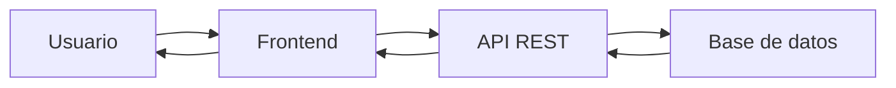
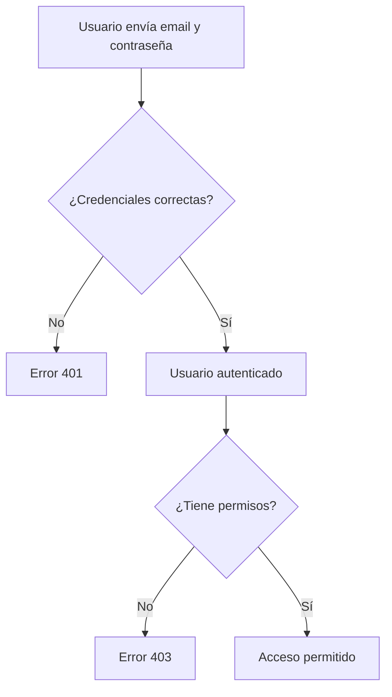
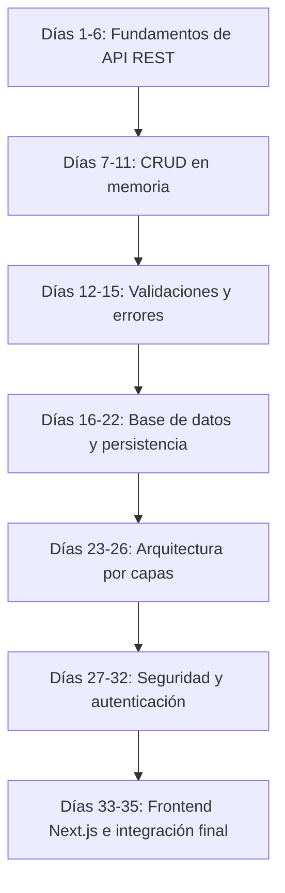
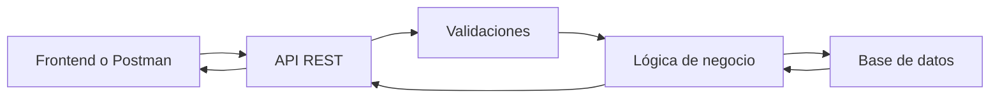

# Día 1: Presentación del reto

Hoy empezamos un reto opcional de 35 días en el que vamos a construir paso a
paso una **API REST de gestión de usuarios**.

La idea no es hacer ejercicios sueltos, sino construir un producto poco a poco,
como se haría en un proyecto real. Empezaremos desde cero, sin servidor, sin
rutas y sin base de datos, y acabaremos con una API capaz de registrar usuarios,
iniciar sesión, proteger rutas, usar roles, conectarse a una base de datos y
comunicarse con un frontend en Next.js.

!!! abstract "Objetivo del día"
    Entender qué vamos a construir, qué es una API REST y cuáles serán las
    primeras decisiones de diseño de **UserManager API**.

## UserManager API

El proyecto se llamará **UserManager API**.

Será una API sencilla en cuanto a temática, pero muy completa técnicamente. He
elegido una gestión de usuarios porque es algo fácil de entender y aparece en
prácticamente cualquier aplicación real: una tienda online, una red social, una
app de reservas, una plataforma educativa, un panel de administración o una
aplicación móvil.

!!! tip "Idea principal"
    Lo importante del reto es que entendáis cómo se construye una API
    profesional desde dentro: rutas, datos, validaciones, errores, seguridad,
    base de datos e integración con un cliente real.

## Qué vamos a construir

Vamos a crear una API REST que permitirá gestionar usuarios.

Al finalizar el proyecto, nuestra API permitirá realizar acciones como estas:

```text title="Funcionalidades finales"
Registrar un usuario
Iniciar sesión
Consultar mi perfil
Listar usuarios
Modificar datos de usuario
Eliminar o desactivar usuarios
Cambiar contraseñas
Asignar roles
Proteger rutas privadas
Conectar con un frontend real
```

La API tendrá tres grupos principales de rutas:

| Recurso | Uso |
| --- | --- |
| `/auth` | Acciones relacionadas con autenticación |
| `/users` | Acciones relacionadas con gestión de usuarios |
| `/health` | Comprobar que la API está funcionando |

## Qué es una API

Una **API** es una forma de comunicación entre aplicaciones.

Por ejemplo, imaginemos que tenemos una aplicación web con una pantalla de
login. Cuando el usuario escribe su email y su contraseña, el frontend necesita
preguntarle al backend:

```text
¿Existe este usuario?
¿La contraseña es correcta?
¿Puede entrar en la aplicación?
```

El frontend no accede directamente a la base de datos. Lo que hace es enviar
una petición a la API.

La API recibe esa petición, procesa la información, consulta la base de datos si
hace falta y devuelve una respuesta.



En nuestro caso, durante los primeros días probaremos la API con herramientas
como **Postman** o **Thunder Client**. Más adelante, conectaremos la API con un
frontend real en **Next.js**.

## Qué es una API REST

REST es una forma de diseñar APIs utilizando los elementos propios del protocolo
HTTP.

Una API REST organiza la información en forma de **recursos**. En nuestro
proyecto, el recurso principal será:

```text
users
```

Sobre ese recurso podremos hacer diferentes operaciones:

```text
Consultar usuarios
Crear usuarios
Modificar usuarios
Eliminar usuarios
```

Cada operación se representa mediante una combinación de:

```text
Método HTTP + Ruta
```

| Ejemplo | Significado |
| --- | --- |
| `GET /api/users` | Quiero obtener la lista de usuarios |
| `POST /api/users` | Quiero crear un nuevo usuario |

## Métodos HTTP principales

Durante el reto trabajaremos con varios métodos HTTP.

| Método | Para qué sirve | Ejemplos |
| --- | --- | --- |
| `GET` | Obtener información | `GET /api/users`, `GET /api/users/1`, `GET /api/users/me` |
| `POST` | Crear información nueva | `POST /api/users`, `POST /api/auth/register`, `POST /api/auth/login` |
| `PATCH` | Modificar parcialmente un recurso | `PATCH /api/users/1`, `PATCH /api/users/me/password`, `PATCH /api/users/1/role` |
| `DELETE` | Eliminar un recurso | `DELETE /api/users/1` |

!!! note "Borrado lógico"
    En un proyecto real muchas veces no se borra el usuario definitivamente,
    sino que se marca como inactivo:

    ```text
    isActive = false
    ```

## Recursos principales

Nuestra API tendrá tres grupos principales de rutas.

### Health

Servirá para comprobar que el servidor está funcionando.

```text
GET /api/health
```

```json title="Respuesta de ejemplo"
{
  "status": "ok",
  "message": "UserManager API funcionando"
}
```

### Auth

Servirá para las acciones relacionadas con autenticación.

```text
POST /api/auth/register
POST /api/auth/login
```

Estas rutas permitirán:

```text
Registrar usuarios
Iniciar sesión
Recibir un token de acceso
```

### Users

Servirá para gestionar usuarios.

```text
GET    /api/users
GET    /api/users/:id
GET    /api/users/me
POST   /api/users
PATCH  /api/users/:id
DELETE /api/users/:id
```

Estas rutas permitirán:

```text
Listar usuarios
Consultar un usuario concreto
Consultar mi propio perfil
Crear usuarios
Modificar usuarios
Eliminar o desactivar usuarios
```

## Modelo inicial de usuario

Nuestro recurso principal será el usuario.

De momento, vamos a imaginar que un usuario tendrá estos datos:

```text
id
name
email
password
role
isActive
createdAt
updatedAt
```

Más adelante veremos que **no debemos guardar la contraseña directamente**, sino
una versión cifrada llamada `passwordHash`.

El modelo final se parecerá más a esto:

| Campo | Descripción |
| --- | --- |
| `id` | Identificador único del usuario |
| `name` | Nombre completo |
| `email` | Correo electrónico |
| `passwordHash` | Contraseña cifrada |
| `role` | Rol del usuario: `USER` o `ADMIN` |
| `isActive` | Indica si el usuario está activo o desactivado |
| `createdAt` | Fecha de creación |
| `updatedAt` | Fecha de última modificación |

```json title="Ejemplo de usuario"
{
  "id": 1,
  "name": "Ana García",
  "email": "ana@email.com",
  "role": "USER",
  "isActive": true,
  "createdAt": "2026-01-01T10:00:00.000Z",
  "updatedAt": "2026-01-01T10:00:00.000Z"
}
```

!!! danger "Importante"
    La API nunca debería devolver la contraseña del usuario. Ni siquiera
    cifrada.

## Roles de usuario

Nuestra API trabajará con dos roles principales:

| Rol | Qué representa | Qué podrá hacer |
| --- | --- | --- |
| `USER` | Usuario normal | Iniciar sesión, ver su perfil, modificar algunos datos y cambiar su contraseña |
| `ADMIN` | Usuario administrador | Listar usuarios, cambiar roles, desactivar usuarios, eliminar usuarios y gestionar el sistema |

La diferencia entre estos dos perfiles nos permitirá trabajar un concepto muy
importante:

```text
Autenticación ≠ Autorización
```

## Autenticación y autorización

### Autenticación

La autenticación consiste en comprobar quién eres.

```text
Soy Laura y esta es mi contraseña.
```

La API comprueba si los datos son correctos. Si son correctos, permite iniciar
sesión.

### Autorización

La autorización consiste en comprobar qué puedes hacer.

```text
Laura ha iniciado sesión, pero ¿puede listar todos los usuarios?
```

Si Laura tiene rol `USER`, probablemente no. Si tiene rol `ADMIN`, sí.



## Recorrido del reto

El reto irá creciendo poco a poco.



No vamos a empezar directamente con seguridad, base de datos o Docker. Primero
construiremos una base sencilla y luego la iremos mejorando.

```text title="Proceso"
Primero: servidor básico.
Después: rutas.
Después: usuarios en memoria.
Después: validaciones.
Después: base de datos.
Después: arquitectura.
Después: login y seguridad.
Finalmente: conexión con frontend.
```

## Contrato inicial de la API

Aunque todavía no vamos a programar toda la API, sí vamos a definir qué
esperamos que haga.

Un **contrato de API** es un acuerdo sobre cómo se comunica el cliente con el
servidor.

Define cosas como:

```text
Qué rutas existen.
Qué método HTTP usa cada ruta.
Qué datos hay que enviar.
Qué respuesta devuelve.
Qué errores pueden aparecer.
```

```text title="Endpoint de ejemplo"
POST /api/auth/register
```

```json title="Datos que recibe"
{
  "name": "Laura Martínez",
  "email": "laura@email.com",
  "password": "123456"
}
```

```json title="Respuesta esperada"
{
  "id": 2,
  "name": "Laura Martínez",
  "email": "laura@email.com",
  "role": "USER",
  "isActive": true
}
```

| Error | Cuándo podría ocurrir |
| --- | --- |
| `400 Bad Request` | Faltan datos |
| `409 Conflict` | El email ya existe |

!!! info "Por qué importa"
    Este concepto será especialmente importante cuando conectemos el frontend
    Next.js, porque el frontend necesitará que nuestra API responda de una
    forma concreta.

## Códigos de estado

Durante el proyecto iremos utilizando códigos HTTP.

| Código | Significado |
| --- | --- |
| `200 OK` | La petición se ha realizado correctamente |
| `201 Created` | Se ha creado un recurso |
| `400 Bad Request` | La petición está mal formada |
| `401 Unauthorized` | No has iniciado sesión o el token no es válido |
| `403 Forbidden` | Has iniciado sesión, pero no tienes permisos |
| `404 Not Found` | No se ha encontrado el recurso |
| `409 Conflict` | Hay un conflicto, por ejemplo un email duplicado |
| `500 Server Error` | Error interno del servidor |

No se trata de memorizarlos todos desde el primer día, pero sí de empezar a
entender que una API debe comunicar bien qué ha pasado.

## Herramientas que utilizaremos

A lo largo del reto utilizaremos herramientas como:

| Herramienta | Uso aproximado |
| --- | --- |
| Node.js | Ejecutar JavaScript/TypeScript en backend |
| Express | Crear el servidor y las rutas |
| TypeScript | Añadir tipado al proyecto |
| Postman o Thunder Client | Probar peticiones HTTP |
| Docker | Levantar servicios de forma reproducible |
| PostgreSQL o MySQL | Guardar datos |
| ORM o acceso a datos | Comunicarnos con la base de datos |
| JWT | Autenticación mediante tokens |
| bcrypt | Cifrar contraseñas |
| Next.js | Frontend real que consumirá la API |

No vamos a necesitarlas todas desde el primer día. Iremos introduciéndolas poco
a poco cuando tengan sentido.

## Parte guiada

En esta primera sesión todavía no vamos a programar la API completa. El objetivo
es **entender el reto y diseñar el producto**.

### Paso 1: Crear el documento inicial

Crea un documento llamado:

```text
UserManager API - Diseño inicial
```

Puede ser un documento de texto, Markdown o una página en vuestro cuaderno
digital.

### Paso 2: Escribir una descripción del proyecto

Añade una descripción breve.

```text title="Ejemplo"
UserManager API es una API REST para gestionar usuarios de una aplicación.
Permitirá registrar usuarios, iniciar sesión, consultar perfiles, modificar
datos, gestionar roles y proteger rutas privadas mediante autenticación.
```

### Paso 3: Definir los recursos principales

Añade los recursos principales de la API y explica brevemente para qué servirá
cada uno.

| Recurso | Explicación |
| --- | --- |
| `/auth` | Servirá para registrar usuarios e iniciar sesión |
| `/users` | Servirá para consultar, crear, modificar y eliminar usuarios |
| `/health` | Servirá para comprobar que la API está funcionando |

### Paso 4: Definir el modelo de usuario

Copia el modelo inicial de usuario y escribe una breve explicación de cada
campo.

```text
User
- id
- name
- email
- passwordHash
- role
- isActive
- createdAt
- updatedAt
```

| Campo | Explicación |
| --- | --- |
| `id` | Identificador único del usuario |
| `name` | Nombre completo del usuario |
| `email` | Correo electrónico del usuario |
| `passwordHash` | Contraseña cifrada |
| `role` | Rol del usuario, `USER` o `ADMIN` |
| `isActive` | Indica si el usuario está activo o desactivado |
| `createdAt` | Fecha de creación |
| `updatedAt` | Fecha de última modificación |

### Paso 5: Diseñar los endpoints principales

Copia esta tabla en tu documento:

| Método | Ruta | Descripción | Acceso |
| --- | --- | --- | --- |
| `GET` | `/api/health` | Comprueba si la API funciona | Público |
| `POST` | `/api/auth/register` | Registra un usuario | Público |
| `POST` | `/api/auth/login` | Inicia sesión | Público |
| `GET` | `/api/users/me` | Consulta mi perfil | Usuario autenticado |
| `GET` | `/api/users` | Lista todos los usuarios | `ADMIN` |
| `GET` | `/api/users/:id` | Consulta un usuario por ID | `ADMIN` o propio usuario |
| `PATCH` | `/api/users/:id` | Modifica un usuario | `ADMIN` o propio usuario |
| `DELETE` | `/api/users/:id` | Elimina o desactiva un usuario | `ADMIN` |
| `PATCH` | `/api/users/me/password` | Cambia mi contraseña | Usuario autenticado |
| `PATCH` | `/api/users/:id/role` | Cambia el rol de un usuario | `ADMIN` |
| `PATCH` | `/api/users/:id/status` | Activa o desactiva un usuario | `ADMIN` |

### Paso 6: Dibujar el flujo general

Añade este esquema a tu documento:



Después, escribe una explicación breve:

```text
El cliente envía una petición a la API. La API valida los datos, aplica la
lógica necesaria, consulta o modifica la base de datos y devuelve una respuesta.
```

### Paso 7: Escribir las reglas iniciales

Añade estas reglas:

```text
El email no se puede repetir.
La contraseña no se guarda en texto plano.
La API nunca devuelve passwordHash.
Un USER solo puede acceder a su propia información.
Un ADMIN puede gestionar usuarios.
Un usuario inactivo no puede iniciar sesión.
```

## Parte libre

Ahora debéis completar una pequeña parte de diseño por vuestra cuenta.

### Tarea libre 1: Añadir dos reglas más

Añade dos reglas nuevas que creas que debería cumplir la API.

```text title="Ejemplos"
La contraseña debe tener al menos 8 caracteres.
El nombre del usuario no puede estar vacío.
Un usuario no puede cambiar su propio rol.
El email debe tener formato válido.
Un ADMIN no puede desactivarse a sí mismo.
```

### Tarea libre 2: Proponer dos errores posibles

Escribe dos situaciones de error que podrían ocurrir en la API y qué código HTTP
devolverías.

```text title="Ejemplo"
Intentar registrar un email ya existente → 409 Conflict
Intentar consultar un usuario que no existe → 404 Not Found
```

### Tarea libre 3: Diseñar una respuesta JSON

Diseña cómo debería responder la API cuando se consulta el perfil de un usuario.

```text title="Ruta"
GET /api/users/me
```

```json title="Ejemplo esperado"
{
  "id": 1,
  "name": "Ana García",
  "email": "ana@email.com",
  "role": "USER",
  "isActive": true
}
```

Puedes añadir algún campo más si crees que tiene sentido, pero recuerda:

!!! warning "Regla"
    Nunca se debe devolver la contraseña.

### Tarea libre 4: Explicar con tus palabras qué es una API

Escribe una explicación breve, con tus palabras, respondiendo a esta pregunta:

```text
¿Qué es una API y para qué sirve?
```

No hace falta que sea una definición perfecta. Lo importante es que se entienda
la idea.

## Entrega recomendada del día 1

Al terminar el día 1 deberías tener un documento con:

- Nombre del proyecto.
- Descripción de UserManager API.
- Recursos principales.
- Modelo de usuario.
- Tabla de endpoints.
- Esquema del funcionamiento general.
- Reglas iniciales.
- Dos reglas propuestas por ti.
- Dos posibles errores HTTP.
- Ejemplo de respuesta JSON.
- Explicación personal de qué es una API.

Nombre recomendado del archivo:

```text
dia-01-diseno-inicial-usermanager.md
```

## Cierre del día

Hoy no hemos empezado todavía a programar, pero hemos hecho algo igual de
importante: **definir qué vamos a construir**.

Antes de escribir código conviene saber:

```text
Qué problema queremos resolver.
Qué recursos tendrá la API.
Qué rutas vamos a necesitar.
Qué datos tendrá cada usuario.
Qué reglas debe cumplir el sistema.
Qué errores pueden aparecer.
```

A partir del próximo día empezaremos a preparar el proyecto y crear el primer
servidor.

!!! success "Idea clave"
    Antes de programar una API, hay que entender qué producto queremos
    construir y cómo se van a comunicar las aplicaciones con ella.
