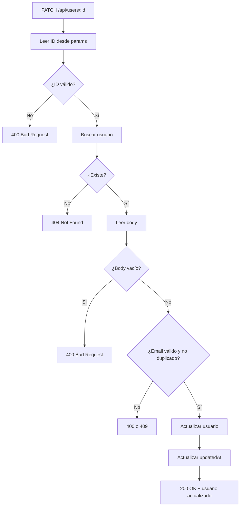

# Día 10: Actualizar usuarios en memoria

En el día 9 implementamos la creación de usuarios en memoria mediante:

```http
POST /api/users
```

Aprendimos a leer datos desde `req.body`, validar campos obligatorios,
comprobar emails duplicados, generar un nuevo ID, crear un objeto `User` y
añadirlo al array con `push`.

Hoy vamos a trabajar la siguiente operación del CRUD: **actualizar un usuario
existente**.

Para ello usaremos:

```http
PATCH /api/users/:id
```

Esta ruta permitirá modificar parcialmente los datos de un usuario. Por
ejemplo, podremos cambiar su nombre o su email sin tener que enviar todos los
campos del usuario.

```http title="Petición"
PATCH /api/users/1
Content-Type: application/json
```

```json title="Body"
{
  "name": "Ana Martínez"
}
```

La API deberá buscar el usuario con ID `1`, aplicar los cambios recibidos y
devolver el usuario actualizado.

!!! abstract "Objetivo del día"
    Implementar `PATCH /api/users/:id` para actualizar usuarios existentes en
    memoria, validando el ID, los campos permitidos, los emails duplicados y la
    fecha `updatedAt`.

## Qué vamos a trabajar hoy

| Concepto | Qué aprenderemos |
| --- | --- |
| `PATCH` | Actualizar parcialmente un recurso |
| Actualización parcial | Cambiar solo los campos enviados |
| `req.params` | Leer el ID desde la URL |
| `req.body` | Leer los cambios enviados por el cliente |
| `findIndex` | Localizar la posición de un usuario dentro del array |
| Validación de ID | Detectar IDs no numéricos |
| Campos modificables | Controlar qué datos se pueden cambiar |
| Email duplicado | Evitar que dos usuarios compartan email |
| `updatedAt` | Registrar cuándo se modificó el usuario |
| Errores `400`, `404` y `409` | Responder correctamente según el problema |

El objetivo principal es que la API pueda modificar usuarios existentes dentro
del array `users`.

## Qué significa actualizar un recurso

Actualizar un recurso significa modificar datos de algo que ya existe.

En nuestro caso, el recurso será un usuario.

```json title="Usuario original"
{
  "id": 1,
  "name": "Ana García",
  "email": "ana@email.com",
  "role": "USER",
  "isActive": true
}
```

Si queremos cambiar solo el nombre, enviaremos:

```json title="Cambios"
{
  "name": "Ana Martínez"
}
```

Después de actualizarlo, el usuario quedaría así:

```json title="Usuario actualizado"
{
  "id": 1,
  "name": "Ana Martínez",
  "email": "ana@email.com",
  "role": "USER",
  "isActive": true
}
```

El resto de campos se mantienen igual.

## Por qué usamos PATCH

En APIs REST podemos encontrar varios métodos para actualizar datos,
especialmente `PUT` y `PATCH`.

En este reto usaremos `PATCH`.

```text
PATCH significa: quiero modificar solo una parte del recurso.
```

Por ejemplo:

```http title="Petición"
PATCH /api/users/1
```

```json title="Body"
{
  "email": "nuevo@email.com"
}
```

Solo cambia el email. El nombre, el rol y el estado del usuario se mantienen
igual.

| Método | Uso habitual | Ejemplo |
| --- | --- | --- |
| `PATCH` | Modificar algunos campos | Cambiar solo el email |
| `PUT` | Reemplazar todo el recurso | Enviar el usuario completo actualizado |

Durante este reto usaremos `PATCH` porque es más cómodo para editar
parcialmente usuarios.

## Qué datos necesitamos

Para actualizar un usuario necesitamos dos cosas:

| Dato | Dónde viaja | Cómo se lee en Express |
| --- | --- | --- |
| ID del usuario | Params | `req.params.id` |
| Cambios | Body | `req.body` |

El ID viajará en la URL:

```http
PATCH /api/users/:id
```

Ejemplo:

```http
PATCH /api/users/2
```

Los cambios viajarán en el body:

```json
{
  "name": "Carlos Actualizado"
}
```

En Express leeremos:

```ts
const id = Number(req.params.id);
const changes = req.body;
```

## Campos modificables

Para `PATCH /api/users/:id`, permitiremos modificar solo estos campos:

| Campo | Se puede modificar | Motivo |
| --- | --- | --- |
| `name` | Sí | Es información editable del usuario |
| `email` | Sí | Es información editable, pero debe validarse |
| `isActive` | Sí | Permite activar o desactivar usuarios |
| `id` | No | Lo genera el sistema y no debe cambiar |
| `role` | No | Se cambiará más adelante desde una ruta específica |
| `createdAt` | No | Indica cuándo se creó el usuario |
| `updatedAt` | No directamente | Lo actualizará automáticamente la API |

Más adelante tendremos rutas concretas para cambios más delicados:

```http
PATCH /api/users/:id/role
PATCH /api/users/:id/status
PATCH /api/users/me/password
```

Hoy trabajaremos una edición básica del usuario.

## Buscar usuario para actualizar

En el día 8 usamos `find` para buscar un usuario:

```ts
const user = users.find((user) => user.id === id);
```

Para actualizar un elemento dentro del array, puede ser más cómodo usar
`findIndex`.

```ts
const userIndex = users.findIndex((user) => user.id === id);
```

Esto devuelve la posición del usuario dentro del array.

```ts
const users = [
  { id: 1, name: "Ana" },
  { id: 2, name: "Carlos" }
];

const index = users.findIndex((user) => user.id === 2);
```

Resultado:

```text
1
```

Carlos está en la posición `1` del array.

Si no encuentra ningún usuario, devuelve:

```text
-1
```

Por eso podemos comprobar:

```ts
if (userIndex === -1) {
  return res.status(404).json({
    error: "Usuario no encontrado"
  });
}
```

## Actualización con spread operator

Para actualizar un objeto manteniendo sus campos anteriores podemos usar el
**spread operator**:

```ts
const updatedUser = {
  ...oldUser,
  name: "Nuevo nombre"
};
```

Esto significa:

1. Copia todos los campos de `oldUser`.
2. Sobrescribe el campo `name`.

En nuestro caso haremos algo parecido:

```ts
const updatedUser: User = {
  ...currentUser,
  name: name ?? currentUser.name,
  email: email ?? currentUser.email,
  isActive: isActive ?? currentUser.isActive,
  updatedAt: new Date().toISOString()
};
```

El operador `??` significa:

```text
Si el valor de la izquierda existe, úsalo.
Si es null o undefined, usa el valor de la derecha.
```

Ejemplo:

```ts
name: name ?? currentUser.name
```

Si llega un nuevo `name` en el body, lo usamos. Si no llega, mantenemos el
`name` anterior.

## Validaciones al actualizar

Al actualizar también debemos validar.

| Validación | Error recomendado |
| --- | --- |
| El ID debe ser numérico | `400 Bad Request` |
| El usuario debe existir | `404 Not Found` |
| El body no puede estar vacío | `400 Bad Request` |
| Si llega `email`, debe tener formato básico válido | `400 Bad Request` |
| Si llega `email`, no puede estar duplicado en otro usuario | `409 Conflict` |

Ejemplo de body vacío:

```json
{}
```

Respuesta:

```json
{
  "error": "Debes enviar al menos un campo para actualizar"
}
```

Ejemplo de email duplicado:

```json
{
  "email": "ana@email.com"
}
```

Si ese email ya lo usa otro usuario, responderemos:

```json
{
  "error": "El email ya está registrado"
}
```

## Email duplicado al actualizar

Al crear usuarios ya comprobamos si un email existía. Al actualizar hay que
tener un poco más de cuidado.

Imaginemos estos usuarios:

```json
[
  {
    "id": 1,
    "email": "ana@email.com"
  },
  {
    "id": 2,
    "email": "carlos@email.com"
  }
]
```

Si actualizamos el usuario `2` con:

```json
{
  "email": "ana@email.com"
}
```

No deberíamos permitirlo, porque ese email ya pertenece al usuario `1`.

Pero si el usuario `2` envía su mismo email:

```json
{
  "email": "carlos@email.com"
}
```

No debería considerarse duplicado.

La comprobación será:

```ts
const emailAlreadyExists = users.some(
  (user) => user.email === cleanEmail && user.id !== id
);
```

Esto significa: busca si existe otro usuario con ese email, sin contar al
usuario que estamos actualizando.

## Flujo completo del endpoint



## Parte guiada

### Paso 1: Abrir el proyecto

Abre el repositorio:

```text
usermanager-api
```

Entra en la carpeta:

```bash
cd usermanager-api
```

Arranca el servidor:

```bash
npm run dev
```

Comprueba que el listado de usuarios funciona:

```http
GET http://localhost:3000/api/users
```

### Paso 2: Buscar la ruta `PATCH /api/users/:id`

En días anteriores teníamos una ruta simulada parecida a esta:

```ts
app.patch("/api/users/:id", (req, res) => {
  const { id } = req.params;
  const changes = req.body;

  res.status(200).json({
    message: "Usuario recibido para actualizar",
    id: id,
    changes: changes
  });
});
```

Hoy vamos a sustituirla por una versión real que actualice usuarios en el
array.

### Paso 3: Leer y validar el ID

Sustituye la ruta por esta primera versión:

```ts
app.patch("/api/users/:id", (req, res) => {
  const idParam = req.params.id;
  const id = Number(idParam);

  if (Number.isNaN(id)) {
    return res.status(400).json({
      error: "El ID debe ser un número",
      received: idParam
    });
  }

  return res.status(200).json({
    message: "ID recibido correctamente",
    id
  });
});
```

Prueba:

```http
PATCH http://localhost:3000/api/users/1
```

```json title="Body"
{
  "name": "Ana Actualizada"
}
```

Respuesta esperada:

```json
{
  "message": "ID recibido correctamente",
  "id": 1
}
```

Ahora prueba:

```http
PATCH http://localhost:3000/api/users/abc
```

Respuesta esperada:

```json
{
  "error": "El ID debe ser un número",
  "received": "abc"
}
```

Código esperado:

```text
400 Bad Request
```

### Paso 4: Buscar el usuario con `findIndex`

Añade la búsqueda:

```ts
const userIndex = users.findIndex((user) => user.id === id);

if (userIndex === -1) {
  return res.status(404).json({
    error: "Usuario no encontrado",
    id
  });
}
```

La ruta quedará así:

```ts
app.patch("/api/users/:id", (req, res) => {
  const idParam = req.params.id;
  const id = Number(idParam);

  if (Number.isNaN(id)) {
    return res.status(400).json({
      error: "El ID debe ser un número",
      received: idParam
    });
  }

  const userIndex = users.findIndex((user) => user.id === id);

  if (userIndex === -1) {
    return res.status(404).json({
      error: "Usuario no encontrado",
      id
    });
  }

  return res.status(200).json({
    message: "Usuario encontrado",
    data: users[userIndex]
  });
});
```

Prueba:

```http
PATCH http://localhost:3000/api/users/999
```

Respuesta esperada:

```json
{
  "error": "Usuario no encontrado",
  "id": 999
}
```

Código esperado:

```text
404 Not Found
```

### Paso 5: Leer campos del body

Ahora vamos a leer los campos que permitiremos actualizar:

```ts
const { name, email, isActive } = req.body;
```

De momento responderemos con esos datos:

```ts
return res.status(200).json({
  message: "Datos recibidos para actualizar",
  id,
  changes: {
    name,
    email,
    isActive
  }
});
```

Prueba:

```http
PATCH http://localhost:3000/api/users/1
```

```json title="Body"
{
  "name": "Ana Martínez",
  "email": "ana.martinez@email.com",
  "isActive": true
}
```

Comprueba que la API recibe los datos correctamente.

### Paso 6: Comprobar que el body no esté vacío

Añade esta comprobación:

```ts
const hasChanges =
  name !== undefined ||
  email !== undefined ||
  isActive !== undefined;

if (!hasChanges) {
  return res.status(400).json({
    error: "Debes enviar al menos un campo para actualizar"
  });
}
```

Prueba con body vacío:

```json
{}
```

Respuesta esperada:

```json
{
  "error": "Debes enviar al menos un campo para actualizar"
}
```

Código esperado:

```text
400 Bad Request
```

### Paso 7: Limpiar y validar el email si llega

Añade esta lógica:

```ts
let cleanEmail: string | undefined;

if (email !== undefined) {
  cleanEmail = String(email).trim().toLowerCase();

  if (!cleanEmail.includes("@")) {
    return res.status(400).json({
      error: "El email no tiene un formato válido"
    });
  }

  const emailAlreadyExists = users.some(
    (user) => user.email === cleanEmail && user.id !== id
  );

  if (emailAlreadyExists) {
    return res.status(409).json({
      error: "El email ya está registrado"
    });
  }
}
```

Esto solo valida el email si viene en el body. Si no se quiere cambiar el
email, no se comprueba.

### Paso 8: Limpiar el nombre si llega

Añade:

```ts
let cleanName: string | undefined;

if (name !== undefined) {
  cleanName = String(name).trim();

  if (cleanName.length === 0) {
    return res.status(400).json({
      error: "El nombre no puede estar vacío"
    });
  }
}
```

Así evitamos aceptar nombres vacíos o con solo espacios.

### Paso 9: Validar `isActive` si llega

Añade:

```ts
if (isActive !== undefined && typeof isActive !== "boolean") {
  return res.status(400).json({
    error: "isActive debe ser true o false"
  });
}
```

Esto evita recibir valores incorrectos como:

```json
{
  "isActive": "false"
}
```

Ese valor parece falso, pero en realidad es un texto. Lo correcto sería:

```json
{
  "isActive": false
}
```

### Paso 10: Actualizar el usuario

Ahora crea el usuario actualizado:

```ts
const currentUser = users[userIndex];

const updatedUser: User = {
  ...currentUser,
  name: cleanName ?? currentUser.name,
  email: cleanEmail ?? currentUser.email,
  isActive: isActive ?? currentUser.isActive,
  updatedAt: new Date().toISOString()
};

users[userIndex] = updatedUser;
```

Esto mantiene los campos anteriores y sobrescribe solo los que llegan en el
body.

### Paso 11: Devolver la respuesta final

Añade:

```ts
return res.status(200).json({
  message: "Usuario actualizado correctamente",
  data: updatedUser
});
```

La ruta completa quedará así:

```ts
app.patch("/api/users/:id", (req, res) => {
  const idParam = req.params.id;
  const id = Number(idParam);

  if (Number.isNaN(id)) {
    return res.status(400).json({
      error: "El ID debe ser un número",
      received: idParam
    });
  }

  const userIndex = users.findIndex((user) => user.id === id);

  if (userIndex === -1) {
    return res.status(404).json({
      error: "Usuario no encontrado",
      id
    });
  }

  const { name, email, isActive } = req.body;

  const hasChanges =
    name !== undefined ||
    email !== undefined ||
    isActive !== undefined;

  if (!hasChanges) {
    return res.status(400).json({
      error: "Debes enviar al menos un campo para actualizar"
    });
  }

  let cleanName: string | undefined;

  if (name !== undefined) {
    cleanName = String(name).trim();

    if (cleanName.length === 0) {
      return res.status(400).json({
        error: "El nombre no puede estar vacío"
      });
    }
  }

  let cleanEmail: string | undefined;

  if (email !== undefined) {
    cleanEmail = String(email).trim().toLowerCase();

    if (!cleanEmail.includes("@")) {
      return res.status(400).json({
        error: "El email no tiene un formato válido"
      });
    }

    const emailAlreadyExists = users.some(
      (user) => user.email === cleanEmail && user.id !== id
    );

    if (emailAlreadyExists) {
      return res.status(409).json({
        error: "El email ya está registrado"
      });
    }
  }

  if (isActive !== undefined && typeof isActive !== "boolean") {
    return res.status(400).json({
      error: "isActive debe ser true o false"
    });
  }

  const currentUser = users[userIndex];

  const updatedUser: User = {
    ...currentUser,
    name: cleanName ?? currentUser.name,
    email: cleanEmail ?? currentUser.email,
    isActive: isActive ?? currentUser.isActive,
    updatedAt: new Date().toISOString()
  };

  users[userIndex] = updatedUser;

  return res.status(200).json({
    message: "Usuario actualizado correctamente",
    data: updatedUser
  });
});
```

### Paso 12: Probar actualización correcta

Prueba:

```http
PATCH http://localhost:3000/api/users/1
```

```json title="Body"
{
  "name": "Ana Martínez"
}
```

Respuesta esperada:

```json
{
  "message": "Usuario actualizado correctamente",
  "data": {
    "id": 1,
    "name": "Ana Martínez",
    "email": "ana@email.com",
    "role": "USER",
    "isActive": true,
    "createdAt": "...",
    "updatedAt": "..."
  }
}
```

Después prueba:

```http
GET http://localhost:3000/api/users/1
```

Comprueba que el cambio se mantiene mientras el servidor sigue encendido.

### Paso 13: Probar casos de error

| Caso | Petición o body | Código esperado |
| --- | --- | ---: |
| ID no válido | `PATCH /api/users/abc` | 400 |
| Usuario inexistente | `PATCH /api/users/999` | 404 |
| Body vacío | `{}` | 400 |
| Nombre vacío | `{ "name": "   " }` | 400 |
| Email inválido | `{ "email": "correo-sin-arroba" }` | 400 |
| Email duplicado | `{ "email": "ana@email.com" }` | 409 |
| `isActive` incorrecto | `{ "isActive": "false" }` | 400 |

!!! tip "Prueba del email duplicado"
    Para comprobar el caso `409`, intenta asignar a un usuario el email de otro
    usuario distinto.

### Paso 14: Crear una carpeta de pruebas del día 10

En Thunder Client o Postman, dentro de la colección `UserManager API`, crea una
carpeta llamada:

```text
Día 10 - Actualizar usuarios
```

Añade estas peticiones:

| Petición | Qué prueba |
| --- | --- |
| `PATCH /api/users/1` | Actualización correcta |
| `PATCH /api/users/abc` | ID no válido |
| `PATCH /api/users/999` | Usuario inexistente |
| `PATCH /api/users/1` | Body vacío |
| `PATCH /api/users/1` | Nombre vacío |
| `PATCH /api/users/1` | Email inválido |
| `PATCH /api/users/2` | Email duplicado |
| `PATCH /api/users/1` | `isActive` incorrecto |
| `GET /api/users/1` | Comprobar actualización |

### Paso 15: Actualizar el README

Actualiza la sección de usuarios añadiendo información sobre actualización:

````md
## Actualizar usuario

```http
PATCH /api/users/:id
```

Permite modificar parcialmente los datos de un usuario.

Campos permitidos:

```text
name
email
isActive
```

Body de ejemplo:

```json
{
  "name": "Ana Martínez"
}
```

Respuesta correcta:

```json
{
  "message": "Usuario actualizado correctamente",
  "data": {
    "id": 1,
    "name": "Ana Martínez",
    "email": "ana@email.com",
    "role": "USER",
    "isActive": true
  }
}
```

Posibles errores:

```json
{
  "error": "El ID debe ser un número",
  "received": "abc"
}
```

```json
{
  "error": "Usuario no encontrado",
  "id": 999
}
```

```json
{
  "error": "Debes enviar al menos un campo para actualizar"
}
```

```json
{
  "error": "El email ya está registrado"
}
```
````

### Paso 16: Crear el documento del día 10

Dentro de la carpeta `docs/`, crea un archivo:

```text
docs/dia-10-actualizar-usuarios.md
```

Añade este contenido inicial:

````md title="docs/dia-10-actualizar-usuarios.md"
# Día 10: Actualizar usuarios en memoria

## Qué he hecho

- He actualizado el endpoint `PATCH /api/users/:id`.
- He leído el ID desde `req.params`.
- He leído los cambios desde `req.body`.
- He validado que el ID sea numérico.
- He comprobado si el usuario existe.
- He validado que el body no esté vacío.
- He validado `name`, `email` e `isActive`.
- He comprobado email duplicado al actualizar.
- He actualizado `updatedAt`.
- He sustituido el usuario dentro del array.

## Endpoint trabajado

```http
PATCH /api/users/:id
```

## Body de ejemplo

```json
{
  "name": "Ana Martínez"
}
```

## Casos probados

| Caso | Código esperado | Resultado |
| --- | ---: | --- |
| Actualización correcta | 200 | |
| ID no válido | 400 | |
| Usuario inexistente | 404 | |
| Body vacío | 400 | |
| Nombre vacío | 400 | |
| Email inválido | 400 | |
| Email duplicado | 409 | |
| `isActive` incorrecto | 400 | |

## Explicación personal

Para actualizar un usuario se lee el ID desde `req.params`, se busca el usuario
en el array, se leen los cambios desde `req.body` y se sustituyen solo los
campos que han llegado en la petición.
````

### Paso 17: Actualizar el índice del README

Añade el enlace al documento del día 10:

```md
## Documentación del reto

- [Día 1 - Diseño inicial](docs/dia-01-diseno-inicial.md)
- [Día 2 - Preparación del proyecto](docs/dia-02-preparacion-proyecto.md)
- [Día 3 - Primer endpoint](docs/dia-03-primer-endpoint.md)
- [Día 4 - Métodos HTTP](docs/dia-04-metodos-http.md)
- [Día 5 - JSON, body, params y headers](docs/dia-05-json-body-params-headers.md)
- [Día 6 - Cliente HTTP y depuración](docs/dia-06-cliente-http-depuracion.md)
- [Día 7 - Listado de usuarios en memoria](docs/dia-07-listado-usuarios.md)
- [Día 8 - Consultar usuario por ID](docs/dia-08-consultar-usuario-id.md)
- [Día 9 - Crear usuarios en memoria](docs/dia-09-crear-usuarios.md)
- [Día 10 - Actualizar usuarios en memoria](docs/dia-10-actualizar-usuarios.md)
```

### Paso 18: Guardar cambios en Git

Comprueba los cambios:

```bash
git status
```

Añade los archivos:

```bash
git add .
```

Crea un commit:

```bash
git commit -m "Dia 10 - Actualizar usuarios en memoria"
```

Sube los cambios:

```bash
git push
```

## Parte libre

Ahora toca practicar un poco sin seguir todos los pasos guiados.

### Tarea libre 1: Impedir actualizar el rol desde esta ruta

Comprueba qué ocurre si alguien envía:

```json
{
  "role": "ADMIN"
}
```

La ruta `PATCH /api/users/:id` no debería permitir cambiar el rol.

Puedes hacer que la API devuelva:

```json
{
  "error": "No se puede modificar el rol desde esta ruta"
}
```

Código recomendado:

```text
400 Bad Request
```

Más adelante crearemos una ruta específica para cambiar roles.

### Tarea libre 2: Impedir actualizar el ID

Comprueba qué ocurre si alguien envía:

```json
{
  "id": 99
}
```

La API no debería permitir cambiar el identificador de un usuario.

Puedes devolver:

```json
{
  "error": "No se puede modificar el ID de un usuario"
}
```

### Tarea libre 3: Crear una ruta específica para desactivar usuarios

Crea una ruta:

```http
PATCH /api/users/:id/status
```

Debe recibir:

```json
{
  "isActive": false
}
```

Y actualizar solo el campo `isActive`.

Debe validar:

| Validación |
| --- |
| El ID debe ser numérico |
| El usuario debe existir |
| `isActive` debe ser boolean |

!!! warning "Orden de rutas"
    Coloca esta ruta antes de `PATCH /api/users/:id`. Si la colocas después,
    Express puede interpretar `status` como si fuera el parámetro `:id`.

### Tarea libre 4: Explicar PATCH con tus palabras

En el documento del día 10, añade una sección:

```md
## PATCH
```

Explica con tus palabras:

- Qué significa actualizar parcialmente.
- Qué diferencia hay entre enviar solo `name` y enviar todo el usuario.
- Por qué no permitimos modificar campos como `id` o `role` desde esta ruta.

## Entrega recomendada del día 10

Las respuestas no se entregan como archivo suelto. Deben quedar dentro del
repositorio de GitHub.

Al finalizar el día 10, el repositorio debería tener esta estructura aproximada:

```text
usermanager-api/
  README.md
  package.json
  package-lock.json
  tsconfig.json
  src/
    server.ts
  docs/
    dia-01-diseno-inicial.md
    dia-02-preparacion-proyecto.md
    dia-03-primer-endpoint.md
    dia-04-metodos-http.md
    dia-05-json-body-params-headers.md
    dia-06-cliente-http-depuracion.md
    dia-07-listado-usuarios.md
    dia-08-consultar-usuario-id.md
    dia-09-crear-usuarios.md
    dia-10-actualizar-usuarios.md
```

El documento del día 10 deberá estar en:

```text
docs/dia-10-actualizar-usuarios.md
```

Y deberá incluir:

| Contenido esperado |
| --- |
| Resumen de lo realizado |
| Endpoint trabajado |
| Body de ejemplo |
| Casos probados |
| Explicación personal del proceso de actualización |
| Explicación del uso de `PATCH` |

En el foro, se compartirá el enlace actualizado al repositorio.

```text title="Mensaje de ejemplo"
Hola, comparto el avance del día 10 del reto UserManager API:

https://github.com/usuario/usermanager-api

He implementado la actualización de usuarios en memoria y he documentado el
trabajo del día 10 en:
docs/dia-10-actualizar-usuarios.md
```

## Cierre del día

Hoy hemos completado la operación de actualización del CRUD.

Nuestra API ya puede recibir cambios desde el body, buscar un usuario por ID,
validar los datos recibidos y actualizar solo los campos permitidos.

Hoy hemos trabajado:

| Concepto |
| --- |
| `PATCH /api/users/:id` |
| Actualización parcial |
| `findIndex` |
| Validación de ID |
| Validación de body vacío |
| Validación de `name`, `email` e `isActive` |
| Email duplicado |
| `updatedAt` |
| Errores `400`, `404` y `409` |

Cada vez estamos más cerca de tener un CRUD completo de usuarios en memoria.

!!! success "Idea clave"
    Actualizar un recurso no consiste solo en sobrescribir datos: hay que
    controlar qué campos pueden cambiar, validar los valores recibidos y
    mantener la coherencia del recurso.
