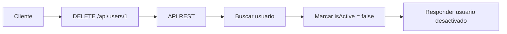
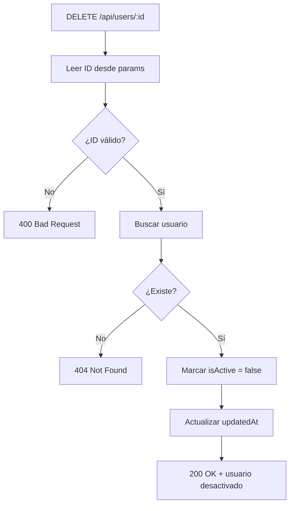

# Día 11: Eliminar o desactivar usuarios en memoria

En el día 10 trabajamos la actualización de usuarios mediante:

```http
PATCH /api/users/:id
```

Aprendimos a buscar un usuario por ID, validar los datos recibidos, modificar
solo algunos campos y actualizar la fecha `updatedAt`.

Hoy vamos a completar la última operación básica del CRUD: **eliminar un
usuario**.

Para ello trabajaremos con este endpoint:

```http
DELETE /api/users/:id
```

Hasta ahora teníamos una ruta `DELETE /api/users/:id` simulada, que simplemente
devolvía un mensaje. Hoy haremos que tenga un comportamiento real.

Pero antes de programarlo tenemos que tomar una decisión importante:

- ¿Queremos borrar el usuario del array?
- ¿O queremos marcarlo como inactivo?

En muchas aplicaciones reales, cuando se "elimina" un usuario, no se borra
completamente de la base de datos. En lugar de eso, se desactiva. Esto permite
conservar información histórica y evitar pérdidas accidentales de datos.

En nuestro reto usaremos esta idea:

```text
DELETE /api/users/:id no borrará físicamente el usuario.
Lo marcará como inactivo usando isActive = false.
```

A esto se le suele llamar **borrado lógico**.

!!! abstract "Objetivo del día"
    Implementar `DELETE /api/users/:id` para desactivar usuarios en memoria
    mediante borrado lógico, validando el ID, comprobando si el usuario existe
    y actualizando `isActive` y `updatedAt`.

## Qué vamos a trabajar hoy

| Concepto | Qué aprenderemos |
| --- | --- |
| `DELETE` | Representar la eliminación de un recurso |
| Borrado físico | Eliminar un recurso del array |
| Borrado lógico | Mantener el recurso y marcarlo como inactivo |
| `isActive` | Indicar si un usuario está activo |
| `req.params` | Leer el ID desde la URL |
| Validación de ID | Detectar IDs no numéricos |
| Búsqueda por ID | Localizar el usuario que queremos desactivar |
| `findIndex` | Obtener la posición del usuario dentro del array |
| Actualización de estado | Cambiar `isActive` a `false` |
| `updatedAt` | Registrar cuándo se modificó el usuario |
| Errores `400` y `404` | Responder correctamente ante problemas |
| Respuesta `200` | Confirmar que el usuario se desactivó |

El objetivo principal será que la API pueda "eliminar" usuarios de forma
controlada, marcándolos como inactivos.

## Qué significa eliminar un recurso

En una API REST, eliminar un recurso suele representarse con el método
`DELETE`.

```http
DELETE /api/users/1
```

Esto significa:

```text
Quiero eliminar el usuario con ID 1.
```

Pero en desarrollo real, eliminar no siempre significa borrar definitivamente.

Hay dos enfoques principales:

- Borrado físico.
- Borrado lógico.

## Borrado físico

El **borrado físico** consiste en eliminar realmente el recurso.

Si tenemos este array:

```ts
const users = [
  {
    id: 1,
    name: "Ana García",
    isActive: true
  },
  {
    id: 2,
    name: "Carlos Pérez",
    isActive: true
  }
];
```

Y eliminamos físicamente el usuario con ID `1`, el array quedaría así:

```ts
const users = [
  {
    id: 2,
    name: "Carlos Pérez",
    isActive: true
  }
];
```

El usuario desaparece completamente.

Ventajas:

- El array queda más pequeño.
- El recurso desaparece de verdad.
- Es sencillo de entender.

Inconvenientes:

- Se pierde información.
- No se puede recuperar fácilmente.
- Puede afectar a datos relacionados.
- Puede complicar auditorías o históricos.

## Borrado lógico

El **borrado lógico** consiste en no eliminar el recurso, sino marcarlo como
inactivo.

```json title="Antes"
{
  "id": 1,
  "name": "Ana García",
  "email": "ana@email.com",
  "isActive": true
}
```

```json title="Después"
{
  "id": 1,
  "name": "Ana García",
  "email": "ana@email.com",
  "isActive": false
}
```

El usuario sigue existiendo, pero queda desactivado.

En nuestro proyecto usaremos el campo `isActive`:

- Si vale `true`, el usuario está activo.
- Si vale `false`, el usuario está desactivado.

Esta decisión nos será útil más adelante, por ejemplo cuando hagamos login:

```text
Un usuario desactivado no podrá iniciar sesión.
```

## Por qué usaremos borrado lógico

En una gestión de usuarios, el borrado lógico suele ser más seguro.

Imaginemos una aplicación real:

- Un usuario ha hecho pedidos.
- Un usuario ha publicado comentarios.
- Un usuario aparece en registros de actividad.
- Un usuario tiene reservas asociadas.

Si borramos completamente ese usuario, podríamos romper relaciones o perder
información importante.

Por eso muchas aplicaciones prefieren hacer esto:

```text
No borro el usuario.
Lo marco como inactivo.
```

En nuestro caso:

```ts
isActive: false
```

Así el usuario deja de estar operativo, pero sigue existiendo en el sistema.

## DELETE con borrado lógico

Aunque usemos el método `DELETE`, internamente lo que haremos será actualizar
el usuario.

La petición será:

```http
DELETE /api/users/1
```

Pero la acción interna será:

```ts
user.isActive = false;
```

Es decir:

- Desde fuera parece una eliminación.
- Por dentro es una desactivación.

Esto es algo habitual en APIs reales. El cliente no necesita saber todos los
detalles internos. Solo necesita saber que ese usuario ya no está activo.



## Códigos de estado que usaremos

| Código | Significado | Cuándo lo usaremos |
| --- | --- | --- |
| `200 OK` | Operación correcta | Usuario desactivado correctamente |
| `400 Bad Request` | Petición incorrecta | El ID no es válido |
| `404 Not Found` | Recurso no encontrado | El usuario no existe |

Podríamos usar también otros códigos, como `204 No Content`, pero para este
reto usaremos `200 OK` porque queremos devolver una respuesta clara con un
mensaje y los datos actualizados.

Ejemplo de respuesta correcta:

```json
{
  "message": "Usuario desactivado correctamente",
  "data": {
    "id": 1,
    "name": "Ana García",
    "email": "ana@email.com",
    "role": "USER",
    "isActive": false
  }
}
```

## Flujo del endpoint de hoy

El endpoint `DELETE /api/users/:id` seguirá este flujo:



## Parte guiada

### Paso 1: Abrir el proyecto

Abre el repositorio:

```text
usermanager-api
```

Entra en la carpeta:

```bash
cd usermanager-api
```

Arranca el servidor:

```bash
npm run dev
```

Comprueba que el listado de usuarios funciona:

```http
GET http://localhost:3000/api/users
```

### Paso 2: Revisar el tipo `User`

Abre el archivo:

```text
src/server.ts
```

Comprueba que el tipo `User` tiene el campo `isActive`:

```ts
type User = {
  id: number;
  name: string;
  email: string;
  role: "USER" | "ADMIN";
  isActive: boolean;
  createdAt: string;
  updatedAt: string;
};
```

Este campo será el protagonista del día de hoy.

### Paso 3: Buscar la ruta `DELETE /api/users/:id`

En días anteriores teníamos una ruta simulada parecida a esta:

```ts
app.delete("/api/users/:id", (req, res) => {
  const { id } = req.params;

  res.status(200).json({
    message: "Usuario recibido para eliminar o desactivar",
    id: id
  });
});
```

Hoy vamos a sustituirla por una versión que desactive usuarios en memoria.

### Paso 4: Leer y validar el ID

Sustituye la ruta por esta primera versión:

```ts
app.delete("/api/users/:id", (req, res) => {
  const idParam = req.params.id;
  const id = Number(idParam);

  if (Number.isNaN(id)) {
    return res.status(400).json({
      error: "El ID debe ser un número",
      received: idParam
    });
  }

  return res.status(200).json({
    message: "ID recibido correctamente",
    id
  });
});
```

Prueba:

```http
DELETE http://localhost:3000/api/users/1
```

Respuesta esperada:

```json
{
  "message": "ID recibido correctamente",
  "id": 1
}
```

Ahora prueba:

```http
DELETE http://localhost:3000/api/users/abc
```

Respuesta esperada:

```json
{
  "error": "El ID debe ser un número",
  "received": "abc"
}
```

Código esperado:

```http
400 Bad Request
```

### Paso 5: Buscar el usuario con `findIndex`

Añade la búsqueda del usuario:

```ts
const userIndex = users.findIndex((user) => user.id === id);

if (userIndex === -1) {
  return res.status(404).json({
    error: "Usuario no encontrado",
    id
  });
}
```

La ruta quedará así:

```ts
app.delete("/api/users/:id", (req, res) => {
  const idParam = req.params.id;
  const id = Number(idParam);

  if (Number.isNaN(id)) {
    return res.status(400).json({
      error: "El ID debe ser un número",
      received: idParam
    });
  }

  const userIndex = users.findIndex((user) => user.id === id);

  if (userIndex === -1) {
    return res.status(404).json({
      error: "Usuario no encontrado",
      id
    });
  }

  return res.status(200).json({
    message: "Usuario encontrado",
    data: users[userIndex]
  });
});
```

Prueba:

```http
DELETE http://localhost:3000/api/users/999
```

Respuesta esperada:

```json
{
  "error": "Usuario no encontrado",
  "id": 999
}
```

Código esperado:

```http
404 Not Found
```

### Paso 6: Marcar el usuario como inactivo

Ahora vamos a desactivar el usuario.

Añade esta parte:

```ts
const currentUser = users[userIndex];

const updatedUser: User = {
  ...currentUser,
  isActive: false,
  updatedAt: new Date().toISOString()
};

users[userIndex] = updatedUser;
```

Esto hace cuatro cosas:

- Copia los datos actuales del usuario.
- Cambia `isActive` a `false`.
- Actualiza `updatedAt`.
- Sustituye el usuario antiguo por el actualizado.

### Paso 7: Devolver la respuesta final

Añade esta respuesta:

```ts
return res.status(200).json({
  message: "Usuario desactivado correctamente",
  data: updatedUser
});
```

La ruta completa quedará así:

```ts
app.delete("/api/users/:id", (req, res) => {
  const idParam = req.params.id;
  const id = Number(idParam);

  if (Number.isNaN(id)) {
    return res.status(400).json({
      error: "El ID debe ser un número",
      received: idParam
    });
  }

  const userIndex = users.findIndex((user) => user.id === id);

  if (userIndex === -1) {
    return res.status(404).json({
      error: "Usuario no encontrado",
      id
    });
  }

  const currentUser = users[userIndex];

  const updatedUser: User = {
    ...currentUser,
    isActive: false,
    updatedAt: new Date().toISOString()
  };

  users[userIndex] = updatedUser;

  return res.status(200).json({
    message: "Usuario desactivado correctamente",
    data: updatedUser
  });
});
```

### Paso 8: Probar desactivación correcta

Prueba:

```http
DELETE http://localhost:3000/api/users/1
```

Respuesta esperada:

```json
{
  "message": "Usuario desactivado correctamente",
  "data": {
    "id": 1,
    "name": "Ana García",
    "email": "ana@email.com",
    "role": "USER",
    "isActive": false,
    "createdAt": "...",
    "updatedAt": "..."
  }
}
```

Comprueba que el código sea:

```http
200 OK
```

### Paso 9: Comprobar que el usuario sigue existiendo

Después de desactivar el usuario, prueba:

```http
GET http://localhost:3000/api/users/1
```

El usuario debería seguir existiendo, pero ahora con:

```json
{
  "isActive": false
}
```

También puedes probar:

```http
GET http://localhost:3000/api/users
```

Y comprobar que el usuario sigue apareciendo en el listado.

Esto confirma que hemos hecho un borrado lógico, no un borrado físico.

### Paso 10: Probar casos de error

Prueba estos casos:

| Caso | Petición | Código esperado |
| --- | --- | ---: |
| ID no válido | `DELETE /api/users/abc` | `400` |
| Usuario inexistente | `DELETE /api/users/999` | `404` |
| Usuario ya desactivado | `DELETE /api/users/1` dos veces | `200` |

En el tercer caso, la segunda vez el usuario ya estará desactivado. De momento
podemos aceptar que vuelva a responder correctamente con `200 OK`. Más adelante
podríamos decidir si queremos devolver un mensaje específico.

### Paso 11: Crear una carpeta de pruebas del día 11

En Thunder Client o Postman, dentro de la colección `UserManager API`, crea una
carpeta llamada:

```text
Día 11 - Eliminar o desactivar usuarios
```

Añade estas peticiones:

| Método | Ruta | Objetivo |
| --- | --- | --- |
| `DELETE` | `/api/users/1` | Desactivar usuario |
| `DELETE` | `/api/users/abc` | Probar ID no válido |
| `DELETE` | `/api/users/999` | Probar usuario inexistente |
| `GET` | `/api/users/1` | Comprobar usuario desactivado |
| `GET` | `/api/users` | Comprobar listado |

### Paso 12: Actualizar el README

Actualiza la sección de usuarios añadiendo información sobre eliminación o
desactivación:

````md
## Eliminar o desactivar usuario

```http
DELETE /api/users/:id
```

En este proyecto, esta ruta no borra físicamente el usuario. Realiza un borrado
lógico marcando:

```text
isActive = false
```

Respuesta correcta:

```json
{
  "message": "Usuario desactivado correctamente",
  "data": {
    "id": 1,
    "name": "Ana García",
    "email": "ana@email.com",
    "role": "USER",
    "isActive": false
  }
}
```

Posibles errores:

```json
{
  "error": "El ID debe ser un número",
  "received": "abc"
}
```

```json
{
  "error": "Usuario no encontrado",
  "id": 999
}
```
````

### Paso 13: Crear el documento del día 11

Dentro de la carpeta `docs/`, crea un archivo:

```text
docs/dia-11-eliminar-desactivar-usuarios.md
```

Añade este contenido inicial:

````md
# Día 11 - Eliminar o desactivar usuarios en memoria

## Qué he hecho

- He actualizado el endpoint `DELETE /api/users/:id`.
- He leído el ID desde `req.params`.
- He validado que el ID sea numérico.
- He comprobado si el usuario existe.
- He aplicado borrado lógico usando `isActive = false`.
- He actualizado `updatedAt`.
- He comprobado que el usuario sigue existiendo en el listado.
- He probado casos de error.

## Endpoint trabajado

```http
DELETE /api/users/:id
```

## Casos probados

| Caso | Código esperado | Resultado |
| --- | ---: | --- |
| Desactivar usuario existente | 200 | |
| ID no válido | 400 | |
| Usuario inexistente | 404 | |
| Consultar usuario desactivado | 200 | |
| Consultar listado después de desactivar | 200 | |

## Explicación personal

En este proyecto `DELETE` no borra físicamente el usuario. En lugar de
eliminarlo del array, lo marcamos como inactivo cambiando `isActive` a `false`.
Esto se llama borrado lógico.
````

### Paso 14: Actualizar el índice del README

Añade el enlace al documento del día 11:

```md
## Documentación del reto

- [Día 1 - Diseño inicial](docs/dia-01-diseno-inicial.md)
- [Día 2 - Preparación del proyecto](docs/dia-02-preparacion-proyecto.md)
- [Día 3 - Primer endpoint](docs/dia-03-primer-endpoint.md)
- [Día 4 - Métodos HTTP](docs/dia-04-metodos-http.md)
- [Día 5 - JSON, body, params y headers](docs/dia-05-json-body-params-headers.md)
- [Día 6 - Cliente HTTP y depuración](docs/dia-06-cliente-http-depuracion.md)
- [Día 7 - Listado de usuarios en memoria](docs/dia-07-listado-usuarios.md)
- [Día 8 - Consultar usuario por ID](docs/dia-08-consultar-usuario-id.md)
- [Día 9 - Crear usuarios en memoria](docs/dia-09-crear-usuarios.md)
- [Día 10 - Actualizar usuarios en memoria](docs/dia-10-actualizar-usuarios.md)
- [Día 11 - Eliminar o desactivar usuarios en memoria](docs/dia-11-eliminar-desactivar-usuarios.md)
```

### Paso 15: Guardar cambios en Git

Comprueba los cambios:

```bash
git status
```

Añade los archivos:

```bash
git add .
```

Crea un commit:

```bash
git commit -m "Dia 11 - Eliminar o desactivar usuarios en memoria"
```

Sube los cambios:

```bash
git push
```

## Parte libre

Ahora toca practicar un poco sin seguir todos los pasos guiados.

### Tarea libre 1: Añadir mensaje si el usuario ya estaba inactivo

Modifica el endpoint para que, si el usuario ya tenía:

```ts
isActive: false
```

Devuelva un mensaje diferente.

Ejemplo:

```json
{
  "message": "El usuario ya estaba desactivado",
  "data": {
    "id": 1,
    "isActive": false
  }
}
```

Puedes mantener el código `200 OK`.

### Tarea libre 2: Crear una ruta para reactivar usuarios

Crea una ruta:

```http
PATCH /api/users/:id/reactivate
```

Debe hacer lo contrario que el borrado lógico:

```ts
isActive = true;
```

Debe validar:

- El ID debe ser numérico.
- El usuario debe existir.

Respuesta esperada:

```json
{
  "message": "Usuario reactivado correctamente",
  "data": {
    "id": 1,
    "isActive": true
  }
}
```

Importante: esta ruta debe colocarse antes de:

```http
PATCH /api/users/:id
```

porque si no, Express puede interpretar `reactivate` como parte de otra ruta
dinámica.

### Tarea libre 3: Crear una ruta de usuarios inactivos

Crea una ruta:

```http
GET /api/users/inactive
```

Debe devolver solo los usuarios que tengan:

```ts
isActive: false
```

Puedes usar:

```ts
const inactiveUsers = users.filter((user) => !user.isActive);
```

Importante: esta ruta debe estar antes de:

```http
GET /api/users/:id
```

Si no, Express puede interpretar `inactive` como si fuera un ID.

### Tarea libre 4: Explicar borrado físico vs borrado lógico

En el documento del día 11, añade una sección:

```md
## Borrado físico vs borrado lógico
```

Explica con tus palabras:

- Qué sería borrar físicamente un usuario.
- Qué significa hacer un borrado lógico.
- Por qué en este proyecto usamos `isActive = false`.
- Qué ventajas tiene conservar el usuario en lugar de eliminarlo.

## Entrega recomendada del día 11

Las respuestas no se entregan como archivo suelto. Deben quedar dentro del
repositorio de GitHub.

Al finalizar el día 11, el repositorio debería tener esta estructura aproximada:

```text
usermanager-api/
  README.md
  package.json
  package-lock.json
  tsconfig.json
  src/
    server.ts
  docs/
    dia-01-diseno-inicial.md
    dia-02-preparacion-proyecto.md
    dia-03-primer-endpoint.md
    dia-04-metodos-http.md
    dia-05-json-body-params-headers.md
    dia-06-cliente-http-depuracion.md
    dia-07-listado-usuarios.md
    dia-08-consultar-usuario-id.md
    dia-09-crear-usuarios.md
    dia-10-actualizar-usuarios.md
    dia-11-eliminar-desactivar-usuarios.md
```

El documento del día 11 deberá estar en:

```text
docs/dia-11-eliminar-desactivar-usuarios.md
```

Y deberá incluir:

- Resumen de lo realizado.
- Endpoint trabajado.
- Casos probados.
- Explicación personal del borrado lógico.
- Explicación de borrado físico vs borrado lógico.
- Pruebas de usuario desactivado.

En el foro, se compartirá el enlace actualizado al repositorio.

Ejemplo de mensaje:

```text
Hola, comparto el avance del día 11 del reto UserManager API:

https://github.com/usuario/usermanager-api

He implementado la eliminación lógica de usuarios en memoria y he documentado el trabajo del día 11 en:
docs/dia-11-eliminar-desactivar-usuarios.md
```

## Cierre del día

Hoy hemos completado el CRUD básico de usuarios en memoria.

Ya tenemos operaciones para:

- Listar usuarios.
- Consultar un usuario por ID.
- Crear usuarios.
- Actualizar usuarios.
- Eliminar o desactivar usuarios.

Además, hemos trabajado una decisión muy importante en desarrollo backend: no
siempre conviene borrar los datos definitivamente.

Hoy hemos visto:

- `DELETE /api/users/:id`
- Borrado físico.
- Borrado lógico.
- `isActive`
- Validación de ID.
- `findIndex`
- `updatedAt`
- Errores `400` y `404`.
- Respuesta `200`.

!!! success "Idea clave"
    Eliminar un usuario no siempre significa borrarlo: muchas veces es mejor
    desactivarlo para conservar la información y mantener la coherencia del
    sistema.
