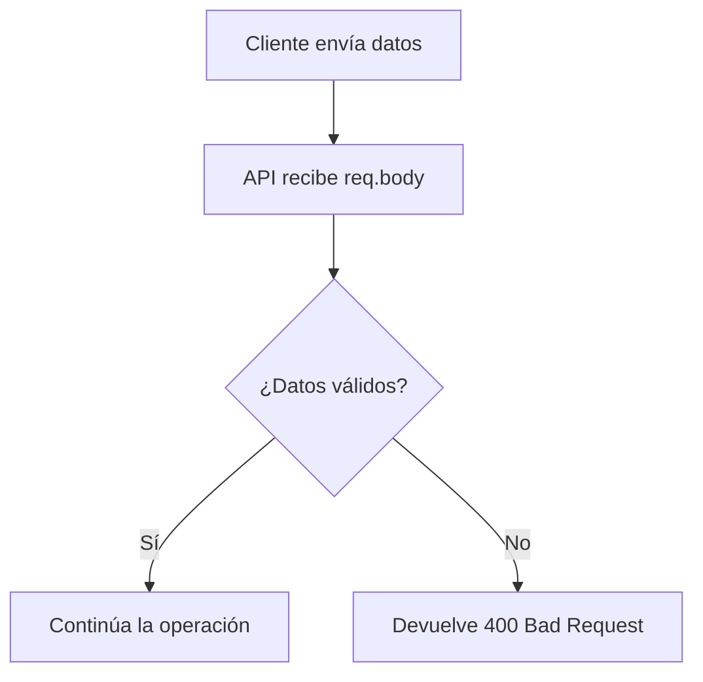
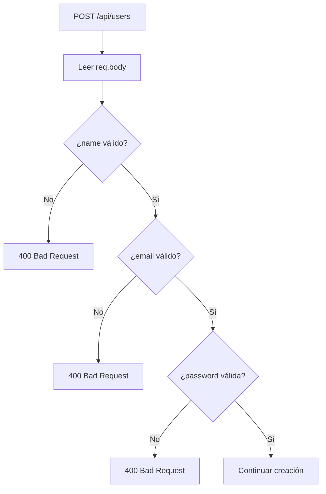

# Día 12: Validación manual básica

En el día 11 completamos el CRUD básico de usuarios en memoria. Ya tenemos
endpoints para:

```http
GET /api/users
GET /api/users/:id
POST /api/users
PATCH /api/users/:id
DELETE /api/users/:id
```

Nuestra API ya puede listar, consultar, crear, actualizar y desactivar usuarios.

Pero ahora aparece un problema importante: **una API no debe aceptar cualquier
dato que le envíe el cliente**.

Hasta ahora ya hemos hecho algunas validaciones dentro de las rutas, como
comprobar si falta un campo, si el ID es numérico o si la contraseña es
demasiado corta. Hoy vamos a detenernos en ese concepto y trabajarlo mejor.

El objetivo del día 12 es entender qué significa **validar datos de entrada** y
mejorar nuestras rutas para que la API responda de forma clara cuando el cliente
envía información incorrecta.

!!! abstract "Objetivo del día"
    Mejorar la validación manual de creación y actualización de usuarios para
    evitar datos vacíos, tipos incorrectos y respuestas poco claras.

## Qué vamos a trabajar hoy

| Concepto | Qué aprenderemos |
| --- | --- |
| Validación de datos | Comprobar lo recibido antes de usarlo |
| Datos obligatorios | Detectar campos que deben estar presentes |
| Tipos de datos | Verificar strings, booleanos y valores inesperados |
| Strings vacíos | Evitar textos vacíos o formados solo por espacios |
| Conversión de datos | Limpiar y normalizar valores antes de guardarlos |
| Validación manual | Escribir comprobaciones con `if` |
| `400 Bad Request` | Responder cuando la petición no es válida |
| Mensajes claros | Ayudar al cliente a entender el error |
| Validaciones reutilizables | Extraer comprobaciones repetidas a funciones |
| Buenas prácticas | No confiar en datos enviados desde fuera |

El objetivo principal será mejorar la calidad de nuestra API para que no cree ni
actualice usuarios con datos incorrectos.

## Qué es validar datos

Validar datos significa comprobar que la información recibida cumple las reglas
esperadas antes de usarla.

Por ejemplo, si un cliente envía esta petición:

```http
POST /api/users
```

Body:

```json
{
  "name": "Ana García",
  "email": "ana@email.com",
  "password": "123456"
}
```

La API debería comprobar:

- ¿Llega `name`?
- ¿Llega `email`?
- ¿Llega `password`?
- ¿`name` es un texto válido?
- ¿`email` es un texto válido?
- ¿`password` cumple la longitud mínima?

Si todo está bien, la API puede crear el usuario. Si algo está mal, la API debe
responder con un error.



## Por qué es importante validar

Una API recibe datos desde fuera. Eso significa que no podemos confiar en que el
cliente siempre enviará lo correcto.

El cliente podría enviar datos incompletos:

```json
{
  "name": "Ana"
}
```

Datos vacíos:

```json
{
  "name": "",
  "email": "",
  "password": ""
}
```

Tipos incorrectos:

```json
{
  "name": 123,
  "email": true,
  "password": []
}
```

O campos que no debería modificar:

```json
{
  "id": 99,
  "role": "ADMIN"
}
```

Si no validamos, nuestra API puede terminar guardando información incoherente.

Validar nos ayuda a evitar:

- Usuarios sin nombre.
- Emails vacíos.
- Contraseñas demasiado cortas.
- IDs incorrectos.
- Datos con tipos inesperados.
- Cambios no permitidos.
- Errores difíciles de depurar.

## Qué es un `400 Bad Request`

Cuando el cliente envía una petición incorrecta, la API debe responder con:

```http
400 Bad Request
```

Este código significa:

```text
La petición no es válida tal como está enviada.
```

Por ejemplo, si intentamos crear un usuario sin email:

```json
{
  "name": "Ana García",
  "password": "123456"
}
```

La API podría responder:

```json
{
  "error": "El email es obligatorio"
}
```

Con código:

```http
400 Bad Request
```

Es importante distinguirlo de otros errores:

| Código | Cuándo ocurre |
| --- | --- |
| `400 Bad Request` | El cliente envió datos incorrectos |
| `404 Not Found` | El recurso no existe |
| `409 Conflict` | Hay un conflicto, como un email duplicado |
| `500 Server Error` | Fallo interno del servidor |

Hoy nos centraremos sobre todo en `400 Bad Request`.

## Validación manual

La validación manual consiste en escribir nosotros mismos las comprobaciones con
`if`.

Ejemplo:

```ts
if (!name) {
  return res.status(400).json({
    error: "El nombre es obligatorio"
  });
}
```

Otro ejemplo:

```ts
if (typeof name !== "string") {
  return res.status(400).json({
    error: "El nombre debe ser un texto"
  });
}
```

Y otro:

```ts
if (name.trim().length === 0) {
  return res.status(400).json({
    error: "El nombre no puede estar vacío"
  });
}
```

Más adelante podríamos usar librerías de validación como Zod, Joi o
express-validator, pero antes conviene entender qué problema resuelven.

Hoy validaremos manualmente.

## Datos obligatorios

Para crear un usuario necesitamos, como mínimo:

- `name`
- `email`
- `password`

Si falta alguno de estos datos, no tiene sentido crear el usuario.

Ejemplo incorrecto:

```json
{
  "name": "Ana García"
}
```

Faltan:

- `email`
- `password`

La API debe responder con un error claro.

Una respuesta posible sería:

```json
{
  "error": "name, email y password son obligatorios"
}
```

Pero podemos hacer algo un poco más claro:

```json
{
  "error": "Faltan campos obligatorios",
  "fields": ["email", "password"]
}
```

En el reto podemos empezar con mensajes sencillos e ir mejorándolos poco a
poco.

## Validar tipos de datos

No basta con comprobar que el campo existe. También debemos comprobar que tiene
el tipo adecuado.

Por ejemplo:

```json
{
  "name": 123,
  "email": true,
  "password": []
}
```

Aquí los campos existen, pero no son válidos.

Esperamos:

| Campo | Tipo esperado |
| --- | --- |
| `name` | `string` |
| `email` | `string` |
| `password` | `string` |
| `isActive` | `boolean` |

Ejemplo de validación:

```ts
if (typeof name !== "string") {
  return res.status(400).json({
    error: "El nombre debe ser un texto"
  });
}
```

Para `isActive`, esperamos un booleano real:

```json
{
  "isActive": false
}
```

No un texto:

```json
{
  "isActive": "false"
}
```

Aunque visualmente parezcan similares, no son lo mismo.

## Strings vacíos y `trim`

Un texto puede existir, pero estar vacío.

Ejemplo:

```json
{
  "name": ""
}
```

También puede contener solo espacios:

```json
{
  "name": "      "
}
```

Para evitarlo usamos:

```ts
name.trim();
```

`trim()` elimina los espacios al principio y al final.

Ejemplo:

```ts
const cleanName = name.trim();
```

Si después de limpiar el texto queda vacío, no debemos aceptarlo:

```ts
if (cleanName.length === 0) {
  return res.status(400).json({
    error: "El nombre no puede estar vacío"
  });
}
```

Esta validación es muy habitual en formularios y APIs.

## Validaciones de creación y actualización

No validamos igual una creación que una actualización.

### Crear usuario

En `POST /api/users`, los campos principales son obligatorios:

- `name`
- `email`
- `password`

Porque estamos creando un usuario desde cero.

### Actualizar usuario

En `PATCH /api/users/:id`, los campos no son todos obligatorios.

Podemos enviar solo:

```json
{
  "name": "Nuevo nombre"
}
```

O solo:

```json
{
  "email": "nuevo@email.com"
}
```

Pero sí debemos comprobar que al menos llegue un campo modificable.

Body incorrecto:

```json
{}
```

Respuesta:

```json
{
  "error": "Debes enviar al menos un campo para actualizar"
}
```

Resumen:

| Operación | Ruta | Validación principal |
| --- | --- | --- |
| Crear | `POST /api/users` | `name`, `email` y `password` obligatorios |
| Actualizar | `PATCH /api/users/:id` | Al menos un campo válido |
| Desactivar | `DELETE /api/users/:id` | ID válido y usuario existente |

## Reutilizar validaciones

Si escribimos las mismas validaciones muchas veces, el código se vuelve difícil
de mantener.

Por ejemplo, podríamos repetir muchas veces:

```ts
if (typeof name !== "string" || name.trim().length === 0) {
  return res.status(400).json({
    error: "El nombre no es válido"
  });
}
```

Para evitarlo, podemos crear pequeñas funciones auxiliares.

Ejemplo:

```ts
function isNonEmptyString(value: unknown): value is string {
  return typeof value === "string" && value.trim().length > 0;
}
```

Esta función devuelve `true` si el valor es un texto y no está vacío.

Después podemos usarla así:

```ts
if (!isNonEmptyString(name)) {
  return res.status(400).json({
    error: "El nombre debe ser un texto no vacío"
  });
}
```

No estamos creando todavía una arquitectura completa, pero sí empezamos a
ordenar nuestro código.

## Flujo de validación de creación

El flujo de `POST /api/users` debería parecerse a esto:



Hoy no vamos a cambiar toda la arquitectura. Vamos a mejorar las validaciones
básicas para que sean más claras.

## Parte guiada

### Paso 1: Abrir el proyecto

Abre el repositorio:

```text
usermanager-api
```

Entra en la carpeta:

```bash
cd usermanager-api
```

Arranca el servidor:

```bash
npm run dev
```

Comprueba que sigue funcionando:

```http
GET http://localhost:3000/api/health
```

### Paso 2: Revisar las validaciones actuales

Abre el archivo:

```text
src/server.ts
```

Busca la ruta:

```http
POST /api/users
```

Seguramente tendrá validaciones parecidas a estas:

```ts
if (!name || !email || !password) {
  return res.status(400).json({
    error: "name, email y password son obligatorios"
  });
}

if (password.length < 6) {
  return res.status(400).json({
    error: "La contraseña debe tener al menos 6 caracteres"
  });
}
```

Estas validaciones funcionan para casos sencillos, pero se pueden mejorar.

Por ejemplo, si el cliente envía:

```json
{
  "name": 123,
  "email": true,
  "password": []
}
```

La API puede comportarse de forma inesperada.

### Paso 3: Crear funciones auxiliares de validación

Encima de las rutas, después del array `users`, añade estas funciones:

```ts
function isNonEmptyString(value: unknown): value is string {
  return typeof value === "string" && value.trim().length > 0;
}

function isBoolean(value: unknown): value is boolean {
  return typeof value === "boolean";
}
```

Estas funciones nos ayudan a comprobar tipos de forma más clara.

- La primera valida que un valor sea un string no vacío.
- La segunda valida que un valor sea booleano.

### Paso 4: Mejorar la validación de `POST /api/users`

Busca la ruta:

```ts
app.post("/api/users", ...)
```

Dentro de la ruta, después de leer el body:

```ts
const { name, email, password } = req.body;
```

Sustituye la validación inicial por esta:

```ts
if (!isNonEmptyString(name)) {
  return res.status(400).json({
    error: "El nombre debe ser un texto no vacío"
  });
}

if (!isNonEmptyString(email)) {
  return res.status(400).json({
    error: "El email debe ser un texto no vacío"
  });
}

if (!isNonEmptyString(password)) {
  return res.status(400).json({
    error: "La contraseña debe ser un texto no vacío"
  });
}
```

Ahora no solo comprobamos si el campo existe, sino también si es un texto
válido.

### Paso 5: Limpiar datos recibidos

Después de validar que son strings no vacíos, crea versiones limpias:

```ts
const cleanName = name.trim();
const cleanEmail = email.trim().toLowerCase();
const cleanPassword = password.trim();
```

A partir de aquí, usa estas variables en lugar de `name`, `email` y `password`.

Esto evita guardar nombres o emails con espacios innecesarios.

### Paso 6: Validar longitud de contraseña

Actualiza la validación de contraseña para usar `cleanPassword`:

```ts
if (cleanPassword.length < 6) {
  return res.status(400).json({
    error: "La contraseña debe tener al menos 6 caracteres"
  });
}
```

### Paso 7: Validar formato básico de email

Añade una validación sencilla:

```ts
if (!cleanEmail.includes("@")) {
  return res.status(400).json({
    error: "El email no tiene un formato válido"
  });
}
```

Esta validación no es perfecta, pero para empezar nos sirve.

Más adelante podríamos mejorarla.

### Paso 8: Actualizar comprobación de email duplicado

Actualiza la búsqueda de email duplicado para usar `cleanEmail`:

```ts
const existingUser = users.find((user) => user.email === cleanEmail);

if (existingUser) {
  return res.status(409).json({
    error: "El email ya está registrado"
  });
}
```

### Paso 9: Crear el usuario con los datos limpios

Cuando crees el usuario, usa `cleanName` y `cleanEmail`:

```ts
const newUser: User = {
  id: newId,
  name: cleanName,
  email: cleanEmail,
  role: "USER",
  isActive: true,
  createdAt: new Date().toISOString(),
  updatedAt: new Date().toISOString()
};
```

No usamos `cleanPassword` para crear el usuario porque todavía no estamos
guardando contraseñas. Más adelante, cuando trabajemos seguridad, guardaremos
`passwordHash`.

### Paso 10: Revisar la ruta completa de creación

La ruta `POST /api/users` debería quedar parecida a esta:

```ts
app.post("/api/users", (req, res) => {
  const { name, email, password } = req.body;

  if (!isNonEmptyString(name)) {
    return res.status(400).json({
      error: "El nombre debe ser un texto no vacío"
    });
  }

  if (!isNonEmptyString(email)) {
    return res.status(400).json({
      error: "El email debe ser un texto no vacío"
    });
  }

  if (!isNonEmptyString(password)) {
    return res.status(400).json({
      error: "La contraseña debe ser un texto no vacío"
    });
  }

  const cleanName = name.trim();
  const cleanEmail = email.trim().toLowerCase();
  const cleanPassword = password.trim();

  if (cleanPassword.length < 6) {
    return res.status(400).json({
      error: "La contraseña debe tener al menos 6 caracteres"
    });
  }

  if (!cleanEmail.includes("@")) {
    return res.status(400).json({
      error: "El email no tiene un formato válido"
    });
  }

  const existingUser = users.find((user) => user.email === cleanEmail);

  if (existingUser) {
    return res.status(409).json({
      error: "El email ya está registrado"
    });
  }

  const newId = users.length > 0
    ? Math.max(...users.map((user) => user.id)) + 1
    : 1;

  const newUser: User = {
    id: newId,
    name: cleanName,
    email: cleanEmail,
    role: "USER",
    isActive: true,
    createdAt: new Date().toISOString(),
    updatedAt: new Date().toISOString()
  };

  users.push(newUser);

  return res.status(201).json({
    message: "Usuario creado correctamente",
    data: newUser
  });
});
```

### Paso 11: Mejorar la validación de `PATCH /api/users/:id`

Busca dentro de la ruta de actualización la parte donde validas `name`, `email`
e `isActive`.

Asegúrate de que el nombre se valida así:

```ts
let cleanName: string | undefined;

if (name !== undefined) {
  if (!isNonEmptyString(name)) {
    return res.status(400).json({
      error: "El nombre debe ser un texto no vacío"
    });
  }

  cleanName = name.trim();
}
```

### Paso 12: Validar `email` en actualización

Asegúrate de que el email se valida así:

```ts
let cleanEmail: string | undefined;

if (email !== undefined) {
  if (!isNonEmptyString(email)) {
    return res.status(400).json({
      error: "El email debe ser un texto no vacío"
    });
  }

  cleanEmail = email.trim().toLowerCase();

  if (!cleanEmail.includes("@")) {
    return res.status(400).json({
      error: "El email no tiene un formato válido"
    });
  }

  const emailAlreadyExists = users.some(
    (user) => user.email === cleanEmail && user.id !== id
  );

  if (emailAlreadyExists) {
    return res.status(409).json({
      error: "El email ya está registrado"
    });
  }
}
```

### Paso 13: Validar `isActive` en actualización

Asegúrate de que `isActive` se valida así:

```ts
if (isActive !== undefined && !isBoolean(isActive)) {
  return res.status(400).json({
    error: "isActive debe ser true o false"
  });
}
```

### Paso 14: Probar casos de validación

En Thunder Client o Postman, prueba estos casos:

| Caso | Body | Código esperado |
| --- | --- | ---: |
| Nombre vacío | `{ "name": "", "email": "nuevo@email.com", "password": "123456" }` | `400` |
| Nombre con solo espacios | `{ "name": "      ", "email": "nuevo@email.com", "password": "123456" }` | `400` |
| Email que no es texto | `{ "name": "Usuario", "email": true, "password": "123456" }` | `400` |
| Password que no es texto | `{ "name": "Usuario", "email": "usuario@email.com", "password": 123456 }` | `400` |
| Email con mayúsculas y espacios | `{ "name": "  Usuario Limpio  ", "email": "  USUARIO@EMAIL.COM  ", "password": "123456" }` | `201` |

Después del último caso, comprueba en el listado que se ha guardado como:

```json
{
  "name": "Usuario Limpio",
  "email": "usuario@email.com"
}
```

### Paso 15: Crear una carpeta de pruebas del día 12

En Thunder Client o Postman, dentro de la colección `UserManager API`, crea una
carpeta llamada:

```text
Día 12 - Validación manual básica
```

Añade estas peticiones:

| Método | Ruta | Objetivo |
| --- | --- | --- |
| `POST` | `/api/users` | Nombre vacío |
| `POST` | `/api/users` | Nombre con espacios |
| `POST` | `/api/users` | Email no string |
| `POST` | `/api/users` | Password no string |
| `POST` | `/api/users` | Datos limpios correctos |
| `PATCH` | `/api/users/1` | Nombre vacío |
| `PATCH` | `/api/users/1` | `isActive` incorrecto |

### Paso 16: Actualizar el README

Añade una sección sobre validaciones básicas:

````md
## Validaciones básicas

La API realiza validaciones manuales antes de crear o actualizar usuarios.

Validaciones principales:

- `name` debe ser un texto no vacío.
- `email` debe ser un texto no vacío.
- `password` debe ser un texto no vacío.
- `password` debe tener al menos 6 caracteres.
- `email` debe contener `@`.
- `isActive` debe ser boolean.

Ejemplo de error:

```json
{
  "error": "El nombre debe ser un texto no vacío"
}
```
````

### Paso 17: Crear el documento del día 12

Dentro de la carpeta `docs/`, crea un archivo:

```text
docs/dia-12-validacion-manual-basica.md
```

Añade este contenido inicial:

````md
# Día 12 - Validación manual básica

## Qué he hecho

- He revisado las validaciones existentes.
- He creado funciones auxiliares de validación.
- He validado strings no vacíos.
- He validado tipos de datos.
- He limpiado `name` y `email` con `trim`.
- He normalizado `email` a minúsculas.
- He mejorado la validación de creación de usuarios.
- He mejorado la validación de actualización de usuarios.
- He probado errores `400 Bad Request`.

## Funciones creadas

```ts
function isNonEmptyString(value: unknown): value is string {
  return typeof value === "string" && value.trim().length > 0;
}

function isBoolean(value: unknown): value is boolean {
  return typeof value === "boolean";
}
```

## Casos probados

| Caso | Código esperado | Resultado |
| --- | ---: | --- |
| Nombre vacío | 400 | |
| Nombre con solo espacios | 400 | |
| Email no string | 400 | |
| Password no string | 400 | |
| Email con mayúsculas y espacios | 201 | |
| isActive incorrecto en PATCH | 400 | |

## Explicación personal

Validar datos significa comprobar que lo que llega a la API tiene el formato
esperado antes de usarlo. Si los datos son incorrectos, la API debe responder
con un error claro y no continuar con la operación.
````

### Paso 18: Actualizar el índice del README

Añade el enlace al documento del día 12:

```md
## Documentación del reto

- [Día 1 - Diseño inicial](docs/dia-01-diseno-inicial.md)
- [Día 2 - Preparación del proyecto](docs/dia-02-preparacion-proyecto.md)
- [Día 3 - Primer endpoint](docs/dia-03-primer-endpoint.md)
- [Día 4 - Métodos HTTP](docs/dia-04-metodos-http.md)
- [Día 5 - JSON, body, params y headers](docs/dia-05-json-body-params-headers.md)
- [Día 6 - Cliente HTTP y depuración](docs/dia-06-cliente-http-depuracion.md)
- [Día 7 - Listado de usuarios en memoria](docs/dia-07-listado-usuarios.md)
- [Día 8 - Consultar usuario por ID](docs/dia-08-consultar-usuario-id.md)
- [Día 9 - Crear usuarios en memoria](docs/dia-09-crear-usuarios.md)
- [Día 10 - Actualizar usuarios en memoria](docs/dia-10-actualizar-usuarios.md)
- [Día 11 - Eliminar o desactivar usuarios en memoria](docs/dia-11-eliminar-desactivar-usuarios.md)
- [Día 12 - Validación manual básica](docs/dia-12-validacion-manual-basica.md)
```

### Paso 19: Guardar cambios en Git

Comprueba los cambios:

```bash
git status
```

Añade los archivos:

```bash
git add .
```

Crea un commit:

```bash
git commit -m "Dia 12 - Mejorar validacion manual basica"
```

Sube los cambios:

```bash
git push
```

## Parte libre

Ahora toca practicar sin seguir todos los pasos guiados.

### Tarea libre 1: Crear una función `isValidBasicEmail`

Crea una función auxiliar:

```ts
function isValidBasicEmail(value: string): boolean {
  return value.includes("@") && value.includes(".");
}
```

Úsala en lugar de comprobar solo:

```ts
cleanEmail.includes("@");
```

No es una validación perfecta, pero mejora un poco la anterior.

### Tarea libre 2: Validar longitud del nombre

Añade una regla para que el nombre tenga al menos 2 caracteres después de
aplicar `trim()`.

Ejemplo de error:

```json
{
  "error": "El nombre debe tener al menos 2 caracteres"
}
```

### Tarea libre 3: Crear una lista de errores de validación

En el documento del día 12, añade una sección:

```md
## Errores de validación
```

Y completa una tabla como esta:

| Error | Cuándo ocurre | Código |
| --- | --- | ---: |
| Nombre vacío | | |
| Email no válido | | |
| Password corta | | |
| `isActive` incorrecto | | |

### Tarea libre 4: Explicar por qué no debemos confiar en el cliente

En el documento del día 12, añade una sección:

```md
## ¿Por qué no debemos confiar en el cliente?
```

Explica con tus palabras por qué la API debe validar los datos aunque el
frontend también tenga validaciones.

Puedes apoyarte en esta idea:

```text
El frontend puede validar, pero la API es la última barrera antes de modificar los datos.
```

## Entrega recomendada del día 12

Las respuestas no se entregan como archivo suelto. Deben quedar dentro del
repositorio de GitHub.

Al finalizar el día 12, el repositorio debería tener esta estructura aproximada:

```text
usermanager-api/
  README.md
  package.json
  package-lock.json
  tsconfig.json
  src/
    server.ts
  docs/
    dia-01-diseno-inicial.md
    dia-02-preparacion-proyecto.md
    dia-03-primer-endpoint.md
    dia-04-metodos-http.md
    dia-05-json-body-params-headers.md
    dia-06-cliente-http-depuracion.md
    dia-07-listado-usuarios.md
    dia-08-consultar-usuario-id.md
    dia-09-crear-usuarios.md
    dia-10-actualizar-usuarios.md
    dia-11-eliminar-desactivar-usuarios.md
    dia-12-validacion-manual-basica.md
```

El documento del día 12 deberá estar en:

```text
docs/dia-12-validacion-manual-basica.md
```

Y deberá incluir:

- Resumen de lo realizado.
- Funciones auxiliares creadas.
- Casos probados.
- Explicación personal de validación de datos.
- Tabla de errores de validación.
- Explicación de por qué no debemos confiar en el cliente.

En el foro, se compartirá el enlace actualizado al repositorio.

Ejemplo de mensaje:

```text
Hola, comparto el avance del día 12 del reto UserManager API:

https://github.com/usuario/usermanager-api

He mejorado la validación manual básica de la API y he documentado el trabajo del día 12 en:
docs/dia-12-validacion-manual-basica.md
```

## Cierre del día

Hoy hemos empezado a mejorar la calidad de nuestra API.

Hasta ahora la API ya podía hacer un CRUD básico, pero ahora empieza a
comportarse de forma más segura y predecible porque no acepta cualquier dato.

Hoy hemos trabajado:

- Validación manual.
- Datos obligatorios.
- Tipos de datos.
- Strings vacíos.
- `trim()`.
- Normalización de email.
- Errores `400 Bad Request`.
- Funciones auxiliares.
- Validación en creación y actualización.

A partir de los próximos días seguiremos mejorando los errores, los códigos de
estado y la forma en que la API comunica los problemas al cliente.

!!! success "Idea clave"
    Una API debe validar siempre los datos que recibe, porque el backend es la
    última barrera antes de modificar la información del sistema.
