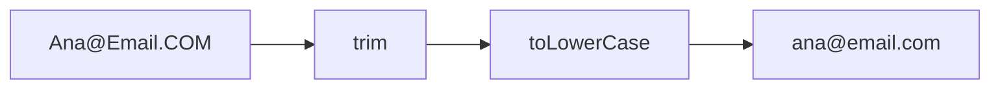
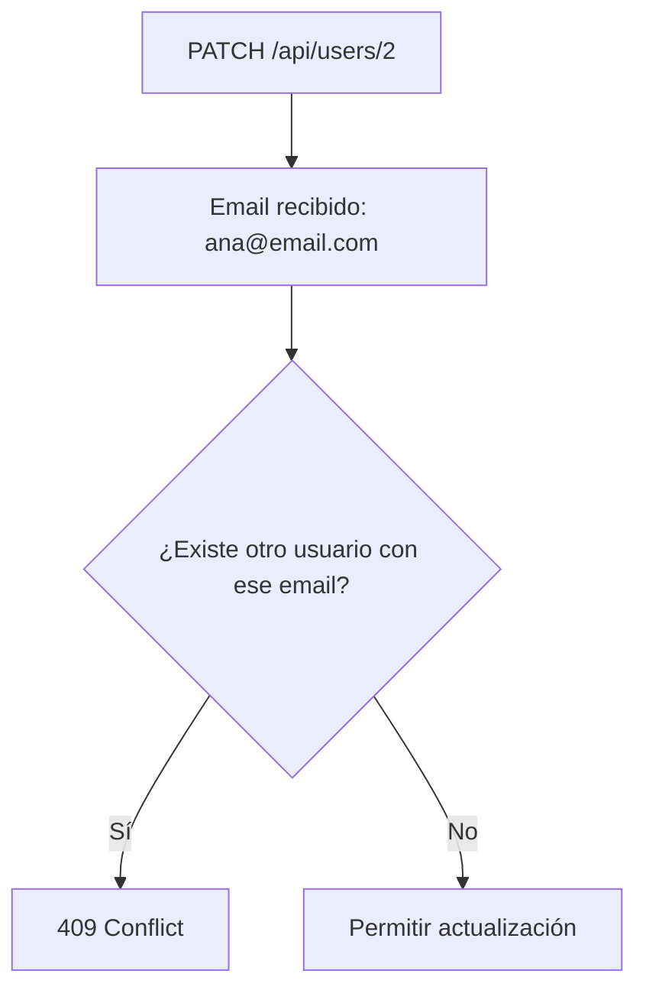
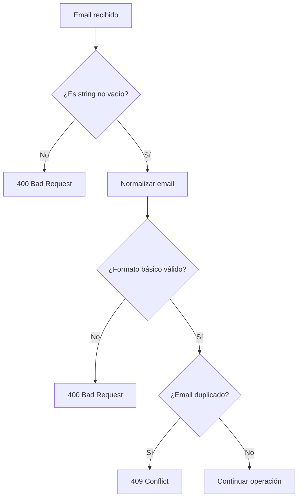

# Día 13: Validación de email y control de duplicados

En el día 12 empezamos a mejorar las validaciones de nuestra API. Vimos que el
backend no puede confiar en que el cliente siempre enviará los datos
correctamente y empezamos a validar strings no vacíos, tipos de datos, campos
obligatorios y valores como `isActive`.

Hoy vamos a profundizar en una validación muy importante en cualquier sistema de
gestión de usuarios:

```text
El email debe ser válido y no puede estar duplicado.
```

En casi cualquier aplicación, el email se utiliza para identificar a un usuario.
Por eso debemos evitar situaciones como estas:

- Dos usuarios con el mismo email.
- Emails guardados con espacios.
- Emails iguales pero con mayúsculas y minúsculas distintas.
- Emails sin formato válido.

Por ejemplo, para una persona estos correos deberían considerarse el mismo:

```text
ana@email.com
ANA@EMAIL.COM
  Ana@Email.com
```

Si no normalizamos el email, la API podría permitir usuarios duplicados sin que
nos demos cuenta.

Hoy vamos a mejorar este comportamiento.

!!! abstract "Objetivo del día"
    Normalizar, validar y comprobar duplicados de email tanto en creación como
    en actualización de usuarios.

## Qué vamos a trabajar hoy

| Concepto | Qué aprenderemos |
| --- | --- |
| Validación de email | Rechazar emails con formato básico incorrecto |
| Normalización de datos | Transformar valores antes de compararlos o guardarlos |
| `trim()` | Eliminar espacios al principio y al final |
| `toLowerCase()` | Guardar emails en minúsculas |
| Email único | Evitar dos usuarios con el mismo email |
| Duplicados en creación | Impedir altas con emails ya registrados |
| Duplicados en actualización | Impedir cambiar a un email de otro usuario |
| `409 Conflict` | Comunicar conflictos con el estado actual |
| Funciones auxiliares | Extraer lógica repetida |
| Reutilización de lógica | Usar las mismas reglas en `POST` y `PATCH` |
| Buenas prácticas | Mantener datos de usuario coherentes |

El objetivo principal será mejorar la lógica relacionada con el email para que
nuestra API sea más coherente y segura.

## Por qué el email es importante

En una aplicación real, el email suele usarse para:

- Registrar usuarios.
- Iniciar sesión.
- Recuperar contraseñas.
- Enviar notificaciones.
- Identificar cuentas.
- Evitar duplicados.

Por eso no debería haber dos usuarios con el mismo email.

Imaginemos este array:

```json
[
  {
    "id": 1,
    "name": "Ana García",
    "email": "ana@email.com"
  },
  {
    "id": 2,
    "name": "Ana Repetida",
    "email": "ANA@EMAIL.COM"
  }
]
```

A simple vista, los emails no son exactamente iguales como texto, pero en la
práctica representan la misma dirección.

Si no controlamos esto, nuestra API podría crear cuentas duplicadas.

## El problema de las mayúsculas y espacios

Cuando un usuario escribe su email en un formulario, puede cometer pequeñas
variaciones:

```text
ana@email.com
Ana@Email.com
  ana@email.com
ANA@EMAIL.COM
```

Para nosotros, todos esos casos deberían guardarse igual.

La forma más sencilla de hacerlo es:

```ts
const cleanEmail = email.trim().toLowerCase();
```

Esto hace dos cosas:

- `trim()` elimina espacios al principio y al final.
- `toLowerCase()` convierte todo el texto a minúsculas.

Ejemplo:

```ts
const email = "  Ana@Email.COM  ";
const cleanEmail = email.trim().toLowerCase();
```

Resultado:

```text
ana@email.com
```

A este proceso lo llamamos **normalización**.

## Qué es normalizar datos

Normalizar datos significa transformar un valor a un formato común antes de
guardarlo o compararlo.

Por ejemplo:

```text
"  Ana@Email.COM  " -> "ana@email.com"
"  Carlos Pérez "   -> "Carlos Pérez"
```

Normalizar no significa cambiar el significado del dato. Significa dejarlo en
una forma más limpia y predecible.

En nuestro caso, normalizaremos el email para:

- Evitar duplicados.
- Facilitar búsquedas.
- Guardar datos de forma coherente.
- Evitar diferencias por mayúsculas o espacios.



## Validación básica de email

Validar un email perfectamente es más complicado de lo que parece. Existen
emails válidos con formatos muy variados.

Para este reto no vamos a hacer una validación perfecta. Haremos una validación
básica suficiente para aprender el concepto.

Podemos comprobar que el email:

- Sea un texto no vacío.
- Contenga `@`.
- Contenga un punto.

Por ejemplo:

```ts
function isValidBasicEmail(value: string): boolean {
  return value.includes("@") && value.includes(".");
}
```

Aceptaremos:

```text
ana@email.com
usuario.prueba@gmail.com
```

Rechazaremos:

```text
anaemail.com
ana@email
correo-sin-arroba
```

Esta validación no es definitiva para una aplicación real, pero es suficiente
para entender la idea.

## Email duplicado en creación

Cuando creamos un usuario con:

```http
POST /api/users
```

La API debe comprobar si ya existe un usuario con ese email.

Ejemplo:

```json
{
  "name": "Ana Repetida",
  "email": "ana@email.com",
  "password": "123456"
}
```

Si ya existe un usuario con ese email, no debemos crearlo.

La respuesta correcta será:

```http
409 Conflict
```

Ejemplo:

```json
{
  "error": "El email ya está registrado"
}
```

Usamos `409 Conflict` porque la petición está bien formada, pero entra en
conflicto con el estado actual del sistema: ya existe un usuario con ese email.

## Email duplicado en actualización

También debemos controlar duplicados cuando actualizamos un usuario con:

```http
PATCH /api/users/:id
```

Imaginemos estos usuarios:

```json
[
  {
    "id": 1,
    "email": "ana@email.com"
  },
  {
    "id": 2,
    "email": "carlos@email.com"
  }
]
```

Si intentamos actualizar el usuario 2 con:

```json
{
  "email": "ana@email.com"
}
```

La API debe impedirlo, porque ese email pertenece al usuario 1.

Pero hay un detalle importante.

Si el usuario 2 se actualiza enviando su propio email:

```json
{
  "email": "carlos@email.com"
}
```

No debe considerarse duplicado, porque el email ya pertenece a ese mismo
usuario.

Por eso, al comprobar duplicados en actualización, debemos ignorar el ID del
usuario que estamos editando.



## Crear funciones auxiliares

Para no repetir código, crearemos funciones auxiliares.

Por ejemplo:

```ts
function normalizeEmail(email: string): string {
  return email.trim().toLowerCase();
}
```

Esta función se encargará de limpiar y normalizar emails.

También podemos crear:

```ts
function isValidBasicEmail(value: string): boolean {
  return value.includes("@") && value.includes(".");
}
```

Y una función para comprobar si un email ya está ocupado:

```ts
function isEmailTaken(email: string, userIdToIgnore?: number): boolean {
  const normalizedEmail = normalizeEmail(email);

  return users.some(
    (user) => user.email === normalizedEmail && user.id !== userIdToIgnore
  );
}
```

Esta función permite dos usos:

```ts
isEmailTaken("ana@email.com");
```

Para creación.

```ts
isEmailTaken("ana@email.com", 2);
```

Para actualización, ignorando el usuario con ID `2`.

## Flujo de validación de email

Cuando creemos o actualicemos un email, el flujo será este:



Este flujo nos ayuda a ordenar la lógica:

1. Primero validamos tipo y contenido.
2. Después normalizamos.
3. Después comprobamos formato.
4. Después comprobamos duplicados.

## Parte guiada

### Paso 1: Abrir el proyecto

Abre el repositorio:

```text
usermanager-api
```

Entra en la carpeta:

```bash
cd usermanager-api
```

Arranca el servidor:

```bash
npm run dev
```

Comprueba que la API sigue funcionando:

```http
GET http://localhost:3000/api/health
```

### Paso 2: Revisar el estado actual del proyecto

Abre el archivo:

```text
src/server.ts
```

Comprueba que tienes estas funciones del día anterior:

```ts
function isNonEmptyString(value: unknown): value is string {
  return typeof value === "string" && value.trim().length > 0;
}

function isBoolean(value: unknown): value is boolean {
  return typeof value === "boolean";
}
```

Hoy añadiremos nuevas funciones relacionadas con email.

### Paso 3: Crear la función `normalizeEmail`

Debajo de las funciones anteriores, añade:

```ts
function normalizeEmail(email: string): string {
  return email.trim().toLowerCase();
}
```

Esta función recibirá un email y devolverá una versión limpia.

Ejemplo:

```ts
normalizeEmail("  Ana@Email.COM  ");
```

Resultado:

```text
ana@email.com
```

### Paso 4: Crear la función `isValidBasicEmail`

Añade esta función:

```ts
function isValidBasicEmail(value: string): boolean {
  return value.includes("@") && value.includes(".");
}
```

Esta función comprobará un formato mínimo.

No es una validación perfecta, pero nos permite rechazar casos muy incorrectos.

Ejemplos válidos:

```text
ana@email.com
usuario.prueba@gmail.com
```

Ejemplos no válidos:

```text
anaemail.com
ana@email
correo
```

### Paso 5: Crear la función `isEmailTaken`

Añade esta función:

```ts
function isEmailTaken(email: string, userIdToIgnore?: number): boolean {
  const normalizedEmail = normalizeEmail(email);

  return users.some(
    (user) => user.email === normalizedEmail && user.id !== userIdToIgnore
  );
}
```

Esta función comprueba si el email ya existe en el array `users`.

El parámetro `userIdToIgnore` es opcional. Lo usaremos cuando actualicemos un
usuario para no compararlo consigo mismo.

### Paso 6: Revisar las funciones auxiliares

La zona de funciones debería quedar parecida a esta:

```ts
function isNonEmptyString(value: unknown): value is string {
  return typeof value === "string" && value.trim().length > 0;
}

function isBoolean(value: unknown): value is boolean {
  return typeof value === "boolean";
}

function normalizeEmail(email: string): string {
  return email.trim().toLowerCase();
}

function isValidBasicEmail(value: string): boolean {
  return value.includes("@") && value.includes(".");
}

function isEmailTaken(email: string, userIdToIgnore?: number): boolean {
  const normalizedEmail = normalizeEmail(email);

  return users.some(
    (user) => user.email === normalizedEmail && user.id !== userIdToIgnore
  );
}
```

### Paso 7: Mejorar `POST /api/users`

Busca la ruta:

```http
POST /api/users
```

Dentro de la ruta, localiza esta parte:

```ts
const cleanEmail = email.trim().toLowerCase();
```

Sustitúyela por:

```ts
const cleanEmail = normalizeEmail(email);
```

Después, si tenías esta validación:

```ts
if (!cleanEmail.includes("@")) {
  return res.status(400).json({
    error: "El email no tiene un formato válido"
  });
}
```

Sustitúyela por:

```ts
if (!isValidBasicEmail(cleanEmail)) {
  return res.status(400).json({
    error: "El email no tiene un formato válido"
  });
}
```

### Paso 8: Usar `isEmailTaken` en creación

Busca esta comprobación:

```ts
const existingUser = users.find((user) => user.email === cleanEmail);

if (existingUser) {
  return res.status(409).json({
    error: "El email ya está registrado"
  });
}
```

Sustitúyela por:

```ts
if (isEmailTaken(cleanEmail)) {
  return res.status(409).json({
    error: "El email ya está registrado"
  });
}
```

La creación queda más limpia porque la lógica de duplicados está en una función.

### Paso 9: Revisar fragmento de creación

La parte central de `POST /api/users` debería quedar parecida a esto:

```ts
const cleanName = name.trim();
const cleanEmail = normalizeEmail(email);
const cleanPassword = password.trim();

if (cleanPassword.length < 6) {
  return res.status(400).json({
    error: "La contraseña debe tener al menos 6 caracteres"
  });
}

if (!isValidBasicEmail(cleanEmail)) {
  return res.status(400).json({
    error: "El email no tiene un formato válido"
  });
}

if (isEmailTaken(cleanEmail)) {
  return res.status(409).json({
    error: "El email ya está registrado"
  });
}
```

### Paso 10: Probar creación con email normalizado

Prueba:

```http
POST http://localhost:3000/api/users
```

Body:

```json
{
  "name": "Usuario Normalizado",
  "email": "  USUARIO.NORMALIZADO@EMAIL.COM  ",
  "password": "123456"
}
```

Respuesta esperada:

```json
{
  "message": "Usuario creado correctamente",
  "data": {
    "id": 4,
    "name": "Usuario Normalizado",
    "email": "usuario.normalizado@email.com",
    "role": "USER",
    "isActive": true
  }
}
```

El email debe guardarse:

```text
usuario.normalizado@email.com
```

### Paso 11: Probar email duplicado con mayúsculas

Después de crear el usuario anterior, intenta crear otro:

```json
{
  "name": "Usuario Repetido",
  "email": "USUARIO.NORMALIZADO@EMAIL.COM",
  "password": "123456"
}
```

Aunque el email esté en mayúsculas, la API debe detectarlo como duplicado.

Respuesta esperada:

```json
{
  "error": "El email ya está registrado"
}
```

Código esperado:

```http
409 Conflict
```

### Paso 12: Mejorar `PATCH /api/users/:id`

Busca la ruta:

```http
PATCH /api/users/:id
```

Dentro de la validación de email, localiza esta parte:

```ts
cleanEmail = email.trim().toLowerCase();
```

Sustitúyela por:

```ts
cleanEmail = normalizeEmail(email);
```

Después sustituye la validación de formato por:

```ts
if (!isValidBasicEmail(cleanEmail)) {
  return res.status(400).json({
    error: "El email no tiene un formato válido"
  });
}
```

### Paso 13: Usar `isEmailTaken` en actualización

Busca esta comprobación:

```ts
const emailAlreadyExists = users.some(
  (user) => user.email === cleanEmail && user.id !== id
);

if (emailAlreadyExists) {
  return res.status(409).json({
    error: "El email ya está registrado"
  });
}
```

Sustitúyela por:

```ts
if (isEmailTaken(cleanEmail, id)) {
  return res.status(409).json({
    error: "El email ya está registrado"
  });
}
```

Aquí sí pasamos el `id` del usuario actual para que no se compare consigo
mismo.

### Paso 14: Probar actualización con el mismo email

Prueba actualizar un usuario manteniendo su propio email.

Por ejemplo, si el usuario 1 tiene:

```text
ana@email.com
```

Prueba:

```http
PATCH http://localhost:3000/api/users/1
```

Body:

```json
{
  "email": "ANA@EMAIL.COM"
}
```

La API debería permitirlo, porque es el mismo email del usuario, solo
normalizado.

Código esperado:

```http
200 OK
```

### Paso 15: Probar actualización con email de otro usuario

Ahora intenta actualizar el usuario 2 usando el email del usuario 1.

```http
PATCH http://localhost:3000/api/users/2
```

Body:

```json
{
  "email": "ana@email.com"
}
```

Respuesta esperada:

```json
{
  "error": "El email ya está registrado"
}
```

Código esperado:

```http
409 Conflict
```

### Paso 16: Crear una carpeta de pruebas del día 13

En Thunder Client o Postman, dentro de la colección `UserManager API`, crea una
carpeta llamada:

```text
Día 13 - Validación de email y duplicados
```

Añade estas peticiones:

| Método | Ruta | Objetivo |
| --- | --- | --- |
| `POST` | `/api/users` | Crear usuario con email normalizado |
| `POST` | `/api/users` | Crear usuario con email duplicado |
| `POST` | `/api/users` | Crear usuario con email sin `@` |
| `POST` | `/api/users` | Crear usuario con email sin punto |
| `PATCH` | `/api/users/1` | Actualizar con su mismo email |
| `PATCH` | `/api/users/2` | Actualizar con email de otro usuario |
| `GET` | `/api/users` | Comprobar emails guardados |

### Paso 17: Actualizar el README

Añade una sección sobre email y duplicados:

````md
## Validación de email

La API normaliza los emails antes de guardarlos o compararlos.

Proceso aplicado:

- `trim()`
- `toLowerCase()`
- Validación básica de formato.
- Comprobación de duplicados.

Ejemplo:

```text
"  USUARIO@EMAIL.COM  " -> "usuario@email.com"
```

Si se intenta crear o actualizar un usuario con un email ya existente, la API
responde:

```json
{
  "error": "El email ya está registrado"
}
```

Código:

```http
409 Conflict
```
````

### Paso 18: Crear el documento del día 13

Dentro de la carpeta `docs/`, crea un archivo:

```text
docs/dia-13-validacion-email-duplicados.md
```

Añade este contenido inicial:

````md
# Día 13 - Validación de email y control de duplicados

## Qué he hecho

- He creado una función para normalizar emails.
- He creado una función para validar emails de forma básica.
- He creado una función para comprobar si un email ya está registrado.
- He mejorado la creación de usuarios.
- He mejorado la actualización de usuarios.
- He comprobado duplicados en `POST /api/users`.
- He comprobado duplicados en `PATCH /api/users/:id`.
- He probado errores `400` y `409`.

## Funciones creadas

```ts
function normalizeEmail(email: string): string {
  return email.trim().toLowerCase();
}

function isValidBasicEmail(value: string): boolean {
  return value.includes("@") && value.includes(".");
}

function isEmailTaken(email: string, userIdToIgnore?: number): boolean {
  const normalizedEmail = normalizeEmail(email);

  return users.some(
    (user) => user.email === normalizedEmail && user.id !== userIdToIgnore
  );
}
```

## Casos probados

| Caso | Código esperado | Resultado |
| --- | ---: | --- |
| Crear usuario con email normalizado | 201 | |
| Crear usuario con email duplicado | 409 | |
| Crear usuario con email sin @ | 400 | |
| Crear usuario con email sin punto | 400 | |
| Actualizar usuario con su mismo email | 200 | |
| Actualizar usuario con email de otro usuario | 409 | |

## Explicación personal

Normalizar un email significa limpiarlo antes de guardarlo o compararlo. En este
proyecto usamos `trim` y `toLowerCase` para evitar duplicados provocados por
espacios o mayúsculas.
````

### Paso 19: Actualizar el índice del README

Añade el enlace al documento del día 13:

```md
## Documentación del reto

- [Día 1 - Diseño inicial](docs/dia-01-diseno-inicial.md)
- [Día 2 - Preparación del proyecto](docs/dia-02-preparacion-proyecto.md)
- [Día 3 - Primer endpoint](docs/dia-03-primer-endpoint.md)
- [Día 4 - Métodos HTTP](docs/dia-04-metodos-http.md)
- [Día 5 - JSON, body, params y headers](docs/dia-05-json-body-params-headers.md)
- [Día 6 - Cliente HTTP y depuración](docs/dia-06-cliente-http-depuracion.md)
- [Día 7 - Listado de usuarios en memoria](docs/dia-07-listado-usuarios.md)
- [Día 8 - Consultar usuario por ID](docs/dia-08-consultar-usuario-id.md)
- [Día 9 - Crear usuarios en memoria](docs/dia-09-crear-usuarios.md)
- [Día 10 - Actualizar usuarios en memoria](docs/dia-10-actualizar-usuarios.md)
- [Día 11 - Eliminar o desactivar usuarios en memoria](docs/dia-11-eliminar-desactivar-usuarios.md)
- [Día 12 - Validación manual básica](docs/dia-12-validacion-manual-basica.md)
- [Día 13 - Validación de email y duplicados](docs/dia-13-validacion-email-duplicados.md)
```

### Paso 20: Guardar cambios en Git

Comprueba los cambios:

```bash
git status
```

Añade los archivos:

```bash
git add .
```

Crea un commit:

```bash
git commit -m "Dia 13 - Validar email y controlar duplicados"
```

Sube los cambios:

```bash
git push
```

## Parte libre

Ahora toca practicar sin seguir todos los pasos guiados.

### Tarea libre 1: Mejorar `isValidBasicEmail`

Mejora la función `isValidBasicEmail` para que también compruebe que el email no
empieza ni termina con `@`.

Ejemplo de emails que deberían rechazarse:

```text
@email.com
usuario@
usuario@correo
```

Puedes experimentar con condiciones sencillas.

### Tarea libre 2: Crear una ruta de búsqueda por email

Crea una ruta temporal:

```http
GET /api/users/search/email?email=ana@email.com
```

Debe leer el email desde `req.query`, normalizarlo y buscar un usuario con ese
email.

Respuesta si lo encuentra:

```json
{
  "message": "Usuario encontrado",
  "data": {
    "id": 1,
    "name": "Ana García",
    "email": "ana@email.com"
  }
}
```

Respuesta si no lo encuentra:

```json
{
  "error": "Usuario no encontrado"
}
```

Importante: coloca esta ruta antes de:

```http
GET /api/users/:id
```

### Tarea libre 3: Explicar el código `409`

En el documento del día 13, añade una sección:

```md
## 409 Conflict
```

Explica con tus palabras:

- Qué significa `409 Conflict`.
- Por qué lo usamos cuando el email ya está registrado.
- Por qué no sería tan adecuado usar `400` para este caso.

### Tarea libre 4: Explicar normalización

En el documento del día 13, añade una sección:

```md
## Normalización de datos
```

Explica con tus palabras:

- Qué significa normalizar un email.
- Qué problemas evita.
- Qué pasaría si guardásemos los emails tal como llegan.

Puedes usar ejemplos como:

```text
ANA@EMAIL.COM
ana@email.com
  ana@email.com
```

## Entrega recomendada del día 13

Las respuestas no se entregan como archivo suelto. Deben quedar dentro del
repositorio de GitHub.

Al finalizar el día 13, el repositorio debería tener esta estructura aproximada:

```text
usermanager-api/
  README.md
  package.json
  package-lock.json
  tsconfig.json
  src/
    server.ts
  docs/
    dia-01-diseno-inicial.md
    dia-02-preparacion-proyecto.md
    dia-03-primer-endpoint.md
    dia-04-metodos-http.md
    dia-05-json-body-params-headers.md
    dia-06-cliente-http-depuracion.md
    dia-07-listado-usuarios.md
    dia-08-consultar-usuario-id.md
    dia-09-crear-usuarios.md
    dia-10-actualizar-usuarios.md
    dia-11-eliminar-desactivar-usuarios.md
    dia-12-validacion-manual-basica.md
    dia-13-validacion-email-duplicados.md
```

El documento del día 13 deberá estar en:

```text
docs/dia-13-validacion-email-duplicados.md
```

Y deberá incluir:

- Resumen de lo realizado.
- Funciones auxiliares creadas.
- Casos probados.
- Explicación personal de normalización.
- Explicación del código `409 Conflict`.
- Pruebas de duplicados en creación.
- Pruebas de duplicados en actualización.

En el foro, se compartirá el enlace actualizado al repositorio.

Ejemplo de mensaje:

```text
Hola, comparto el avance del día 13 del reto UserManager API:

https://github.com/usuario/usermanager-api

He mejorado la validación de emails, la normalización y el control de duplicados. La documentación está en:
docs/dia-13-validacion-email-duplicados.md
```

## Cierre del día

Hoy hemos mejorado una de las reglas más importantes de una gestión de usuarios:
el email debe ser válido y único.

Hemos trabajado:

- Normalización de email.
- `trim()`.
- `toLowerCase()`.
- Validación básica de formato.
- Control de duplicados.
- `409 Conflict`.
- Duplicados en creación.
- Duplicados en actualización.
- Funciones auxiliares.
- Reutilización de lógica.

Este tipo de validación parece pequeña, pero es fundamental en cualquier backend
real.

A partir del próximo día seguiremos mejorando la forma en que nuestra API
comunica los resultados y los errores mediante códigos de estado más claros y
consistentes.

!!! success "Idea clave"
    En una API de usuarios, el email no es un dato cualquiera: debe limpiarse,
    validarse y protegerse contra duplicados para mantener la coherencia del
    sistema.
