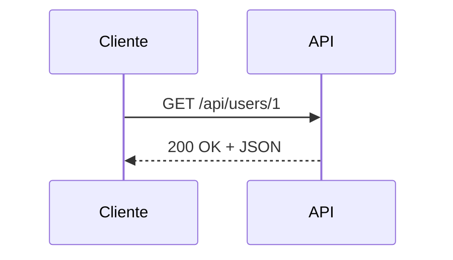
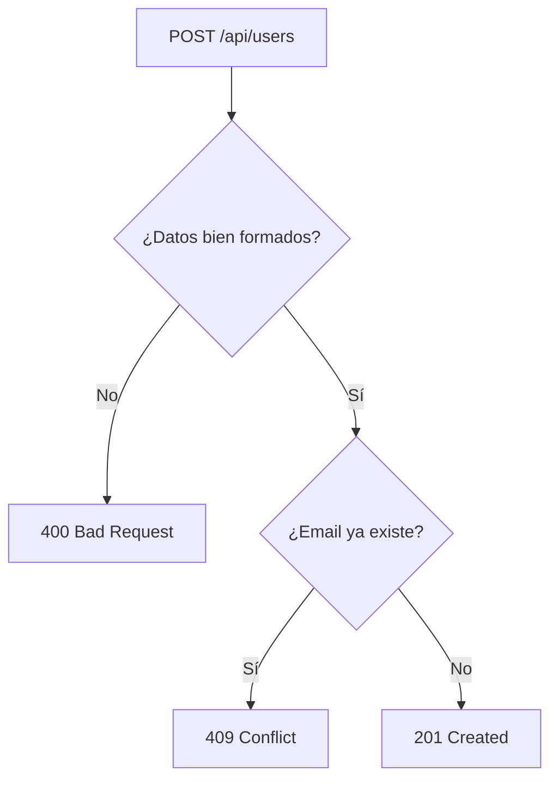
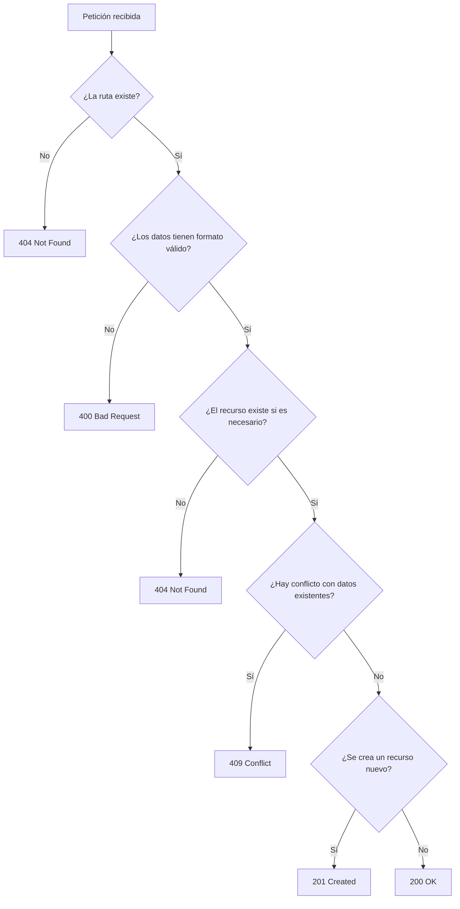

# Día 14: Códigos de estado HTTP

En el día 13 mejoramos la validación del email y el control de duplicados.
Vimos que el email debe normalizarse, validarse y comprobarse para evitar que
dos usuarios tengan la misma dirección.

Durante los últimos días ya hemos usado varios códigos HTTP:

```http
200 OK
201 Created
400 Bad Request
404 Not Found
409 Conflict
```

Pero hasta ahora los hemos ido usando según aparecían los casos. Hoy vamos a
dedicar la sesión a entenderlos mejor y a revisar que nuestra API los utiliza de
forma coherente.

Una API REST no solo debe devolver datos en JSON. También debe comunicar
correctamente **qué ha pasado** con cada petición. Para eso usamos los
**códigos de estado HTTP**.

Por ejemplo:

| Petición | Resultado |
| --- | --- |
| `GET /api/users/1` | `200 OK` si el usuario existe |
| `GET /api/users/999` | `404 Not Found` si no existe |
| `POST /api/users` | `201 Created` si se crea correctamente |
| `POST /api/users` | `400 Bad Request` si faltan datos |
| `POST /api/users` | `409 Conflict` si el email ya existe |

El objetivo de hoy será revisar los endpoints que ya tenemos y asegurarnos de
que responden con el código adecuado en cada situación.

!!! abstract "Objetivo del día"
    Entender los códigos de estado HTTP más usados en UserManager API y revisar
    que cada endpoint responda con un código coherente.

## Qué vamos a trabajar hoy

| Concepto | Qué aprenderemos |
| --- | --- |
| Status code | Comunicar el resultado de una petición |
| Familias de códigos HTTP | Distinguir `2xx`, `4xx` y `5xx` |
| `200 OK` | Confirmar consultas, actualizaciones o desactivaciones correctas |
| `201 Created` | Confirmar creación de recursos |
| `400 Bad Request` | Señalar datos incorrectos o incompletos |
| `404 Not Found` | Indicar que un recurso no existe |
| `409 Conflict` | Indicar conflictos con datos existentes |
| Error de cliente vs servidor | Separar problemas de petición y fallos internos |
| Respuestas coherentes | Alinear código, mensaje y JSON |
| Contrato de API | Hacer que el cliente sepa qué esperar |
| Pruebas de códigos HTTP | Verificar cada caso en Postman o Thunder Client |
| Documentación de errores | Registrar cuándo se usa cada código |

La idea principal es que aprendamos a diseñar respuestas más profesionales.

## Qué es un código de estado HTTP

Un **código de estado HTTP** es un número que acompaña a la respuesta del
servidor e indica el resultado de la petición.

Por ejemplo:

```text
200
201
400
404
409
500
```

Cada código tiene un significado.

Cuando una API responde, normalmente devuelve dos cosas importantes:

- Código de estado.
- Cuerpo de respuesta.

Ejemplo:

```http
HTTP/1.1 200 OK
Content-Type: application/json
```

Body:

```json
{
  "message": "Usuario encontrado",
  "data": {
    "id": 1,
    "name": "Ana García"
  }
}
```

El código `200` indica que la petición ha ido bien. El JSON explica el resultado
con más detalle.



## Familias de códigos HTTP

Los códigos HTTP se agrupan en familias.

No hace falta memorizar todos, pero sí entender la idea general.

| Familia | Significado general | Ejemplos |
| --- | --- | --- |
| `2xx` | La petición ha ido bien | `200`, `201` |
| `3xx` | Redirecciones | `301`, `302` |
| `4xx` | Error provocado por la petición del cliente | `400`, `401`, `403`, `404`, `409` |
| `5xx` | Error del servidor | `500` |

En este reto trabajaremos sobre todo con:

- `2xx`: respuestas correctas.
- `4xx`: errores del cliente.
- `5xx`: errores internos.

## Códigos `2xx`: todo ha ido bien

Los códigos que empiezan por `2` indican que la petición se ha procesado
correctamente.

### `200 OK`

Usamos `200 OK` cuando la petición se ha realizado correctamente.

Ejemplos:

```http
GET /api/health
GET /api/users
GET /api/users/:id
PATCH /api/users/:id
DELETE /api/users/:id
```

Respuesta:

```json
{
  "message": "Usuario encontrado",
  "data": {
    "id": 1,
    "name": "Ana García"
  }
}
```

Uso recomendado en nuestro proyecto:

- Consultar datos.
- Actualizar datos correctamente.
- Desactivar usuarios correctamente.

### `201 Created`

Usamos `201 Created` cuando se ha creado un nuevo recurso.

Ejemplo:

```http
POST /api/users
```

Si el usuario se crea correctamente, la API debe responder:

```http
201 Created
```

Respuesta:

```json
{
  "message": "Usuario creado correctamente",
  "data": {
    "id": 4,
    "name": "María López",
    "email": "maria@email.com",
    "role": "USER",
    "isActive": true
  }
}
```

Uso recomendado en nuestro proyecto:

- Crear usuarios.
- Registrar usuarios, cuando creemos `/auth/register` más adelante.

## Códigos `4xx`: el cliente ha enviado algo incorrecto

Los códigos que empiezan por `4` indican que la petición no se puede completar
por algún problema relacionado con lo que ha enviado el cliente.

Esto no significa que el navegador o Postman estén rotos. Significa que la
petición no cumple lo que la API espera.

Ejemplos:

- Falta un campo obligatorio.
- El ID no es válido.
- El usuario no existe.
- El email ya está registrado.
- No hay token.
- El usuario no tiene permisos.

En nuestro CRUD actual usaremos principalmente:

- `400 Bad Request`
- `404 Not Found`
- `409 Conflict`

Más adelante usaremos:

- `401 Unauthorized`
- `403 Forbidden`

## `400 Bad Request`

Usamos `400 Bad Request` cuando la petición está mal formada o contiene datos
incorrectos.

Ejemplos:

- El ID debe ser un número.
- Falta un campo obligatorio.
- El email no tiene formato válido.
- La contraseña es demasiado corta.
- `isActive` no es boolean.
- El body está vacío en una actualización.

Ejemplo:

```http
PATCH /api/users/abc
```

Respuesta:

```json
{
  "error": "El ID debe ser un número",
  "received": "abc"
}
```

Código:

```http
400 Bad Request
```

Otro ejemplo:

```json
{
  "name": "",
  "email": "usuario@email.com",
  "password": "123456"
}
```

Respuesta:

```json
{
  "error": "El nombre debe ser un texto no vacío"
}
```

Código:

```http
400 Bad Request
```

La idea es:

```text
La API entiende la ruta, pero los datos enviados no son válidos.
```

## `404 Not Found`

Usamos `404 Not Found` cuando el recurso solicitado no existe.

Ejemplo:

```http
GET /api/users/999
```

Si no hay ningún usuario con ID `999`, la respuesta debe ser:

```json
{
  "error": "Usuario no encontrado",
  "id": 999
}
```

Código:

```http
404 Not Found
```

También puede ocurrir cuando se llama a una ruta que no existe:

```http
GET /api/ruta-inventada
```

De momento Express gestiona esto de forma básica. Más adelante crearemos una
gestión de errores más ordenada.

La idea es:

```text
La petición puede estar bien escrita, pero el recurso solicitado no existe.
```

## `409 Conflict`

Usamos `409 Conflict` cuando la petición está bien formada, pero entra en
conflicto con el estado actual del sistema.

El ejemplo más claro en nuestra API es el email duplicado.

Si ya existe este usuario:

```json
{
  "id": 1,
  "email": "ana@email.com"
}
```

Y enviamos:

```json
{
  "name": "Ana Repetida",
  "email": "ana@email.com",
  "password": "123456"
}
```

La API debe responder:

```json
{
  "error": "El email ya está registrado"
}
```

Código:

```http
409 Conflict
```

¿Por qué no usamos `400`?

Porque la estructura de la petición es correcta. Tiene `name`, `email` y
`password`. El problema es que ese email entra en conflicto con un dato que ya
existe.



## Códigos que usaremos más adelante

Aunque hoy no los implementaremos del todo, conviene conocer dos códigos que
aparecerán en la parte de seguridad.

### `401 Unauthorized`

Se usa cuando el usuario no está autenticado.

Ejemplo futuro:

```http
GET /api/users/me
```

Sin token:

```json
{
  "error": "Token no proporcionado"
}
```

Código:

```http
401 Unauthorized
```

Significa:

```text
No sé quién eres o no has iniciado sesión correctamente.
```

### `403 Forbidden`

Se usa cuando el usuario sí está autenticado, pero no tiene permisos
suficientes.

Ejemplo futuro:

```http
GET /api/users
```

Si lo intenta un usuario normal con rol `USER`, la API podría responder:

```json
{
  "error": "No tienes permisos para realizar esta acción"
}
```

Código:

```http
403 Forbidden
```

Significa:

```text
Sé quién eres, pero no puedes hacer esto.
```

Diferencia importante:

| Código | Significado |
| --- | --- |
| `401` | No estás autenticado |
| `403` | Estás autenticado, pero no tienes permisos |

## `500 Internal Server Error`

El código `500 Internal Server Error` indica que ha ocurrido un error inesperado
en el servidor.

Ejemplos:

- Falló una conexión.
- Hay un error en el código.
- La base de datos no responde.
- Ocurre una excepción no controlada.

En este reto intentaremos evitar que errores internos se mezclen con errores de
validación.

No es lo mismo:

| Situación | Código |
| --- | --- |
| El cliente envía mal un ID | `400` |
| El usuario no existe | `404` |
| El servidor se rompe por un bug | `500` |

Más adelante crearemos un middleware centralizado de errores para controlar
mejor este tipo de situaciones.

## Tabla resumen para UserManager API

Esta tabla resume los códigos que vamos a usar en nuestro proyecto:

| Código | Nombre | Cuándo lo usamos |
| ---: | --- | --- |
| `200` | OK | Consulta, actualización o desactivación correcta |
| `201` | Created | Usuario creado correctamente |
| `400` | Bad Request | Datos incorrectos o incompletos |
| `404` | Not Found | Usuario o ruta no encontrada |
| `409` | Conflict | Email duplicado |
| `401` | Unauthorized | Falta autenticación, más adelante |
| `403` | Forbidden | No hay permisos, más adelante |
| `500` | Internal Server Error | Error inesperado del servidor |

## Flujo general de decisión

Cuando respondemos a una petición, podemos pensar así:



No siempre todos los pasos aplican, pero este esquema ayuda a razonar.

## Parte guiada

### Paso 1: Abrir el proyecto

Abre el repositorio:

```text
usermanager-api
```

Entra en la carpeta:

```bash
cd usermanager-api
```

Arranca el servidor:

```bash
npm run dev
```

Comprueba que la API responde:

```http
GET http://localhost:3000/api/health
```

Código esperado:

```http
200 OK
```

### Paso 2: Revisar `GET /api/users`

Prueba:

```http
GET http://localhost:3000/api/users
```

Debe devolver:

```http
200 OK
```

Este endpoint consulta información, por eso usamos `200`.

Respuesta esperada:

```json
{
  "message": "Listado de usuarios",
  "total": 3,
  "data": []
}
```

Comprueba en Thunder Client o Postman que el código obtenido sea `200`.

### Paso 3: Revisar `GET /api/users/:id`

Prueba un usuario existente:

```http
GET http://localhost:3000/api/users/1
```

Código esperado:

```http
200 OK
```

Prueba un usuario inexistente:

```http
GET http://localhost:3000/api/users/999
```

Código esperado:

```http
404 Not Found
```

Prueba un ID incorrecto:

```http
GET http://localhost:3000/api/users/abc
```

Código esperado:

```http
400 Bad Request
```

La lógica debería ser:

| Caso | Código |
| --- | --- |
| Usuario existe | `200` |
| Usuario no existe | `404` |
| ID no válido | `400` |

### Paso 4: Revisar `POST /api/users`

Prueba una creación correcta:

```http
POST http://localhost:3000/api/users
```

Body:

```json
{
  "name": "Usuario Estado",
  "email": "estado@email.com",
  "password": "123456"
}
```

Código esperado:

```http
201 Created
```

Ahora prueba datos incorrectos:

```json
{
  "name": "",
  "email": "estado2@email.com",
  "password": "123456"
}
```

Código esperado:

```http
400 Bad Request
```

Ahora prueba email duplicado:

```json
{
  "name": "Usuario Repetido",
  "email": "estado@email.com",
  "password": "123456"
}
```

Código esperado:

```http
409 Conflict
```

La lógica debería ser:

| Caso | Código |
| --- | --- |
| Usuario creado | `201` |
| Datos incorrectos | `400` |
| Email duplicado | `409` |

### Paso 5: Revisar `PATCH /api/users/:id`

Prueba una actualización correcta:

```http
PATCH http://localhost:3000/api/users/1
```

Body:

```json
{
  "name": "Ana Código 200"
}
```

Código esperado:

```http
200 OK
```

Prueba ID incorrecto:

```http
PATCH http://localhost:3000/api/users/abc
```

Código esperado:

```http
400 Bad Request
```

Prueba usuario inexistente:

```http
PATCH http://localhost:3000/api/users/999
```

Código esperado:

```http
404 Not Found
```

Prueba body vacío:

```json
{}
```

Código esperado:

```http
400 Bad Request
```

Prueba email duplicado:

```json
{
  "email": "ana@email.com"
}
```

Hazlo sobre un usuario distinto a Ana.

Código esperado:

```http
409 Conflict
```

La lógica debería ser:

| Caso | Código |
| --- | --- |
| Actualización correcta | `200` |
| ID o datos incorrectos | `400` |
| Usuario inexistente | `404` |
| Email duplicado | `409` |

### Paso 6: Revisar `DELETE /api/users/:id`

Prueba una desactivación correcta:

```http
DELETE http://localhost:3000/api/users/1
```

Código esperado:

```http
200 OK
```

Prueba ID incorrecto:

```http
DELETE http://localhost:3000/api/users/abc
```

Código esperado:

```http
400 Bad Request
```

Prueba usuario inexistente:

```http
DELETE http://localhost:3000/api/users/999
```

Código esperado:

```http
404 Not Found
```

La lógica debería ser:

| Caso | Código |
| --- | --- |
| Usuario desactivado | `200` |
| ID incorrecto | `400` |
| Usuario inexistente | `404` |

### Paso 7: Crear una carpeta de pruebas del día 14

En Thunder Client o Postman, dentro de la colección `UserManager API`, crea una
carpeta llamada:

```text
Día 14 - Códigos de estado HTTP
```

Añade estas peticiones:

| Método | Ruta | Código |
| --- | --- | ---: |
| `GET` | `/api/health` | 200 |
| `GET` | `/api/users` | 200 |
| `GET` | `/api/users/1` | 200 |
| `GET` | `/api/users/999` | 404 |
| `GET` | `/api/users/abc` | 400 |
| `POST` | `/api/users` | 201 |
| `POST` | `/api/users` | 400 |
| `POST` | `/api/users` | 409 |
| `PATCH` | `/api/users/1` | 200 |
| `PATCH` | `/api/users/abc` | 400 |
| `PATCH` | `/api/users/999` | 404 |
| `PATCH` | `/api/users/2` | 409 |
| `DELETE` | `/api/users/1` | 200 |
| `DELETE` | `/api/users/abc` | 400 |
| `DELETE` | `/api/users/999` | 404 |

### Paso 8: Revisar que las respuestas tengan sentido

Para cada petición, no mires solo el JSON. Revisa también:

- Método.
- Ruta.
- Código HTTP.
- Mensaje de respuesta.
- Cuerpo JSON.

Una respuesta correcta debe tener coherencia entre el código y el mensaje.

Mal ejemplo:

```http
200 OK
```

```json
{
  "error": "Usuario no encontrado"
}
```

Esto es incoherente, porque si el usuario no existe no debería ser `200`.

Buen ejemplo:

```http
404 Not Found
```

```json
{
  "error": "Usuario no encontrado",
  "id": 999
}
```

### Paso 9: Crear una tabla de revisión

En tu documento del día 14 tendrás que crear una tabla como esta:

| Petición | Caso | Código esperado | Código obtenido | ¿Correcto? |
| --- | --- | ---: | ---: | --- |
| `GET /api/health` | Health | 200 | | |
| `GET /api/users` | Listado | 200 | | |
| `GET /api/users/1` | Usuario existente | 200 | | |
| `GET /api/users/999` | Usuario inexistente | 404 | | |
| `GET /api/users/abc` | ID inválido | 400 | | |
| `POST /api/users` | Creación correcta | 201 | | |
| `POST /api/users` | Datos inválidos | 400 | | |
| `POST /api/users` | Email duplicado | 409 | | |
| `PATCH /api/users/1` | Actualización correcta | 200 | | |
| `PATCH /api/users/999` | Usuario inexistente | 404 | | |
| `DELETE /api/users/1` | Desactivación correcta | 200 | | |

### Paso 10: Actualizar el README

Añade una sección sobre códigos de estado:

````md
## Códigos de estado utilizados

La API utiliza códigos HTTP para indicar el resultado de cada petición.

| Código | Significado | Uso en el proyecto |
| ---: | --- | --- |
| 200 | OK | Consulta, actualización o desactivación correcta |
| 201 | Created | Usuario creado correctamente |
| 400 | Bad Request | Datos incorrectos o incompletos |
| 404 | Not Found | Usuario no encontrado |
| 409 | Conflict | Email duplicado |

Ejemplo de error 404:

```json
{
  "error": "Usuario no encontrado",
  "id": 999
}
```

Ejemplo de error 409:

```json
{
  "error": "El email ya está registrado"
}
```
````

### Paso 11: Crear el documento del día 14

Dentro de la carpeta `docs/`, crea un archivo:

```text
docs/dia-14-codigos-estado-http.md
```

Añade este contenido inicial:

````md
# Día 14 - Códigos de estado HTTP

## Qué he hecho

- He revisado los códigos HTTP utilizados en la API.
- He probado respuestas correctas con `200 OK`.
- He probado creación con `201 Created`.
- He probado errores de validación con `400 Bad Request`.
- He probado usuario inexistente con `404 Not Found`.
- He probado email duplicado con `409 Conflict`.
- He comprobado que el código HTTP coincide con el mensaje JSON.

## Tabla resumen

| Código | Significado | Cuándo lo uso |
| ---: | --- | --- |
| 200 | OK | Cuando la petición se procesa correctamente |
| 201 | Created | Cuando se crea un usuario |
| 400 | Bad Request | Cuando la petición tiene datos incorrectos |
| 404 | Not Found | Cuando el usuario no existe |
| 409 | Conflict | Cuando el email ya está registrado |

## Casos probados

| Petición | Caso | Código esperado | Código obtenido | ¿Correcto? |
| --- | --- | ---: | ---: | --- |
| `GET /api/health` | Health | 200 | | |
| `GET /api/users` | Listado | 200 | | |
| `GET /api/users/1` | Usuario existente | 200 | | |
| `GET /api/users/999` | Usuario inexistente | 404 | | |
| `GET /api/users/abc` | ID inválido | 400 | | |
| `POST /api/users` | Creación correcta | 201 | | |
| `POST /api/users` | Datos inválidos | 400 | | |
| `POST /api/users` | Email duplicado | 409 | | |
| `PATCH /api/users/1` | Actualización correcta | 200 | | |
| `PATCH /api/users/999` | Usuario inexistente | 404 | | |
| `DELETE /api/users/1` | Desactivación correcta | 200 | | |

## Explicación personal

Los códigos de estado HTTP permiten que el cliente entienda rápidamente qué ha
pasado con una petición. No basta con devolver un JSON; el código HTTP también
debe ser coherente con el resultado.
````

### Paso 12: Actualizar el índice del README

Añade el enlace al documento del día 14:

```md
## Documentación del reto

- [Día 1 - Diseño inicial](docs/dia-01-diseno-inicial.md)
- [Día 2 - Preparación del proyecto](docs/dia-02-preparacion-proyecto.md)
- [Día 3 - Primer endpoint](docs/dia-03-primer-endpoint.md)
- [Día 4 - Métodos HTTP](docs/dia-04-metodos-http.md)
- [Día 5 - JSON, body, params y headers](docs/dia-05-json-body-params-headers.md)
- [Día 6 - Cliente HTTP y depuración](docs/dia-06-cliente-http-depuracion.md)
- [Día 7 - Listado de usuarios en memoria](docs/dia-07-listado-usuarios.md)
- [Día 8 - Consultar usuario por ID](docs/dia-08-consultar-usuario-id.md)
- [Día 9 - Crear usuarios en memoria](docs/dia-09-crear-usuarios.md)
- [Día 10 - Actualizar usuarios en memoria](docs/dia-10-actualizar-usuarios.md)
- [Día 11 - Eliminar o desactivar usuarios en memoria](docs/dia-11-eliminar-desactivar-usuarios.md)
- [Día 12 - Validación manual básica](docs/dia-12-validacion-manual-basica.md)
- [Día 13 - Validación de email y duplicados](docs/dia-13-validacion-email-duplicados.md)
- [Día 14 - Códigos de estado HTTP](docs/dia-14-codigos-estado-http.md)
```

### Paso 13: Guardar cambios en Git

Comprueba los cambios:

```bash
git status
```

Añade los archivos:

```bash
git add .
```

Crea un commit:

```bash
git commit -m "Dia 14 - Revisar codigos de estado HTTP"
```

Sube los cambios:

```bash
git push
```

## Parte libre

Ahora toca practicar sin seguir todos los pasos guiados.

### Tarea libre 1: Detectar una respuesta incoherente

Revisa tu código y busca si hay alguna ruta que pueda devolver un mensaje de
error con código `200`.

Si encuentras alguna, corrígela.

Ejemplo incorrecto:

```ts
return res.status(200).json({
  error: "Usuario no encontrado"
});
```

Ejemplo correcto:

```ts
return res.status(404).json({
  error: "Usuario no encontrado"
});
```

### Tarea libre 2: Crear una tabla de decisiones

En el documento del día 14, añade una sección:

```md
## Cómo decido qué código usar
```

Completa una tabla como esta:

| Situación | Código que usaría | Motivo |
| --- | ---: | --- |
| Usuario creado correctamente | | |
| Usuario no encontrado | | |
| ID no numérico | | |
| Email duplicado | | |
| Falta un campo obligatorio | | |
| Usuario actualizado correctamente | | |

### Tarea libre 3: Explicar diferencia entre `400`, `404` y `409`

En el documento del día 14, añade una sección:

```md
## Diferencia entre 400, 404 y 409
```

Explica con tus palabras la diferencia entre estos tres códigos:

- `400 Bad Request`
- `404 Not Found`
- `409 Conflict`

Puedes usar ejemplos de UserManager API.

### Tarea libre 4: Investigar `401` y `403`

Aunque todavía no los vamos a implementar, busca o razona la diferencia entre:

- `401 Unauthorized`
- `403 Forbidden`

Después escribe una explicación breve en el documento.

Ejemplo orientativo:

```text
401 se usa cuando no hay autenticación válida.
403 se usa cuando el usuario está autenticado pero no tiene permisos.
```

Estos códigos serán importantes cuando añadamos JWT y roles.

## Entrega recomendada del día 14

Las respuestas no se entregan como archivo suelto. Deben quedar dentro del
repositorio de GitHub.

Al finalizar el día 14, el repositorio debería tener esta estructura aproximada:

```text
usermanager-api/
  README.md
  package.json
  package-lock.json
  tsconfig.json
  src/
    server.ts
  docs/
    dia-01-diseno-inicial.md
    dia-02-preparacion-proyecto.md
    dia-03-primer-endpoint.md
    dia-04-metodos-http.md
    dia-05-json-body-params-headers.md
    dia-06-cliente-http-depuracion.md
    dia-07-listado-usuarios.md
    dia-08-consultar-usuario-id.md
    dia-09-crear-usuarios.md
    dia-10-actualizar-usuarios.md
    dia-11-eliminar-desactivar-usuarios.md
    dia-12-validacion-manual-basica.md
    dia-13-validacion-email-duplicados.md
    dia-14-codigos-estado-http.md
```

El documento del día 14 deberá estar en:

```text
docs/dia-14-codigos-estado-http.md
```

Y deberá incluir:

- Resumen de lo realizado.
- Tabla resumen de códigos HTTP.
- Tabla de casos probados.
- Explicación personal de los códigos de estado.
- Tabla de decisiones.
- Diferencia entre `400`, `404` y `409`.
- Explicación breve de `401` y `403`.

En el foro, se compartirá el enlace actualizado al repositorio.

Ejemplo de mensaje:

```text
Hola, comparto el avance del día 14 del reto UserManager API:

https://github.com/usuario/usermanager-api

He revisado los códigos de estado HTTP de la API y he documentado el trabajo del día 14 en:
docs/dia-14-codigos-estado-http.md
```

## Cierre del día

Hoy hemos trabajado una parte fundamental del diseño de una API REST: los códigos
de estado HTTP.

La API no solo debe devolver JSON. También debe usar códigos adecuados para que
cualquier cliente pueda interpretar correctamente el resultado de la petición.

Hoy hemos visto:

- `200 OK`
- `201 Created`
- `400 Bad Request`
- `404 Not Found`
- `409 Conflict`
- `401 Unauthorized`
- `403 Forbidden`
- `500 Internal Server Error`

También hemos revisado que cada endpoint responda de forma coherente en función
del caso.

!!! success "Idea clave"
    Una buena API no solo responde: comunica de forma clara qué ha ocurrido
    usando el código HTTP adecuado y un JSON coherente.
