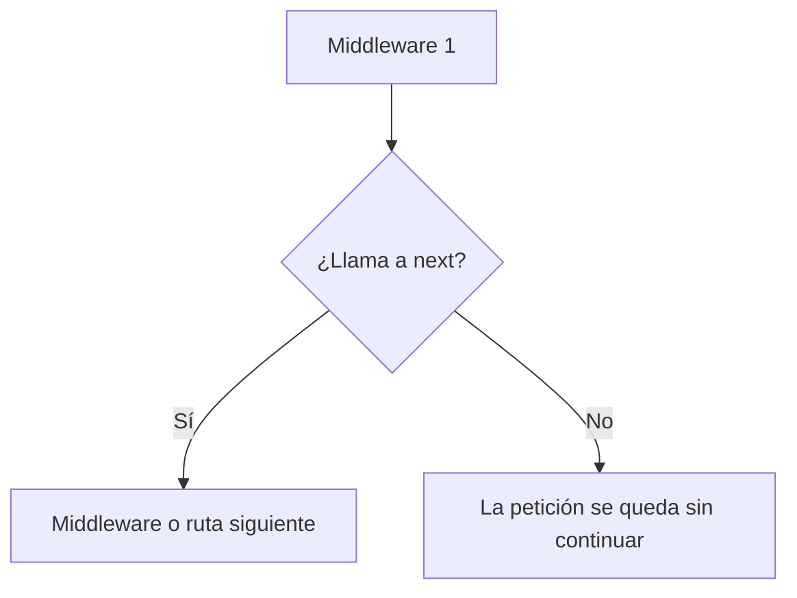
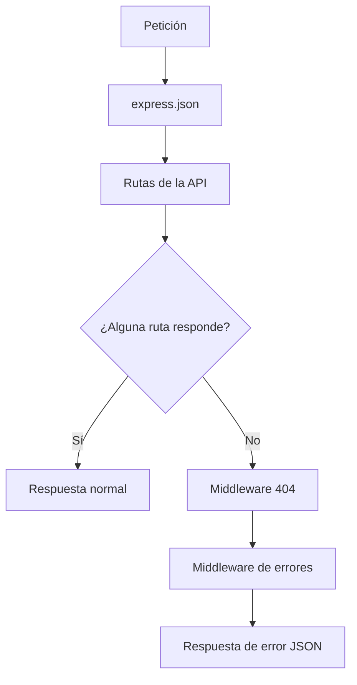
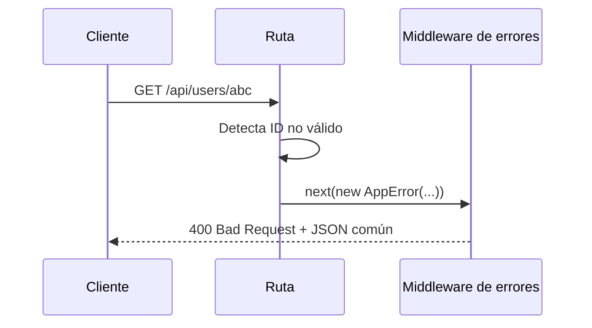

# Día 15: Middleware centralizado de errores

En el día 14 revisamos los códigos de estado HTTP que está usando nuestra API:

```http
200 OK
201 Created
400 Bad Request
404 Not Found
409 Conflict
```

Aprendimos que una API no solo debe devolver JSON, sino que debe usar el código
HTTP adecuado para que el cliente entienda qué ha ocurrido.

Hoy vamos a dar un paso más: vamos a empezar a **centralizar la gestión de
errores**.

Hasta ahora, cada ruta genera sus propios errores directamente:

```ts
return res.status(400).json({
  error: "El ID debe ser un número"
});
```

Esto funciona, pero tiene un problema: si cada ruta construye los errores a su
manera, nuestra API puede acabar devolviendo respuestas diferentes según el
endpoint.

Por ejemplo:

```json
{
  "error": "Usuario no encontrado"
}
```

```json
{
  "message": "Error",
  "status": 404
}
```

```json
{
  "msg": "Email duplicado"
}
```

Eso no es ideal.

A partir de hoy intentaremos que todos los errores tengan un formato común.

La idea será crear:

- Un tipo de error propio.
- Un middleware para rutas no encontradas.
- Un middleware global de errores.

!!! abstract "Objetivo del día"
    Crear una primera gestión centralizada de errores con `AppError`, un
    middleware `404` y un middleware global de errores.

## Qué vamos a trabajar hoy

| Concepto | Qué aprenderemos |
| --- | --- |
| Middleware | Intervenir en el flujo de una petición |
| `next()` | Pasar la petición o un error al siguiente middleware |
| Middleware de error | Capturar errores en Express |
| Error personalizado | Representar errores de la aplicación |
| `AppError` | Guardar mensaje, código y detalles del error |
| Formato común de error | Responder siempre con una estructura coherente |
| `404` centralizado | Responder en JSON cuando una ruta no existe |
| `500 Internal Server Error` | Gestionar errores inesperados |
| Orden de middlewares | Colocar rutas, 404 y errores en el orden correcto |
| Delegar errores | Separar la ruta de la construcción de la respuesta de error |

El objetivo es que nuestra API empiece a gestionar los errores de una forma más
profesional y mantenible.

## Qué es un middleware

Un **middleware** es una función que se ejecuta durante el recorrido de una
petición antes de llegar a la respuesta final.

En Express, una petición puede pasar por varios middlewares.

Por ejemplo, nosotros ya usamos este middleware:

```ts
app.use(express.json());
```

Ese middleware permite que Express pueda leer cuerpos JSON en las peticiones.

El flujo sería algo así:


Un middleware puede hacer diferentes cosas:

- Leer datos de la petición.
- Modificar la request.
- Comprobar permisos.
- Validar tokens.
- Registrar logs.
- Gestionar errores.
- Responder directamente.
- Pasar la petición al siguiente paso.

## Qué es `next()`

En Express, `next()` sirve para pasar la petición al siguiente middleware o al
siguiente manejador.

Ejemplo:

```ts
app.use((req, res, next) => {
  console.log("Ha llegado una petición");
  next();
});
```

Si no llamamos a `next()` y tampoco enviamos una respuesta, la petición se queda
bloqueada.

Podemos verlo así:



También podemos pasar un error a `next()`:

```ts
next(error);
```

Cuando hacemos eso, Express salta al middleware de errores.

## Qué es un middleware de errores

Un middleware de errores es una función especial que Express ejecuta cuando
ocurre un error.

Tiene esta forma:

```ts
app.use((err, req, res, next) => {
  res.status(500).json({
    error: "Error interno del servidor"
  });
});
```

La diferencia con un middleware normal es que recibe **cuatro parámetros**.

| Tipo de middleware | Parámetros |
| --- | --- |
| Middleware normal | `req`, `res`, `next` |
| Middleware de errores | `err`, `req`, `res`, `next` |

Esto es importante porque Express reconoce que es un middleware de errores por
esa estructura.

## Por qué centralizar errores

Hasta ahora, cada ruta gestiona sus errores directamente.

Ejemplo:

```ts
if (!user) {
  return res.status(404).json({
    error: "Usuario no encontrado"
  });
}
```

Esto no está mal para empezar, pero puede volverse repetitivo.

Si tenemos muchos endpoints, tendremos muchos errores repetidos:

- ID no válido.
- Usuario no encontrado.
- Email duplicado.
- Datos incorrectos.
- Ruta no encontrada.
- Error interno.

Centralizar errores nos permite:

- Usar siempre el mismo formato de respuesta.
- Evitar repetir código.
- Separar la lógica normal de la lógica de error.
- Facilitar el mantenimiento.
- Mejorar la claridad de la API.
- Preparar el proyecto para crecer.

## Formato común de error

A partir de ahora intentaremos que los errores tengan una estructura parecida a
esta:

```json
{
  "error": "Usuario no encontrado",
  "statusCode": 404,
  "path": "/api/users/999",
  "method": "GET",
  "timestamp": "2026-01-01T10:00:00.000Z"
}
```

Este formato nos da más información que un simple mensaje.

Incluye:

| Campo | Significado |
| --- | --- |
| `error` | Mensaje principal del error |
| `statusCode` | Código HTTP |
| `path` | Ruta que ha provocado el error |
| `method` | Método HTTP utilizado |
| `timestamp` | Momento en que ocurrió |

También podremos añadir detalles extra cuando sea necesario:

```json
{
  "error": "El ID debe ser un número",
  "statusCode": 400,
  "details": {
    "received": "abc"
  },
  "path": "/api/users/abc",
  "method": "GET",
  "timestamp": "2026-01-01T10:00:00.000Z"
}
```

## Error personalizado: `AppError`

Para centralizar errores, podemos crear una clase propia.

La llamaremos `AppError`.

Esta clase nos permitirá crear errores con:

- Mensaje.
- Código de estado.
- Detalles opcionales.

Ejemplo:

```ts
throw new AppError("Usuario no encontrado", 404);
```

O:

```ts
throw new AppError("El ID debe ser un número", 400, {
  received: "abc"
});
```

La ventaja es que el middleware de errores podrá leer esa información y
construir una respuesta común.

## Diferencia entre errores controlados y errores inesperados

No todos los errores son iguales.

### Error controlado

Es un error que esperamos y gestionamos.

Ejemplos:

- Usuario no encontrado.
- Email duplicado.
- ID no válido.
- Faltan campos obligatorios.

Estos errores deberían devolver códigos como:

- `400`
- `404`
- `409`

### Error inesperado

Es un fallo que no esperábamos.

Ejemplos:

- Bug en el código.
- Variable `undefined`.
- Fallo de conexión.
- Error interno no controlado.

Estos errores suelen devolver:

```http
500 Internal Server Error
```

La idea del middleware global será gestionar ambos casos.

## Middleware `404`

También vamos a crear un middleware para rutas no encontradas.

Hasta ahora, si llamamos a una ruta que no existe:

```http
GET /api/ruta-inventada
```

Express responde de forma básica.

Nosotros queremos que responda en JSON, siguiendo nuestro formato.

Ejemplo:

```json
{
  "error": "Ruta no encontrada",
  "statusCode": 404,
  "path": "/api/ruta-inventada",
  "method": "GET",
  "timestamp": "2026-01-01T10:00:00.000Z"
}
```

Este middleware debe colocarse **después de todas las rutas**.

¿Por qué?

Porque solo queremos que se ejecute si ninguna ruta anterior ha respondido.

## Orden de middlewares

El orden en Express es muy importante.

Una estructura correcta sería:

1. Crear `app`.
2. Middlewares generales.
3. Rutas.
4. Middleware `404`.
5. Middleware global de errores.
6. `app.listen`.

Ejemplo:

```ts
app.use(express.json());

app.get("/api/health", ...);
app.get("/api/users", ...);
app.post("/api/users", ...);

app.use(notFoundMiddleware);
app.use(errorMiddleware);

app.listen(PORT, ...);
```

El middleware de errores debe ir al final, después de las rutas y después del
middleware `404`.



## Flujo de error centralizado

Cuando usemos `next(error)`, el flujo será este:



La ruta detecta el problema, pero no construye toda la respuesta.

El middleware de errores se encarga de responder con el formato común.

## Parte guiada

### Paso 1: Abrir el proyecto

Abre el repositorio:

```text
usermanager-api
```

Entra en la carpeta:

```bash
cd usermanager-api
```

Arranca el servidor:

```bash
npm run dev
```

Comprueba que la API sigue funcionando:

```http
GET http://localhost:3000/api/health
```

### Paso 2: Importar tipos de Express

Abre el archivo:

```text
src/server.ts
```

Arriba del todo, modifica el import de Express.

Si tienes esto:

```ts
import express from "express";
```

Cámbialo por:

```ts
import express, { Request, Response, NextFunction } from "express";
```

Estos tipos nos ayudarán a escribir el middleware de errores con TypeScript.

### Paso 3: Crear la clase `AppError`

Debajo del tipo `User` o debajo del array `users`, añade esta clase:

```ts
class AppError extends Error {
  statusCode: number;
  details?: unknown;

  constructor(message: string, statusCode: number = 500, details?: unknown) {
    super(message);
    this.statusCode = statusCode;
    this.details = details;
  }
}
```

Esta clase extiende la clase `Error` de JavaScript, pero añade:

- `statusCode`
- `details`

Ejemplo de uso:

```ts
new AppError("Usuario no encontrado", 404);
```

Otro ejemplo:

```ts
new AppError("El ID debe ser un número", 400, {
  received: "abc"
});
```

### Paso 4: Crear el middleware de rutas no encontradas

Debajo de las rutas, pero antes de `app.listen`, vamos a añadir un middleware
`404`.

Primero crea la función:

```ts
function notFoundMiddleware(req: Request, res: Response, next: NextFunction) {
  next(
    new AppError("Ruta no encontrada", 404, {
      method: req.method,
      path: req.originalUrl
    })
  );
}
```

Este middleware crea un error `404` y lo pasa al middleware global usando
`next()`.

### Paso 5: Crear el middleware global de errores

Debajo del middleware anterior, crea esta función:

```ts
function errorMiddleware(
  err: AppError,
  req: Request,
  res: Response,
  _next: NextFunction
) {
  const statusCode = err.statusCode || 500;

  return res.status(statusCode).json({
    error: err.message || "Error interno del servidor",
    statusCode,
    details: err.details,
    path: req.originalUrl,
    method: req.method,
    timestamp: new Date().toISOString()
  });
}
```

Este middleware construye una respuesta común para todos los errores.

Usamos `_next` porque Express exige el cuarto parámetro, aunque en esta función
no lo utilicemos.

### Paso 6: Registrar los middlewares al final

Busca esta parte:

```ts
app.listen(PORT, () => {
  console.log(`Servidor escuchando en http://localhost:${PORT}`);
});
```

Justo antes de `app.listen`, añade:

```ts
app.use(notFoundMiddleware);
app.use(errorMiddleware);
```

La parte final del archivo debe quedar así:

```ts
app.use(notFoundMiddleware);
app.use(errorMiddleware);

app.listen(PORT, () => {
  console.log(`Servidor escuchando en http://localhost:${PORT}`);
});
```

Importante:

```text
Estos middlewares deben ir después de todas las rutas.
```

### Paso 7: Probar ruta inexistente

Prueba en Thunder Client o Postman:

```http
GET http://localhost:3000/api/ruta-inventada
```

Respuesta esperada:

```json
{
  "error": "Ruta no encontrada",
  "statusCode": 404,
  "details": {
    "method": "GET",
    "path": "/api/ruta-inventada"
  },
  "path": "/api/ruta-inventada",
  "method": "GET",
  "timestamp": "..."
}
```

Código esperado:

```http
404 Not Found
```

Ahora las rutas inexistentes ya responden en JSON.

### Paso 8: Adaptar `GET /api/users/:id` al nuevo sistema

Busca la ruta:

```http
GET /api/users/:id
```

Actualmente puede tener algo parecido a esto:

```ts
app.get("/api/users/:id", (req, res) => {
  const id = Number(req.params.id);

  if (Number.isNaN(id)) {
    return res.status(400).json({
      error: "El ID debe ser un número"
    });
  }

  const user = users.find((user) => user.id === id);

  if (!user) {
    return res.status(404).json({
      error: "Usuario no encontrado"
    });
  }

  return res.status(200).json({
    message: "Usuario encontrado",
    data: user
  });
});
```

Vamos a cambiarla para usar `next()` y `AppError`.

### Paso 9: Añadir `next` a la ruta

Cambia la cabecera de la ruta:

```ts
app.get("/api/users/:id", (req, res) => {
```

Por:

```ts
app.get("/api/users/:id", (req, res, next) => {
```

Ahora la ruta puede enviar errores al middleware centralizado.

### Paso 10: Usar `next(new AppError(...))`

Actualiza la ruta así:

```ts
app.get("/api/users/:id", (req, res, next) => {
  const idParam = req.params.id;
  const id = Number(idParam);

  if (Number.isNaN(id)) {
    return next(
      new AppError("El ID debe ser un número", 400, {
        received: idParam
      })
    );
  }

  const user = users.find((user) => user.id === id);

  if (!user) {
    return next(
      new AppError("Usuario no encontrado", 404, {
        id
      })
    );
  }

  return res.status(200).json({
    message: "Usuario encontrado",
    data: user
  });
});
```

Ahora la ruta ya no construye directamente los errores. Los delega al
middleware.

### Paso 11: Probar ID no válido

Prueba:

```http
GET http://localhost:3000/api/users/abc
```

Respuesta esperada:

```json
{
  "error": "El ID debe ser un número",
  "statusCode": 400,
  "details": {
    "received": "abc"
  },
  "path": "/api/users/abc",
  "method": "GET",
  "timestamp": "..."
}
```

Código esperado:

```http
400 Bad Request
```

### Paso 12: Probar usuario inexistente

Prueba:

```http
GET http://localhost:3000/api/users/999
```

Respuesta esperada:

```json
{
  "error": "Usuario no encontrado",
  "statusCode": 404,
  "details": {
    "id": 999
  },
  "path": "/api/users/999",
  "method": "GET",
  "timestamp": "..."
}
```

Código esperado:

```http
404 Not Found
```

### Paso 13: Probar usuario existente

Prueba:

```http
GET http://localhost:3000/api/users/1
```

Respuesta esperada:

```json
{
  "message": "Usuario encontrado",
  "data": {
    "id": 1,
    "name": "Ana García",
    "email": "ana@email.com",
    "role": "USER",
    "isActive": true
  }
}
```

Código esperado:

```http
200 OK
```

Este caso sigue siendo una respuesta normal, no pasa por el middleware de
errores.

### Paso 14: Crear una ruta temporal para probar error `500`

Añade una ruta temporal antes del middleware `404`:

```ts
app.get("/api/debug/error", (req, res, next) => {
  next(new AppError("Error de prueba interno", 500));
});
```

Prueba:

```http
GET http://localhost:3000/api/debug/error
```

Respuesta esperada:

```json
{
  "error": "Error de prueba interno",
  "statusCode": 500,
  "path": "/api/debug/error",
  "method": "GET",
  "timestamp": "..."
}
```

Código esperado:

```http
500 Internal Server Error
```

Esta ruta es solo para aprender. Más adelante se puede eliminar.

### Paso 15: Crear una carpeta de pruebas del día 15

En Thunder Client o Postman, dentro de la colección `UserManager API`, crea una
carpeta llamada:

```text
Día 15 - Middleware centralizado de errores
```

Añade estas peticiones:

| Método | Ruta | Objetivo |
| --- | --- | --- |
| `GET` | `/api/users/1` | Usuario existente |
| `GET` | `/api/users/abc` | ID no válido |
| `GET` | `/api/users/999` | Usuario no encontrado |
| `GET` | `/api/ruta-inventada` | Ruta inexistente |
| `GET` | `/api/debug/error` | Error interno de prueba |

### Paso 16: Actualizar el README

Añade una sección sobre gestión de errores:

````md
## Gestión centralizada de errores

La API utiliza un middleware global para devolver errores con un formato común.

Formato general:

```json
{
  "error": "Mensaje del error",
  "statusCode": 400,
  "details": {},
  "path": "/api/users/abc",
  "method": "GET",
  "timestamp": "2026-01-01T10:00:00.000Z"
}
```

También se ha añadido un middleware para rutas no encontradas:

```http
GET /api/ruta-inventada
```

Respuesta:

```json
{
  "error": "Ruta no encontrada",
  "statusCode": 404
}
```
````

### Paso 17: Crear el documento del día 15

Dentro de la carpeta `docs/`, crea un archivo:

```text
docs/dia-15-middleware-errores.md
```

Añade este contenido inicial:

````md
# Día 15 - Middleware centralizado de errores

## Qué he hecho

- He aprendido qué es un middleware.
- He aprendido para qué sirve `next()`.
- He creado una clase `AppError`.
- He creado un middleware para rutas no encontradas.
- He creado un middleware global de errores.
- He adaptado `GET /api/users/:id` para usar `next(new AppError(...))`.
- He probado errores `400`, `404` y `500`.
- He comprobado que los errores tienen un formato común.

## Clase AppError

```ts
class AppError extends Error {
  statusCode: number;
  details?: unknown;

  constructor(message: string, statusCode: number = 500, details?: unknown) {
    super(message);
    this.statusCode = statusCode;
    this.details = details;
  }
}
```

## Formato de error

```json
{
  "error": "Mensaje del error",
  "statusCode": 400,
  "details": {},
  "path": "/api/users/abc",
  "method": "GET",
  "timestamp": "..."
}
```

## Casos probados

| Petición | Caso | Código esperado | Resultado |
| --- | --- | ---: | --- |
| `GET /api/users/1` | Usuario existente | 200 | |
| `GET /api/users/abc` | ID no válido | 400 | |
| `GET /api/users/999` | Usuario no encontrado | 404 | |
| `GET /api/ruta-inventada` | Ruta inexistente | 404 | |
| `GET /api/debug/error` | Error interno de prueba | 500 | |

## Explicación personal

Un middleware de errores permite centralizar la forma en que la API responde
cuando ocurre un problema. Así evitamos que cada ruta devuelva errores con
formatos diferentes.
````

### Paso 18: Actualizar el índice del README

Añade el enlace al documento del día 15:

```md
## Documentación del reto

- [Día 1 - Diseño inicial](docs/dia-01-diseno-inicial.md)
- [Día 2 - Preparación del proyecto](docs/dia-02-preparacion-proyecto.md)
- [Día 3 - Primer endpoint](docs/dia-03-primer-endpoint.md)
- [Día 4 - Métodos HTTP](docs/dia-04-metodos-http.md)
- [Día 5 - JSON, body, params y headers](docs/dia-05-json-body-params-headers.md)
- [Día 6 - Cliente HTTP y depuración](docs/dia-06-cliente-http-depuracion.md)
- [Día 7 - Listado de usuarios en memoria](docs/dia-07-listado-usuarios.md)
- [Día 8 - Consultar usuario por ID](docs/dia-08-consultar-usuario-id.md)
- [Día 9 - Crear usuarios en memoria](docs/dia-09-crear-usuarios.md)
- [Día 10 - Actualizar usuarios en memoria](docs/dia-10-actualizar-usuarios.md)
- [Día 11 - Eliminar o desactivar usuarios en memoria](docs/dia-11-eliminar-desactivar-usuarios.md)
- [Día 12 - Validación manual básica](docs/dia-12-validacion-manual-basica.md)
- [Día 13 - Validación de email y duplicados](docs/dia-13-validacion-email-duplicados.md)
- [Día 14 - Códigos de estado HTTP](docs/dia-14-codigos-estado-http.md)
- [Día 15 - Middleware centralizado de errores](docs/dia-15-middleware-errores.md)
```

### Paso 19: Guardar cambios en Git

Comprueba los cambios:

```bash
git status
```

Añade los archivos:

```bash
git add .
```

Crea un commit:

```bash
git commit -m "Dia 15 - Crear middleware centralizado de errores"
```

Sube los cambios:

```bash
git push
```

## Parte libre

Ahora toca practicar sin seguir todos los pasos guiados.

### Tarea libre 1: Adaptar otro endpoint al middleware de errores

Elige una de estas rutas:

```http
PATCH /api/users/:id
DELETE /api/users/:id
POST /api/users
```

Y cambia al menos un error para que use:

```ts
next(new AppError(...));
```

Por ejemplo, en lugar de:

```ts
return res.status(409).json({
  error: "El email ya está registrado"
});
```

Puedes usar:

```ts
return next(new AppError("El email ya está registrado", 409));
```

### Tarea libre 2: Mejorar el error `404` de ruta inexistente

Modifica el mensaje de ruta no encontrada para que incluya el método y la ruta.

Ejemplo:

```json
{
  "error": "No existe la ruta GET /api/ruta-inventada",
  "statusCode": 404
}
```

Pista:

```ts
req.method;
req.originalUrl;
```

### Tarea libre 3: Ocultar `details` cuando no existan

Actualmente puede aparecer:

```json
{
  "details": null
}
```

O:

```json
{
  "details": undefined
}
```

Modifica el middleware para que `details` solo aparezca cuando exista.

Pista:

```ts
const response = {
  error: err.message,
  statusCode,
  path: req.originalUrl,
  method: req.method,
  timestamp: new Date().toISOString()
};

if (err.details) {
  response.details = err.details;
}
```

Si TypeScript te da problemas, puedes dejar esta tarea como explicación en el
documento.

### Tarea libre 4: Explicar el orden de middlewares

En el documento del día 15, añade una sección:

```md
## Orden de middlewares
```

Explica con tus palabras por qué el middleware `404` y el middleware de errores
deben ir después de las rutas.

Puedes apoyarte en esta idea:

```text
Si los ponemos antes de las rutas, las peticiones podrían llegar al middleware de error antes de tener oportunidad de encontrar su endpoint correcto.
```

## Entrega recomendada del día 15

Las respuestas no se entregan como archivo suelto. Deben quedar dentro del
repositorio de GitHub.

Al finalizar el día 15, el repositorio debería tener esta estructura aproximada:

```text
usermanager-api/
  README.md
  package.json
  package-lock.json
  tsconfig.json
  src/
    server.ts
  docs/
    dia-01-diseno-inicial.md
    dia-02-preparacion-proyecto.md
    dia-03-primer-endpoint.md
    dia-04-metodos-http.md
    dia-05-json-body-params-headers.md
    dia-06-cliente-http-depuracion.md
    dia-07-listado-usuarios.md
    dia-08-consultar-usuario-id.md
    dia-09-crear-usuarios.md
    dia-10-actualizar-usuarios.md
    dia-11-eliminar-desactivar-usuarios.md
    dia-12-validacion-manual-basica.md
    dia-13-validacion-email-duplicados.md
    dia-14-codigos-estado-http.md
    dia-15-middleware-errores.md
```

El documento del día 15 deberá estar en:

```text
docs/dia-15-middleware-errores.md
```

Y deberá incluir:

- Resumen de lo realizado.
- Clase `AppError`.
- Formato común de error.
- Casos probados.
- Explicación personal del middleware de errores.
- Explicación del orden de middlewares.

En el foro, se compartirá el enlace actualizado al repositorio.

Ejemplo de mensaje:

```text
Hola, comparto el avance del día 15 del reto UserManager API:

https://github.com/usuario/usermanager-api

He creado un middleware centralizado de errores y he documentado el trabajo del día 15 en:
docs/dia-15-middleware-errores.md
```

## Cierre del día

Hoy hemos dado un paso importante hacia una API más profesional.

Hasta ahora cada ruta devolvía sus propios errores. A partir de ahora empezamos
a centralizar la gestión de errores para que todas las respuestas tengan una
estructura común.

Hoy hemos trabajado:

- Middleware.
- `next()`.
- `AppError`.
- Middleware `404`.
- Middleware global de errores.
- Formato común de error.
- Errores `400`, `404` y `500`.
- Orden de middlewares.

Esto nos prepara para las siguientes fases del proyecto, donde la API crecerá
bastante y necesitaremos una estructura más mantenible.

!!! success "Idea clave"
    Una API profesional no debería devolver errores desordenados: debe tener un
    formato común, códigos coherentes y una gestión centralizada de los
    problemas.
