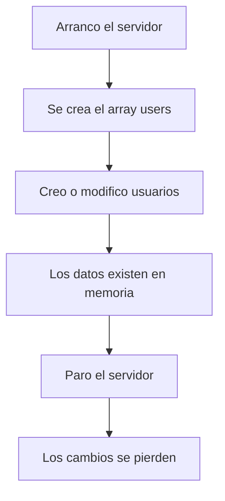
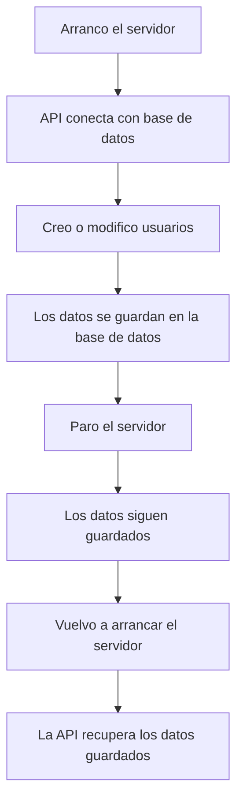
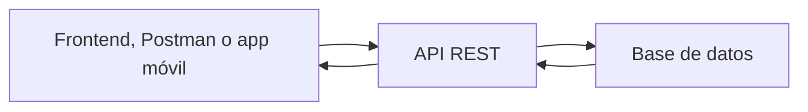
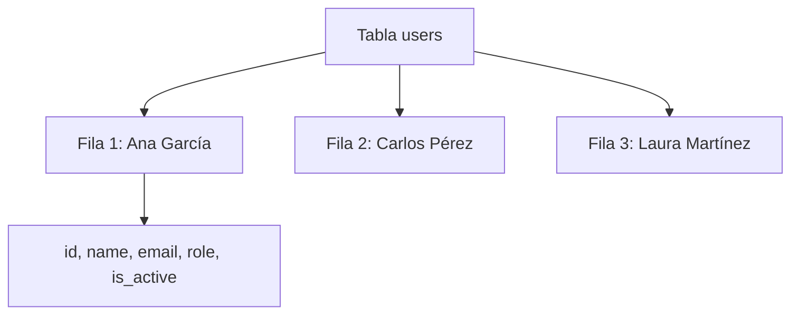
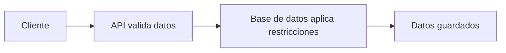
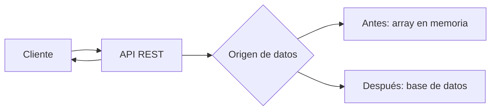
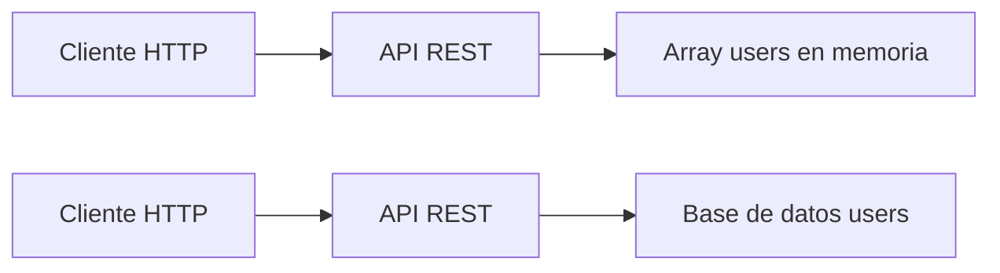

# Día 16: ¿Por qué necesitamos una base de datos?

En el día 15 mejoramos la gestión de errores de nuestra API. Creamos una primera
versión de un middleware centralizado de errores, una clase `AppError` y un
middleware para rutas no encontradas.

Con eso cerramos una primera etapa importante del reto: ya tenemos un CRUD de
usuarios en memoria, con validaciones básicas, códigos de estado y una gestión
de errores más ordenada.

Hasta ahora, nuestros usuarios viven dentro de un array en el código:

```ts
const users: User[] = [
  {
    id: 1,
    name: "Ana García",
    email: "ana@email.com",
    role: "USER",
    isActive: true,
    createdAt: new Date().toISOString(),
    updatedAt: new Date().toISOString()
  }
];
```

Esto nos ha servido para aprender cómo debe comportarse la API, pero tiene una
limitación muy clara:

```text
Si el servidor se reinicia, los cambios se pierden.
```

Si creamos un usuario nuevo, lo modificamos o lo desactivamos, esos cambios solo
existen mientras la aplicación está ejecutándose. Cuando paramos el servidor y
lo volvemos a arrancar, el array vuelve a su estado inicial.

Hoy empezamos una nueva fase del reto: preparar el paso de datos en memoria a
**datos persistentes**.

El objetivo del día no será todavía conectar una base de datos. Eso llegará en
los próximos días. Hoy vamos a entender **por qué necesitamos una base de
datos** y vamos a diseñar la estructura que tendrá nuestra tabla de usuarios.

!!! abstract "Objetivo del día"
    Entender por qué los datos en memoria no bastan para una aplicación real y
    diseñar la tabla `users` que usaremos más adelante.

## Qué vamos a trabajar hoy

| Concepto | Qué aprenderemos |
| --- | --- |
| Persistencia | Conservar datos aunque la aplicación se reinicie |
| Datos en memoria | Entender la limitación del array `users` |
| Base de datos | Guardar datos de forma estructurada y permanente |
| Tabla | Agrupar registros del mismo tipo |
| Fila | Representar un registro concreto |
| Columna | Representar un dato de cada registro |
| Modelo de datos | Diseñar qué información guardaremos |
| Clave primaria | Identificar cada fila de forma única |
| Campo único | Evitar duplicados como emails repetidos |
| Restricciones | Aplicar reglas desde la base de datos |
| Tipos de datos | Elegir tipos conceptuales para cada campo |
| Tabla `users` | Diseñar la estructura principal de usuarios |
| TypeScript vs base de datos | Traducir `camelCase` a `snake_case` |

El objetivo principal será diseñar cómo debería guardarse un usuario en una base
de datos.

## Qué significa persistencia

La **persistencia** significa que los datos se conservan aunque la aplicación se
apague o se reinicie.

Ahora mismo, nuestra API trabaja así:



Con una base de datos, el funcionamiento será diferente:



Esta es una diferencia fundamental entre una prueba sencilla y una aplicación
real.

## Datos en memoria vs base de datos

Hasta ahora nuestros datos están en memoria.

Eso significa que están dentro del proceso que está ejecutando Node.js.

Ventajas de trabajar en memoria:

- Es más sencillo.
- No necesitamos instalar nada más.
- Permite aprender la lógica de la API.
- Es rápido para empezar.

Inconvenientes:

- Los datos se pierden al reiniciar.
- No sirve para una aplicación real.
- No permite trabajar bien con muchos datos.
- No permite consultas avanzadas.
- No permite acceso concurrente real.
- No separa correctamente aplicación y persistencia.

Una base de datos soluciona esos problemas.

Ventajas de usar base de datos:

- Los datos se mantienen.
- Podemos consultar, filtrar y ordenar.
- Podemos definir restricciones.
- Podemos evitar duplicados.
- Podemos trabajar con relaciones.
- Podemos hacer copias de seguridad.
- Podemos escalar mejor el sistema.

## Qué es una base de datos

Una **base de datos** es un sistema que permite almacenar, organizar y consultar
información de forma estructurada.

En nuestro reto, la API será la encargada de hablar con la base de datos.

El cliente no accederá directamente a la base de datos.



Esto es importante por seguridad y por arquitectura.

El cliente pide algo a la API:

```http
GET /api/users
```

La API consulta la base de datos y devuelve JSON.

El cliente no necesita saber si por dentro usamos:

- PostgreSQL
- MySQL
- SQLite
- MongoDB
- Otra base de datos

La API actúa como una capa intermedia que protege y organiza el acceso a los
datos.

## Qué base de datos usaremos

En este reto podríamos usar distintas opciones. Las más habituales para este
tipo de proyecto serían:

- PostgreSQL
- MySQL
- SQLite

Para un proyecto de API REST con usuarios, una base de datos relacional como
PostgreSQL o MySQL encaja muy bien.

En los próximos días trabajaremos con una de estas opciones y la levantaremos
con Docker.

Hoy no vamos a instalar todavía la base de datos. Primero vamos a diseñar qué
necesitamos guardar.

## Qué es una tabla

En una base de datos relacional, la información se organiza en **tablas**.

Una tabla es una estructura formada por filas y columnas.

Por ejemplo, una tabla de usuarios podría llamarse:

```text
users
```

Y tener columnas como:

- `id`
- `name`
- `email`
- `password_hash`
- `role`
- `is_active`
- `created_at`
- `updated_at`

Cada fila representa un usuario.

Ejemplo:

| id | name | email | role | is_active |
| -: | --- | --- | --- | --- |
| 1 | Ana García | ana@email.com | USER | true |
| 2 | Carlos Pérez | carlos@email.com | ADMIN | true |
| 3 | Laura Martínez | laura@email.com | USER | false |

En nuestra API actual, esto se parece al array `users`.

Ahora lo tenemos así:

```ts
const users = [
  {
    id: 1,
    name: "Ana García",
    email: "ana@email.com",
    role: "USER",
    isActive: true
  }
];
```

Más adelante estará en una tabla:

```text
users
```

## Tabla, fila y columna

Vamos a aclarar tres conceptos básicos.

### Tabla

Es el conjunto de datos de un tipo.

Ejemplo:

```text
users
```

Representa todos los usuarios.

### Fila

Cada fila es un registro concreto.

Ejemplo:

```text
Usuario Ana García
```

### Columna

Cada columna es un dato del registro.

Ejemplo:

```text
id
name
email
role
```

Visualmente:



## Nuestro modelo actual en TypeScript

Ahora mismo tenemos un tipo `User` parecido a este:

```ts
type User = {
  id: number;
  name: string;
  email: string;
  role: "USER" | "ADMIN";
  isActive: boolean;
  createdAt: string;
  updatedAt: string;
};
```

Este tipo nos sirve dentro del código TypeScript.

Pero una base de datos tendrá su propia forma de representar esos datos.

Por ejemplo, en la base de datos usaremos nombres de columnas como:

- `is_active`
- `created_at`
- `updated_at`

Mientras que en TypeScript usamos:

- `isActive`
- `createdAt`
- `updatedAt`

Esto es bastante habitual.

En código JavaScript/TypeScript solemos usar `camelCase`.

En bases de datos SQL es frecuente usar `snake_case`.

## Diseño de la tabla `users`

Nuestra tabla principal será:

```text
users
```

Tendrá estos campos:

- `id`
- `name`
- `email`
- `password_hash`
- `role`
- `is_active`
- `created_at`
- `updated_at`

Aunque hasta ahora no estamos guardando contraseña, en la base de datos final sí
necesitaremos guardar una versión cifrada:

```text
password_hash
```

Importante:

```text
Nunca guardaremos la contraseña en texto plano.
```

Cuando lleguemos a seguridad, veremos cómo convertir la contraseña en un hash.

## Campos de la tabla `users`

### `id`

Identificador único del usuario.

Características:

- Es único.
- No se repite.
- Lo genera el sistema.
- Sirve para buscar un usuario concreto.

Ejemplo:

```http
GET /api/users/1
```

### `name`

Nombre del usuario.

Características:

- Debe ser obligatorio.
- Debe ser texto.
- No debería estar vacío.

Ejemplo:

```text
Ana García
```

### `email`

Correo electrónico del usuario.

Características:

- Debe ser obligatorio.
- Debe ser único.
- Debe estar normalizado.
- Debe tener formato válido.

Ejemplo:

```text
ana@email.com
```

Este campo será muy importante para el registro y login.

### `password_hash`

Contraseña cifrada o hasheada.

No guardaremos:

```text
password
```

Guardaremos:

```text
password_hash
```

Ejemplo conceptual:

```text
$2b$10$...
```

Este campo no se devolverá nunca al cliente.

### `role`

Rol del usuario.

Valores posibles:

- `USER`
- `ADMIN`

Nos servirá para controlar permisos.

### `is_active`

Indica si el usuario está activo.

Valores posibles:

- `true`
- `false`

Lo usaremos para el borrado lógico.

Un usuario desactivado tendrá:

```text
is_active = false
```

### `created_at`

Fecha de creación.

Indica cuándo se creó el usuario.

### `updated_at`

Fecha de última modificación.

Indica cuándo se modificó por última vez el usuario.

Cada vez que actualicemos o desactivemos un usuario, este campo debería cambiar.

## Propuesta de tabla `users`

Una primera propuesta de tabla sería:

| Columna | Tipo conceptual | Obligatorio | Único | Descripción |
| --- | --- | --- | --- | --- |
| `id` | número | sí | sí | Identificador del usuario |
| `name` | texto | sí | no | Nombre del usuario |
| `email` | texto | sí | sí | Email normalizado |
| `password_hash` | texto | sí | no | Contraseña hasheada |
| `role` | texto | sí | no | USER o ADMIN |
| `is_active` | booleano | sí | no | Usuario activo o inactivo |
| `created_at` | fecha | sí | no | Fecha de creación |
| `updated_at` | fecha | sí | no | Fecha de última actualización |

## Representación SQL conceptual

Más adelante veremos cómo crear esta tabla de forma real. De momento, una
versión conceptual en SQL podría ser:

```sql
CREATE TABLE users (
  id SERIAL PRIMARY KEY,
  name VARCHAR(100) NOT NULL,
  email VARCHAR(150) NOT NULL UNIQUE,
  password_hash VARCHAR(255) NOT NULL,
  role VARCHAR(20) NOT NULL,
  is_active BOOLEAN NOT NULL DEFAULT true,
  created_at TIMESTAMP NOT NULL DEFAULT CURRENT_TIMESTAMP,
  updated_at TIMESTAMP NOT NULL DEFAULT CURRENT_TIMESTAMP
);
```

No hace falta entender cada detalle todavía, pero sí algunas ideas:

| Elemento | Significado |
| --- | --- |
| `PRIMARY KEY` | `id` identifica cada fila |
| `NOT NULL` | El campo es obligatorio |
| `UNIQUE` | El valor no puede repetirse |
| `DEFAULT` | Valor por defecto |

## Restricciones

Una restricción es una regla que la base de datos aplica sobre los datos.

Ejemplos:

- El email no puede ser nulo.
- El email no puede repetirse.
- El `id` debe ser único.
- `is_active` tiene un valor por defecto.

Hasta ahora estas reglas las estábamos comprobando en la API.

Más adelante algunas reglas también las podrá reforzar la base de datos.

Por ejemplo, nuestra API comprueba email duplicado, pero la base de datos
también puede tener:

```sql
UNIQUE (email)
```

Esto añade una segunda capa de protección.



## Relación entre API y base de datos

Cuando pasemos a base de datos, nuestras rutas no deberían cambiar para el
cliente.

Ahora tenemos:

```http
GET /api/users
POST /api/users
PATCH /api/users/:id
DELETE /api/users/:id
```

Después seguiremos teniendo esas mismas rutas.

Lo que cambiará será el origen de los datos.

Ahora:

```text
Array users en memoria
```

Más adelante:

```text
Tabla users en base de datos
```

Pero el cliente seguirá consumiendo JSON.



Esto es una de las ventajas de usar API REST: el cliente no tiene por qué saber
cómo se guardan los datos internamente.

## Parte guiada

### Paso 1: Abrir el proyecto

Abre el repositorio:

```text
usermanager-api
```

Entra en la carpeta:

```bash
cd usermanager-api
```

Arranca el servidor:

```bash
npm run dev
```

Comprueba que el CRUD sigue funcionando:

```http
GET http://localhost:3000/api/users
```

### Paso 2: Observar el problema de la memoria

Crea un usuario nuevo:

```http
POST http://localhost:3000/api/users
```

Body:

```json
{
  "name": "Usuario Temporal",
  "email": "temporal@email.com",
  "password": "123456"
}
```

Después consulta el listado:

```http
GET http://localhost:3000/api/users
```

El usuario debe aparecer.

Ahora para el servidor y vuelve a arrancarlo:

```text
Ctrl + C
npm run dev
```

Vuelve a consultar:

```http
GET http://localhost:3000/api/users
```

Observa qué ocurre.

Resultado esperado:

```text
El usuario temporal ha desaparecido.
```

Esto demuestra por qué necesitamos persistencia.

### Paso 3: Revisar el tipo `User`

Abre:

```text
src/server.ts
```

Busca el tipo `User`:

```ts
type User = {
  id: number;
  name: string;
  email: string;
  role: "USER" | "ADMIN";
  isActive: boolean;
  createdAt: string;
  updatedAt: string;
};
```

Piensa qué campos deberían guardarse en una base de datos.

De momento nos faltará uno importante para la versión final:

```text
passwordHash
```

Todavía no lo usaremos en código, pero sí lo tendremos en cuenta en el diseño.

### Paso 4: Diseñar la tabla `users`

Crea en tu documentación una tabla como esta:

| Campo TypeScript | Campo en base de datos | Tipo conceptual | Descripción |
| --- | --- | --- | --- |
| `id` | `id` | número | Identificador único |
| `name` | `name` | texto | Nombre del usuario |
| `email` | `email` | texto | Email único |
| `passwordHash` | `password_hash` | texto | Contraseña hasheada |
| `role` | `role` | texto | USER o ADMIN |
| `isActive` | `is_active` | booleano | Estado del usuario |
| `createdAt` | `created_at` | fecha | Fecha de creación |
| `updatedAt` | `updated_at` | fecha | Fecha de modificación |

### Paso 5: Definir restricciones

Añade una tabla de restricciones:

| Campo | Restricción | Motivo |
| --- | --- | --- |
| `id` | PRIMARY KEY | Identifica cada usuario |
| `name` | NOT NULL | Todo usuario debe tener nombre |
| `email` | NOT NULL, UNIQUE | Todo usuario debe tener email y no se puede repetir |
| `password_hash` | NOT NULL | Todo usuario necesita credenciales |
| `role` | NOT NULL | Todo usuario debe tener un rol |
| `is_active` | NOT NULL, DEFAULT true | Todo usuario debe tener estado |
| `created_at` | NOT NULL | Debe registrarse cuándo se creó |
| `updated_at` | NOT NULL | Debe registrarse cuándo se modificó |

### Paso 6: Escribir una propuesta SQL conceptual

En el documento del día 16, añade una propuesta como esta:

```sql
CREATE TABLE users (
  id SERIAL PRIMARY KEY,
  name VARCHAR(100) NOT NULL,
  email VARCHAR(150) NOT NULL UNIQUE,
  password_hash VARCHAR(255) NOT NULL,
  role VARCHAR(20) NOT NULL,
  is_active BOOLEAN NOT NULL DEFAULT true,
  created_at TIMESTAMP NOT NULL DEFAULT CURRENT_TIMESTAMP,
  updated_at TIMESTAMP NOT NULL DEFAULT CURRENT_TIMESTAMP
);
```

No pasa nada si todavía no entiendes todos los detalles. La idea es empezar a
familiarizarse con cómo se traduce un modelo de usuario a una tabla.

### Paso 7: Dibujar el cambio de arquitectura

Añade este diagrama a tu documentación:



Y explica que en los próximos días cambiaremos el origen de datos, pero no el
contrato de la API.

### Paso 8: Crear el documento del día 16

Dentro de la carpeta `docs/`, crea un archivo:

```text
docs/dia-16-base-datos-persistencia.md
```

Añade este contenido inicial:

````md
# Día 16 - Base de datos y persistencia

## Qué he hecho

- He comprobado que los datos en memoria se pierden al reiniciar el servidor.
- He entendido qué significa persistencia.
- He comparado datos en memoria y base de datos.
- He diseñado la tabla users.
- He definido campos, tipos conceptuales y restricciones.
- He escrito una propuesta SQL conceptual.
- He explicado cómo cambiará la arquitectura del proyecto.

## Problema detectado

Al crear un usuario en memoria y reiniciar el servidor, el usuario desaparece.

Esto ocurre porque los datos están guardados dentro del proceso de Node.js y no
en una base de datos persistente.

## Diseño de la tabla users

| Campo TypeScript | Campo en base de datos | Tipo conceptual | Descripción |
| --- | --- | --- | --- |
| `id` | `id` | número | Identificador único |
| `name` | `name` | texto | Nombre del usuario |
| `email` | `email` | texto | Email único |
| `passwordHash` | `password_hash` | texto | Contraseña hasheada |
| `role` | `role` | texto | USER o ADMIN |
| `isActive` | `is_active` | booleano | Estado del usuario |
| `createdAt` | `created_at` | fecha | Fecha de creación |
| `updatedAt` | `updated_at` | fecha | Fecha de modificación |

## Propuesta SQL conceptual

```sql
CREATE TABLE users (
  id SERIAL PRIMARY KEY,
  name VARCHAR(100) NOT NULL,
  email VARCHAR(150) NOT NULL UNIQUE,
  password_hash VARCHAR(255) NOT NULL,
  role VARCHAR(20) NOT NULL,
  is_active BOOLEAN NOT NULL DEFAULT true,
  created_at TIMESTAMP NOT NULL DEFAULT CURRENT_TIMESTAMP,
  updated_at TIMESTAMP NOT NULL DEFAULT CURRENT_TIMESTAMP
);
```

## Explicación personal

Necesitamos una base de datos porque los datos en memoria se pierden cuando se
reinicia el servidor. Una base de datos permite guardar la información de forma
persistente y recuperarla más adelante.
````

### Paso 9: Actualizar el README

Añade una sección sobre persistencia:

````md
## Persistencia

Hasta el día 15, la API trabaja con usuarios en memoria.

Esto significa que los datos se pierden al reiniciar el servidor.

A partir de la siguiente fase, prepararemos una base de datos para guardar los
usuarios de forma persistente.

Tabla principal prevista:

```text
users
```

Campos principales:

```text
id
name
email
password_hash
role
is_active
created_at
updated_at
```
````

### Paso 10: Actualizar el índice del README

Añade el enlace al documento del día 16:

```md
## Documentación del reto

- [Día 1 - Diseño inicial](docs/dia-01-diseno-inicial.md)
- [Día 2 - Preparación del proyecto](docs/dia-02-preparacion-proyecto.md)
- [Día 3 - Primer endpoint](docs/dia-03-primer-endpoint.md)
- [Día 4 - Métodos HTTP](docs/dia-04-metodos-http.md)
- [Día 5 - JSON, body, params y headers](docs/dia-05-json-body-params-headers.md)
- [Día 6 - Cliente HTTP y depuración](docs/dia-06-cliente-http-depuracion.md)
- [Día 7 - Listado de usuarios en memoria](docs/dia-07-listado-usuarios.md)
- [Día 8 - Consultar usuario por ID](docs/dia-08-consultar-usuario-id.md)
- [Día 9 - Crear usuarios en memoria](docs/dia-09-crear-usuarios.md)
- [Día 10 - Actualizar usuarios en memoria](docs/dia-10-actualizar-usuarios.md)
- [Día 11 - Eliminar o desactivar usuarios en memoria](docs/dia-11-eliminar-desactivar-usuarios.md)
- [Día 12 - Validación manual básica](docs/dia-12-validacion-manual-basica.md)
- [Día 13 - Validación de email y duplicados](docs/dia-13-validacion-email-duplicados.md)
- [Día 14 - Códigos de estado HTTP](docs/dia-14-codigos-estado-http.md)
- [Día 15 - Middleware centralizado de errores](docs/dia-15-middleware-errores.md)
- [Día 16 - Base de datos y persistencia](docs/dia-16-base-datos-persistencia.md)
```

### Paso 11: Guardar cambios en Git

Comprueba los cambios:

```bash
git status
```

Añade los archivos:

```bash
git add .
```

Crea un commit:

```bash
git commit -m "Dia 16 - Disenar persistencia y tabla users"
```

Sube los cambios:

```bash
git push
```

## Parte libre

Ahora toca practicar sin seguir todos los pasos guiados.

### Tarea libre 1: Añadir una explicación sobre persistencia

En el documento del día 16, añade una sección:

```md
## ¿Qué es la persistencia?
```

Explica con tus palabras qué significa que los datos sean persistentes.

Puedes usar esta idea:

```text
Persistencia significa que los datos se conservan aunque la aplicación se apague o se reinicie.
```

### Tarea libre 2: Comparar memoria y base de datos

Añade una tabla comparativa:

| Aspecto | Memoria | Base de datos |
| --- | --- | --- |
| ¿Los datos se conservan al reiniciar? | | |
| ¿Sirve para pruebas iniciales? | | |
| ¿Sirve para una aplicación real? | | |
| ¿Permite trabajar con muchos datos? | | |
| ¿Permite restricciones como UNIQUE? | | |

### Tarea libre 3: Proponer una mejora para la tabla `users`

Propón al menos un campo adicional que podría tener la tabla `users`.

Ejemplos:

- `last_login_at`
- `avatar_url`
- `phone`
- `bio`

Para cada campo propuesto, indica:

- Nombre del campo.
- Tipo conceptual.
- Para qué serviría.
- Si debería ser obligatorio o no.

### Tarea libre 4: Explicar la independencia del cliente

En el documento del día 16, añade una sección:

```md
## Independencia entre API y base de datos
```

Explica con tus palabras por qué el cliente no necesita saber si los usuarios
vienen de un array en memoria o de una base de datos.

Puedes apoyarte en esta idea:

```text
El cliente consume rutas y respuestas JSON. Mientras la API mantenga el mismo contrato, el origen interno de los datos puede cambiar.
```

## Entrega recomendada del día 16

Las respuestas no se entregan como archivo suelto. Deben quedar dentro del
repositorio de GitHub.

Al finalizar el día 16, el repositorio debería tener esta estructura aproximada:

```text
usermanager-api/
  README.md
  package.json
  package-lock.json
  tsconfig.json
  src/
    server.ts
  docs/
    dia-01-diseno-inicial.md
    dia-02-preparacion-proyecto.md
    dia-03-primer-endpoint.md
    dia-04-metodos-http.md
    dia-05-json-body-params-headers.md
    dia-06-cliente-http-depuracion.md
    dia-07-listado-usuarios.md
    dia-08-consultar-usuario-id.md
    dia-09-crear-usuarios.md
    dia-10-actualizar-usuarios.md
    dia-11-eliminar-desactivar-usuarios.md
    dia-12-validacion-manual-basica.md
    dia-13-validacion-email-duplicados.md
    dia-14-codigos-estado-http.md
    dia-15-middleware-errores.md
    dia-16-base-datos-persistencia.md
```

El documento del día 16 deberá estar en:

```text
docs/dia-16-base-datos-persistencia.md
```

Y deberá incluir:

- Resumen de lo realizado.
- Prueba de pérdida de datos en memoria.
- Explicación de persistencia.
- Diseño de la tabla `users`.
- Tabla de restricciones.
- Propuesta SQL conceptual.
- Comparación entre memoria y base de datos.
- Explicación de independencia entre API y base de datos.

En el foro, se compartirá el enlace actualizado al repositorio.

Ejemplo de mensaje:

```text
Hola, comparto el avance del día 16 del reto UserManager API:

https://github.com/usuario/usermanager-api

He analizado por qué necesitamos una base de datos, he diseñado la tabla users y he documentado el trabajo del día 16 en:
docs/dia-16-base-datos-persistencia.md
```

## Cierre del día

Hoy hemos empezado una nueva fase del reto.

Hasta ahora nuestra API trabajaba con datos en memoria. Eso nos ha servido para
entender rutas, CRUD, validaciones y errores, pero no es suficiente para una
aplicación real.

Hoy hemos visto:

- Persistencia.
- Datos en memoria.
- Base de datos.
- Tabla.
- Fila.
- Columna.
- Modelo de datos.
- Clave primaria.
- Campo único.
- Restricciones.
- Diseño de la tabla `users`.

En los próximos días empezaremos a preparar la base de datos real y a conectar
nuestra API con ella.

!!! success "Idea clave"
    Una API puede aprenderse usando datos en memoria, pero una aplicación real
    necesita una base de datos para conservar la información de forma
    persistente.
