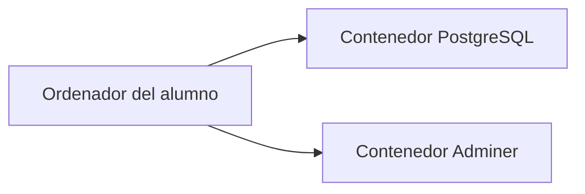
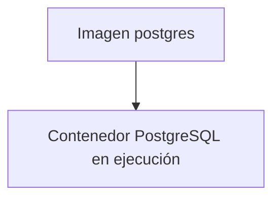
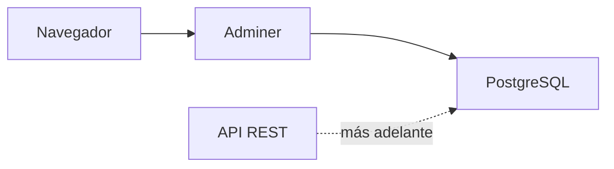
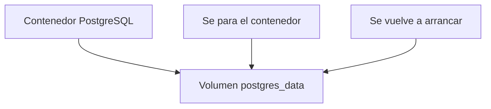
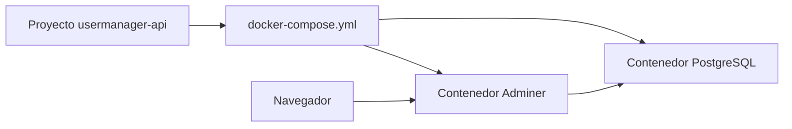
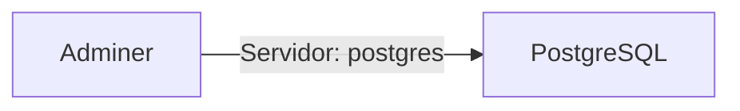
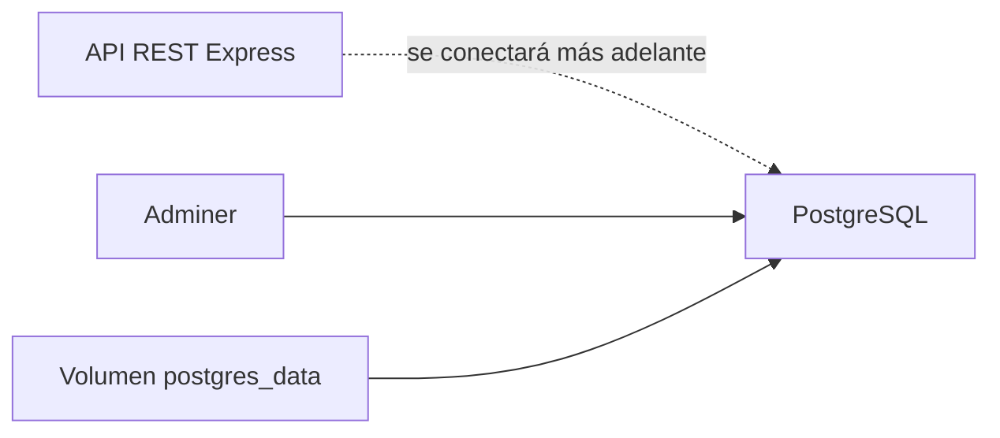

# Día 17: Preparar PostgreSQL con Docker Compose

En el día 16 analizamos por qué necesitamos una base de datos. Comprobamos que
los datos guardados en memoria desaparecen al reiniciar el servidor y diseñamos
una primera versión de la tabla `users`.

Hasta ahora nuestra API guarda los usuarios aquí:

```ts
const users: User[] = [
  {
    id: 1,
    name: "Ana García",
    email: "ana@email.com",
    role: "USER",
    isActive: true,
    createdAt: new Date().toISOString(),
    updatedAt: new Date().toISOString()
  }
];
```

A partir de esta fase, vamos a preparar una base de datos real para que los
datos se puedan conservar.

Hoy no vamos a conectar todavía Express con la base de datos. Antes necesitamos
preparar el entorno.

Usaremos:

- PostgreSQL
- Docker
- Docker Compose
- Adminer

PostgreSQL será nuestra base de datos.

Docker nos permitirá levantarla sin instalar PostgreSQL directamente en el
sistema.

Docker Compose nos permitirá definir toda la configuración en un archivo.

Adminer nos permitirá entrar visualmente a la base de datos desde el navegador.

!!! abstract "Objetivo del día"
    Levantar PostgreSQL y Adminer con Docker Compose, comprobar la conexión y
    verificar que los datos se conservan mediante un volumen.

## Qué vamos a trabajar hoy

| Concepto | Qué aprenderemos |
| --- | --- |
| Docker | Ejecutar servicios en contenedores |
| Contenedor | Entorno aislado donde se ejecuta una aplicación |
| Imagen | Plantilla desde la que se crea un contenedor |
| Docker Compose | Definir varios servicios en un archivo |
| Servicio | Cada pieza que levantamos con Compose |
| PostgreSQL | Base de datos relacional del proyecto |
| Puerto | Acceso desde nuestro ordenador al contenedor |
| Variables de entorno | Configurar usuario, contraseña y base de datos |
| Volumen | Conservar datos aunque se recree el contenedor |
| Persistencia de datos | Mantener información entre reinicios |
| Adminer | Interfaz web para consultar la base de datos |
| `docker-compose.yml` | Archivo de configuración de Docker Compose |

El objetivo principal será levantar una base de datos PostgreSQL funcionando y
comprobar que podemos acceder a ella.

## Qué es Docker

Docker es una herramienta que permite ejecutar aplicaciones dentro de entornos
aislados llamados **contenedores**.

Un contenedor es como una pequeña caja donde una aplicación se ejecuta con todo
lo que necesita.

Por ejemplo, en lugar de instalar PostgreSQL directamente en nuestro ordenador,
podemos levantarlo dentro de un contenedor.



Esto tiene varias ventajas:

- No instalamos PostgreSQL directamente en el sistema.
- Todos usamos una configuración parecida.
- Podemos arrancar y parar la base de datos fácilmente.
- Podemos borrar y recrear el entorno si algo falla.
- El proyecto es más fácil de compartir.

Docker es muy habitual en desarrollo backend porque permite preparar entornos
reproducibles.

## Imagen y contenedor

En Docker hay dos conceptos importantes:

- Imagen.
- Contenedor.

### Imagen

Una imagen es como una plantilla.

Por ejemplo:

```text
postgres
```

Es una imagen que contiene PostgreSQL preparado para ejecutarse.

### Contenedor

Un contenedor es una instancia en ejecución de una imagen.

Podemos imaginarlo así:



La imagen es el molde.

El contenedor es la aplicación funcionando.

## Qué es Docker Compose

Docker Compose permite definir varios contenedores en un archivo.

Ese archivo se llama:

```text
docker-compose.yml
```

En lugar de escribir comandos largos para levantar PostgreSQL, escribiremos una
configuración como esta:

```yaml
services:
  postgres:
    image: postgres:16
```

Y después podremos arrancarlo con:

```bash
docker compose up -d
```

Docker Compose nos permite definir:

- Qué servicios queremos levantar.
- Qué imágenes usar.
- Qué puertos abrir.
- Qué variables de entorno configurar.
- Qué volúmenes usar para conservar datos.

## Qué servicios levantaremos

Hoy levantaremos dos servicios:

- `postgres`
- `adminer`

### `postgres`

Será nuestra base de datos.

Contendrá la base de datos de UserManager API.

### `adminer`

Será una herramienta web para ver y gestionar la base de datos desde el
navegador.

Accederemos a Adminer desde:

```text
http://localhost:8080
```

Desde ahí podremos conectarnos a PostgreSQL usando los datos configurados en
Docker Compose.



La API todavía no se conectará hoy. Eso llegará en los próximos días.

## Variables de entorno

PostgreSQL necesita algunos datos de configuración para arrancar.

Por ejemplo:

- Nombre de usuario.
- Contraseña.
- Nombre de la base de datos.

En Docker Compose se configuran mediante variables de entorno.

Ejemplo:

```yaml
environment:
  POSTGRES_USER: usermanager
  POSTGRES_PASSWORD: usermanager_password
  POSTGRES_DB: usermanager_db
```

Esto significa:

| Variable | Valor |
| --- | --- |
| Usuario de PostgreSQL | `usermanager` |
| Contraseña | `usermanager_password` |
| Base de datos inicial | `usermanager_db` |

Estos datos los usaremos después para conectar la API.

## Puertos

Un contenedor está aislado. Para acceder a él desde nuestro ordenador,
necesitamos mapear puertos.

PostgreSQL usa normalmente el puerto:

```text
5432
```

En Docker Compose escribiremos:

```yaml
ports:
  - "5432:5432"
```

Esto significa:

```text
Puerto 5432 del ordenador -> Puerto 5432 del contenedor
```

Adminer usará:

```yaml
ports:
  - "8080:8080"
```

Esto significa que podremos acceder desde el navegador a:

```text
http://localhost:8080
```

## Volúmenes

Los contenedores se pueden borrar y recrear. Si no hacemos nada más, podríamos
perder los datos de la base de datos.

Para evitarlo, usamos un **volumen**.

Un volumen permite guardar datos fuera del ciclo de vida del contenedor.

En nuestro caso:

```yaml
volumes:
  - postgres_data:/var/lib/postgresql/data
```

Esto significa que los datos internos de PostgreSQL se guardarán en un volumen
llamado:

```text
postgres_data
```

Así, si paramos el contenedor y lo volvemos a levantar, los datos pueden
conservarse.



## Arquitectura del día 17

Al final del día tendremos esta estructura funcionando:



Todavía no tendremos esto:

```text
Express conectado a PostgreSQL
```

Eso llegará después.

Hoy solo preparamos la base de datos.

## Parte guiada

### Paso 1: Comprobar que Docker funciona

Abre una terminal y ejecuta:

```bash
docker --version
```

Deberías ver una versión de Docker instalada.

Después ejecuta:

```bash
docker compose version
```

Deberías ver una versión de Docker Compose.

Si alguno de estos comandos no funciona, hay que revisar la instalación de
Docker antes de continuar.

### Paso 2: Abrir el proyecto

Entra en el repositorio:

```bash
cd usermanager-api
```

Comprueba que estás en la raíz del proyecto, donde tienes archivos como:

```text
package.json
README.md
src/
docs/
```

### Paso 3: Crear el archivo `docker-compose.yml`

En la raíz del proyecto, crea un archivo llamado:

```text
docker-compose.yml
```

Debe quedar al mismo nivel que `package.json`.

Estructura esperada:

```text
usermanager-api/
  docker-compose.yml
  package.json
  README.md
  src/
  docs/
```

### Paso 4: Añadir PostgreSQL y Adminer

Dentro de `docker-compose.yml`, escribe:

```yaml
services:
  postgres:
    image: postgres:16
    container_name: usermanager_postgres
    restart: unless-stopped
    environment:
      POSTGRES_USER: usermanager
      POSTGRES_PASSWORD: usermanager_password
      POSTGRES_DB: usermanager_db
    ports:
      - "5432:5432"
    volumes:
      - postgres_data:/var/lib/postgresql/data

  adminer:
    image: adminer:latest
    container_name: usermanager_adminer
    restart: unless-stopped
    ports:
      - "8080:8080"
    depends_on:
      - postgres

volumes:
  postgres_data:
```

Este archivo define dos servicios:

- `postgres`
- `adminer`

Y un volumen:

- `postgres_data`

### Paso 5: Entender el archivo

Vamos a revisar algunas líneas importantes.

```yaml
image: postgres:16
```

Indica qué imagen queremos usar.

```yaml
container_name: usermanager_postgres
```

Define un nombre claro para el contenedor.

```yaml
POSTGRES_USER: usermanager
POSTGRES_PASSWORD: usermanager_password
POSTGRES_DB: usermanager_db
```

Configura usuario, contraseña y base de datos inicial.

```yaml
ports:
  - "5432:5432"
```

Permite acceder a PostgreSQL desde nuestro ordenador.

```yaml
volumes:
  - postgres_data:/var/lib/postgresql/data
```

Permite conservar los datos de PostgreSQL.

```yaml
depends_on:
  - postgres
```

Indica que Adminer depende del servicio `postgres`.

### Paso 6: Levantar los contenedores

Desde la raíz del proyecto, ejecuta:

```bash
docker compose up -d
```

La opción `-d` significa:

```text
Ejecutar en segundo plano.
```

Docker descargará las imágenes si no las tienes todavía.

Después debería levantar los contenedores.

### Paso 7: Comprobar contenedores en ejecución

Ejecuta:

```bash
docker ps
```

Deberías ver algo parecido a:

```text
usermanager_postgres
usermanager_adminer
```

También puedes usar:

```bash
docker compose ps
```

Resultado esperado:

```text
postgres   running
adminer    running
```

### Paso 8: Acceder a Adminer

Abre el navegador y entra en:

```text
http://localhost:8080
```

Deberías ver la pantalla de inicio de Adminer.

Para conectarte, usa estos datos:

| Campo | Valor |
| --- | --- |
| Sistema | PostgreSQL |
| Servidor | postgres |
| Usuario | usermanager |
| Contraseña | usermanager_password |
| Base de datos | usermanager_db |

Importante: en el campo servidor escribimos:

```text
postgres
```

No escribimos `localhost`.

¿Por qué?

Porque Adminer está dentro de otro contenedor. Dentro de Docker Compose, los
servicios se comunican usando el nombre del servicio.



### Paso 9: Comprobar la base de datos

Una vez dentro de Adminer, deberías poder ver la base de datos:

```text
usermanager_db
```

Todavía no tendrá tablas propias del proyecto.

Esto es normal.

Hoy solo estamos preparando el entorno.

### Paso 10: Crear una tabla de prueba desde Adminer

Para comprobar que la base de datos funciona, vamos a crear una tabla sencilla de
prueba.

En Adminer, busca la opción para ejecutar SQL y escribe:

```sql
CREATE TABLE test_connection (
  id SERIAL PRIMARY KEY,
  message VARCHAR(100) NOT NULL
);
```

Después inserta un dato:

```sql
INSERT INTO test_connection (message)
VALUES ('PostgreSQL funciona correctamente');
```

Y consulta:

```sql
SELECT * FROM test_connection;
```

Resultado esperado:

| id | message |
| -: | --- |
| 1 | PostgreSQL funciona correctamente |

Esta tabla es solo de prueba.

Más adelante crearemos la tabla real `users`.

### Paso 11: Probar persistencia del volumen

Ahora vamos a comprobar que los datos se conservan.

Para los contenedores:

```bash
docker compose down
```

Vuelve a levantarlos:

```bash
docker compose up -d
```

Entra otra vez en Adminer:

```text
http://localhost:8080
```

Consulta de nuevo:

```sql
SELECT * FROM test_connection;
```

Si el dato sigue apareciendo, significa que el volumen está funcionando.

Esto demuestra la persistencia de la base de datos.

### Paso 12: Diferencia entre parar y borrar volúmenes

Cuando usamos:

```bash
docker compose down
```

Se paran y eliminan los contenedores, pero normalmente se conserva el volumen.

En cambio, si usamos:

```bash
docker compose down -v
```

También se eliminan los volúmenes.

Eso puede borrar los datos guardados.

Por eso hay que tener cuidado con:

```bash
docker compose down -v
```

Resumen:

| Comando | Qué hace |
| --- | --- |
| `docker compose up -d` | Levanta los contenedores |
| `docker compose down` | Para y elimina contenedores, conserva volúmenes |
| `docker compose down -v` | Para contenedores y borra volúmenes |
| `docker ps` | Muestra contenedores en ejecución |
| `docker compose ps` | Muestra servicios del proyecto |
| `docker compose logs` | Muestra logs de los servicios |

### Paso 13: Crear el documento del día 17

Dentro de la carpeta `docs/`, crea un archivo:

```text
docs/dia-17-postgresql-docker-compose.md
```

Añade este contenido inicial:

````md
# Día 17 - PostgreSQL con Docker Compose

## Qué he hecho

- He comprobado que Docker está instalado.
- He creado un archivo `docker-compose.yml`.
- He levantado un servicio PostgreSQL.
- He levantado un servicio Adminer.
- He accedido a Adminer desde el navegador.
- He creado una tabla de prueba.
- He insertado un dato de prueba.
- He comprobado la persistencia usando un volumen.

## Servicios creados

| Servicio | Imagen | Puerto | Función |
| --- | --- | --- | --- |
| postgres | postgres:16 | 5432 | Base de datos PostgreSQL |
| adminer | adminer:latest | 8080 | Interfaz web para consultar la base de datos |

## Datos de conexión

| Campo | Valor |
| --- | --- |
| Sistema | PostgreSQL |
| Servidor | postgres |
| Usuario | usermanager |
| Contraseña | usermanager_password |
| Base de datos | usermanager_db |

## Comandos usados

```bash
docker compose up -d
docker ps
docker compose ps
docker compose down
```

## Prueba de conexión

```sql
CREATE TABLE test_connection (
  id SERIAL PRIMARY KEY,
  message VARCHAR(100) NOT NULL
);

INSERT INTO test_connection (message)
VALUES ('PostgreSQL funciona correctamente');

SELECT * FROM test_connection;
```

## Explicación personal

Docker Compose permite levantar la base de datos y otras herramientas necesarias
usando un único archivo de configuración. Gracias al volumen, los datos de
PostgreSQL se conservan aunque paremos y volvamos a arrancar los contenedores.
````

### Paso 14: Actualizar el README

Añade una sección sobre Docker Compose:

````md
## Base de datos con Docker Compose

El proyecto utiliza Docker Compose para levantar PostgreSQL y Adminer.

Servicios:

```text
postgres  -> Base de datos PostgreSQL
adminer   -> Interfaz web para consultar la base de datos
```

Comando para arrancar:

```bash
docker compose up -d
```

Comando para parar:

```bash
docker compose down
```

Adminer:

```text
http://localhost:8080
```

Datos de conexión:

```text
Sistema: PostgreSQL
Servidor: postgres
Usuario: usermanager
Contraseña: usermanager_password
Base de datos: usermanager_db
```
````

### Paso 15: Actualizar el índice del README

Añade el enlace al documento del día 17:

```md
## Documentación del reto

- [Día 1 - Diseño inicial](docs/dia-01-diseno-inicial.md)
- [Día 2 - Preparación del proyecto](docs/dia-02-preparacion-proyecto.md)
- [Día 3 - Primer endpoint](docs/dia-03-primer-endpoint.md)
- [Día 4 - Métodos HTTP](docs/dia-04-metodos-http.md)
- [Día 5 - JSON, body, params y headers](docs/dia-05-json-body-params-headers.md)
- [Día 6 - Cliente HTTP y depuración](docs/dia-06-cliente-http-depuracion.md)
- [Día 7 - Listado de usuarios en memoria](docs/dia-07-listado-usuarios.md)
- [Día 8 - Consultar usuario por ID](docs/dia-08-consultar-usuario-id.md)
- [Día 9 - Crear usuarios en memoria](docs/dia-09-crear-usuarios.md)
- [Día 10 - Actualizar usuarios en memoria](docs/dia-10-actualizar-usuarios.md)
- [Día 11 - Eliminar o desactivar usuarios en memoria](docs/dia-11-eliminar-desactivar-usuarios.md)
- [Día 12 - Validación manual básica](docs/dia-12-validacion-manual-basica.md)
- [Día 13 - Validación de email y duplicados](docs/dia-13-validacion-email-duplicados.md)
- [Día 14 - Códigos de estado HTTP](docs/dia-14-codigos-estado-http.md)
- [Día 15 - Middleware centralizado de errores](docs/dia-15-middleware-errores.md)
- [Día 16 - Base de datos y persistencia](docs/dia-16-base-datos-persistencia.md)
- [Día 17 - PostgreSQL con Docker Compose](docs/dia-17-postgresql-docker-compose.md)
```

### Paso 16: Guardar cambios en Git

Comprueba los cambios:

```bash
git status
```

Añade los archivos:

```bash
git add .
```

Crea un commit:

```bash
git commit -m "Dia 17 - Preparar PostgreSQL con Docker Compose"
```

Sube los cambios:

```bash
git push
```

## Parte libre

Ahora toca practicar sin seguir todos los pasos guiados.

### Tarea libre 1: Investigar los servicios del `docker-compose.yml`

En el documento del día 17, añade una sección:

```md
## Explicación del docker-compose.yml
```

Explica con tus palabras qué hacen estas partes:

- `services`
- `image`
- `container_name`
- `environment`
- `ports`
- `volumes`
- `depends_on`

### Tarea libre 2: Crear otra tabla de prueba

Desde Adminer, crea una tabla llamada:

```text
notes
```

Con esta estructura:

```sql
CREATE TABLE notes (
  id SERIAL PRIMARY KEY,
  title VARCHAR(100) NOT NULL,
  content TEXT NOT NULL
);
```

Inserta dos notas y consulta el contenido.

```sql
INSERT INTO notes (title, content)
VALUES
('Primera nota', 'Estoy probando PostgreSQL'),
('Segunda nota', 'Los datos se guardan en un volumen');

SELECT * FROM notes;
```

Documenta el resultado.

### Tarea libre 3: Probar qué ocurre al borrar volúmenes

Esta tarea debe hacerse con cuidado.

Primero asegúrate de que entiendes la diferencia entre:

```bash
docker compose down
```

Y:

```bash
docker compose down -v
```

Después explica en el documento qué crees que pasaría si ejecutas `down -v`.

No hace falta ejecutarlo si no quieres perder los datos de prueba.

### Tarea libre 4: Dibujar la arquitectura

Añade un diagrama Mermaid al documento:



Explica qué representa cada elemento.

## Entrega recomendada del día 17

Las respuestas no se entregan como archivo suelto. Deben quedar dentro del
repositorio de GitHub.

Al finalizar el día 17, el repositorio debería tener esta estructura aproximada:

```text
usermanager-api/
  docker-compose.yml
  README.md
  package.json
  package-lock.json
  tsconfig.json
  src/
    server.ts
  docs/
    dia-01-diseno-inicial.md
    dia-02-preparacion-proyecto.md
    dia-03-primer-endpoint.md
    dia-04-metodos-http.md
    dia-05-json-body-params-headers.md
    dia-06-cliente-http-depuracion.md
    dia-07-listado-usuarios.md
    dia-08-consultar-usuario-id.md
    dia-09-crear-usuarios.md
    dia-10-actualizar-usuarios.md
    dia-11-eliminar-desactivar-usuarios.md
    dia-12-validacion-manual-basica.md
    dia-13-validacion-email-duplicados.md
    dia-14-codigos-estado-http.md
    dia-15-middleware-errores.md
    dia-16-base-datos-persistencia.md
    dia-17-postgresql-docker-compose.md
```

El documento del día 17 deberá estar en:

```text
docs/dia-17-postgresql-docker-compose.md
```

Y deberá incluir:

- Resumen de lo realizado.
- Servicios creados.
- Datos de conexión.
- Comandos usados.
- Prueba de conexión.
- Explicación del `docker-compose.yml`.
- Prueba de persistencia.
- Diagrama de arquitectura.

En el foro, se compartirá el enlace actualizado al repositorio.

Ejemplo de mensaje:

```text
Hola, comparto el avance del día 17 del reto UserManager API:

https://github.com/usuario/usermanager-api

He preparado PostgreSQL y Adminer con Docker Compose y he documentado el trabajo del día 17 en:
docs/dia-17-postgresql-docker-compose.md
```

## Cierre del día

Hoy hemos preparado el entorno de base de datos del proyecto.

Todavía no hemos conectado la API con PostgreSQL, pero ya tenemos una base de
datos funcionando en Docker y una herramienta visual para consultarla.

Hoy hemos trabajado:

- Docker.
- Contenedores.
- Imágenes.
- Docker Compose.
- PostgreSQL.
- Adminer.
- Puertos.
- Variables de entorno.
- Volúmenes.
- Persistencia.
- `docker-compose.yml`.

A partir del próximo día empezaremos a crear la estructura real de la base de
datos y prepararemos la tabla `users`.

!!! success "Idea clave"
    Docker Compose nos permite preparar un entorno de base de datos
    reproducible, fácil de arrancar y compartible con el resto del equipo.
