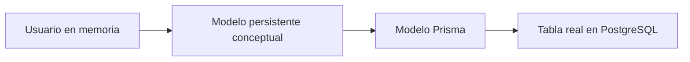
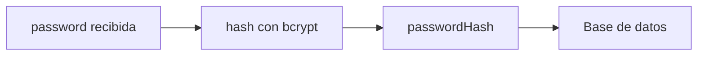
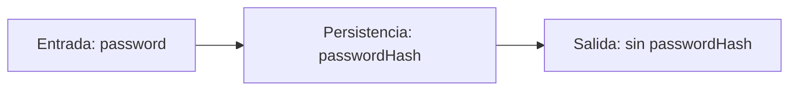
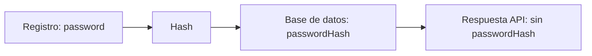
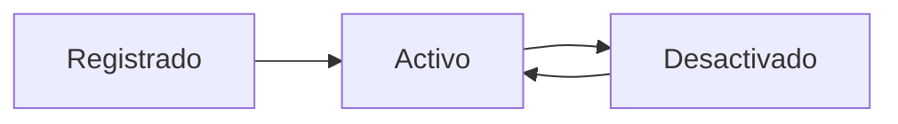

# Día 18: Diseño del modelo persistente `User`

En el día 17 preparamos el entorno de base de datos con Docker Compose. Ya tenemos una base de datos PostgreSQL funcionando en un contenedor y una herramienta como Adminer para poder observarla desde el navegador.

Pero antes de crear tablas, migraciones o modelos con un ORM, necesitamos hacer una pausa importante:

> ¿Qué datos debe guardar realmente un usuario?

Hasta ahora, durante los días de CRUD en memoria, hemos trabajado con usuarios dentro de un array de TypeScript. Ese modelo nos ha servido para aprender rutas, métodos HTTP, validaciones y errores.

Un usuario en memoria podía tener una forma parecida a esta:

```ts
type User = {
  id: number;
  name: string;
  email: string;
  role: "USER" | "ADMIN";
  isActive: boolean;
  createdAt: string;
  updatedAt: string;
};
```

Pero ahora vamos a pasar a una fase nueva: los usuarios se guardarán en una base de datos real.

Eso implica pensar mejor el modelo:

- Qué campos necesita.
- Qué campos son obligatorios.
- Qué campos deben ser únicos.
- Qué datos no se deben devolver nunca.
- Qué valores por defecto tendrá.
- Qué reglas de negocio debe respetar.

El objetivo de hoy no es programar muchos endpoints nuevos. El objetivo es diseñar bien el **modelo persistente `User`**, que después convertiremos en un modelo real de Prisma.

## ¿Qué vamos a trabajar hoy?

Hoy trabajaremos estos conceptos:

| Concepto | Qué aprenderemos |
| --- | --- |
| Modelo persistente | Cómo representar datos que se guardan en base de datos |
| Entidad `User` | Qué información define a un usuario del sistema |
| Campo y tipo de dato | Cómo describir cada propiedad del modelo |
| Restricción | Qué reglas debe cumplir cada campo |
| Valor por defecto | Qué valores puede asignar el sistema automáticamente |
| Clave primaria | Cómo identificar cada usuario de forma única |
| Campo único | Por qué el email no puede repetirse |
| Dato sensible | Qué información no debe exponerse nunca |
| `passwordHash` | Cómo preparar el modelo para contraseñas seguras |
| Rol de usuario | Cómo diferenciar `USER` y `ADMIN` |
| Borrado lógico | Cómo desactivar usuarios sin eliminarlos físicamente |
| Fechas de auditoría | Cómo registrar creación y actualización |
| Diseño antes de implementación | Por qué pensar el modelo antes de programar |

El producto del día será un documento de diseño del modelo `User`.

Este diseño servirá de puente entre:

- El array en memoria que usamos al principio.
- El modelo Prisma que crearemos más adelante.
- La tabla real que existirá en PostgreSQL.

## ¿Qué es un modelo persistente?

Un **modelo persistente** representa cómo se va a guardar una entidad en una base de datos.

En nuestro caso, la entidad principal del proyecto es `User`.

Un usuario no es solo un objeto temporal dentro del código. En una aplicación real, un usuario debe conservarse aunque el servidor se apague.

Por eso necesitamos definirlo bien.

Un modelo persistente responde preguntas como estas:

- ¿Cómo se identifica un usuario?
- ¿Qué datos personales o de cuenta guarda?
- ¿Qué datos necesita para iniciar sesión?
- ¿Qué rol tiene?
- ¿Está activo o desactivado?
- ¿Cuándo se creó?
- ¿Cuándo se actualizó por última vez?

Este diseño es importante porque después afectará a muchas partes de la API:

- Registro.
- Login.
- Listado de usuarios.
- Edición de usuarios.
- Roles.
- Permisos.
- Cambio de contraseña.
- Activación y desactivación de cuentas.

## Del usuario en memoria al usuario persistente

Durante los primeros días, nuestro usuario en memoria podía ser sencillo:

```ts
const users = [
  {
    id: 1,
    name: "Ana García",
    email: "ana@email.com",
    role: "USER",
    isActive: true
  }
];
```

Esto era suficiente para practicar CRUD básico.

Pero en una base de datos real necesitamos añadir algunos detalles importantes.

Por ejemplo:

- La contraseña no se guardará como `password`, sino como `passwordHash`.
- El email debe ser único.
- El rol debe tener valores controlados.
- `isActive` tendrá un valor por defecto.
- `createdAt` y `updatedAt` deben generarse automáticamente.

La evolución sería:



Hoy estamos en el segundo paso: el modelo persistente conceptual.

## Campos principales del modelo `User`

Nuestro modelo `User` tendrá estos campos:

- `id`
- `name`
- `email`
- `passwordHash`
- `role`
- `isActive`
- `createdAt`
- `updatedAt`

Vamos a analizarlos uno a uno.

## Campo `id`

El campo `id` identifica de forma única a cada usuario.

Características:

- Es obligatorio.
- Es único.
- Lo genera el sistema.
- No lo escribe el usuario manualmente.
- Sirve para buscar, actualizar o eliminar usuarios.

Ejemplos de uso:

```text
GET /api/users/1
PATCH /api/users/1
DELETE /api/users/1
```

En una base de datos, el `id` suele ser la **clave primaria**.

Conceptualmente: `id` → clave primaria.

## Campo `name`

El campo `name` representa el nombre visible del usuario.

Características:

- Es obligatorio.
- Debe ser texto.
- No debe estar vacío.
- Puede contener espacios entre palabras.
- Puede modificarse más adelante.

Ejemplo:

```text
Ana García
```

Validaciones recomendadas:

- No aceptar string vacío.
- Eliminar espacios al principio y al final.
- Exigir una longitud mínima razonable.

Ejemplo de normalización:

```ts
const cleanName = name.trim();
```

## Campo `email`

El campo `email` será uno de los campos más importantes del modelo.

Lo usaremos para:

- Identificar usuarios.
- Evitar duplicados.
- Iniciar sesión.
- Recuperar cuentas en un sistema real.

Características:

- Es obligatorio.
- Debe ser único.
- Debe tener formato de email.
- Debe guardarse normalizado.

Ejemplo:

```text
ana@email.com
```

Normalización recomendada:

```ts
const cleanEmail = email.trim().toLowerCase();
```

Esto evita que se registren como usuarios diferentes:

```text
ana@email.com
ANA@EMAIL.COM
  Ana@Email.com
```

Regla importante: no puede haber dos usuarios con el mismo email.

En el modelo persistente, este campo tendrá una restricción de unicidad.

Conceptualmente: `email` → único.

## Campo `passwordHash`

En una API real nunca debemos guardar la contraseña en texto plano.

Mal enfoque:

```text
password: "123456"
```

Buen enfoque:

```text
passwordHash: "$2b$10$..."
```

El campo persistente será `passwordHash`.

No será `password`.

¿Por qué?

Porque `password` representa el texto que el usuario escribe al registrarse o iniciar sesión. Ese texto solo debe existir momentáneamente en la petición.

Después debe transformarse en un hash mediante una librería como `bcrypt`.

Aunque todavía no implementaremos `bcrypt` en este día, ya dejamos diseñado el modelo pensando en seguridad.

Regla importante: `passwordHash` nunca se devuelve en respuestas de la API.

Ejemplo incorrecto:

```json
{
  "id": 1,
  "name": "Ana García",
  "email": "ana@email.com",
  "passwordHash": "$2b$10$..."
}
```

Ejemplo correcto:

```json
{
  "id": 1,
  "name": "Ana García",
  "email": "ana@email.com",
  "role": "USER",
  "isActive": true
}
```

## Campo `role`

El campo `role` indica qué tipo de usuario tenemos.

En este reto usaremos dos roles:

- `USER`
- `ADMIN`

### `USER`

Será el usuario normal del sistema.

Podrá hacer acciones como:

- Consultar su propio perfil.
- Modificar algunos de sus datos.
- Cambiar su contraseña.

### `ADMIN`

Será el usuario administrador.

Podrá hacer acciones como:

- Listar usuarios.
- Consultar usuarios.
- Crear usuarios desde administración.
- Cambiar roles.
- Activar o desactivar cuentas.
- Eliminar o desactivar usuarios.

El rol tendrá un valor por defecto: `USER`.

Eso significa que, cuando alguien se registre, será usuario normal salvo que el sistema indique lo contrario.

Conceptualmente: `role` → `USER` por defecto.

## Campo `isActive`

El campo `isActive` indica si una cuenta está activa.

Valores posibles:

- `true`
- `false`

Lo usaremos para implementar borrado lógico.

En lugar de borrar físicamente un usuario de la base de datos, podemos marcarlo como inactivo: `isActive = false`.

Esto permite conservar información histórica sin permitir que el usuario siga accediendo.

Reglas asociadas:

- Un usuario activo puede iniciar sesión.
- Un usuario inactivo no puede iniciar sesión.
- Un `ADMIN` puede activar o desactivar usuarios.

Valor por defecto: `true`.

## Campo `createdAt`

El campo `createdAt` indica cuándo se creó el usuario.

No debe introducirlo manualmente el usuario.

Debe generarse automáticamente cuando se crea el registro.

Sirve para saber:

- Cuándo se registró el usuario.
- Cuándo se creó una cuenta desde administración.
- Cuánto tiempo lleva una cuenta en el sistema.

Conceptualmente: `createdAt` → fecha de creación automática.

## Campo `updatedAt`

El campo `updatedAt` indica cuándo se modificó por última vez el usuario.

Debe actualizarse cuando cambian datos como:

- `name`
- `email`
- `passwordHash`
- `role`
- `isActive`

Sirve para tener una pequeña auditoría de cambios.

Conceptualmente: `updatedAt` → fecha de última modificación.

## Tabla conceptual del modelo

Podemos resumir el modelo así:

| Campo          | Tipo conceptual  | Obligatorio | Único | Valor por defecto | Se devuelve al cliente |
| -------------- | ---------------- | ----------- | ----- | ----------------- | ---------------------- |
| `id`           | número           | sí          | sí    | automático        | sí                     |
| `name`         | texto            | sí          | no    | no                | sí                     |
| `email`        | texto            | sí          | sí    | no                | sí                     |
| `passwordHash` | texto            | sí          | no    | no                | no                     |
| `role`         | `USER` / `ADMIN` | sí          | no    | `USER`            | sí                     |
| `isActive`     | booleano         | sí          | no    | `true`            | sí                     |
| `createdAt`    | fecha            | sí          | no    | automático        | sí                     |
| `updatedAt`    | fecha            | sí          | no    | automático        | sí                     |

## Reglas del modelo `User`

El modelo `User` debe respetar estas reglas:

- El email no se puede repetir.
- El email debe guardarse normalizado.
- La contraseña nunca se guarda en texto plano.
- `passwordHash` nunca se devuelve al cliente.
- Todo usuario tiene un rol.
- El rol por defecto es `USER`.
- Todo usuario se crea activo.
- Un usuario desactivado no puede iniciar sesión.
- `createdAt` se genera al crear.
- `updatedAt` cambia al modificar.

Estas reglas no son solo detalles técnicos. Son decisiones de diseño del sistema.

## Diferencia entre contraseña y `passwordHash`

Conviene distinguir muy bien estos dos conceptos.

| Concepto       | Cuándo existe              | Se guarda en base de datos | Se devuelve al cliente |
| -------------- | -------------------------- | -------------------------- | ---------------------- |
| `password`     | Cuando el usuario la envía | no                         | no                     |
| `passwordHash` | Después de aplicar hash    | sí                         | no                     |

Ejemplo de registro:

```json
{
  "name": "Laura Martínez",
  "email": "laura@email.com",
  "password": "123456"
}
```

La API recibirá `password`, pero guardará `passwordHash`.

Flujo conceptual:



Este paso lo implementaremos más adelante en la fase de seguridad.

## Diferencia entre modelo de entrada, modelo persistente y modelo de salida

En una API real, no siempre usamos el mismo modelo para todo.

Podemos distinguir tres representaciones.

### Modelo de entrada

Es lo que llega desde el cliente.

Ejemplo para registro:

```json
{
  "name": "Ana García",
  "email": "ana@email.com",
  "password": "123456"
}
```

Contiene `password`, porque el usuario la está enviando.

### Modelo persistente

Es lo que se guarda en base de datos:

- `id`
- `name`
- `email`
- `passwordHash`
- `role`
- `isActive`
- `createdAt`
- `updatedAt`

Contiene `passwordHash`, pero no `password`.

### Modelo de salida

Es lo que devolvemos al cliente.

```json
{
  "id": 1,
  "name": "Ana García",
  "email": "ana@email.com",
  "role": "USER",
  "isActive": true,
  "createdAt": "...",
  "updatedAt": "..."
}
```

No contiene ni `password` ni `passwordHash`.



## Relación con Prisma

Aunque hoy no vamos a instalar Prisma todavía, este diseño nos prepara para ello.

Más adelante, el modelo Prisma tendrá una forma parecida a esta:

```prisma
model User {
  id           Int      @id @default(autoincrement())
  name         String
  email        String   @unique
  passwordHash String
  role         Role     @default(USER)
  isActive     Boolean  @default(true)
  createdAt    DateTime @default(now())
  updatedAt    DateTime @updatedAt
}

enum Role {
  USER
  ADMIN
}
```

No hace falta memorizar todavía esta sintaxis.

Lo importante es entender que este modelo Prisma saldrá del diseño que estamos haciendo hoy.

Hoy diseñamos.

Más adelante implementamos.

## Parte guiada

### Paso 1: Abrir el proyecto

Abre el repositorio:

```bash
cd usermanager-api
```

Comprueba que el proyecto mantiene una estructura parecida a:

```text
usermanager-api/
  src/
    server.ts
  docs/
  docker-compose.yml
  README.md
  package.json
```

### Paso 2: Crear el documento del día 18

Dentro de la carpeta `docs/`, crea un archivo:

```text
docs/dia-18-diseno-modelo-persistente-user.md
```

Este documento recogerá el diseño del modelo `User`.

### Paso 3: Añadir el resumen inicial

Añade al documento:

```md
# Día 18 - Diseño del modelo persistente User

## Qué he hecho

- He analizado qué datos necesita guardar un usuario.
- He diferenciado entre usuario en memoria y usuario persistente.
- He definido los campos principales del modelo User.
- He identificado qué campos son obligatorios.
- He identificado qué campos deben ser únicos.
- He marcado passwordHash como dato sensible.
- He definido las reglas de role e isActive.
- He preparado el diseño para convertirlo más adelante en un modelo Prisma.
```

### Paso 4: Añadir la tabla de campos

Añade esta tabla:

```md
## Campos del modelo User

| Campo | Tipo conceptual | Obligatorio | Único | Valor por defecto | Se devuelve al cliente |
|---|---|---|---|---|---|
| `id` | número | sí | sí | automático | sí |
| `name` | texto | sí | no | no | sí |
| `email` | texto | sí | sí | no | sí |
| `passwordHash` | texto | sí | no | no | no |
| `role` | `USER` / `ADMIN` | sí | no | `USER` | sí |
| `isActive` | booleano | sí | no | `true` | sí |
| `createdAt` | fecha | sí | no | automático | sí |
| `updatedAt` | fecha | sí | no | automático | sí |
```

### Paso 5: Añadir las reglas de negocio

Añade:

```md
## Reglas del modelo

- El email no se puede repetir.
- El email debe guardarse normalizado.
- La contraseña nunca se guarda en texto plano.
- `passwordHash` nunca se devuelve al cliente.
- Todo usuario tiene un rol.
- El rol por defecto es `USER`.
- Todo usuario se crea activo.
- Un usuario desactivado no puede iniciar sesión.
- `createdAt` se genera al crear el usuario.
- `updatedAt` cambia cuando el usuario se modifica.
```

### Paso 6: Añadir diferencia entre entrada, persistencia y salida

Añade esta tabla:

```md
## Entrada, persistencia y salida

| Representación | Qué significa | Contiene password | Contiene passwordHash |
|---|---|---|---|
| Entrada | Datos que envía el cliente | sí | no |
| Persistencia | Datos guardados en base de datos | no | sí |
| Salida | Datos que devuelve la API | no | no |
```

Y añade este ejemplo:

````md
### Ejemplo de entrada

```json
{
  "name": "Ana García",
  "email": "ana@email.com",
  "password": "123456"
}
```

### Ejemplo de salida

```json
{
  "id": 1,
  "name": "Ana García",
  "email": "ana@email.com",
  "role": "USER",
  "isActive": true,
  "createdAt": "...",
  "updatedAt": "..."
}
```
````

### Paso 7: Añadir el diseño futuro en Prisma

Añade una sección:

````md
## Posible modelo Prisma futuro

```prisma
model User {
  id           Int      @id @default(autoincrement())
  name         String
  email        String   @unique
  passwordHash String
  role         Role     @default(USER)
  isActive     Boolean  @default(true)
  createdAt    DateTime @default(now())
  updatedAt    DateTime @updatedAt
}

enum Role {
  USER
  ADMIN
}
```

Este modelo todavía no se implementa hoy. Servirá como referencia para los próximos días.
````

### Paso 8: Añadir un diagrama del flujo

Añade este diagrama Mermaid:



Explicación sugerida:

```md
La contraseña llega desde el cliente solo durante el registro o login. Después se transforma en un hash y se guarda como passwordHash. La API nunca debe devolver password ni passwordHash.
```

### Paso 9: Actualizar el README

En el README, añade una sección breve:

````md
## Modelo persistente User

El modelo principal del proyecto será `User`.

Campos principales:

```text
id
name
email
passwordHash
role
isActive
createdAt
updatedAt
```

Reglas importantes:

```text
email único
passwordHash nunca se devuelve
role por defecto USER
isActive por defecto true
createdAt y updatedAt automáticos
```

Este diseño se convertirá más adelante en un modelo Prisma.
````

### Paso 10: Actualizar el índice del README

Añade el enlace:

```md
- [Día 18 - Diseño del modelo persistente User](docs/dia-18-diseno-modelo-persistente-user.md)
```

El bloque debería quedar parecido a:

```md
## Documentación del reto

- [Día 1 - Diseño inicial](docs/dia-01-diseno-inicial.md)
- [Día 2 - Preparación del proyecto](docs/dia-02-preparacion-proyecto.md)
- [Día 3 - Primer endpoint](docs/dia-03-primer-endpoint.md)
- [Día 4 - Métodos HTTP](docs/dia-04-metodos-http.md)
- [Día 5 - JSON, body, params y headers](docs/dia-05-json-body-params-headers.md)
- [Día 6 - Cliente HTTP y depuración](docs/dia-06-cliente-http-depuracion.md)
- [Día 7 - Listado de usuarios en memoria](docs/dia-07-listado-usuarios.md)
- [Día 8 - Consultar usuario por ID](docs/dia-08-consultar-usuario-id.md)
- [Día 9 - Crear usuarios en memoria](docs/dia-09-crear-usuarios.md)
- [Día 10 - Actualizar usuarios en memoria](docs/dia-10-actualizar-usuarios.md)
- [Día 11 - Eliminar o desactivar usuarios en memoria](docs/dia-11-eliminar-desactivar-usuarios.md)
- [Día 12 - Validación manual básica](docs/dia-12-validacion-manual-basica.md)
- [Día 13 - Validación de email y duplicados](docs/dia-13-validacion-email-duplicados.md)
- [Día 14 - Códigos de estado HTTP](docs/dia-14-codigos-estado-http.md)
- [Día 15 - Middleware centralizado de errores](docs/dia-15-middleware-errores.md)
- [Día 16 - Base de datos y persistencia](docs/dia-16-base-datos-persistencia.md)
- [Día 17 - PostgreSQL con Docker Compose](docs/dia-17-postgresql-docker-compose.md)
- [Día 18 - Diseño del modelo persistente User](docs/dia-18-diseno-modelo-persistente-user.md)
```

### Paso 11: Guardar cambios en Git

Comprueba los cambios:

```bash
git status
```

Añade los archivos:

```bash
git add .
```

Crea un commit:

```bash
git commit -m "Dia 18 - Disenar modelo persistente User"
```

Sube los cambios:

```bash
git push
```

## Parte libre

### Tarea libre 1: Añadir campos opcionales

Propón dos campos opcionales que podría tener un usuario en una aplicación real.

Ejemplos:

```text
avatarUrl
phone
lastLoginAt
bio
```

Para cada campo indica:

```text
Nombre del campo.
Tipo conceptual.
Para qué serviría.
Si se debería devolver al cliente.
```

### Tarea libre 2: Explicar `passwordHash`

Añade una sección al documento:

```md
## Por qué guardamos passwordHash y no password
```

Explica con tus palabras por qué sería peligroso guardar contraseñas en texto plano.

### Tarea libre 3: Definir permisos por rol

Añade una tabla:

| Acción                    | USER | ADMIN |
| ------------------------- | ---- | ----- |
| Ver su perfil             | sí   | sí    |
| Listar todos los usuarios | no   | sí    |
| Cambiar su nombre         | sí   | sí    |
| Cambiar su rol            | no   | sí    |
| Desactivar usuarios       | no   | sí    |
| Cambiar su contraseña     | sí   | sí    |

### Tarea libre 4: Dibujar el ciclo de vida de un usuario

Añade un diagrama Mermaid que represente este flujo:

```text
Registrado → Activo → Desactivado → Reactivado
```

Ejemplo:



### Tarea libre 5: Preparar preguntas para el día 19

En el documento, añade una sección:

```md
## Dudas para elegir herramienta de acceso a datos
```

Escribe al menos tres preguntas que te gustaría resolver antes de elegir entre SQL directo, Prisma, TypeORM o Sequelize.

Ejemplos:

```text
¿Qué herramienta se usa más con TypeScript?
Cuál permite definir modelos de forma más clara?
Cuál ayuda más a evitar errores?
Cuál es más fácil de aprender?
```

## Entrega recomendada del día 18

Las respuestas no se entregan como archivo suelto. Deben quedar dentro del repositorio de GitHub.

Al finalizar el día 18, el repositorio debería tener esta estructura aproximada:

```text
usermanager-api/
  docker-compose.yml
  README.md
  package.json
  package-lock.json
  tsconfig.json
  src/
    server.ts
  docs/
    dia-01-diseno-inicial.md
    dia-02-preparacion-proyecto.md
    dia-03-primer-endpoint.md
    dia-04-metodos-http.md
    dia-05-json-body-params-headers.md
    dia-06-cliente-http-depuracion.md
    dia-07-listado-usuarios.md
    dia-08-consultar-usuario-id.md
    dia-09-crear-usuarios.md
    dia-10-actualizar-usuarios.md
    dia-11-eliminar-desactivar-usuarios.md
    dia-12-validacion-manual-basica.md
    dia-13-validacion-email-duplicados.md
    dia-14-codigos-estado-http.md
    dia-15-middleware-errores.md
    dia-16-base-datos-persistencia.md
    dia-17-postgresql-docker-compose.md
    dia-18-diseno-modelo-persistente-user.md
```

El documento del día 18 deberá estar en:

```text
docs/dia-18-diseno-modelo-persistente-user.md
```

Y deberá incluir:

```text
Resumen de lo realizado.
Tabla de campos del modelo User.
Reglas del modelo.
Diferencia entre entrada, persistencia y salida.
Ejemplo de posible modelo Prisma futuro.
Explicación de passwordHash.
Tabla de permisos por rol.
Ciclo de vida del usuario.
Preguntas para el día 19.
```

En el foro, se compartirá el enlace actualizado al repositorio.

Ejemplo de mensaje:

```text
Hola, comparto el avance del día 18 del reto UserManager API:

https://github.com/usuario/usermanager-api

He diseñado el modelo persistente User, definiendo campos, reglas, datos sensibles y una propuesta futura de modelo Prisma. La documentación está en:

docs/dia-18-diseno-modelo-persistente-user.md
```

## Cierre del día

Hoy no hemos creado una tabla nueva ni hemos instalado Prisma todavía. Hemos hecho algo previo y muy importante: diseñar bien el modelo persistente `User`.

Hoy hemos trabajado:

```text
Modelo persistente.
Campos del usuario.
id.
name.
email.
passwordHash.
role.
isActive.
createdAt.
updatedAt.
Datos sensibles.
Entrada, persistencia y salida.
Diseño futuro en Prisma.
```

Este día sirve para evitar programar sin pensar. Antes de crear migraciones o escribir código de acceso a datos, necesitamos saber qué queremos guardar y qué reglas debe cumplir nuestro modelo.

!!! success "Idea clave"
    Un buen modelo persistente no solo define campos: define reglas, límites,
    datos sensibles y decisiones que afectarán a toda la API.
