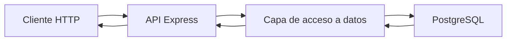
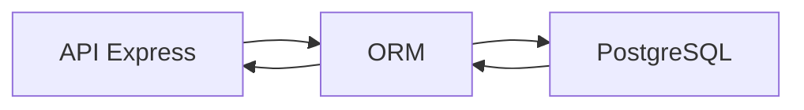
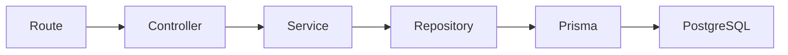
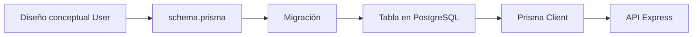
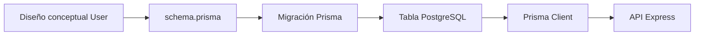

# Día 19: ORM o acceso a datos

En el día 18 diseñamos el modelo persistente `User`. Analizamos qué campos necesita un usuario, qué datos deben ser obligatorios, qué información debe ser única y qué datos nunca deben devolverse al cliente.

Nuestro modelo conceptual quedó formado por campos como:

- `id`
- `name`
- `email`
- `passwordHash`
- `role`
- `isActive`
- `createdAt`
- `updatedAt`

Ahora que ya sabemos qué información queremos guardar, aparece una nueva pregunta importante:

> ¿Cómo va a acceder nuestra API a la base de datos?

Hasta ahora, durante el CRUD en memoria, el backend trabajaba con un array:

```ts
const users = [
  {
    id: 1,
    name: "Ana García",
    email: "ana@email.com",
    role: "USER",
    isActive: true
  }
];
```

Y para buscar, crear o modificar usuarios usábamos operaciones propias de JavaScript:

- `users.find(...)`
- `users.push(...)`
- `users.map(...)`
- `users.filter(...)`

Pero una base de datos real no funciona así.

Cuando los datos estén en PostgreSQL, necesitaremos una herramienta que permita al backend comunicarse con la base de datos.

Existen varias opciones:

- SQL directo
- Prisma
- TypeORM
- Sequelize

Hoy vamos a comparar esas opciones y vamos a tomar una decisión técnica para el resto del reto.

El objetivo del día será entender qué es un ORM, qué problema resuelve y por qué vamos a utilizar **Prisma** como herramienta principal de acceso a datos.

## ¿Qué vamos a trabajar hoy?

Hoy trabajaremos estos conceptos:

| Concepto | Qué aprenderemos |
| --- | --- |
| Acceso a datos | Cómo lee y escribe la API en una base de datos |
| SQL directo | Qué implica escribir consultas manualmente |
| ORM | Qué problema resuelve una capa de mapeo objeto-relacional |
| Prisma | Por qué será la herramienta principal del reto |
| TypeORM | Qué alternativa existe en el ecosistema TypeScript |
| Sequelize | Qué opción clásica existe en Node.js |
| Modelo de datos | Cómo conectar el diseño `User` con la persistencia |
| Migraciones | Cómo evolucionar la base de datos de forma controlada |
| Cliente tipado | Cómo ganar seguridad de tipos al consultar datos |
| Repository | Dónde vivirá el acceso a datos en la arquitectura |
| Abstracción | Qué se gana y qué se pierde al usar herramientas de más alto nivel |
| Decisión técnica | Cómo elegir una opción razonada para el proyecto |

El producto del día será una decisión razonada:

!!! success "Decisión del reto"
    Usaremos Prisma como ORM principal del proyecto UserManager API.

Todavía no instalaremos Prisma. Eso lo haremos en el día 20.

Hoy nos centraremos en comprender el problema y justificar la decisión.

## ¿Qué significa acceso a datos?

El acceso a datos es la parte del backend encargada de leer y escribir información en la base de datos.

Por ejemplo, cuando el cliente hace esta petición:

```http
GET /api/users
```

La API necesita obtener los usuarios guardados.

Cuando usamos un array en memoria, el acceso a datos era algo así:

```ts
const activeUsers = users.filter((user) => user.isActive);
```

Pero cuando usamos PostgreSQL, el backend necesita consultar la base de datos.

Conceptualmente, la consulta sería algo parecido a:

```sql
SELECT id, name, email, role, is_active, created_at, updated_at
FROM users
WHERE is_active = true;
```

Por tanto, la API necesita una forma de comunicarse con PostgreSQL.

El flujo general será:



La capa de acceso a datos puede implementarse de varias maneras.

## Opción 1 — SQL directo

Una primera opción es escribir directamente consultas SQL desde el backend.

Ejemplo:

```ts
const result = await pool.query(
  `
  SELECT id, name, email, role, is_active, created_at, updated_at
  FROM users
  WHERE id = $1
  `,
  [id]
);
```

En este enfoque usamos una librería de conexión, como `pg`, y escribimos nosotros las consultas SQL.

### Ventajas

- Se entiende exactamente qué consulta se ejecuta.
- Es muy transparente.
- Ayuda a aprender SQL.
- No oculta lo que ocurre en la base de datos.
- Puede ser muy eficiente si se usa bien.

### Inconvenientes

- Hay que escribir más código manual.
- Hay que repetir muchas consultas.
- Hay que transformar datos a mano.
- Hay que tener mucho cuidado con SQL injection.
- Hay que gestionar errores de base de datos de forma más directa.

Por ejemplo, con SQL directo tenemos que pensar en detalles como:

- Parámetros `$1`, `$2`, `$3`.
- `RETURNING`.
- Mapeo entre `snake_case` y `camelCase`.
- Restricciones `UNIQUE`.
- Errores concretos de PostgreSQL.

SQL directo es muy interesante para aprender cómo funciona una base de datos, pero puede añadir demasiado ruido si el objetivo principal es construir una API REST completa.

## Opción 2 — Usar un ORM

Un ORM es una herramienta que permite trabajar con la base de datos usando modelos y objetos del lenguaje de programación.

ORM significa **Object-Relational Mapping**.

En lugar de escribir siempre SQL manualmente, definimos modelos y usamos métodos del ORM.

Por ejemplo, en lugar de escribir algo como:

```sql
SELECT * FROM users WHERE id = 1;
```

Podríamos escribir algo parecido a:

```ts
const user = await prisma.user.findUnique({
  where: { id: 1 }
});
```

La idea no es que desaparezca la base de datos. La base de datos sigue existiendo.

La diferencia es que el ORM nos da una capa más cómoda para trabajar con ella.



## ¿Qué problema resuelve un ORM?

Un ORM ayuda a resolver varios problemas habituales:

- Evita repetir SQL básico.
- Permite definir modelos de datos.
- Ayuda a trabajar con tipos.
- Facilita las migraciones.
- Reduce errores en consultas comunes.
- Hace más legible el acceso a datos.

Por ejemplo, si queremos obtener todos los usuarios, con SQL directo podríamos hacer:

```ts
const result = await pool.query(`
  SELECT id, name, email, role, is_active, created_at, updated_at
  FROM users
`);
```

Con Prisma, más adelante podremos hacer algo parecido a:

```ts
const users = await prisma.user.findMany({
  select: {
    id: true,
    name: true,
    email: true,
    role: true,
    isActive: true,
    createdAt: true,
    updatedAt: true
  }
});
```

El ORM no elimina la necesidad de entender qué estamos haciendo, pero nos da una forma más organizada de expresarlo.

## Prisma

Prisma es un ORM moderno muy utilizado con TypeScript.

Con Prisma definimos los modelos en un archivo llamado `schema.prisma`.

Ese archivo describe qué entidades tiene nuestra aplicación.

Por ejemplo, nuestro usuario podría definirse de forma parecida a esta:

```prisma
model User {
  id           Int      @id @default(autoincrement())
  name         String
  email        String   @unique
  passwordHash String
  role         Role     @default(USER)
  isActive     Boolean  @default(true)
  createdAt    DateTime @default(now())
  updatedAt    DateTime @updatedAt
}

enum Role {
  USER
  ADMIN
}
```

Después Prisma genera un cliente que podemos usar desde TypeScript.

Ejemplo conceptual:

```ts
const users = await prisma.user.findMany();
```

O:

```ts
const user = await prisma.user.findUnique({
  where: { id: 1 }
});
```

## Ventajas de Prisma

- Encaja muy bien con TypeScript.
- Permite definir modelos de forma clara.
- Genera un cliente tipado.
- Incluye sistema de migraciones.
- Tiene Prisma Studio para ver los datos visualmente.
- Reduce mucho SQL repetitivo.
- Ayuda a que el proyecto sea más mantenible.

## Inconvenientes de Prisma

- Hay que aprender su sintaxis.
- Oculta parte del SQL.
- Añade una capa más al proyecto.
- Requiere entender migraciones y generación de cliente.

Aun así, para este reto, Prisma nos interesa porque nos permite trabajar con una herramienta profesional sin perder claridad.

## TypeORM

TypeORM es otro ORM bastante conocido en el ecosistema TypeScript.

Suele trabajar con clases, decoradores y entidades.

Ejemplo conceptual:

```ts
@Entity()
class User {
  @PrimaryGeneratedColumn()
  id: number;

  @Column()
  name: string;

  @Column({ unique: true })
  email: string;
}
```

### Ventajas

- Encaja con programación orientada a objetos.
- Permite trabajar con entidades.
- Se usa bastante en algunos frameworks como NestJS.
- Tiene repositorios y relaciones.

### Inconvenientes

- Requiere entender decoradores.
- Puede resultar más complejo al principio.
- Añade bastante configuración.
- Puede mezclar muchos conceptos de golpe.

TypeORM es una opción válida, pero para este reto puede ser más difícil de introducir que Prisma.

## Sequelize

Sequelize es un ORM clásico del ecosistema Node.js.

Permite definir modelos y trabajar con varias bases de datos SQL.

Ejemplo conceptual:

```ts
const User = sequelize.define("User", {
  name: DataTypes.STRING,
  email: DataTypes.STRING
});
```

### Ventajas

- Tiene mucha trayectoria.
- Funciona con muchas bases de datos.
- Permite trabajar sin escribir todo el SQL a mano.

### Inconvenientes

- Puede sentirse menos natural con TypeScript.
- Su estilo puede parecer menos moderno.
- Requiere aprender su propia forma de definir modelos.

Sequelize sigue siendo una herramienta importante, pero para un proyecto nuevo con TypeScript, Prisma resulta más directo para este reto.

## Comparación general

| Opción      | Cómo se trabaja                             | Ventaja principal        | Inconveniente principal              |
| ----------- | ------------------------------------------- | ------------------------ | ------------------------------------ |
| SQL directo | Escribiendo consultas SQL                   | Muy transparente         | Más código manual                    |
| Prisma      | Modelos en `schema.prisma` y cliente tipado | Muy claro con TypeScript | Hay que aprender su ecosistema       |
| TypeORM     | Clases, entidades y decoradores             | Orientado a objetos      | Más configuración inicial            |
| Sequelize   | Modelos ORM clásicos                        | Muy conocido en Node.js  | Menos natural con TypeScript moderno |

## ¿Cuál elegiremos en este reto?

En este reto vamos a elegir **Prisma**.

La razón principal es que queremos construir una API REST completa y cercana a un proyecto real.

Prisma nos ayuda a trabajar con:

- Modelos.
- Migraciones.
- Cliente tipado.
- Consultas legibles.
- Integración con TypeScript.
- Prisma Studio.

Además, nos permitirá conectar mejor las siguientes fases del reto:

- Base de datos.
- Arquitectura por capas.
- Repositorios.
- Servicios.
- Autenticación.
- Roles.
- Frontend de prueba.

Prisma será la herramienta que usará nuestra API para comunicarse con PostgreSQL.

## SQL directo no desaparece del todo

Aunque elegimos Prisma, es importante entender que por debajo sigue existiendo una base de datos SQL.

Prisma no elimina PostgreSQL.

Prisma traduce nuestras operaciones a consultas contra la base de datos.

Por ejemplo:

```ts
await prisma.user.findMany();
```

Conceptualmente equivale a consultar usuarios en la base de datos.

La idea clave es esta:

!!! note "Idea clave"
    No usamos Prisma para evitar pensar, sino para trabajar de forma más
    organizada.

En algunos proyectos reales se puede usar ORM y, en casos concretos, SQL directo para consultas muy específicas.

## Qué será Prisma en nuestra arquitectura

Más adelante, cuando organicemos el proyecto por capas, Prisma estará principalmente en la capa de repositorio.

Una estructura futura será:

```text
routes → controllers → services → repositories → Prisma → PostgreSQL
```

Visualmente:



Cada capa tendrá una responsabilidad:

| Capa | Responsabilidad |
| --- | --- |
| Route | Define la URL |
| Controller | Recibe `req` y `res` |
| Service | Aplica reglas de negocio |
| Repository | Accede a los datos |
| Prisma | Comunica con PostgreSQL |

Hoy todavía no construiremos toda esa arquitectura. Pero es importante saber hacia dónde vamos.

## Cómo se relaciona con el modelo `User`

En el día 18 diseñamos este modelo conceptual:

- `id`
- `name`
- `email`
- `passwordHash`
- `role`
- `isActive`
- `createdAt`
- `updatedAt`

Prisma nos permitirá convertir ese diseño en un modelo real.

El modelo conceptual `User` se transformará en `model User` dentro de `schema.prisma`.

Y después Prisma podrá crear la tabla correspondiente en PostgreSQL mediante migraciones.



Este será el camino de los próximos días.

## Qué haremos en los próximos días

La secuencia será:

- Día 20: instalar y configurar Prisma.
- Día 21: definir el modelo `User` y `Role` en `schema.prisma`.
- Día 22: crear la primera migración.
- Día 23: usar Prisma Studio.
- Día 24: crear seed de datos iniciales.

Después, cuando Prisma ya esté preparado, pasaremos a arquitectura por capas y al CRUD persistente.

## Parte guiada

### Paso 1: Abrir el proyecto

Abre el repositorio:

```bash
cd usermanager-api
```

No necesitas instalar nada nuevo hoy.

El día de hoy es de análisis, comparación y decisión técnica.

### Paso 2: Crear el documento del día 19

Dentro de la carpeta `docs/`, crea un archivo:

```text
docs/dia-19-orm-acceso-datos.md
```

Este documento recogerá la comparación de opciones y la decisión técnica.

### Paso 3: Añadir el resumen inicial

Añade al documento:

```md
# Día 19 - ORM o acceso a datos

## Qué he hecho

- He entendido qué significa acceso a datos.
- He comparado SQL directo, Prisma, TypeORM y Sequelize.
- He aprendido qué es un ORM.
- He analizado ventajas e inconvenientes de cada opción.
- He relacionado el acceso a datos con el modelo User.
- He decidido usar Prisma como ORM principal del proyecto.
```

### Paso 4: Añadir una explicación de acceso a datos

Añade:

```md
## Qué es el acceso a datos

El acceso a datos es la parte del backend encargada de leer y escribir información en la base de datos.

En este proyecto, la API necesitará acceder a PostgreSQL para crear, consultar, modificar y desactivar usuarios.

El flujo será:

Cliente HTTP → API Express → Capa de acceso a datos → PostgreSQL
```

### Paso 5: Añadir la comparación de opciones

Añade esta tabla:

```md
## Comparación de opciones

| Opción | Cómo se trabaja | Ventaja principal | Inconveniente principal |
|---|---|---|---|
| SQL directo | Escribiendo consultas SQL | Muy transparente | Más código manual |
| Prisma | Modelos en schema.prisma y cliente tipado | Muy claro con TypeScript | Hay que aprender su ecosistema |
| TypeORM | Clases, entidades y decoradores | Orientado a objetos | Más configuración inicial |
| Sequelize | Modelos ORM clásicos | Muy conocido en Node.js | Menos natural con TypeScript moderno |
```

### Paso 6: Añadir ejemplos comparativos

Añade una sección:

````md
## SQL directo frente a Prisma

Ejemplo conceptual con SQL directo:

```ts
const result = await pool.query(
  "SELECT * FROM users WHERE id = $1",
  [id]
);
```

Ejemplo conceptual con Prisma:

```ts
const user = await prisma.user.findUnique({
  where: { id }
});
```

Ambos enfoques buscan un usuario por id, pero Prisma lo expresa desde el modelo User.
````

### Paso 7: Añadir la decisión técnica

Añade:

```md
## Decisión técnica

Para este reto usaremos Prisma.

Motivos:

- Encaja muy bien con TypeScript.
- Permite definir modelos de forma clara.
- Genera un cliente tipado.
- Incluye migraciones.
- Incluye Prisma Studio.
- Reduce SQL repetitivo.
- Se integra bien con una arquitectura por capas.

SQL directo sigue siendo importante para entender qué ocurre por debajo, pero no será el camino principal del proyecto.
```

### Paso 8: Añadir relación con la arquitectura futura

Añade:

```md
## Prisma dentro de la arquitectura

Más adelante, Prisma se usará desde la capa de repositorio.

Flujo previsto:

Route → Controller → Service → Repository → Prisma → PostgreSQL

Responsabilidades:

- Route: define la ruta.
- Controller: gestiona req y res.
- Service: aplica reglas de negocio.
- Repository: accede a los datos.
- Prisma: comunica con PostgreSQL.
```

### Paso 9: Añadir relación con el modelo `User`

Añade:

```md
## Relación con el modelo User

En el día 18 diseñamos el modelo persistente User.

Campos principales:

- id
- name
- email
- passwordHash
- role
- isActive
- createdAt
- updatedAt

En los próximos días este diseño se convertirá en un modelo Prisma dentro del archivo schema.prisma.
```

### Paso 10: Añadir diagrama Mermaid

Añade este diagrama:



Y explica brevemente:

```md
Este diagrama muestra cómo el diseño conceptual del usuario terminará convirtiéndose en una tabla real en PostgreSQL, accesible desde la API mediante Prisma Client.
```

### Paso 11: Actualizar el README

En el README, añade una sección breve:

````md
## ORM y acceso a datos

El proyecto usará Prisma como ORM principal para comunicarse con PostgreSQL.

Se ha elegido Prisma porque:

```text
Encaja bien con TypeScript.
Permite definir modelos claros.
Incluye migraciones.
Genera un cliente tipado.
Permite explorar datos con Prisma Studio.
```

Flujo previsto:

```text
API Express → Repository → Prisma → PostgreSQL
```

SQL directo, TypeORM y Sequelize se han considerado como alternativas, pero no serán el camino principal del reto.
````

### Paso 12: Actualizar el índice del README

Añade el enlace:

```md
- [Día 19 - ORM o acceso a datos](docs/dia-19-orm-acceso-datos.md)
```

El bloque debería quedar parecido a:

```md
## Documentación del reto

- [Día 1 - Diseño inicial](docs/dia-01-diseno-inicial.md)
- [Día 2 - Preparación del proyecto](docs/dia-02-preparacion-proyecto.md)
- [Día 3 - Primer endpoint](docs/dia-03-primer-endpoint.md)
- [Día 4 - Métodos HTTP](docs/dia-04-metodos-http.md)
- [Día 5 - JSON, body, params y headers](docs/dia-05-json-body-params-headers.md)
- [Día 6 - Cliente HTTP y depuración](docs/dia-06-cliente-http-depuracion.md)
- [Día 7 - Listado de usuarios en memoria](docs/dia-07-listado-usuarios.md)
- [Día 8 - Consultar usuario por ID](docs/dia-08-consultar-usuario-id.md)
- [Día 9 - Crear usuarios en memoria](docs/dia-09-crear-usuarios.md)
- [Día 10 - Actualizar usuarios en memoria](docs/dia-10-actualizar-usuarios.md)
- [Día 11 - Eliminar o desactivar usuarios en memoria](docs/dia-11-eliminar-desactivar-usuarios.md)
- [Día 12 - Validación manual básica](docs/dia-12-validacion-manual-basica.md)
- [Día 13 - Validación de email y duplicados](docs/dia-13-validacion-email-duplicados.md)
- [Día 14 - Códigos de estado HTTP](docs/dia-14-codigos-estado-http.md)
- [Día 15 - Middleware centralizado de errores](docs/dia-15-middleware-errores.md)
- [Día 16 - Base de datos y persistencia](docs/dia-16-base-datos-persistencia.md)
- [Día 17 - PostgreSQL con Docker Compose](docs/dia-17-postgresql-docker-compose.md)
- [Día 18 - Diseño del modelo persistente User](docs/dia-18-diseno-modelo-persistente-user.md)
- [Día 19 - ORM o acceso a datos](docs/dia-19-orm-acceso-datos.md)
```

### Paso 13: Guardar cambios en Git

Comprueba los cambios:

```bash
git status
```

Añade los archivos:

```bash
git add .
```

Crea un commit:

```bash
git commit -m "Dia 19 - Elegir Prisma como ORM"
```

Sube los cambios:

```bash
git push
```

## Parte libre

### Tarea libre 1: Explicar qué es un ORM

Añade al documento una sección:

```md
## Qué es un ORM
```

Explica con tus palabras qué problema resuelve un ORM.

Puedes apoyarte en esta idea:

```text
Un ORM permite trabajar con la base de datos usando modelos y métodos del lenguaje de programación, reduciendo la necesidad de escribir SQL repetitivo.
```

### Tarea libre 2: Defender la elección de Prisma

Añade una sección:

```md
## Por qué elegimos Prisma
```

Explica por qué Prisma puede ser una buena elección para este reto.

Incluye al menos tres argumentos.

Ejemplos:

```text
Se integra bien con TypeScript.
Permite definir modelos de forma clara.
Incluye migraciones.
Permite usar Prisma Studio.
Reduce SQL manual.
```

### Tarea libre 3: Comparar SQL directo y Prisma

Completa esta tabla:

| Aspecto                    | SQL directo | Prisma |
| -------------------------- | ----------- | ------ |
| Cómo se escriben consultas |             |        |
| Relación con TypeScript    |             |        |
| Facilidad inicial          |             |        |
| Control sobre SQL          |             |        |
| Cantidad de código manual  |             |        |
| Migraciones                |             |        |
| Herramienta visual         |             |        |

### Tarea libre 4: Investigar Prisma Studio

Añade una sección:

```md
## Prisma Studio
```

Explica qué crees que nos permitirá hacer Prisma Studio durante el reto.

Pista:

```text
Ver datos.
Crear registros.
Editar registros.
Comprobar si las migraciones han funcionado.
Comprobar usuarios iniciales.
```

### Tarea libre 5: Relacionar Prisma con arquitectura por capas

Añade una tabla:

| Capa       | Responsabilidad             | ¿Usa Prisma directamente? |
| ---------- | --------------------------- | ------------------------- |
| Route      | Define rutas                | no                        |
| Controller | Maneja petición y respuesta | no                        |
| Service    | Aplica reglas de negocio    | no                        |
| Repository | Accede a datos              | sí                        |
| Prisma     | Comunica con PostgreSQL     | sí                        |

## Entrega recomendada del día 19

Las respuestas no se entregan como archivo suelto. Deben quedar dentro del repositorio de GitHub.

Al finalizar el día 19, el repositorio debería tener esta estructura aproximada:

```text
usermanager-api/
  docker-compose.yml
  README.md
  package.json
  package-lock.json
  tsconfig.json
  src/
    server.ts
  docs/
    dia-01-diseno-inicial.md
    dia-02-preparacion-proyecto.md
    dia-03-primer-endpoint.md
    dia-04-metodos-http.md
    dia-05-json-body-params-headers.md
    dia-06-cliente-http-depuracion.md
    dia-07-listado-usuarios.md
    dia-08-consultar-usuario-id.md
    dia-09-crear-usuarios.md
    dia-10-actualizar-usuarios.md
    dia-11-eliminar-desactivar-usuarios.md
    dia-12-validacion-manual-basica.md
    dia-13-validacion-email-duplicados.md
    dia-14-codigos-estado-http.md
    dia-15-middleware-errores.md
    dia-16-base-datos-persistencia.md
    dia-17-postgresql-docker-compose.md
    dia-18-diseno-modelo-persistente-user.md
    dia-19-orm-acceso-datos.md
```

El documento del día 19 deberá estar en:

```text
docs/dia-19-orm-acceso-datos.md
```

Y deberá incluir:

```text
Resumen de lo realizado.
Explicación de acceso a datos.
Comparación entre SQL directo, Prisma, TypeORM y Sequelize.
Ejemplos comparativos.
Decisión técnica.
Relación con arquitectura por capas.
Relación con el modelo User.
Diagrama del flujo conceptual.
Defensa de la elección de Prisma.
```

En el foro, se compartirá el enlace actualizado al repositorio.

Ejemplo de mensaje:

```text
Hola, comparto el avance del día 19 del reto UserManager API:

https://github.com/usuario/usermanager-api

He comparado diferentes opciones de acceso a datos y he decidido usar Prisma como ORM principal del proyecto. La documentación está en:

docs/dia-19-orm-acceso-datos.md
```

## Cierre del día

Hoy hemos tomado una decisión técnica importante para el proyecto.

Ya sabemos que nuestra API no accederá a PostgreSQL escribiendo todo el SQL manualmente, sino usando Prisma como ORM principal.

Hoy hemos trabajado:

- Acceso a datos.
- SQL directo.
- ORM.
- Prisma.
- TypeORM.
- Sequelize.
- Modelos.
- Migraciones.
- Cliente tipado.
- Prisma Studio.
- Arquitectura por capas.

Esta decisión afectará a los próximos días del reto. A partir de ahora prepararemos Prisma, definiremos el modelo `User`, crearemos migraciones y empezaremos a utilizarlo dentro de la API.

!!! success "Idea clave"
    Elegir una herramienta de acceso a datos no es solo una cuestión técnica:
    condiciona cómo modelamos la información, cómo organizamos el código y
    cómo evolucionará la API.
