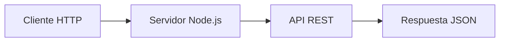
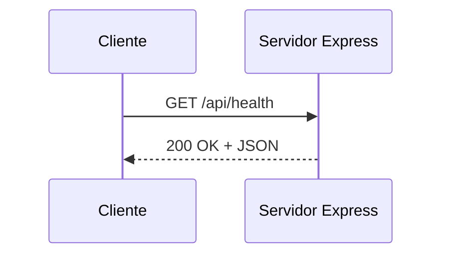
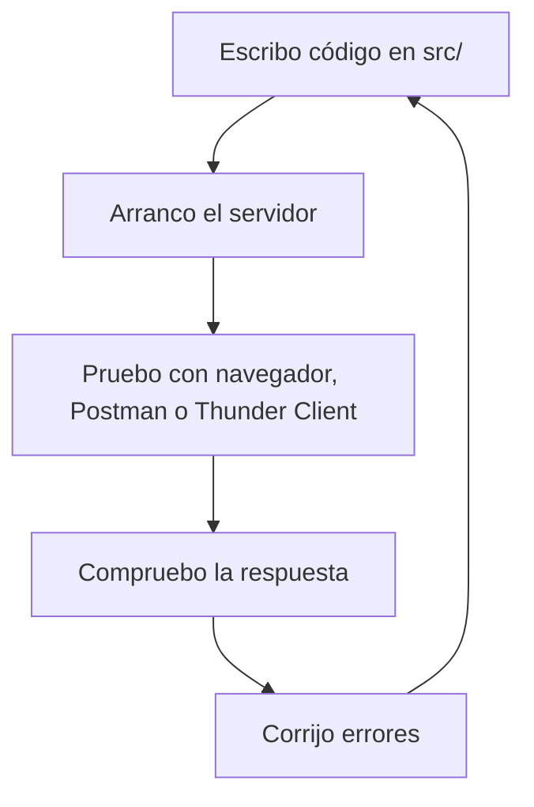

# Día 2: Preparación del proyecto

En el día 1 definimos qué vamos a construir: una **API REST de gestión de
usuarios** llamada **UserManager API**. Todavía no escribimos código, pero
dejamos claro el objetivo del proyecto, los recursos principales, los endpoints
que necesitaremos y algunas reglas iniciales.

Hoy vamos a dar el primer paso técnico: **crear el proyecto backend**.

!!! abstract "Objetivo del día"
    Preparar la base sobre la que construiremos toda la API: proyecto Node.js,
    Express, TypeScript, scripts de desarrollo, estructura inicial y servidor
    básico.

No vamos a crear todavía el CRUD de usuarios ni la autenticación. Hoy nos
centraremos en dejar el entorno preparado, instalar las primeras dependencias y
arrancar un servidor básico.

## Qué vamos a trabajar hoy

| Concepto | Para qué nos servirá |
| --- | --- |
| Node.js | Ejecutar JavaScript/TypeScript en backend |
| npm | Instalar dependencias y ejecutar scripts |
| `package.json` | Centralizar configuración, dependencias y comandos |
| Express | Crear el servidor HTTP y las rutas |
| TypeScript | Escribir código con tipos |
| `tsconfig.json` | Configurar la compilación de TypeScript |
| Scripts de desarrollo | Arrancar, compilar y ejecutar el proyecto |
| Estructura inicial | Organizar el código desde el principio |
| Servidor HTTP básico | Comprobar que la API arranca |

El resultado será un proyecto que podamos arrancar con un comando y que deje el
servidor escuchando en un puerto.

## Qué es Node.js

**Node.js** es un entorno que permite ejecutar JavaScript fuera del navegador.

Normalmente asociamos JavaScript al frontend, es decir, al código que se ejecuta
en el navegador. Sin embargo, con Node.js también podemos usar JavaScript para
crear aplicaciones de servidor.

Gracias a Node.js podemos construir:

```text
APIs REST
Servidores web
Aplicaciones de consola
Scripts de automatización
Herramientas de desarrollo
Servicios backend
```

En nuestro reto usaremos Node.js para crear el backend de UserManager API.



## Qué es npm

**npm** es el gestor de paquetes de Node.js.

Nos permite instalar librerías externas que usaremos en nuestro proyecto. Por
ejemplo, en lugar de programar desde cero todo el servidor HTTP, usaremos una
librería muy conocida llamada **Express**.

npm también nos permite definir comandos de trabajo dentro del archivo
`package.json`.

```bash title="Comandos habituales"
npm install express
npm run dev
npm run build
npm start
```

## Qué es package.json

El archivo `package.json` es uno de los archivos más importantes de un proyecto
Node.js.

Contiene información como:

```text
Nombre del proyecto
Versión
Dependencias instaladas
Scripts de ejecución
Configuración general
```

```json title="package.json simplificado"
{
  "name": "usermanager-api",
  "version": "1.0.0",
  "scripts": {
    "dev": "tsx watch src/server.ts",
    "build": "tsc",
    "start": "node dist/server.js"
  },
  "dependencies": {
    "express": "^4.18.0"
  },
  "devDependencies": {
    "typescript": "^5.0.0",
    "tsx": "^4.0.0"
  }
}
```

!!! tip "Idea clave"
    No es necesario memorizar todo el contenido de `package.json`, pero sí
    entender que será el punto central para gestionar dependencias, scripts y
    configuración básica del proyecto.

## Qué es Express

**Express** es un framework para Node.js que facilita la creación de servidores
y APIs.

Con Express podemos definir rutas como:

```ts
app.get("/api/health", (req, res) => {
  res.json({
    status: "ok"
  });
});
```

Sin Express, tendríamos que escribir mucho más código para gestionar peticiones
HTTP. Express nos permite centrarnos en la lógica de nuestra API.

Durante el reto usaremos Express para crear endpoints como:

```text
GET /api/health
GET /api/users
POST /api/auth/login
PATCH /api/users/:id
```

## Qué es TypeScript

**TypeScript** es un lenguaje basado en JavaScript que añade tipado estático.

Esto significa que podemos indicar qué tipo de datos esperamos usar.

=== "JavaScript"

    ```js
    function greet(name) {
      return "Hola " + name;
    }
    ```

=== "TypeScript"

    ```ts
    function greet(name: string): string {
      return "Hola " + name;
    }
    ```

La ventaja es que TypeScript nos ayuda a detectar errores antes de ejecutar el
programa.

```ts title="Error detectable por TypeScript"
greet(123);
```

TypeScript nos avisará de que estamos pasando un número donde se esperaba un
texto. En una API, esto nos ayudará a trabajar de forma más ordenada y segura.

## Qué es tsconfig.json

El archivo `tsconfig.json` contiene la configuración de TypeScript.

Define, entre otras cosas:

```text
Dónde está el código fuente
Dónde se generará el código compilado
Qué versión de JavaScript se usará
Qué reglas de comprobación aplicará TypeScript
```

```json title="tsconfig.json básico"
{
  "compilerOptions": {
    "target": "ES2020",
    "module": "CommonJS",
    "rootDir": "src",
    "outDir": "dist",
    "strict": true,
    "esModuleInterop": true
  }
}
```

Durante el desarrollo escribiremos código en TypeScript dentro de `src/`, y más
adelante podremos compilarlo a JavaScript dentro de `dist/`.

## Qué es un servidor HTTP

Un servidor HTTP es un programa que espera peticiones y devuelve respuestas.

```text
Cliente → GET /api/health → Servidor
Servidor → JSON de respuesta → Cliente
```

En nuestro caso, el servidor será una aplicación Express ejecutándose sobre
Node.js.



En el día 3 crearemos el primer endpoint real. Hoy dejaremos preparado el
servidor para poder hacerlo.

## Estructura inicial del proyecto

Hoy crearemos una estructura sencilla.

```text title="Estructura inicial"
usermanager-api/
  README.md
  package.json
  tsconfig.json
  src/
    server.ts
  docs/
    dia-01-diseno-inicial.md
```

De momento solo necesitamos un archivo dentro de `src/`:

```text
src/server.ts
```

Más adelante iremos creando más carpetas:

```text
routes/
controllers/
services/
repositories/
middlewares/
config/
dtos/
errors/
```

Pero hoy no conviene adelantarnos demasiado. Primero necesitamos que el servidor
arranque.

## Flujo de trabajo del proyecto

A partir de ahora, el flujo habitual será:



Este ciclo se repetirá durante todo el reto.

!!! note "Forma de trabajo"
    La idea no es escribir mucho código de golpe, sino avanzar poco a poco y
    probar constantemente.

## Parte guiada

### Paso 1: Abrir el repositorio

Abre el repositorio que creaste en el día 1.

El repositorio recomendado era:

```text
usermanager-api
```

Si todavía no lo tienes creado, créalo ahora en GitHub y clónalo en tu
ordenador.

```bash title="Clonar el repositorio"
git clone https://github.com/usuario/usermanager-api.git
cd usermanager-api
```

Si ya lo tienes clonado, simplemente entra en la carpeta:

```bash
cd usermanager-api
```

### Paso 2: Inicializar el proyecto Node.js

Dentro de la carpeta del proyecto, ejecuta:

```bash
npm init -y
```

Este comando crea el archivo:

```text
package.json
```

Comprueba que aparece en la raíz del proyecto.

### Paso 3: Instalar Express

Instala Express:

```bash
npm install express
```

Express será la librería que usaremos para crear el servidor y las rutas de la
API.

### Paso 4: Instalar TypeScript y herramientas de desarrollo

Instala las dependencias necesarias para trabajar con TypeScript:

```bash
npm install -D typescript tsx @types/node @types/express
```

| Paquete | Uso |
| --- | --- |
| `typescript` | Compilador de TypeScript |
| `tsx` | Herramienta para ejecutar TypeScript en desarrollo |
| `@types/node` | Tipos de Node.js |
| `@types/express` | Tipos de Express |

### Paso 5: Crear la configuración de TypeScript

Ejecuta:

```bash
npx tsc --init
```

Esto creará el archivo:

```text
tsconfig.json
```

Puedes dejarlo tal como se genera o simplificarlo con una configuración como
esta:

```json
{
  "compilerOptions": {
    "target": "ES2020",
    "module": "CommonJS",
    "rootDir": "src",
    "outDir": "dist",
    "strict": true,
    "esModuleInterop": true,
    "skipLibCheck": true
  }
}
```

### Paso 6: Crear la carpeta src

Crea la carpeta donde estará el código fuente:

```bash
mkdir src
```

Dentro de esa carpeta, crea el archivo:

```text
src/server.ts
```

La estructura debería quedar así:

```text
usermanager-api/
  docs/
    dia-01-diseno-inicial.md
  node_modules/
  src/
    server.ts
  README.md
  package.json
  package-lock.json
  tsconfig.json
```

### Paso 7: Crear el servidor básico

Dentro de `src/server.ts`, escribe:

```ts
import express from "express";

const app = express();
const PORT = 3000;

app.use(express.json());

app.get("/", (req, res) => {
  res.json({
    message: "UserManager API"
  });
});

app.listen(PORT, () => {
  console.log(`Servidor escuchando en http://localhost:${PORT}`);
});
```

Este código hace varias cosas:

| Línea o bloque | Qué hace |
| --- | --- |
| `import express from "express"` | Importa Express |
| `const app = express()` | Crea una aplicación Express |
| `const PORT = 3000` | Define el puerto |
| `app.use(express.json())` | Permite leer JSON en las peticiones |
| `app.get("/", ...)` | Crea una ruta `GET /` |
| `app.listen(...)` | Arranca el servidor |

### Paso 8: Añadir script de desarrollo

Abre el archivo `package.json` y busca la sección `"scripts"`.

Sustitúyela por esta:

```json
"scripts": {
  "dev": "tsx watch src/server.ts",
  "build": "tsc",
  "start": "node dist/server.js"
}
```

Con esto podremos arrancar el servidor en modo desarrollo con:

```bash
npm run dev
```

### Paso 9: Arrancar el servidor

Ejecuta:

```bash
npm run dev
```

Si todo va bien, deberías ver un mensaje parecido a:

```text
Servidor escuchando en http://localhost:3000
```

Ahora abre en el navegador:

```text
http://localhost:3000
```

Deberías ver una respuesta JSON:

```json
{
  "message": "UserManager API"
}
```

### Paso 10: Probar con Thunder Client o Postman

Hasta ahora hemos probado la API desde el navegador, pero un navegador solo nos
permite probar fácilmente peticiones sencillas de tipo `GET`.

En una API REST necesitaremos probar muchas más cosas:

```text
GET
POST
PATCH
DELETE
Headers
Body JSON
Tokens de autenticación
Códigos de estado
Respuestas de error
```

Para eso usamos herramientas específicas como **Thunder Client** o **Postman**.

| Herramienta | Ventaja |
| --- | --- |
| Thunder Client | Más cómodo si trabajas desde VS Code |
| Postman | Más completo y muy usado profesionalmente |

Para empezar, crea una petición:

```text
GET http://localhost:3000
```

Después pulsa **Send**.

Si el servidor está funcionando correctamente, deberías recibir una respuesta
parecida a esta:

```json
{
  "message": "UserManager API"
}
```

A partir de ahora, cada vez que creemos una ruta nueva, la probaremos con una
herramienta de este tipo.

!!! info "Guías recomendadas"
    - [Postman: Send your first API request](https://learning.postman.com/docs/getting-started/first-steps/sending-the-first-request/)
    - [Thunder Client: documentación oficial](https://docs.thunderclient.com/)

Para el documento del día 2, anota qué herramienta has utilizado y añade una
captura o una breve descripción de la prueba realizada.

### Paso 11: Actualizar README.md

Actualiza el `README.md` del repositorio con una sección de instalación.

````md title="README.md"
# UserManager API

Reto opcional de construcción de una API REST de gestión de usuarios.

## Descripción

Este proyecto tiene como objetivo construir paso a paso una API REST capaz de
gestionar usuarios, autenticación, roles, seguridad, base de datos e integración
con un frontend.

## Instalación

Instalar dependencias:

```bash
npm install
```

Arrancar en modo desarrollo:

```bash
npm run dev
```

La API se ejecutará inicialmente en:

```text
http://localhost:3000
```

## Documentación del reto

- [Día 1 - Diseño inicial](docs/dia-01-diseno-inicial.md)
````

### Paso 12: Crear el documento del día 2

Dentro de la carpeta `docs/`, crea un nuevo archivo:

```text
docs/dia-02-preparacion-proyecto.md
```

En este documento añade un pequeño resumen de lo que has hecho hoy:

````md title="docs/dia-02-preparacion-proyecto.md"
# Día 2: Preparación del proyecto

## Qué he hecho

- He inicializado el proyecto Node.js.
- He instalado Express.
- He configurado TypeScript.
- He creado la carpeta src.
- He creado el archivo src/server.ts.
- He arrancado el servidor en local.
- He probado la respuesta desde navegador o Thunder Client.

## Comando para arrancar el proyecto

```bash
npm run dev
```

## URL de prueba

```text
http://localhost:3000
```

## Respuesta obtenida

```json
{
  "message": "UserManager API"
}
```
````

### Paso 13: Actualizar el índice del README

Añade el enlace del día 2 en el README:

```md
## Documentación del reto

- [Día 1 - Diseño inicial](docs/dia-01-diseno-inicial.md)
- [Día 2 - Preparación del proyecto](docs/dia-02-preparacion-proyecto.md)
```

### Paso 14: Guardar cambios en Git

Comprueba los cambios:

```bash
git status
```

Añade los archivos:

```bash
git add .
```

Crea un commit:

```bash
git commit -m "Dia 2 - Preparacion inicial del proyecto"
```

Sube los cambios:

```bash
git push
```

## Parte libre

Ahora toca completar una pequeña parte sin guía directa.

### Tarea libre 1: Personalizar el mensaje inicial

Modifica la respuesta de la ruta `/` para que devuelva algo más completo.

```json title="Ejemplo"
{
  "name": "UserManager API",
  "version": "1.0.0",
  "status": "running",
  "author": "Tu nombre"
}
```

Puedes elegir los campos que quieras, pero la respuesta debe ser JSON.

### Tarea libre 2: Añadir una segunda ruta temporal

Crea una ruta nueva:

```text
GET /api/info
```

Esta ruta debe devolver información básica del proyecto.

```json title="Ejemplo"
{
  "project": "UserManager API",
  "description": "API REST para gestionar usuarios",
  "day": 2,
  "technologies": ["Node.js", "Express", "TypeScript"]
}
```

Esta ruta es temporal. Más adelante reorganizaremos las rutas, pero ahora nos
sirve para practicar.

### Tarea libre 3: Explicar el servidor con tus palabras

En el archivo:

```text
docs/dia-02-preparacion-proyecto.md
```

añade una sección llamada:

```md
## Explicación personal
```

Y responde con tus palabras:

```text
¿Qué hace el archivo src/server.ts?
¿Qué hace app.listen?
¿Qué hace app.get?
¿Por qué usamos express.json?
```

No hace falta una explicación perfecta. Lo importante es que seas capaz de
explicar el código que has escrito.

### Tarea libre 4: Investigar un error

Provoca intencionadamente un pequeño error, por ejemplo:

```text
Cambiar el puerto.
Escribir mal una ruta.
Borrar temporalmente una importación.
```

Después, anota en el documento:

```text
Qué error apareció.
Qué crees que significaba.
Cómo lo solucionaste.
```

Una parte importante de programar backend es aprender a leer errores.

## Entrega recomendada del día 2

Las respuestas no se entregan como archivo suelto. Deben quedar dentro del
repositorio de GitHub.

Al finalizar el día 2, el repositorio debería tener esta estructura aproximada:

```text
usermanager-api/
  README.md
  package.json
  package-lock.json
  tsconfig.json
  src/
    server.ts
  docs/
    dia-01-diseno-inicial.md
    dia-02-preparacion-proyecto.md
```

El documento del día 2 deberá estar en:

```text
docs/dia-02-preparacion-proyecto.md
```

Y deberá incluir:

- Resumen de lo realizado.
- Comando para arrancar el proyecto.
- URL de prueba.
- Respuesta obtenida.
- Explicación personal del archivo `server.ts`.
- Error investigado y solución.

En el foro, se compartirá el enlace actualizado al repositorio.

```text title="Mensaje de ejemplo"
Hola, comparto el avance del día 2 del reto UserManager API:

https://github.com/usuario/usermanager-api

He añadido el servidor inicial en src/server.ts y la documentación del día 2 en:
docs/dia-02-preparacion-proyecto.md
```

## Cierre del día

Hoy hemos creado la base técnica del proyecto.

Todavía no tenemos una API completa, pero ya tenemos algo importante:

```text
Un proyecto Node.js inicializado.
Express instalado.
TypeScript configurado.
Una estructura mínima de carpetas.
Un servidor arrancando en local.
Una primera respuesta JSON.
Documentación del avance en el repositorio.
```

A partir de aquí podremos empezar a crear rutas reales de nuestra API.

!!! success "Idea clave"
    Antes de crear endpoints, necesitamos preparar una base de proyecto clara,
    ejecutable y fácil de mantener.
