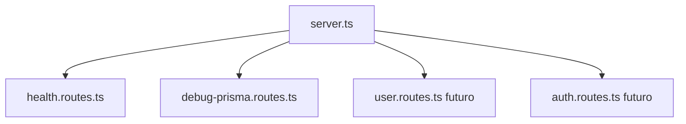
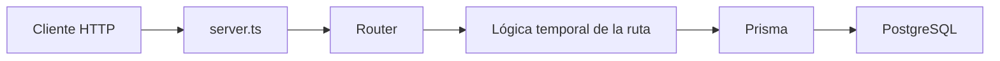
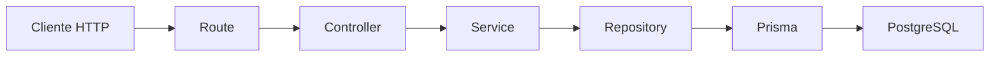
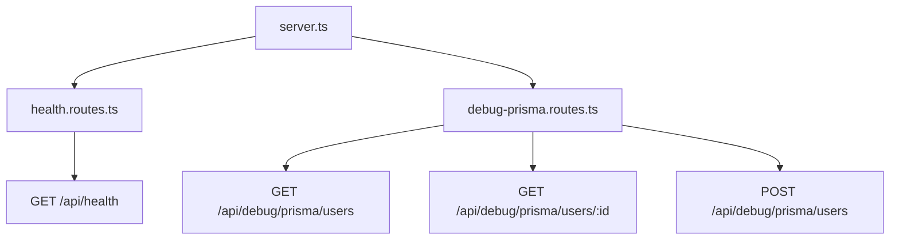

# Día 26: Separar rutas

En el día 25 usamos Prisma Client desde Express por primera vez.

Creamos rutas temporales como:

- `GET /api/debug/prisma/users`
- `GET /api/debug/prisma/users/:id`
- `GET /api/debug/prisma/users-active`
- `POST /api/debug/prisma/users`

Estas rutas nos sirvieron para practicar `findMany`, `findUnique`, `create`,
`select`, `where` y `orderBy`.

Hasta ahora, gran parte del código del proyecto ha estado dentro de un único
archivo: `src/server.ts`.

Eso es normal al principio. Cuando estamos aprendiendo, es cómodo tener todo en un mismo sitio.

Pero una API real no puede crecer así indefinidamente.

Si seguimos añadiendo rutas, validaciones, consultas a Prisma, autenticación, roles y lógica de negocio dentro de `server.ts`, el archivo acabará siendo difícil de leer y mantener.

A partir de hoy empezamos una nueva fase del reto: **arquitectura por capas**.

El primer paso será separar las rutas.

Hoy no crearemos todavía controladores, servicios ni repositorios. Eso llegará en los próximos días.

El objetivo de hoy será crear la carpeta `src/routes/` y mover algunas rutas
fuera de `server.ts`.

!!! info "Objetivo"
    `server.ts` debe arrancar y configurar la aplicación, no contener todas las
    rutas del proyecto.

## ¿Qué vamos a trabajar hoy?

Hoy trabajaremos estos conceptos:

| Concepto | Qué aprenderemos |
| --- | --- |
| Arquitectura por capas | Cómo dividir responsabilidades |
| Express Router | Cómo agrupar endpoints relacionados |
| `src/routes/` | Dónde ubicar los archivos de rutas |
| `server.ts` | Cómo limitarlo a configurar y arrancar la aplicación |
| `app.use` | Cómo montar un router con un prefijo |
| `router.get` y `router.post` | Cómo declarar rutas dentro de un router |
| Orden de rutas | Cómo evitar conflictos con parámetros dinámicos |
| Limpieza del proyecto | Cómo retirar rutas duplicadas de `server.ts` |

El producto del día será la carpeta `src/routes/` con las rutas separadas.

El resultado esperado será que la API siga funcionando igual, pero con un código más ordenado.

## ¿Por qué separar rutas?

Hasta ahora, `server.ts` se ha encargado de demasiadas cosas:

- Crear la aplicación de Express.
- Configurar `express.json()`.
- Definir endpoints y validar datos.
- Consultar Prisma.
- Gestionar errores.
- Arrancar el servidor.

Al principio esto es aceptable.

Pero a medida que crece el proyecto, necesitamos dividir responsabilidades.

Separar rutas nos permite que `server.ts` se centre en:

- Crear la aplicación.
- Configurar middlewares globales.
- Montar grupos de rutas.
- Configurar errores.
- Arrancar el servidor.

Y que los archivos de rutas se encarguen de:

- Agrupar endpoints relacionados.
- Definir URL concretas.
- Decidir qué función se ejecuta para cada método HTTP.

Visualmente:



## ¿Qué es `Express Router`?

`Express Router` permite crear grupos de rutas separados.

En lugar de escribir todas las rutas así:

```ts
app.get("/api/health", (req, res) => {
  res.json({ status: "ok" });
});
```

Podemos crear un archivo de rutas:

```ts
import { Router } from "express";

export const healthRouter = Router();

healthRouter.get("/", (req, res) => {
  res.json({ status: "ok" });
});
```

Y después montarlo en `server.ts`:

```ts
app.use("/api/health", healthRouter);
```

El resultado final para el cliente será el mismo: `GET /api/health`.

Pero el código estará mejor organizado.

## `app.get` frente a `router.get`

Hasta ahora hemos usado rutas directamente sobre `app`:

```ts
app.get("/api/users", ...)
```

A partir de ahora, dentro de los archivos de rutas usaremos:

```ts
router.get("/", ...)
```

La diferencia está en dónde se define la parte común de la ruta.

Ejemplo:

```ts
app.use("/api/debug/prisma", debugPrismaRouter);
```

Y dentro del router:

```ts
debugPrismaRouter.get("/users", ...);
```

La ruta final será `GET /api/debug/prisma/users`.

!!! tip "Composición de rutas"
    Prefijo en `server.ts` + ruta interna del router = ruta final.

## Qué vamos a separar hoy

Hoy separaremos dos grupos de rutas:

- Rutas de salud de la API.
- Rutas temporales de debug con Prisma.

La estructura quedará así:

```text
src/
  prisma.ts
  server.ts
  routes/
    health.routes.ts
    debug-prisma.routes.ts
```

Más adelante añadiremos `user.routes.ts` y `auth.routes.ts`.

Pero hoy no hace falta adelantarse.

## Lo que todavía no haremos hoy

Hoy no vamos a crear todavía `controllers/`, `services/`, `repositories/` ni
`dtos/`.

Eso vendrá en los próximos días.

La progresión será:

| Día | Objetivo |
| --- | --- |
| 26 | Separar rutas |
| 27 | Crear controladores |
| 28 | Crear servicios |
| 29 | Crear repositorios con Prisma |
| 30 | Construir un CRUD persistente ordenado |

Hoy solo damos el primer paso.

## Flujo de la nueva organización

Después del cambio, una petición seguirá este recorrido:



En los próximos días evolucionará a:



Hoy nos quedamos en el primer esquema.

## Parte guiada

### Paso 1: Abrir el proyecto

Abre una terminal y entra en el repositorio:

```bash
cd usermanager-api
```

Comprueba que tienes una estructura parecida a:

```text
usermanager-api/
  prisma/
  src/
    prisma.ts
    server.ts
  docs/
  package.json
  docker-compose.yml
```

### Paso 2: Crear la carpeta `routes`

Dentro de `src/`, crea la carpeta `src/routes/`.

La estructura quedará así:

```text
src/
  prisma.ts
  server.ts
  routes/
```

### Paso 3: Crear `health.routes.ts`

Dentro de `src/routes/`, crea `src/routes/health.routes.ts`.

Añade este código:

```ts
import { Router } from "express";

export const healthRouter = Router();

healthRouter.get("/", (req, res) => {
  return res.status(200).json({
    status: "ok",
    message: "UserManager API funcionando",
    timestamp: new Date().toISOString()
  });
});
```

Observa que aquí la ruta es `/`, no `/api/health`.

El prefijo `/api/health` lo pondremos en `server.ts`.

### Paso 4: Montar `healthRouter` en `server.ts`

Abre `src/server.ts`.

Importa el router:

```ts
import { healthRouter } from "./routes/health.routes";
```

Después, donde configuras las rutas, añade:

```ts
app.use("/api/health", healthRouter);
```

Si tenías una ruta antigua como esta:

```ts
app.get("/api/health", ...)
```

puedes eliminarla para evitar duplicados.

### Paso 5: Probar `/api/health`

Arranca el servidor:

```bash
npm run dev
```

Prueba `GET http://localhost:3000/api/health`.

Respuesta esperada:

```json
{
  "status": "ok",
  "message": "UserManager API funcionando",
  "timestamp": "..."
}
```

La ruta funciona igual que antes, pero ahora su código está separado.

### Paso 6: Crear `debug-prisma.routes.ts`

Dentro de `src/routes/`, crea `src/routes/debug-prisma.routes.ts`.

Este archivo contendrá las rutas temporales de Prisma que hicimos en el día 25.

### Paso 7: Preparar imports y router

Añade al principio:

```ts
import { Router } from "express";
import { prisma } from "../prisma";

export const debugPrismaRouter = Router();
```

Esto crea un router separado para las rutas de debug.

### Paso 8: Añadir `userSafeSelect`

Debajo del router, añade:

```ts
const userSafeSelect = {
  id: true,
  name: true,
  email: true,
  role: true,
  isActive: true,
  createdAt: true,
  updatedAt: true
} as const;
```

!!! danger "Dato sensible"
    `passwordHash` nunca debe salir en las respuestas de la API.

### Paso 9: Mover la ruta de usuarios activos

Añade primero la ruta más concreta:

```ts
debugPrismaRouter.get("/users-active", async (req, res, next) => {
  try {
    const users = await prisma.user.findMany({
      where: {
        isActive: true
      },
      select: userSafeSelect,
      orderBy: {
        id: "asc"
      }
    });

    return res.status(200).json({
      message: "Usuarios activos obtenidos con Prisma",
      total: users.length,
      data: users
    });
  } catch (error) {
    next(error);
  }
});
```

Esta ruta debe ir antes de las rutas con `:id`.

### Paso 10: Mover la ruta de listado de usuarios

Añade:

```ts
debugPrismaRouter.get("/users", async (req, res, next) => {
  try {
    const users = await prisma.user.findMany({
      select: userSafeSelect,
      orderBy: {
        id: "asc"
      }
    });

    return res.status(200).json({
      message: "Usuarios obtenidos con Prisma",
      total: users.length,
      data: users
    });
  } catch (error) {
    next(error);
  }
});
```

### Paso 11: Mover la ruta de usuario por ID

Añade:

```ts
debugPrismaRouter.get("/users/:id", async (req, res, next) => {
  try {
    const id = Number(req.params.id);

    if (Number.isNaN(id)) {
      return res.status(400).json({
        error: "El ID debe ser un número"
      });
    }

    const user = await prisma.user.findUnique({
      where: {
        id
      },
      select: userSafeSelect
    });

    if (!user) {
      return res.status(404).json({
        error: "Usuario no encontrado"
      });
    }

    return res.status(200).json({
      message: "Usuario encontrado con Prisma",
      data: user
    });
  } catch (error) {
    next(error);
  }
});
```

### Paso 12: Mover la ruta de creación temporal

Añade:

```ts
debugPrismaRouter.post("/users", async (req, res, next) => {
  try {
    const { name, email, password } = req.body;

    if (!name || !email || !password) {
      return res.status(400).json({
        error: "name, email y password son obligatorios"
      });
    }

    const cleanName = String(name).trim();
    const cleanEmail = String(email).trim().toLowerCase();
    const cleanPassword = String(password).trim();

    if (cleanName.length === 0) {
      return res.status(400).json({
        error: "El nombre no puede estar vacío"
      });
    }

    if (!cleanEmail.includes("@") || !cleanEmail.includes(".")) {
      return res.status(400).json({
        error: "El email no tiene un formato válido"
      });
    }

    if (cleanPassword.length < 6) {
      return res.status(400).json({
        error: "La contraseña debe tener al menos 6 caracteres"
      });
    }

    const createdUser = await prisma.user.create({
      data: {
        name: cleanName,
        email: cleanEmail,
        passwordHash: `hash_temporal_${cleanPassword}`
      },
      select: userSafeSelect
    });

    return res.status(201).json({
      message: "Usuario creado con Prisma",
      data: createdUser
    });
  } catch (error: any) {
    if (error.code === "P2002") {
      return res.status(409).json({
        error: "El email ya está registrado"
      });
    }

    next(error);
  }
});
```

### Paso 13: Revisar el archivo completo

El archivo `src/routes/debug-prisma.routes.ts` debería tener esta estructura:

```ts
import { Router } from "express";
import { prisma } from "../prisma";

export const debugPrismaRouter = Router();

const userSafeSelect = {
  id: true,
  name: true,
  email: true,
  role: true,
  isActive: true,
  createdAt: true,
  updatedAt: true
} as const;

debugPrismaRouter.get("/users-active", async (req, res, next) => {
  // ...
});

debugPrismaRouter.get("/users", async (req, res, next) => {
  // ...
});

debugPrismaRouter.get("/users/:id", async (req, res, next) => {
  // ...
});

debugPrismaRouter.post("/users", async (req, res, next) => {
  // ...
});
```

### Paso 14: Montar `debugPrismaRouter` en `server.ts`

En `server.ts`, importa:

```ts
import { debugPrismaRouter } from "./routes/debug-prisma.routes";
```

Después añade:

```ts
app.use("/api/debug/prisma", debugPrismaRouter);
```

Con esto, las rutas quedan compuestas así:

| Ruta interna | Ruta final |
| --- | --- |
| `GET /users` | `GET /api/debug/prisma/users` |
| `GET /users/:id` | `GET /api/debug/prisma/users/:id` |
| `GET /users-active` | `GET /api/debug/prisma/users-active` |
| `POST /users` | `POST /api/debug/prisma/users` |

### Paso 15: Limpiar `server.ts`

Ahora elimina de `server.ts` las rutas temporales de debug que hayas movido.

La idea es que `server.ts` quede más limpio.

Una versión simplificada debería parecerse a esta:

```ts
import express from "express";
import { healthRouter } from "./routes/health.routes";
import { debugPrismaRouter } from "./routes/debug-prisma.routes";

const app = express();
const PORT = process.env.PORT || 3000;

app.use(express.json());

app.use("/api/health", healthRouter);
app.use("/api/debug/prisma", debugPrismaRouter);

// Aquí irían los middlewares de 404 y errores si ya los tienes

app.listen(PORT, () => {
  console.log(`Servidor escuchando en http://localhost:${PORT}`);
});
```

Si ya tenías `AppError`, `notFoundMiddleware` y `errorMiddleware`, deben quedarse al final, después de montar las rutas:

```ts
app.use(notFoundMiddleware);
app.use(errorMiddleware);
```

El orden correcto es:

1. Middlewares generales.
2. Rutas.
3. Middleware 404.
4. Middleware de errores.
5. `app.listen`.

### Paso 16: Probar que todo sigue funcionando

Arranca la API:

```bash
npm run dev
```

Prueba estas rutas:

- `GET http://localhost:3000/api/health`
- `GET http://localhost:3000/api/debug/prisma/users`
- `GET http://localhost:3000/api/debug/prisma/users-active`
- `GET http://localhost:3000/api/debug/prisma/users/1`

También prueba `POST http://localhost:3000/api/debug/prisma/users`.

Body:

```json
{
  "name": "Usuario Rutas",
  "email": "usuario.rutas@email.com",
  "password": "123456"
}
```

Si todo responde igual que antes, la separación ha funcionado.

### Paso 17: Comprobar la estructura final

La estructura debería quedar así:

```text
src/
  prisma.ts
  server.ts
  routes/
    health.routes.ts
    debug-prisma.routes.ts
```

Todavía no deberían aparecer obligatoriamente `controllers/`, `services/` ni
`repositories/`.

Eso llegará después.

### Paso 18: Crear el documento del día 26

Dentro de la carpeta `docs/`, crea:

```text
docs/dia-26-separar-rutas.md
```

Añade este contenido inicial:

````md
# Día 26 - Separar rutas

## Qué he hecho

- He empezado la fase de arquitectura por capas.
- He creado la carpeta src/routes.
- He creado health.routes.ts.
- He movido la ruta GET /api/health fuera de server.ts.
- He creado debug-prisma.routes.ts.
- He movido las rutas temporales de Prisma fuera de server.ts.
- He montado los routers usando app.use.
- He comprobado que las rutas siguen funcionando.
- He dejado server.ts más limpio.

## Archivos creados

```text
src/routes/health.routes.ts
src/routes/debug-prisma.routes.ts
```

## Estructura actual

```text
src/
  prisma.ts
  server.ts
  routes/
    health.routes.ts
    debug-prisma.routes.ts
```

## Rutas montadas

| Router | Prefijo en server.ts | Ruta interna | Ruta final |
|---|---|---|---|
| healthRouter | `/api/health` | `/` | `/api/health` |
| debugPrismaRouter | `/api/debug/prisma` | `/users` | `/api/debug/prisma/users` |
| debugPrismaRouter | `/api/debug/prisma` | `/users/:id` | `/api/debug/prisma/users/:id` |
| debugPrismaRouter | `/api/debug/prisma` | `/users-active` | `/api/debug/prisma/users-active` |

## Explicación personal

Separar rutas permite que server.ts no tenga toda la lógica de la API. A partir de ahora, server.ts se encarga de configurar la aplicación y montar routers, mientras que los archivos de routes agrupan endpoints relacionados.
````

### Paso 19: Añadir diagrama Mermaid

Añade al documento:



Explicación sugerida:

```md
server.ts ya no define todas las rutas directamente. Ahora monta routers separados, y cada router agrupa rutas relacionadas.
```

### Paso 20: Actualizar el README

Añade una sección al README:

````md
## Separación de rutas

El proyecto empieza a organizarse por capas.

Primera carpeta creada:

```text
src/routes/
```

Archivos actuales:

```text
src/routes/health.routes.ts
src/routes/debug-prisma.routes.ts
```

server.ts monta los routers:

```ts
app.use("/api/health", healthRouter);
app.use("/api/debug/prisma", debugPrismaRouter);
```

Esta separación permite que server.ts quede más limpio y que el proyecto pueda crecer hacia una arquitectura con controladores, servicios y repositorios.
````

### Paso 21: Actualizar el índice del README

Añade el enlace:

```md
- [Día 26 - Separar rutas](docs/dia-26-separar-rutas.md)
```

El bloque debería quedar parecido a:

```md
## Documentación del reto

- [Día 1 - Diseño inicial](docs/dia-01-diseno-inicial.md)
- [Día 2 - Preparación del proyecto](docs/dia-02-preparacion-proyecto.md)
- [Día 3 - Primer endpoint](docs/dia-03-primer-endpoint.md)
- [Día 4 - Métodos HTTP](docs/dia-04-metodos-http.md)
- [Día 5 - JSON, body, params y headers](docs/dia-05-json-body-params.md)
- [Día 6 - Cliente HTTP y depuración](docs/dia-06-cliente-http-depuracion.md)
- [Día 7 - Listado de usuarios en memoria](docs/dia-07-listado-usuarios.md)
- [Día 8 - Consultar usuario por ID](docs/dia-08-consultar-usuario-id.md)
- [Día 9 - Crear usuarios en memoria](docs/dia-09-crear-usuarios.md)
- [Día 10 - Actualizar usuarios en memoria](docs/dia-10-actualizar-usuarios.md)
- [Día 11 - Eliminar o desactivar usuarios en memoria](docs/dia-11-eliminar-desactivar-usuarios.md)
- [Día 12 - Validación manual básica](docs/dia-12-validacion-manual-basica.md)
- [Día 13 - Validación de email y duplicados](docs/dia-13-validacion-email-duplicados.md)
- [Día 14 - Códigos de estado HTTP](docs/dia-14-codigos-estado-http.md)
- [Día 15 - Middleware centralizado de errores](docs/dia-15-middleware-errores.md)
- [Día 16 - Base de datos y persistencia](docs/dia-16-base-datos-persistencia.md)
- [Día 17 - PostgreSQL con Docker Compose](docs/dia-17-postgresql-docker-compose.md)
- [Día 18 - Diseño del modelo persistente User](docs/dia-18-diseno-modelo-persistente-user.md)
- [Día 19 - ORM o acceso a datos](docs/dia-19-orm-acceso-datos.md)
- [Día 20 - Instalación y configuración inicial de Prisma](docs/dia-20-instalacion-prisma.md)
- [Día 21 - Modelo Prisma User](docs/dia-21-modelo-prisma-user.md)
- [Día 22 - Primera migración con Prisma](docs/dia-22-primera-migracion-prisma.md)
- [Día 23 - Prisma Studio](docs/dia-23-prisma-studio.md)
- [Día 24 - Seed de datos iniciales](docs/dia-24-seed-datos-iniciales.md)
- [Día 25 - Consultas básicas con Prisma Client](docs/dia-25-consultas-basicas-prisma.md)
- [Día 26 - Separar rutas](docs/dia-26-separar-rutas.md)
```

### Paso 22: Guardar cambios en Git

Comprueba los cambios:

```bash
git status
```

Añade los archivos:

```bash
git add .
```

Crea un commit:

```bash
git commit -m "Dia 26 - Separar rutas"
```

Sube los cambios:

```bash
git push
```

## Problemas frecuentes

### Error: no se encuentra el router

Si aparece un error de importación, revisa la ruta:

```ts
import { healthRouter } from "./routes/health.routes";
```

Desde `server.ts`, la carpeta `routes` está dentro de `src`, por eso usamos
`./routes/...`.

### Error: no se encuentra Prisma

Dentro de `debug-prisma.routes.ts`, el import debe ser:

```ts
import { prisma } from "../prisma";
```

Como `debug-prisma.routes.ts` está dentro de `src/routes/` y `prisma.ts` está
en `src/prisma.ts`, subimos un nivel con `../prisma`.

### La ruta `/api/health` da 404

Comprueba que has montado el router:

```ts
app.use("/api/health", healthRouter);
```

Y que dentro de `health.routes.ts` tienes:

```ts
healthRouter.get("/", ...)
```

No debes poner dentro del router:

```ts
healthRouter.get("/api/health", ...)
```

### Las rutas de debug han cambiado sin querer

Si montas:

```ts
app.use("/api/debug/prisma", debugPrismaRouter);
```

y dentro tienes:

```ts
debugPrismaRouter.get("/users", ...)
```

la ruta final será `GET /api/debug/prisma/users`.

Revisa siempre la suma entre prefijo y ruta interna.

### Express interpreta `users-active` como `:id`

Recuerda poner primero las rutas más concretas:

```ts
debugPrismaRouter.get("/users-active", ...);
debugPrismaRouter.get("/users/:id", ...);
```

Si pones primero `/:id`, Express puede interpretar `users-active` como un id.

### El servidor arranca, pero las rutas antiguas siguen duplicadas

Revisa que has eliminado las rutas antiguas de `server.ts`.

Si dejas una ruta duplicada en `server.ts` y otra en un router, puede resultar confuso saber cuál está respondiendo.

## Parte libre

### Tarea libre 1: Crear `auth.routes.ts` de preparación

Crea `src/routes/auth.routes.ts`.

Incluye la ruta temporal `GET /api/auth/debug`.

Respuesta sugerida:

```json
{
  "message": "Auth routes preparadas"
}
```

Después móntala en `server.ts`:

```ts
app.use("/api/auth", authRouter);
```

No implementes todavía registro ni login.

Solo prepara la estructura.

### Tarea libre 2: Crear un mapa de rutas

Añade al documento una tabla:

| Archivo                  | Prefijo             | Rutas internas | Ruta final                |
| ------------------------ | ------------------- | -------------- | ------------------------- |
| `health.routes.ts`       | `/api/health`       | `/`            | `/api/health`             |
| `debug-prisma.routes.ts` | `/api/debug/prisma` | `/users`       | `/api/debug/prisma/users` |
| `auth.routes.ts`         | `/api/auth`         | `/debug`       | `/api/auth/debug`         |

### Tarea libre 3: Explicar `app.use`

Añade una sección:

```md
## Qué hace app.use
```

Explica con tus palabras qué significa montar un router con un prefijo.

Idea orientativa:

```text
app.use permite decirle a Express que todas las rutas de un router empiezan por un determinado prefijo.
```

### Tarea libre 4: Comparar antes y después

Completa esta tabla:

| Antes                                  | Después                                   |
| -------------------------------------- | ----------------------------------------- |
| Todas las rutas estaban en `server.ts` | Las rutas están agrupadas en `src/routes` |
| `server.ts` crecía demasiado           | `server.ts` queda más limpio              |
| Era difícil localizar endpoints        | Cada archivo agrupa rutas relacionadas    |

### Tarea libre 5: Preparar el día 27

Añade una sección:

```md
## Preparación para controladores
```

Responde:

- ¿Qué lógica sigue mezclada dentro de las rutas?
- ¿Qué partes podrían moverse a funciones controladoras?
- ¿Qué debería hacer un controlador?

Idea orientativa:

```text
Un controlador debería recibir la petición, llamar a la lógica necesaria y devolver la respuesta HTTP.
```

## Entrega recomendada del día 26

Las respuestas no se entregan como archivo suelto. Deben quedar dentro del repositorio de GitHub.

Al finalizar el día 26, el repositorio debería tener esta estructura aproximada:

```text
usermanager-api/
  .env.example
  .gitignore
  docker-compose.yml
  README.md
  package.json
  package-lock.json
  tsconfig.json
  prisma/
    schema.prisma
    seed.ts
    migrations/
      <timestamp>_init/
        migration.sql
  src/
    prisma.ts
    server.ts
    routes/
      health.routes.ts
      debug-prisma.routes.ts
  docs/
    dia-01-diseno-inicial.md
    dia-02-preparacion-proyecto.md
    dia-03-primer-endpoint.md
    dia-04-metodos-http.md
    dia-05-json-body-params-headers.md
    dia-06-cliente-http-depuracion.md
    dia-07-listado-usuarios.md
    dia-08-consultar-usuario-id.md
    dia-09-crear-usuarios.md
    dia-10-actualizar-usuarios.md
    dia-11-eliminar-desactivar-usuarios.md
    dia-12-validacion-manual-basica.md
    dia-13-validacion-email-duplicados.md
    dia-14-codigos-estado-http.md
    dia-15-middleware-errores.md
    dia-16-base-datos-persistencia.md
    dia-17-postgresql-docker-compose.md
    dia-18-diseno-modelo-persistente-user.md
    dia-19-orm-acceso-datos.md
    dia-20-instalacion-prisma.md
    dia-21-modelo-prisma-user.md
    dia-22-primera-migracion-prisma.md
    dia-23-prisma-studio.md
    dia-24-seed-datos-iniciales.md
    dia-25-consultas-basicas-prisma.md
    dia-26-separar-rutas.md
```

El documento del día 26 deberá estar en:

```text
docs/dia-26-separar-rutas.md
```

Y deberá incluir:

- Resumen de lo realizado.
- Archivos creados.
- Estructura actual.
- Rutas montadas.
- Diferencia entre `app.get` y `router.get`.
- Explicación de `app.use`.
- Diagrama de organización.
- Comparación antes y después.
- Preparación para controladores.

En el foro, se compartirá el enlace actualizado al repositorio.

Ejemplo de mensaje:

```text
Hola, comparto el avance del día 26 del reto UserManager API:

https://github.com/usuario/usermanager-api

He empezado la fase de arquitectura separando rutas en la carpeta src/routes. La documentación está en:

docs/dia-26-separar-rutas.md
```

## Cierre del día

Hoy hemos empezado a transformar el proyecto en una API más organizada.

No hemos cambiado todavía la lógica de negocio ni hemos creado controladores, servicios o repositorios. Pero hemos dado el primer paso: sacar rutas de `server.ts`.

Hoy hemos trabajado:

- Arquitectura por capas.
- Separación de responsabilidades.
- Express Router.
- `src/routes/`.
- `health.routes.ts`.
- `debug-prisma.routes.ts`.
- `app.use`.
- `router.get`.
- `router.post`.
- Orden de rutas.
- Limpieza de `server.ts`.

Este cambio prepara el terreno para los próximos días.

A partir de ahora, el proyecto empezará a parecerse más a una API real, donde cada archivo tiene una responsabilidad concreta.

!!! success "Idea clave"
    Separar rutas no cambia lo que la API hace, pero sí cambia cómo está
    organizado el proyecto para que pueda crecer sin volverse inmanejable.
