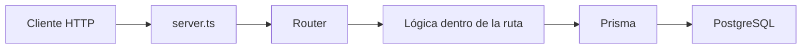
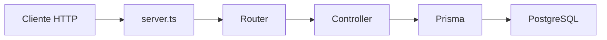
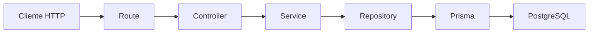
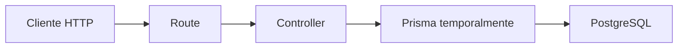

# Día 27: Controladores

En el día 26 empezamos la fase de arquitectura por capas.

El primer paso fue separar las rutas en una carpeta propia: `src/routes/`.

Creamos archivos como:

- `health.routes.ts`
- `debug-prisma.routes.ts`

Y dejamos `server.ts` más limpio, montando routers con `app.use`.

Ese cambio fue importante, pero todavía tenemos un problema: aunque las rutas ya están separadas, dentro de los archivos de rutas sigue habiendo demasiada lógica.

Por ejemplo, en `debug-prisma.routes.ts` todavía podemos tener código como:

```ts
debugPrismaRouter.get("/users/:id", async (req, res, next) => {
  try {
    const id = Number(req.params.id);

    if (Number.isNaN(id)) {
      return res.status(400).json({
        error: "El ID debe ser un número"
      });
    }

    const user = await prisma.user.findUnique({
      where: { id },
      select: userSafeSelect
    });

    if (!user) {
      return res.status(404).json({
        error: "Usuario no encontrado"
      });
    }

    return res.status(200).json({
      message: "Usuario encontrado con Prisma",
      data: user
    });
  } catch (error) {
    next(error);
  }
});
```

La ruta funciona, pero el archivo de rutas está haciendo demasiadas cosas:

- Lee parámetros.
- Valida datos.
- Consulta Prisma.
- Decide códigos de estado.
- Construye la respuesta.
- Gestiona errores.

Hoy vamos a mejorar esto creando **controladores**.

Un controlador es una función encargada de gestionar la petición HTTP y devolver una respuesta.

!!! info "Idea principal"
    La ruta decide qué endpoint existe; el controlador decide qué hacer cuando se llama a ese endpoint.

## ¿Qué vamos a trabajar hoy?

Hoy trabajaremos estos conceptos:

- Controladores.
- Separación de responsabilidades.
- `Request`.
- `Response`.
- `NextFunction`.
- Funciones controladoras.
- Route handler.
- `user.controller.ts`.
- `health.controller.ts`.
- Rutas más limpias.
- Preparación para servicios.
- Preparación para repositorios.

El producto del día será la carpeta `src/controllers` con controladores separados.

El resultado esperado será que los archivos de rutas queden más limpios.

## ¿Qué es un controlador?

Un controlador es una función que recibe una petición HTTP, ejecuta una acción y devuelve una respuesta.

En Express, un controlador suele tener esta forma:

```ts
function controller(req, res, next) {
  // lógica de la petición
}
```

Con TypeScript, lo escribiremos mejor así:

```ts
import { Request, Response, NextFunction } from "express";

export async function getUsers(
  req: Request,
  res: Response,
  next: NextFunction
) {
  try {
    // lógica
  } catch (error) {
    next(error);
  }
}
```

El controlador sigue trabajando con conceptos HTTP:

- `req`
- `res`
- `next`
- `status`
- `json`
- `params`
- `body`

Pero al separarlo del archivo de rutas, el proyecto queda más ordenado.

## Diferencia entre ruta y controlador

Una ruta define el método HTTP y la URL.

Ejemplo:

```ts
debugPrismaRouter.get("/users", getUsers);
```

El controlador define qué ocurre cuando se llama a esa ruta.

Ejemplo:

```ts
export async function getUsers(req, res, next) {
  // obtener usuarios y responder
}
```

Podemos resumirlo así:

| Elemento    | Responsabilidad                     |
| ----------- | ----------------------------------- |
| Ruta        | Define método y URL                 |
| Controlador | Gestiona la petición y la respuesta |
| Servicio    | Aplicará reglas de negocio          |
| Repositorio | Accederá a los datos                |
| Prisma      | Comunicará con PostgreSQL           |

Hoy solo crearemos la capa de controladores.

## Cómo queda el flujo después de hoy

Antes del día 27, el flujo era:



Después del día 27 será:



Todavía no es la arquitectura final.

Más adelante queremos llegar a esto:



Hoy añadimos la capa `Controller`.

## Qué debe hacer un controlador

Un controlador puede encargarse de:

- Leer `req.params`.
- Leer `req.body`.
- Leer `req.query`.
- Llamar a la lógica necesaria.
- Decidir el código HTTP.
- Enviar la respuesta JSON.
- Pasar errores al middleware con `next(error)`.

Ejemplo:

```ts
export async function getUserById(req, res, next) {
  try {
    const id = Number(req.params.id);

    if (Number.isNaN(id)) {
      return res.status(400).json({
        error: "El ID debe ser un número"
      });
    }

    // buscar usuario

    return res.status(200).json({
      message: "Usuario encontrado",
      data: user
    });
  } catch (error) {
    next(error);
  }
}
```

Esto sigue teniendo lógica mezclada, pero ya está mejor que tenerlo todo dentro del archivo de rutas.

## Qué no debería hacer un controlador en la arquitectura final

En una arquitectura más limpia, el controlador no debería cargar con todo.

No debería ser el lugar principal para:

- Aplicar toda la lógica de negocio.
- Decidir si un email está duplicado.
- Consultar directamente todos los datos.
- Contener validaciones largas.
- Conocer demasiados detalles de Prisma.

Eso lo iremos moviendo en próximos días.

La progresión será:

| Día | Capa |
| --- | --- |
| Día 27 | Controladores |
| Día 28 | Servicios |
| Día 29 | Repositorios con Prisma |
| Día 30 | CRUD persistente ordenado |

Hoy aceptaremos que el controlador todavía use Prisma directamente, porque estamos en una transición.

## Qué vamos a crear hoy

Crearemos una carpeta: `src/controllers/`.

Y dentro:

- `health.controller.ts`
- `user.controller.ts`

La estructura quedará así:

```text
src/
  prisma.ts
  server.ts
  routes/
    health.routes.ts
    debug-prisma.routes.ts
  controllers/
    health.controller.ts
    user.controller.ts
```

El archivo `health.controller.ts` gestionará la respuesta de salud.

El archivo `user.controller.ts` gestionará temporalmente las rutas de usuario que ahora están en `debug-prisma.routes.ts`.

Más adelante, este controlador evolucionará para trabajar con servicios.

## Parte guiada

### Paso 1: Abrir el proyecto

Abre una terminal y entra en el repositorio:

```bash
cd usermanager-api
```

Comprueba que tienes una estructura parecida a:

```text
src/
  prisma.ts
  server.ts
  routes/
    health.routes.ts
    debug-prisma.routes.ts
```

### Paso 2: Crear la carpeta `controllers`

Dentro de `src/`, crea una carpeta:

```text
src/controllers/
```

La estructura quedará así:

```text
src/
  controllers/
  routes/
  prisma.ts
  server.ts
```

### Paso 3: Crear `health.controller.ts`

Dentro de `src/controllers/`, crea:

```text
src/controllers/health.controller.ts
```

Añade:

```ts
import { Request, Response } from "express";

export function getHealth(req: Request, res: Response) {
  return res.status(200).json({
    status: "ok",
    message: "UserManager API funcionando",
    timestamp: new Date().toISOString()
  });
}
```

Este controlador se encarga de responder a la ruta de salud.

### Paso 4: Modificar `health.routes.ts`

Abre:

```text
src/routes/health.routes.ts
```

Antes podía tener algo así:

```ts
import { Router } from "express";

export const healthRouter = Router();

healthRouter.get("/", (req, res) => {
  return res.status(200).json({
    status: "ok",
    message: "UserManager API funcionando",
    timestamp: new Date().toISOString()
  });
});
```

Ahora lo dejaremos así:

```ts
import { Router } from "express";
import { getHealth } from "../controllers/health.controller";

export const healthRouter = Router();

healthRouter.get("/", getHealth);
```

Mucho más limpio.

La ruta solo dice:

Cuando llegue `GET /`, ejecuta `getHealth`.

### Paso 5: Crear `user.controller.ts`

Dentro de `src/controllers/`, crea:

```text
src/controllers/user.controller.ts
```

Este archivo contendrá funciones relacionadas con usuarios.

De momento moveremos aquí las funciones temporales de debug con Prisma.

### Paso 6: Preparar imports en `user.controller.ts`

Añade:

```ts
import { Request, Response, NextFunction } from "express";
import { prisma } from "../prisma";
```

Necesitamos:

| Elemento | Para qué sirve |
| --- | --- |
| `Request` | Leer params, body o query |
| `Response` | Responder con status y json |
| `NextFunction` | Enviar errores al middleware |
| `prisma` | Consultar PostgreSQL |

### Paso 7: Añadir `userSafeSelect`

En `user.controller.ts`, añade:

```ts
const userSafeSelect = {
  id: true,
  name: true,
  email: true,
  role: true,
  isActive: true,
  createdAt: true,
  updatedAt: true
} as const;
```

Este selector evita devolver `passwordHash`.

!!! danger "Regla importante"
    Nunca se devuelve `passwordHash`.

### Paso 8: Crear controlador `getActiveUsers`

Añade:

```ts
export async function getActiveUsers(
  req: Request,
  res: Response,
  next: NextFunction
) {
  try {
    const users = await prisma.user.findMany({
      where: {
        isActive: true
      },
      select: userSafeSelect,
      orderBy: {
        id: "asc"
      }
    });

    return res.status(200).json({
      message: "Usuarios activos obtenidos con Prisma",
      total: users.length,
      data: users
    });
  } catch (error) {
    next(error);
  }
}
```

Este controlador usa:

- `findMany`
- `where`
- `select`
- `orderBy`

### Paso 9: Crear controlador `getUsers`

Añade:

```ts
export async function getUsers(
  req: Request,
  res: Response,
  next: NextFunction
) {
  try {
    const users = await prisma.user.findMany({
      select: userSafeSelect,
      orderBy: {
        id: "asc"
      }
    });

    return res.status(200).json({
      message: "Usuarios obtenidos con Prisma",
      total: users.length,
      data: users
    });
  } catch (error) {
    next(error);
  }
}
```

Este controlador lista todos los usuarios sin devolver `passwordHash`.

### Paso 10: Crear controlador `getUserById`

Añade:

```ts
export async function getUserById(
  req: Request,
  res: Response,
  next: NextFunction
) {
  try {
    const id = Number(req.params.id);

    if (Number.isNaN(id)) {
      return res.status(400).json({
        error: "El ID debe ser un número"
      });
    }

    const user = await prisma.user.findUnique({
      where: {
        id
      },
      select: userSafeSelect
    });

    if (!user) {
      return res.status(404).json({
        error: "Usuario no encontrado"
      });
    }

    return res.status(200).json({
      message: "Usuario encontrado con Prisma",
      data: user
    });
  } catch (error) {
    next(error);
  }
}
```

Este controlador gestiona tres casos:

| Caso | Código |
| --- | --- |
| ID no numérico | `400` |
| Usuario inexistente | `404` |
| Usuario encontrado | `200` |

### Paso 11: Crear controlador `createDebugUser`

Añade:

```ts
export async function createDebugUser(
  req: Request,
  res: Response,
  next: NextFunction
) {
  try {
    const { name, email, password } = req.body;

    if (!name || !email || !password) {
      return res.status(400).json({
        error: "name, email y password son obligatorios"
      });
    }

    const cleanName = String(name).trim();
    const cleanEmail = String(email).trim().toLowerCase();
    const cleanPassword = String(password).trim();

    if (cleanName.length === 0) {
      return res.status(400).json({
        error: "El nombre no puede estar vacío"
      });
    }

    if (!cleanEmail.includes("@") || !cleanEmail.includes(".")) {
      return res.status(400).json({
        error: "El email no tiene un formato válido"
      });
    }

    if (cleanPassword.length < 6) {
      return res.status(400).json({
        error: "La contraseña debe tener al menos 6 caracteres"
      });
    }

    const createdUser = await prisma.user.create({
      data: {
        name: cleanName,
        email: cleanEmail,
        passwordHash: `hash_temporal_${cleanPassword}`
      },
      select: userSafeSelect
    });

    return res.status(201).json({
      message: "Usuario creado con Prisma",
      data: createdUser
    });
  } catch (error: any) {
    if (error.code === "P2002") {
      return res.status(409).json({
        error: "El email ya está registrado"
      });
    }

    next(error);
  }
}
```

Este controlador todavía contiene bastante lógica.

Eso es normal en este día.

En los próximos días moveremos parte de esa lógica a:

- `services/`
- `repositories/`

### Paso 12: Revisar `user.controller.ts` completo

El archivo debería tener esta estructura:

```ts
import { Request, Response, NextFunction } from "express";
import { prisma } from "../prisma";

const userSafeSelect = {
  id: true,
  name: true,
  email: true,
  role: true,
  isActive: true,
  createdAt: true,
  updatedAt: true
} as const;

export async function getActiveUsers(
  req: Request,
  res: Response,
  next: NextFunction
) {
  // ...
}

export async function getUsers(
  req: Request,
  res: Response,
  next: NextFunction
) {
  // ...
}

export async function getUserById(
  req: Request,
  res: Response,
  next: NextFunction
) {
  // ...
}

export async function createDebugUser(
  req: Request,
  res: Response,
  next: NextFunction
) {
  // ...
}
```

### Paso 13: Modificar `debug-prisma.routes.ts`

Abre:

```text
src/routes/debug-prisma.routes.ts
```

Antes tenía la lógica completa de cada ruta.

Ahora debe importar los controladores.

Déjalo así:

```ts
import { Router } from "express";
import {
  createDebugUser,
  getActiveUsers,
  getUserById,
  getUsers
} from "../controllers/user.controller";

export const debugPrismaRouter = Router();

debugPrismaRouter.get("/users-active", getActiveUsers);

debugPrismaRouter.get("/users", getUsers);

debugPrismaRouter.get("/users/:id", getUserById);

debugPrismaRouter.post("/users", createDebugUser);
```

Observa que este archivo ya no importa:

```ts
prisma
```

Y tampoco contiene consultas Prisma directamente.

### Paso 14: Revisar el orden de rutas

El orden sigue siendo importante.

Esta ruta debe ir antes:

```ts
debugPrismaRouter.get("/users-active", getActiveUsers);
```

Que esta:

```ts
debugPrismaRouter.get("/users/:id", getUserById);
```

Si la ruta con `:id` va antes, Express podría interpretar `users-active` como un parámetro.

### Paso 15: Revisar `server.ts`

`server.ts` no debería cambiar mucho respecto al día 26.

Debe seguir montando los routers:

```ts
app.use("/api/health", healthRouter);
app.use("/api/debug/prisma", debugPrismaRouter);
```

La estructura ideal de `server.ts` es:

```ts
import express from "express";
import { healthRouter } from "./routes/health.routes";
import { debugPrismaRouter } from "./routes/debug-prisma.routes";

const app = express();
const PORT = process.env.PORT || 3000;

app.use(express.json());

app.use("/api/health", healthRouter);
app.use("/api/debug/prisma", debugPrismaRouter);

// Middlewares de 404 y error, si ya existen

app.listen(PORT, () => {
  console.log(`Servidor escuchando en http://localhost:${PORT}`);
});
```

Si ya tienes middleware de errores, recuerda mantenerlo después de las rutas.

### Paso 16: Probar que todo sigue funcionando

Arranca la API:

```bash
npm run dev
```

Prueba:

- `GET http://localhost:3000/api/health`
- `GET http://localhost:3000/api/debug/prisma/users`
- `GET http://localhost:3000/api/debug/prisma/users-active`
- `GET http://localhost:3000/api/debug/prisma/users/1`

Prueba también la creación: `POST http://localhost:3000/api/debug/prisma/users`.

Body:

```json
{
  "name": "Usuario Controller",
  "email": "usuario.controller@email.com",
  "password": "123456"
}
```

Si todo responde igual que antes, la extracción a controladores ha funcionado.

### Paso 17: Comprobar con Prisma Studio

Abre Prisma Studio:

```bash
npm run prisma:studio
```

Comprueba que el usuario creado aparece en la tabla:

`User`.

Esto confirma que el controlador sigue usando Prisma correctamente.

### Paso 18: Comparar antes y después

Antes:

```ts
debugPrismaRouter.get("/users", async (req, res, next) => {
  // toda la lógica aquí
});
```

Después:

```ts
debugPrismaRouter.get("/users", getUsers);
```

Y la lógica está en:

`src/controllers/user.controller.ts`.

Esto mejora la legibilidad del archivo de rutas.

### Paso 19: Crear el documento del día 27

Dentro de la carpeta `docs/`, crea:

```text
docs/dia-27-controladores.md
```

Añade este contenido inicial:

````md
# Día 27 - Controladores

## Qué he hecho

- He creado la carpeta src/controllers.
- He creado health.controller.ts.
- He movido la lógica de GET /api/health a getHealth.
- He creado user.controller.ts.
- He movido la lógica de usuarios a funciones controladoras.
- He simplificado health.routes.ts.
- He simplificado debug-prisma.routes.ts.
- He comprobado que las rutas siguen funcionando.
- He comprobado que los datos siguen llegando a PostgreSQL mediante Prisma.

## Archivos creados

```text
src/controllers/health.controller.ts
src/controllers/user.controller.ts
```

## Estructura actual

```text
src/
  prisma.ts
  server.ts
  routes/
    health.routes.ts
    debug-prisma.routes.ts
  controllers/
    health.controller.ts
    user.controller.ts
```

## Controladores creados

| Controlador | Función |
| --- | --- |
| `getHealth` | Devuelve el estado de la API |
| `getUsers` | Lista usuarios |
| `getActiveUsers` | Lista usuarios activos |
| `getUserById` | Busca un usuario por ID |
| `createDebugUser` | Crea un usuario temporal con Prisma |

## Antes y después

Antes:

```ts
debugPrismaRouter.get("/users", async (req, res, next) => {
  // lógica completa aquí
});
```

Después:

```ts
debugPrismaRouter.get("/users", getUsers);
```

## Explicación personal

Los controladores permiten separar la definición de rutas de la lógica que responde a cada petición. Esto hace que los archivos de rutas sean más fáciles de leer y prepara el proyecto para añadir servicios y repositorios.
````

### Paso 20: Añadir diagrama Mermaid

Añade al documento:



Explicación sugerida:

```md
En este día el controlador todavía usa Prisma directamente. En los próximos días se añadirá una capa de servicio y una capa de repositorio para separar mejor las responsabilidades.
```

### Paso 21: Actualizar el README

Añade una sección al README:

````md
## Controladores

El proyecto empieza a separar la lógica HTTP en controladores.

Carpeta creada:

```text
src/controllers/
```

Archivos actuales:

```text
src/controllers/health.controller.ts
src/controllers/user.controller.ts
```

Ejemplo de ruta simplificada:

```ts
debugPrismaRouter.get("/users", getUsers);
```

La lógica de la petición queda en el controlador:

```text
getUsers
getUserById
createDebugUser
```

Esta separación prepara el proyecto para añadir servicios y repositorios.
````

### Paso 22: Actualizar el índice del README

Añade el enlace:

```md
- [Día 27 - Controladores](docs/dia-27-controladores.md)
```

El bloque debería quedar parecido a:

```md
## Documentación del reto

- [Día 1 - Diseño inicial](docs/dia-01-diseno-inicial.md)
- [Día 2 - Preparación del proyecto](docs/dia-02-preparacion-proyecto.md)
- [Día 3 - Primer endpoint](docs/dia-03-primer-endpoint.md)
- [Día 4 - Métodos HTTP](docs/dia-04-metodos-http.md)
- [Día 5 - JSON, body, params y headers](docs/dia-05-json-body-params-headers.md)
- [Día 6 - Cliente HTTP y depuración](docs/dia-06-cliente-http-depuracion.md)
- [Día 7 - Listado de usuarios en memoria](docs/dia-07-listado-usuarios.md)
- [Día 8 - Consultar usuario por ID](docs/dia-08-consultar-usuario-id.md)
- [Día 9 - Crear usuarios en memoria](docs/dia-09-crear-usuarios.md)
- [Día 10 - Actualizar usuarios en memoria](docs/dia-10-actualizar-usuarios.md)
- [Día 11 - Eliminar o desactivar usuarios en memoria](docs/dia-11-eliminar-desactivar-usuarios.md)
- [Día 12 - Validación manual básica](docs/dia-12-validacion-manual-basica.md)
- [Día 13 - Validación de email y duplicados](docs/dia-13-validacion-email-duplicados.md)
- [Día 14 - Códigos de estado HTTP](docs/dia-14-codigos-estado-http.md)
- [Día 15 - Middleware centralizado de errores](docs/dia-15-middleware-errores.md)
- [Día 16 - Base de datos y persistencia](docs/dia-16-base-datos-persistencia.md)
- [Día 17 - PostgreSQL con Docker Compose](docs/dia-17-postgresql-docker-compose.md)
- [Día 18 - Diseño del modelo persistente User](docs/dia-18-diseno-modelo-persistente-user.md)
- [Día 19 - ORM o acceso a datos](docs/dia-19-orm-acceso-datos.md)
- [Día 20 - Instalación y configuración inicial de Prisma](docs/dia-20-instalacion-prisma.md)
- [Día 21 - Modelo Prisma User](docs/dia-21-modelo-prisma-user.md)
- [Día 22 - Primera migración con Prisma](docs/dia-22-primera-migracion-prisma.md)
- [Día 23 - Prisma Studio](docs/dia-23-prisma-studio.md)
- [Día 24 - Seed de datos iniciales](docs/dia-24-seed-datos-iniciales.md)
- [Día 25 - Consultas básicas con Prisma Client](docs/dia-25-consultas-basicas-prisma.md)
- [Día 26 - Separar rutas](docs/dia-26-separar-rutas.md)
- [Día 27 - Controladores](docs/dia-27-controladores.md)
```

### Paso 23: Guardar cambios en Git

Comprueba los cambios:

```bash
git status
```

Añade los archivos:

```bash
git add .
```

Crea un commit:

```bash
git commit -m "Dia 27 - Crear controladores"
```

Sube los cambios:

```bash
git push
```

## Problemas frecuentes

### Error de importación del controlador

Desde `debug-prisma.routes.ts`, el import debe subir un nivel:

```ts
import { getUsers } from "../controllers/user.controller";
```

Porque el archivo está en:

```text
src/routes/
```

Y los controladores están en:

```text
src/controllers/
```

### La ruta funciona antes pero ahora da error

Comprueba que el controlador está exportado:

```ts
export async function getUsers(...)
```

Y que en la ruta está importado con el mismo nombre.

### `req`, `res` o `next` dan errores de tipo

Asegúrate de importar los tipos:

```ts
import { Request, Response, NextFunction } from "express";
```

### `passwordHash` aparece en la respuesta

Revisa que el controlador usa:

```ts
select: userSafeSelect
```

No uses consultas sin `select`.

### `users-active` se interpreta como ID

Revisa el orden en `debug-prisma.routes.ts`:

```ts
debugPrismaRouter.get("/users-active", getActiveUsers);
debugPrismaRouter.get("/users/:id", getUserById);
```

Las rutas concretas deben ir antes que las dinámicas.

### El controlador está haciendo demasiadas cosas

Es cierto.

En este punto todavía es normal.

El siguiente paso será crear servicios para mover parte de la lógica fuera del controlador.

## Parte libre

### Tarea libre 1: Crear controlador para `auth`

Crea el archivo:

```text
src/controllers/auth.controller.ts
```

Añade una función temporal:

```ts
import { Request, Response } from "express";

export function authDebug(req: Request, res: Response) {
  return res.status(200).json({
    message: "Auth controller preparado"
  });
}
```

Si en el día 26 creaste `auth.routes.ts`, úsalo ahí.

### Tarea libre 2: Crear tabla de responsabilidades

Añade al documento:

| Archivo                  | Responsabilidad                    |
| ------------------------ | ---------------------------------- |
| `server.ts`              | Configura Express y monta routers  |
| `health.routes.ts`       | Define rutas de health             |
| `health.controller.ts`   | Responde al health check           |
| `debug-prisma.routes.ts` | Define rutas temporales de usuario |
| `user.controller.ts`     | Gestiona las peticiones de usuario |

### Tarea libre 3: Explicar qué es un controlador

Añade una sección:

```md
## Qué es un controlador
```

Explícalo con tus palabras.

Idea orientativa:

> Un controlador es la función que recibe una petición HTTP, llama a la lógica necesaria y devuelve una respuesta al cliente.

### Tarea libre 4: Identificar lógica pendiente de mover

En `user.controller.ts`, localiza qué partes todavía podrían moverse a un servicio.

Ejemplos:

- Validar `name`, `email` y `password`.
- Normalizar `email`.
- Comprobar longitud de `password`.
- Decidir cómo crear `passwordHash`.
- Gestionar email duplicado.

Documenta esta lista para preparar el día 28.

### Tarea libre 5: Comparar routes y controllers

Completa esta tabla:

| Capa              | Qué sabe               | Qué no debería saber          |
| ----------------- | ---------------------- | ----------------------------- |
| Route             | URL y método HTTP      | Lógica interna compleja       |
| Controller        | req, res, status, json | Detalles profundos de negocio |
| Service futuro    | Reglas de negocio      | Detalles de Express           |
| Repository futuro | Acceso a datos         | Reglas HTTP                   |

## Entrega recomendada del día 27

Las respuestas no se entregan como archivo suelto. Deben quedar dentro del repositorio de GitHub.

Al finalizar el día 27, el repositorio debería tener esta estructura aproximada:

```text
usermanager-api/
  .env.example
  .gitignore
  docker-compose.yml
  README.md
  package.json
  package-lock.json
  tsconfig.json
  prisma/
    schema.prisma
    seed.ts
    migrations/
      <timestamp>_init/
        migration.sql
  src/
    prisma.ts
    server.ts
    routes/
      health.routes.ts
      debug-prisma.routes.ts
    controllers/
      health.controller.ts
      user.controller.ts
  docs/
    dia-01-diseno-inicial.md
    dia-02-preparacion-proyecto.md
    dia-03-primer-endpoint.md
    dia-04-metodos-http.md
    dia-05-json-body-params-headers.md
    dia-06-cliente-http-depuracion.md
    dia-07-listado-usuarios.md
    dia-08-consultar-usuario-id.md
    dia-09-crear-usuarios.md
    dia-10-actualizar-usuarios.md
    dia-11-eliminar-desactivar-usuarios.md
    dia-12-validacion-manual-basica.md
    dia-13-validacion-email-duplicados.md
    dia-14-codigos-estado-http.md
    dia-15-middleware-errores.md
    dia-16-base-datos-persistencia.md
    dia-17-postgresql-docker-compose.md
    dia-18-diseno-modelo-persistente-user.md
    dia-19-orm-acceso-datos.md
    dia-20-instalacion-prisma.md
    dia-21-modelo-prisma-user.md
    dia-22-primera-migracion-prisma.md
    dia-23-prisma-studio.md
    dia-24-seed-datos-iniciales.md
    dia-25-consultas-basicas-prisma.md
    dia-26-separar-rutas.md
    dia-27-controladores.md
```

El documento del día 27 deberá estar en:

```text
docs/dia-27-controladores.md
```

Y deberá incluir:

- Resumen de lo realizado.
- Archivos creados.
- Estructura actual.
- Controladores creados.
- Antes y después.
- Diagrama de flujo.
- Tabla de responsabilidades.
- Explicación de qué es un controlador.
- Lógica pendiente de mover a servicios.
- Comparación entre routes y controllers.

En el foro, se compartirá el enlace actualizado al repositorio.

Ejemplo de mensaje:

```text
Hola, comparto el avance del día 27 del reto UserManager API:

https://github.com/usuario/usermanager-api

He creado la capa de controladores y he movido la lógica HTTP fuera de las rutas. La documentación está en:

docs/dia-27-controladores.md
```

## Cierre del día

Hoy hemos añadido una nueva capa al proyecto: los controladores.

Las rutas ya no contienen toda la lógica de cada endpoint. Ahora se limitan a asociar una URL y un método HTTP con una función controladora.

Hoy hemos trabajado:

- Controladores.
- `Request`.
- `Response`.
- `NextFunction`.
- `health.controller.ts`.
- `user.controller.ts`.
- Separación de responsabilidades.
- Rutas más limpias.
- Preparación para servicios.

El proyecto empieza a parecerse más a una API real.

Todavía queda trabajo por hacer: los controladores siguen teniendo lógica de negocio y consultas a Prisma. Pero eso es justamente lo que resolveremos en los próximos días.

!!! success "Idea clave"
    Un controlador no crea nuevas funcionalidades por sí mismo, pero organiza mejor cómo se atienden las peticiones HTTP y prepara el camino hacia una arquitectura más mantenible.
