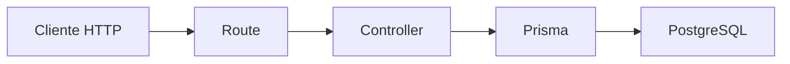
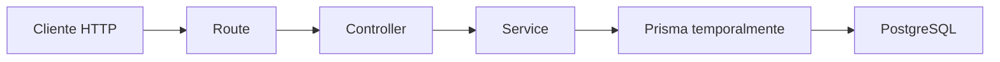
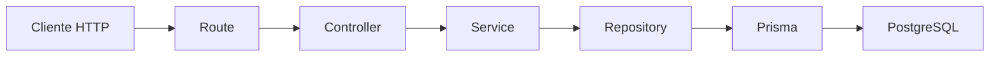
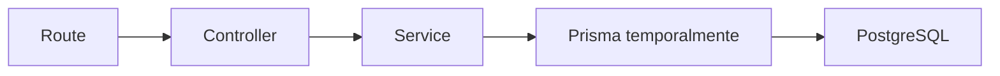

# Día 28: Servicios

En el día 27 creamos la capa de controladores.

Antes, nuestras rutas tenían demasiada lógica dentro:

```ts
debugPrismaRouter.get("/users/:id", async (req, res, next) => {
  // leer params
  // validar id
  // consultar Prisma
  // comprobar si existe
  // responder con JSON
});
```

Después del día 27, las rutas quedaron más limpias:

```ts
debugPrismaRouter.get("/users/:id", getUserById);
```

Y la lógica pasó a los controladores: `src/controllers/user.controller.ts`.

Eso fue un buen avance, pero todavía tenemos un problema.

Ahora el controlador hace demasiadas cosas:

- Lee datos de la petición.
- Valida campos.
- Normaliza email.
- Comprueba errores.
- Consulta Prisma.
- Decide qué hacer si el usuario no existe.
- Crea usuarios.
- Gestiona reglas de negocio.
- Devuelve respuestas HTTP.

El controlador debería estar centrado en HTTP:

- `req`
- `res`
- `status`
- `json`
- `params`
- `body`
- `next`

Pero no debería acumular toda la lógica interna de la aplicación.

Hoy vamos a crear una nueva capa: `services/`.

Un servicio contiene la lógica de negocio de la aplicación.

!!! info "Idea principal"
    El controlador habla HTTP; el servicio aplica reglas de negocio.

## ¿Qué vamos a trabajar hoy?

Hoy trabajaremos estos conceptos:

- Servicios.
- Lógica de negocio.
- Separación de responsabilidades.
- `user.service.ts`.
- Funciones de servicio.
- Validación de datos.
- Normalización de email.
- Reglas de usuario.
- Controladores más limpios.
- Preparación para repositorios.

El producto del día será la carpeta `src/services` con `user.service.ts`.

El resultado esperado será que el controlador de usuarios quede más limpio y delegue parte de la lógica en el servicio.

## ¿Qué es un servicio?

Un servicio es una capa que contiene lógica de negocio.

La lógica de negocio son las reglas propias de la aplicación.

En nuestro caso, algunas reglas son:

- El email debe normalizarse.
- El email no puede repetirse.
- El usuario debe existir para consultarlo.
- La contraseña debe tener una longitud mínima.
- Un usuario se crea activo por defecto.
- Un usuario no debe devolver `passwordHash`.

Algunas de estas reglas ya las estamos aplicando, pero ahora están mezcladas dentro del controlador.

El servicio nos ayuda a sacar esa lógica fuera.

## Diferencia entre controlador y servicio

Podemos verlo así:

| Capa       | Qué debe hacer                                       | Qué debería evitar                      |
| ---------- | ---------------------------------------------------- | --------------------------------------- |
| Route      | Definir URL y método HTTP                            | Validar datos o consultar base de datos |
| Controller | Leer `req`, llamar al servicio y responder con `res` | Contener toda la lógica de negocio      |
| Service    | Aplicar reglas de negocio                            | Saber demasiado de Express              |
| Repository | Acceder a la base de datos                           | Decidir códigos HTTP                    |
| Prisma     | Comunicarse con PostgreSQL                           | Gestionar reglas de negocio             |

Hoy añadimos la capa `Service`.

Todavía no tendremos repositorios.

Eso llegará en el día 29.

## Cómo queda el flujo después de hoy

Antes del día 28 teníamos:



Después del día 28 tendremos:



Prisma todavía estará dentro del servicio de forma temporal.

En el día 29 lo moveremos a una nueva capa: `repositories/`.

La arquitectura final será:



Hoy nos quedamos en el paso intermedio.

## Qué debe hacer un servicio

Un servicio puede encargarse de:

- Validar reglas de negocio.
- Normalizar datos.
- Comprobar si un usuario existe.
- Comprobar si un email ya está registrado.
- Crear objetos con la forma correcta.
- Decidir qué hacer en casos de error.
- Llamar temporalmente a Prisma.

Un servicio no debería depender directamente de `req` ni de `res`.

Es decir, en un servicio no queremos trabajar con:

- `req.params`
- `req.body`
- `res.status`
- `res.json`
- `next`

Eso pertenece al controlador.

En cambio, un servicio debería recibir datos normales:

```ts
getUserByIdService(id: number)
```

O:

```ts
createUserService({
  name,
  email,
  password
})
```

## Qué hará hoy `user.service.ts`

Hoy crearemos `src/services/user.service.ts`.

Y moveremos allí funciones como:

- `getUsersService`
- `getActiveUsersService`
- `getUserByIdService`
- `createDebugUserService`

El controlador seguirá decidiendo los códigos HTTP y la respuesta JSON.

El servicio devolverá datos o lanzará errores sencillos.

Hoy el servicio todavía usará Prisma directamente.

Ejemplo:

```ts
export async function getUsersService() {
  return prisma.user.findMany({
    select: userSafeSelect,
    orderBy: {
      id: "asc"
    }
  });
}
```

Más adelante, cuando creemos repositorios, el servicio dejará de llamar directamente a Prisma.

## ¿Cómo gestionaremos errores hoy?

De momento usaremos errores sencillos con `Error`.

Por ejemplo:

```ts
throw new Error("Usuario no encontrado");
```

Pero esto tiene una limitación: un `Error` normal no sabe si debe responder con `400`, `404` o `409`.

Si ya tienes una clase `AppError` del día 15, puedes usarla.

Ejemplo:

```ts
throw new AppError("Usuario no encontrado", 404);
```

Para mantener el día más claro, trabajaremos con una versión sencilla de `AppError`.

Si ya la tienes creada en otro archivo, puedes reutilizarla.

Si todavía no está separada, hoy podemos dejarla en el controlador o crear una carpeta `errors`.

## Mejor opción para este día

Para que el proyecto avance de forma ordenada, hoy haremos dos cosas:

- Crear `src/services/user.service.ts`.
- Crear `src/errors/AppError.ts`.

Así el servicio podrá lanzar errores con código HTTP.

La estructura quedará:

```text
src/
  controllers/
    health.controller.ts
    user.controller.ts
  errors/
    AppError.ts
  routes/
    health.routes.ts
    debug-prisma.routes.ts
  services/
    user.service.ts
  prisma.ts
  server.ts
```

Esto prepara muy bien el trabajo de los próximos días.

## Parte guiada

### Paso 1: Abrir el proyecto

Abre una terminal y entra en el repositorio:

```bash
cd usermanager-api
```

Comprueba que tienes:

```text
src/
  controllers/
  routes/
  prisma.ts
  server.ts
```

### Paso 2: Crear la carpeta `services`

Dentro de `src/`, crea:

```text
src/services/
```

La estructura quedará así:

```text
src/
  controllers/
  routes/
  services/
  prisma.ts
  server.ts
```

### Paso 3: Crear la carpeta `errors`

Dentro de `src/`, crea:

```text
src/errors/
```

La estructura quedará así:

```text
src/
  controllers/
  errors/
  routes/
  services/
  prisma.ts
  server.ts
```

### Paso 4: Crear `AppError.ts`

Dentro de `src/errors/`, crea:

```text
src/errors/AppError.ts
```

Añade:

```ts
export class AppError extends Error {
  statusCode: number;
  details?: unknown;

  constructor(message: string, statusCode: number = 500, details?: unknown) {
    super(message);
    this.statusCode = statusCode;
    this.details = details;
  }
}
```

Esta clase nos permite crear errores con código HTTP.

Ejemplo:

```ts
throw new AppError("Usuario no encontrado", 404);
```

### Paso 5: Revisar el middleware de errores

Si ya tienes un middleware de errores del día 15, asegúrate de que pueda trabajar con `AppError`.

Una versión posible sería:

```ts
import { Request, Response, NextFunction } from "express";
import { AppError } from "../errors/AppError";

export function errorMiddleware(
  err: Error | AppError,
  req: Request,
  res: Response,
  _next: NextFunction
) {
  const isAppError = err instanceof AppError;
  const statusCode = isAppError ? err.statusCode : 500;
  const details = isAppError ? err.details : undefined;

  return res.status(statusCode).json({
    error: isAppError ? err.message : "Error interno del servidor",
    statusCode,
    details,
    path: req.originalUrl,
    method: req.method,
    timestamp: new Date().toISOString()
  });
}
```

Si todavía no has separado el middleware de errores en un archivo, no pasa nada. Lo importante hoy es entender que `AppError` permitirá al servicio comunicar errores al controlador y al middleware.

### Paso 6: Crear `user.service.ts`

Dentro de `src/services/`, crea:

```text
src/services/user.service.ts
```

Añade los imports:

```ts
import { prisma } from "../prisma";
import { AppError } from "../errors/AppError";
```

### Paso 7: Añadir `userSafeSelect`

En `user.service.ts`, añade:

```ts
const userSafeSelect = {
  id: true,
  name: true,
  email: true,
  role: true,
  isActive: true,
  createdAt: true,
  updatedAt: true
} as const;
```

Este selector seguirá evitando que se devuelva `passwordHash`.

Más adelante podremos mover este mapper o selector a una carpeta de DTOs.

### Paso 8: Crear un tipo de entrada para crear usuario

Añade:

```ts
type CreateDebugUserInput = {
  name: unknown;
  email: unknown;
  password: unknown;
};
```

Usamos `unknown` porque los datos llegan desde el body y no debemos confiar en ellos directamente.

El servicio se encargará de validarlos.

### Paso 9: Crear funciones auxiliares

Añade estas funciones:

```ts
function isNonEmptyString(value: unknown): value is string {
  return typeof value === "string" && value.trim().length > 0;
}

function normalizeEmail(email: string): string {
  return email.trim().toLowerCase();
}

function isValidBasicEmail(email: string): boolean {
  return email.includes("@") && email.includes(".");
}
```

Estas funciones ya las hemos usado en días anteriores.

Ahora empiezan a vivir dentro del servicio, porque forman parte de la lógica de usuario.

### Paso 10: Crear `getUsersService`

Añade:

```ts
export async function getUsersService() {
  return prisma.user.findMany({
    select: userSafeSelect,
    orderBy: {
      id: "asc"
    }
  });
}
```

Esta función obtiene todos los usuarios de forma segura.

### Paso 11: Crear `getActiveUsersService`

Añade:

```ts
export async function getActiveUsersService() {
  return prisma.user.findMany({
    where: {
      isActive: true
    },
    select: userSafeSelect,
    orderBy: {
      id: "asc"
    }
  });
}
```

Esta función aplica una regla sencilla:

!!! tip "Regla aplicada"
    Solo devolver usuarios activos.

### Paso 12: Crear `getUserByIdService`

Añade:

```ts
export async function getUserByIdService(id: number) {
  const user = await prisma.user.findUnique({
    where: {
      id
    },
    select: userSafeSelect
  });

  if (!user) {
    throw new AppError("Usuario no encontrado", 404, { id });
  }

  return user;
}
```

Observa que el servicio no recibe `req`.

Solo recibe:

`id: number`.

Y si el usuario no existe, lanza un error de aplicación.

### Paso 13: Crear `createDebugUserService`

Añade:

```ts
export async function createDebugUserService(input: CreateDebugUserInput) {
  const { name, email, password } = input;

  if (!isNonEmptyString(name)) {
    throw new AppError("El nombre debe ser un texto no vacío", 400);
  }

  if (!isNonEmptyString(email)) {
    throw new AppError("El email debe ser un texto no vacío", 400);
  }

  if (!isNonEmptyString(password)) {
    throw new AppError("La contraseña debe ser un texto no vacío", 400);
  }

  const cleanName = name.trim();
  const cleanEmail = normalizeEmail(email);
  const cleanPassword = password.trim();

  if (!isValidBasicEmail(cleanEmail)) {
    throw new AppError("El email no tiene un formato válido", 400);
  }

  if (cleanPassword.length < 6) {
    throw new AppError("La contraseña debe tener al menos 6 caracteres", 400);
  }

  try {
    return await prisma.user.create({
      data: {
        name: cleanName,
        email: cleanEmail,
        passwordHash: `hash_temporal_${cleanPassword}`
      },
      select: userSafeSelect
    });
  } catch (error: any) {
    if (error.code === "P2002") {
      throw new AppError("El email ya está registrado", 409, {
        email: cleanEmail
      });
    }

    throw error;
  }
}
```

Ahora la validación ya no estará en el controlador.

El servicio se encarga de:

- Validar `name`.
- Validar `email`.
- Validar `password`.
- Normalizar `email`.
- Crear `passwordHash` temporal.
- Crear usuario con Prisma.
- Gestionar email duplicado.

### Paso 14: Revisar `user.service.ts` completo

El archivo debería tener una estructura parecida a esta:

```ts
import { prisma } from "../prisma";
import { AppError } from "../errors/AppError";

const userSafeSelect = {
  id: true,
  name: true,
  email: true,
  role: true,
  isActive: true,
  createdAt: true,
  updatedAt: true
} as const;

type CreateDebugUserInput = {
  name: unknown;
  email: unknown;
  password: unknown;
};

function isNonEmptyString(value: unknown): value is string {
  return typeof value === "string" && value.trim().length > 0;
}

function normalizeEmail(email: string): string {
  return email.trim().toLowerCase();
}

function isValidBasicEmail(email: string): boolean {
  return email.includes("@") && email.includes(".");
}

export async function getUsersService() {
  // ...
}

export async function getActiveUsersService() {
  // ...
}

export async function getUserByIdService(id: number) {
  // ...
}

export async function createDebugUserService(input: CreateDebugUserInput) {
  // ...
}
```

### Paso 15: Modificar `user.controller.ts`

Ahora el controlador debe llamar al servicio.

Abre:

```text
src/controllers/user.controller.ts
```

Elimina el import de Prisma:

```ts
import { prisma } from "../prisma";
```

Y añade:

```ts
import {
  createDebugUserService,
  getActiveUsersService,
  getUserByIdService,
  getUsersService
} from "../services/user.service";
```

### Paso 16: Modificar `getUsers`

Sustituye el controlador `getUsers` por:

```ts
export async function getUsers(
  req: Request,
  res: Response,
  next: NextFunction
) {
  try {
    const users = await getUsersService();

    return res.status(200).json({
      message: "Usuarios obtenidos con Prisma",
      total: users.length,
      data: users
    });
  } catch (error) {
    next(error);
  }
}
```

Ahora el controlador ya no sabe cómo se consultan los usuarios.

Solo sabe que llama a:

`getUsersService()`.

### Paso 17: Modificar `getActiveUsers`

Sustituye por:

```ts
export async function getActiveUsers(
  req: Request,
  res: Response,
  next: NextFunction
) {
  try {
    const users = await getActiveUsersService();

    return res.status(200).json({
      message: "Usuarios activos obtenidos con Prisma",
      total: users.length,
      data: users
    });
  } catch (error) {
    next(error);
  }
}
```

### Paso 18: Modificar `getUserById`

Sustituye por:

```ts
export async function getUserById(
  req: Request,
  res: Response,
  next: NextFunction
) {
  try {
    const id = Number(req.params.id);

    if (Number.isNaN(id)) {
      throw new AppError("El ID debe ser un número", 400, {
        received: req.params.id
      });
    }

    const user = await getUserByIdService(id);

    return res.status(200).json({
      message: "Usuario encontrado con Prisma",
      data: user
    });
  } catch (error) {
    next(error);
  }
}
```

Importante: este controlador necesita importar `AppError`:

```ts
import { AppError } from "../errors/AppError";
```

Aquí el controlador sigue validando que el parámetro `id` sea numérico porque eso está muy ligado a HTTP y a `req.params`.

La comprobación de si el usuario existe está en el servicio.

### Paso 19: Modificar `createDebugUser`

Sustituye por:

```ts
export async function createDebugUser(
  req: Request,
  res: Response,
  next: NextFunction
) {
  try {
    const createdUser = await createDebugUserService(req.body);

    return res.status(201).json({
      message: "Usuario creado con Prisma",
      data: createdUser
    });
  } catch (error) {
    next(error);
  }
}
```

Observa la diferencia.

Antes el controlador tenía mucha lógica de validación.

Ahora solo hace:

- Llama al servicio.
- Devuelve respuesta `201`.
- Pasa errores al middleware.

### Paso 20: Revisar `user.controller.ts` completo

El archivo debería quedar mucho más limpio:

```ts
import { Request, Response, NextFunction } from "express";
import { AppError } from "../errors/AppError";
import {
  createDebugUserService,
  getActiveUsersService,
  getUserByIdService,
  getUsersService
} from "../services/user.service";

export async function getActiveUsers(
  req: Request,
  res: Response,
  next: NextFunction
) {
  try {
    const users = await getActiveUsersService();

    return res.status(200).json({
      message: "Usuarios activos obtenidos con Prisma",
      total: users.length,
      data: users
    });
  } catch (error) {
    next(error);
  }
}

export async function getUsers(
  req: Request,
  res: Response,
  next: NextFunction
) {
  try {
    const users = await getUsersService();

    return res.status(200).json({
      message: "Usuarios obtenidos con Prisma",
      total: users.length,
      data: users
    });
  } catch (error) {
    next(error);
  }
}

export async function getUserById(
  req: Request,
  res: Response,
  next: NextFunction
) {
  try {
    const id = Number(req.params.id);

    if (Number.isNaN(id)) {
      throw new AppError("El ID debe ser un número", 400, {
        received: req.params.id
      });
    }

    const user = await getUserByIdService(id);

    return res.status(200).json({
      message: "Usuario encontrado con Prisma",
      data: user
    });
  } catch (error) {
    next(error);
  }
}

export async function createDebugUser(
  req: Request,
  res: Response,
  next: NextFunction
) {
  try {
    const createdUser = await createDebugUserService(req.body);

    return res.status(201).json({
      message: "Usuario creado con Prisma",
      data: createdUser
    });
  } catch (error) {
    next(error);
  }
}
```

### Paso 21: Comprobar rutas

Arranca la API:

```bash
npm run dev
```

Prueba:

- `GET http://localhost:3000/api/debug/prisma/users`
- `GET http://localhost:3000/api/debug/prisma/users-active`
- `GET http://localhost:3000/api/debug/prisma/users/1`
- `GET http://localhost:3000/api/debug/prisma/users/999`
- `GET http://localhost:3000/api/debug/prisma/users/abc`

Y prueba crear usuario: `POST http://localhost:3000/api/debug/prisma/users`.

Body:

```json
{
  "name": "Usuario Service",
  "email": "usuario.service@email.com",
  "password": "123456"
}
```

### Paso 22: Probar errores

Prueba estos casos:

### Email duplicado

```json
{
  "name": "Usuario Repetido",
  "email": "usuario.service@email.com",
  "password": "123456"
}
```

Resultado esperado:

`409 Conflict`.

### Email inválido

```json
{
  "name": "Usuario Email Malo",
  "email": "correo-sin-formato",
  "password": "123456"
}
```

Resultado esperado:

`400 Bad Request`.

### Password corta

```json
{
  "name": "Usuario Password Corta",
  "email": "password.corta@email.com",
  "password": "123"
}
```

Resultado esperado:

`400 Bad Request`.

### Paso 23: Crear el documento del día 28

Dentro de la carpeta `docs/`, crea:

```text
docs/dia-28-servicios.md
```

Añade este contenido inicial:

````md
# Día 28 - Servicios

## Qué he hecho

- He creado la carpeta src/services.
- He creado la carpeta src/errors.
- He creado la clase AppError.
- He creado user.service.ts.
- He movido lógica de negocio desde el controlador al servicio.
- He creado getUsersService.
- He creado getActiveUsersService.
- He creado getUserByIdService.
- He creado createDebugUserService.
- He limpiado user.controller.ts.
- He comprobado que las rutas siguen funcionando.
- He probado errores de validación y email duplicado.

## Archivos creados

```text
src/errors/AppError.ts
src/services/user.service.ts
```

## Estructura actual

```text
src/
  prisma.ts
  server.ts
  controllers/
    health.controller.ts
    user.controller.ts
  errors/
    AppError.ts
  routes/
    health.routes.ts
    debug-prisma.routes.ts
  services/
    user.service.ts
```

## Servicios creados

| Servicio | Responsabilidad |
| --- | --- |
| `getUsersService` | Obtener todos los usuarios |
| `getActiveUsersService` | Obtener usuarios activos |
| `getUserByIdService` | Buscar un usuario por ID |
| `createDebugUserService` | Validar y crear un usuario temporal |

## Antes y después

Antes, el controlador validaba datos y consultaba Prisma directamente.

Ahora, el controlador llama al servicio:

```ts
const createdUser = await createDebugUserService(req.body);
```

Y el servicio contiene la lógica de validación y creación.

## Explicación personal

Un servicio contiene reglas de negocio. En este proyecto, user.service.ts se encarga de validar datos, normalizar email, comprobar errores y crear usuarios. El controlador queda más centrado en recibir la petición y devolver la respuesta HTTP.
````

### Paso 24: Añadir diagrama Mermaid

Añade al documento:



Explicación sugerida:

```md
En este día el servicio todavía usa Prisma directamente. En el próximo paso se creará una capa de repositorio para separar el acceso a datos.
```

### Paso 25: Añadir tabla de responsabilidades

Añade:

```md
## Responsabilidades actuales

| Capa | Responsabilidad |
| --- | --- |
| Route | Define URL y método HTTP |
| Controller | Lee req, llama al servicio y responde |
| Service | Aplica reglas de negocio |
| Prisma | Accede temporalmente a PostgreSQL |
```

### Paso 26: Actualizar el README

Añade una sección:

````md
## Servicios

El proyecto ya incluye una capa de servicios.

Carpeta creada:

```text
src/services/
```

Archivo principal:

```text
src/services/user.service.ts
```

Los servicios contienen lógica de negocio como:

- Validar datos.
- Normalizar email.
- Comprobar usuario inexistente.
- Gestionar email duplicado.
- Crear usuarios.

El controlador queda más limpio y llama a funciones como:

```ts
getUsersService()
getUserByIdService(id)
createDebugUserService(req.body)
```

En este punto, el servicio todavía usa Prisma directamente. En el siguiente paso se añadirá una capa de repositorios.
````

### Paso 27: Actualizar el índice del README

Añade el enlace:

```md
- [Día 28 - Servicios](docs/dia-28-servicios.md)
```

El bloque debería quedar parecido a:

```md
## Documentación del reto

- [Día 1 - Diseño inicial](docs/dia-01-diseno-inicial.md)
- [Día 2 - Preparación del proyecto](docs/dia-02-preparacion-proyecto.md)
- [Día 3 - Primer endpoint](docs/dia-03-primer-endpoint.md)
- [Día 4 - Métodos HTTP](docs/dia-04-metodos-http.md)
- [Día 5 - JSON, body, params y headers](docs/dia-05-json-body-params-headers.md)
- [Día 6 - Cliente HTTP y depuración](docs/dia-06-cliente-http-depuracion.md)
- [Día 7 - Listado de usuarios en memoria](docs/dia-07-listado-usuarios.md)
- [Día 8 - Consultar usuario por ID](docs/dia-08-consultar-usuario-id.md)
- [Día 9 - Crear usuarios en memoria](docs/dia-09-crear-usuarios.md)
- [Día 10 - Actualizar usuarios en memoria](docs/dia-10-actualizar-usuarios.md)
- [Día 11 - Eliminar o desactivar usuarios en memoria](docs/dia-11-eliminar-desactivar-usuarios.md)
- [Día 12 - Validación manual básica](docs/dia-12-validacion-manual-basica.md)
- [Día 13 - Validación de email y duplicados](docs/dia-13-validacion-email-duplicados.md)
- [Día 14 - Códigos de estado HTTP](docs/dia-14-codigos-estado-http.md)
- [Día 15 - Middleware centralizado de errores](docs/dia-15-middleware-errores.md)
- [Día 16 - Base de datos y persistencia](docs/dia-16-base-datos-persistencia.md)
- [Día 17 - PostgreSQL con Docker Compose](docs/dia-17-postgresql-docker-compose.md)
- [Día 18 - Diseño del modelo persistente User](docs/dia-18-diseno-modelo-persistente-user.md)
- [Día 19 - ORM o acceso a datos](docs/dia-19-orm-acceso-datos.md)
- [Día 20 - Instalación y configuración inicial de Prisma](docs/dia-20-instalacion-prisma.md)
- [Día 21 - Modelo Prisma User](docs/dia-21-modelo-prisma-user.md)
- [Día 22 - Primera migración con Prisma](docs/dia-22-primera-migracion-prisma.md)
- [Día 23 - Prisma Studio](docs/dia-23-prisma-studio.md)
- [Día 24 - Seed de datos iniciales](docs/dia-24-seed-datos-iniciales.md)
- [Día 25 - Consultas básicas con Prisma Client](docs/dia-25-consultas-basicas-prisma.md)
- [Día 26 - Separar rutas](docs/dia-26-separar-rutas.md)
- [Día 27 - Controladores](docs/dia-27-controladores.md)
- [Día 28 - Servicios](docs/dia-28-servicios.md)
```

### Paso 28: Guardar cambios en Git

Comprueba los cambios:

```bash
git status
```

Añade los archivos:

```bash
git add .
```

Crea un commit:

```bash
git commit -m "Dia 28 - Crear capa de servicios"
```

Sube los cambios:

```bash
git push
```

## Problemas frecuentes

### Error: no se encuentra `AppError`

Revisa el import:

```ts
import { AppError } from "../errors/AppError";
```

Desde `user.service.ts`, la carpeta `errors` está al mismo nivel que `services`, por eso usamos:

```text
../errors/AppError
```

### El middleware no reconoce `statusCode`

Asegúrate de que el error es instancia de `AppError`:

```ts
err instanceof AppError
```

Y de que estás importando la misma clase `AppError`.

### El controlador sigue importando Prisma

Después de crear el servicio, `user.controller.ts` no debería importar:

```ts
import { prisma } from "../prisma";
```

La consulta a datos se hace ahora en el servicio.

### Aparece `passwordHash` en la respuesta

Revisa que el servicio usa:

```ts
select: userSafeSelect
```

### El email duplicado devuelve 500 en lugar de 409

Comprueba que en `createDebugUserService` capturas:

```ts
error.code === "P2002"
```

Y lanzas:

```ts
throw new AppError("El email ya está registrado", 409);
```

### El controlador parece demasiado vacío

Eso es buena señal.

Un controlador limpio suele limitarse a:

- Leer datos HTTP.
- Llamar al servicio.
- Responder.
- Pasar errores.

## Parte libre

### Tarea libre 1: Crear un servicio para buscar por email

Añade una función:

```ts
export async function getUserByEmailService(email: string) {
  // ...
}
```

Debe normalizar el email y buscar el usuario.

Recuerda no devolver `passwordHash`.

### Tarea libre 2: Crear ruta y controlador temporal

Crea una ruta:

```text
GET /api/debug/prisma/users-by-email/:email
```

Debe usar el servicio anterior.

### Tarea libre 3: Explicar qué es lógica de negocio

Añade al documento una sección:

```md
## Qué es lógica de negocio
```

Explícalo con tus palabras.

Ejemplos:

- El email no puede repetirse.
- La contraseña debe tener mínimo 6 caracteres.
- Un usuario inactivo no podrá iniciar sesión.
- Un `ADMIN` podrá cambiar roles.

### Tarea libre 4: Comparar controlador y servicio

Completa esta tabla:

| Aspecto                        | Controller | Service |
| ------------------------------ | ---------- | ------- |
| Trabaja con `req` y `res`      |            |         |
| Devuelve `res.status().json()` |            |         |
| Aplica reglas de negocio       |            |         |
| Normaliza email                |            |         |
| Llama a funciones de datos     |            |         |
| Conoce códigos HTTP            |            |         |

### Tarea libre 5: Preparar el día 29

Añade una sección:

```md
## Preparación para repositorios
```

Responde:

- ¿Qué consultas Prisma hay todavía dentro del servicio?
- ¿Qué funciones podrían moverse a `user.repository.ts`?
- ¿Qué debería hacer un repositorio?

Idea orientativa:

> Un repositorio debe encargarse de leer y escribir datos, dejando al servicio las reglas de negocio.

## Entrega recomendada del día 28

Las respuestas no se entregan como archivo suelto. Deben quedar dentro del repositorio de GitHub.

Al finalizar el día 28, el repositorio debería tener esta estructura aproximada:

```text
usermanager-api/
  .env.example
  .gitignore
  docker-compose.yml
  README.md
  package.json
  package-lock.json
  tsconfig.json
  prisma/
    schema.prisma
    seed.ts
    migrations/
      <timestamp>_init/
        migration.sql
  src/
    prisma.ts
    server.ts
    controllers/
      health.controller.ts
      user.controller.ts
    errors/
      AppError.ts
    routes/
      health.routes.ts
      debug-prisma.routes.ts
    services/
      user.service.ts
  docs/
    dia-01-diseno-inicial.md
    dia-02-preparacion-proyecto.md
    dia-03-primer-endpoint.md
    dia-04-metodos-http.md
    dia-05-json-body-params-headers.md
    dia-06-cliente-http-depuracion.md
    dia-07-listado-usuarios.md
    dia-08-consultar-usuario-id.md
    dia-09-crear-usuarios.md
    dia-10-actualizar-usuarios.md
    dia-11-eliminar-desactivar-usuarios.md
    dia-12-validacion-manual-basica.md
    dia-13-validacion-email-duplicados.md
    dia-14-codigos-estado-http.md
    dia-15-middleware-errores.md
    dia-16-base-datos-persistencia.md
    dia-17-postgresql-docker-compose.md
    dia-18-diseno-modelo-persistente-user.md
    dia-19-orm-acceso-datos.md
    dia-20-instalacion-prisma.md
    dia-21-modelo-prisma-user.md
    dia-22-primera-migracion-prisma.md
    dia-23-prisma-studio.md
    dia-24-seed-datos-iniciales.md
    dia-25-consultas-basicas-prisma.md
    dia-26-separar-rutas.md
    dia-27-controladores.md
    dia-28-servicios.md
```

El documento del día 28 deberá estar en:

```text
docs/dia-28-servicios.md
```

Y deberá incluir:

- Resumen de lo realizado.
- Archivos creados.
- Estructura actual.
- Servicios creados.
- Antes y después.
- Diagrama de flujo.
- Tabla de responsabilidades.
- Explicación de lógica de negocio.
- Comparación entre controller y service.
- Preparación para repositorios.

En el foro, se compartirá el enlace actualizado al repositorio.

Ejemplo de mensaje:

```text
Hola, comparto el avance del día 28 del reto UserManager API:

https://github.com/usuario/usermanager-api

He creado la capa de servicios y he movido lógica de negocio fuera del controlador. La documentación está en:

docs/dia-28-servicios.md
```

## Cierre del día

Hoy hemos añadido una capa muy importante a la arquitectura del proyecto: los servicios.

Los controladores ya no tienen que encargarse de toda la lógica. Ahora pueden llamar a funciones de servicio que aplican reglas de negocio.

Hoy hemos trabajado:

- Servicios.
- Lógica de negocio.
- `user.service.ts`.
- `AppError`.
- Validación.
- Normalización de email.
- Email duplicado.
- Controladores más limpios.
- Preparación para repositorios.

El proyecto empieza a separar mejor sus responsabilidades.

Todavía queda un paso importante: el servicio sigue usando Prisma directamente. En el próximo día moveremos el acceso a datos a una nueva capa de repositorio.

!!! success "Idea clave"
    Un servicio permite sacar la lógica de negocio del controlador, haciendo que el código sea más claro, más mantenible y más fácil de evolucionar.
