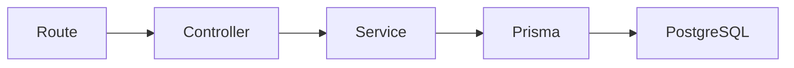
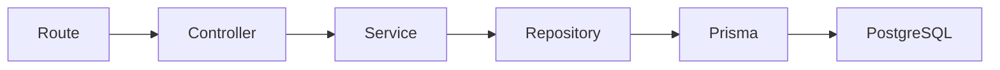
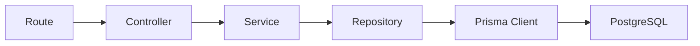

# Día 29: Repositorio con Prisma

En el día 28 creamos la capa de servicios.

Hasta ese momento, el controlador tenía demasiada lógica:

- Validaba datos.
- Normalizaba email.
- Consultaba Prisma.
- Gestionaba errores.
- Creaba usuarios.
- Respondía al cliente.

Después del día 28, parte de esa lógica pasó a `src/services/user.service.ts`.

Eso dejó el controlador más limpio.

Sin embargo, todavía había un problema: el servicio seguía usando Prisma directamente.

Por ejemplo:

```ts
const users = await prisma.user.findMany({
  select: userSafeSelect,
  orderBy: {
    id: "asc"
  }
});
```

Esto funciona, pero mezcla dos responsabilidades distintas.

El servicio debería centrarse en reglas de negocio:

- Validar datos.
- Normalizar email.
- Comprobar si un usuario existe.
- Decidir si se lanza un error.
- Preparar la información antes de guardar.

El acceso a datos debería estar en otra capa: `repositories/`.

Hoy vamos a crear esa capa.

!!! info "Idea principal"
    El servicio decide qué hay que hacer; el repositorio sabe cómo acceder a los datos.

## ¿Qué vamos a trabajar hoy?

Hoy trabajaremos estos conceptos:

- Repositorio.
- Repository pattern.
- Acceso a datos.
- Prisma Client.
- Separación de responsabilidades.
- `user.repository.ts`.
- `findMany`.
- `findUnique`.
- `create`.
- `select`.
- Servicio sin Prisma directo.
- Arquitectura por capas.

El producto del día será la carpeta `src/repositories` con `user.repository.ts`.

El resultado esperado será que `user.service.ts` deje de usar Prisma directamente.

## ¿Qué es un repositorio?

Un repositorio es una capa encargada de acceder a los datos.

En nuestro caso, el repositorio de usuarios será el archivo encargado de usar Prisma para leer y escribir usuarios en PostgreSQL.

Por ejemplo, en lugar de tener esto en el servicio:

```ts
const users = await prisma.user.findMany({
  select: userSafeSelect
});
```

Tendremos una función de repositorio:

```ts
export function findAllUsers() {
  return prisma.user.findMany({
    select: userSafeSelect
  });
}
```

Y el servicio llamará a esa función:

```ts
const users = await findAllUsers();
```

Así el servicio no necesita saber los detalles de Prisma.

## Diferencia entre service y repository

La diferencia es importante.

| Capa       | Responsabilidad                                 |
| ---------- | ----------------------------------------------- |
| Controller | Recibe la petición HTTP y devuelve la respuesta |
| Service    | Aplica reglas de negocio                        |
| Repository | Lee y escribe datos                             |
| Prisma     | Se comunica con PostgreSQL                      |
| PostgreSQL | Guarda los datos reales                         |

Ejemplo práctico:

| Acción                             | Quién debería hacerla                    |
| ---------------------------------- | ---------------------------------------- |
| Leer `req.params.id`               | Controller                               |
| Comprobar si el ID es numérico     | Controller o Service                     |
| Comprobar si el usuario existe     | Service                                  |
| Buscar usuario en la base de datos | Repository                               |
| Ejecutar `prisma.user.findUnique`  | Repository                               |
| Decidir devolver `404`             | Service o Controller mediante `AppError` |
| Enviar `res.status(200).json(...)` | Controller                               |

## Cómo quedará el flujo después de hoy

Antes del día 29 teníamos:



Después del día 29 tendremos:



Esta será ya una arquitectura mucho más limpia.

Cada capa tendrá una responsabilidad concreta.

## Qué debe hacer un repositorio

Un repositorio debe encargarse de operaciones de datos.

Por ejemplo:

- Buscar todos los usuarios.
- Buscar usuarios activos.
- Buscar usuario por ID.
- Buscar usuario por email.
- Crear usuario.
- Actualizar usuario.
- Desactivar usuario.

Hoy trabajaremos las operaciones básicas que ya tenemos:

- `findAllUsers`
- `findActiveUsers`
- `findUserById`
- `findUserByEmail`
- `createUser`

Más adelante añadiremos:

- `updateUser`
- `deactivateUser`
- `updateUserRole`
- `updateUserStatus`

## Qué no debería hacer un repositorio

El repositorio no debería decidir reglas de negocio.

Por ejemplo, no debería decidir:

- Si una contraseña es demasiado corta.
- Si un usuario inactivo puede iniciar sesión.
- Si un `USER` puede listar usuarios.
- Qué código HTTP debe devolverse.
- Qué mensaje JSON verá el cliente.

Eso corresponde a otras capas.

El repositorio debe ser bastante directo:

- Recibe datos.
- Consulta Prisma.
- Devuelve resultados.

## Qué haremos hoy

Hoy crearemos `src/repositories/user.repository.ts`.

Y moveremos allí las consultas Prisma que ahora están en `src/services/user.service.ts`.

Después modificaremos el servicio para que use el repositorio.

La estructura final quedará así:

```text
src/
  prisma.ts
  server.ts
  controllers/
    health.controller.ts
    user.controller.ts
  errors/
    AppError.ts
  repositories/
    user.repository.ts
  routes/
    health.routes.ts
    debug-prisma.routes.ts
  services/
    user.service.ts
```

## Parte guiada

### Paso 1: Abrir el proyecto

Abre una terminal y entra en el repositorio:

```bash
cd usermanager-api
```

Comprueba que tienes una estructura parecida a:

```text
src/
  controllers/
  errors/
  routes/
  services/
  prisma.ts
  server.ts
```

### Paso 2: Crear la carpeta `repositories`

Dentro de `src/`, crea:

```text
src/repositories/
```

La estructura quedará así:

```text
src/
  controllers/
  errors/
  repositories/
  routes/
  services/
  prisma.ts
  server.ts
```

### Paso 3: Crear `user.repository.ts`

Dentro de `src/repositories/`, crea:

```text
src/repositories/user.repository.ts
```

Este archivo contendrá las consultas a Prisma relacionadas con usuarios.

### Paso 4: Preparar imports

Añade al principio:

```ts
import { Role } from "@prisma/client";
import { prisma } from "../prisma";
```

Usaremos:

| Elemento | Para qué sirve |
| --- | --- |
| `prisma` | Consultar PostgreSQL |
| `Role` | Tipar el rol del usuario |

### Paso 5: Mover `userSafeSelect`

Añade en `user.repository.ts`:

```ts
const userSafeSelect = {
  id: true,
  name: true,
  email: true,
  role: true,
  isActive: true,
  createdAt: true,
  updatedAt: true
} as const;
```

Este selector evita devolver `passwordHash`.

!!! danger "Regla importante"
    `passwordHash` nunca debe salir en respuestas de la API.

De momento, el selector vivirá en el repositorio porque es donde se hacen las consultas.

### Paso 6: Crear tipo `CreateUserData`

Añade:

```ts
type CreateUserData = {
  name: string;
  email: string;
  passwordHash: string;
  role?: Role;
  isActive?: boolean;
};
```

Este tipo representa los datos que el repositorio necesita para crear un usuario.

Observa que aquí ya no usamos `password`.

Usamos `passwordHash`.

Porque la base de datos no guarda contraseñas en texto plano.

### Paso 7: Crear `findAllUsers`

Añade:

```ts
export function findAllUsers() {
  return prisma.user.findMany({
    select: userSafeSelect,
    orderBy: {
      id: "asc"
    }
  });
}
```

Esta función devuelve todos los usuarios de forma segura.

### Paso 8: Crear `findActiveUsers`

Añade:

```ts
export function findActiveUsers() {
  return prisma.user.findMany({
    where: {
      isActive: true
    },
    select: userSafeSelect,
    orderBy: {
      id: "asc"
    }
  });
}
```

Esta función devuelve solo usuarios activos.

### Paso 9: Crear `findUserById`

Añade:

```ts
export function findUserById(id: number) {
  return prisma.user.findUnique({
    where: {
      id
    },
    select: userSafeSelect
  });
}
```

Esta función busca un usuario por ID.

Si no existe, Prisma devolverá:

`null`.

El repositorio no decide qué hacer con ese `null`.

Esa decisión será del servicio.

### Paso 10: Crear `findUserByEmail`

Añade:

```ts
export function findUserByEmail(email: string) {
  return prisma.user.findUnique({
    where: {
      email
    },
    select: userSafeSelect
  });
}
```

Esta función será útil para comprobar si un email ya existe.

También nos servirá más adelante para el login.

Importante: para login necesitaremos leer también `passwordHash`, pero eso lo haremos más adelante con una función específica.

De momento, esta función mantiene una salida segura.

### Paso 11: Crear `createUser`

Añade:

```ts
export function createUser(data: CreateUserData) {
  return prisma.user.create({
    data,
    select: userSafeSelect
  });
}
```

Esta función crea un usuario y devuelve solo campos seguros.

### Paso 12: Revisar `user.repository.ts` completo

El archivo debería quedar así:

```ts
import { Role } from "@prisma/client";
import { prisma } from "../prisma";

const userSafeSelect = {
  id: true,
  name: true,
  email: true,
  role: true,
  isActive: true,
  createdAt: true,
  updatedAt: true
} as const;

type CreateUserData = {
  name: string;
  email: string;
  passwordHash: string;
  role?: Role;
  isActive?: boolean;
};

export function findAllUsers() {
  return prisma.user.findMany({
    select: userSafeSelect,
    orderBy: {
      id: "asc"
    }
  });
}

export function findActiveUsers() {
  return prisma.user.findMany({
    where: {
      isActive: true
    },
    select: userSafeSelect,
    orderBy: {
      id: "asc"
    }
  });
}

export function findUserById(id: number) {
  return prisma.user.findUnique({
    where: {
      id
    },
    select: userSafeSelect
  });
}

export function findUserByEmail(email: string) {
  return prisma.user.findUnique({
    where: {
      email
    },
    select: userSafeSelect
  });
}

export function createUser(data: CreateUserData) {
  return prisma.user.create({
    data,
    select: userSafeSelect
  });
}
```

### Paso 13: Modificar `user.service.ts`

Abre:

```text
src/services/user.service.ts
```

Ahora vamos a eliminar el uso directo de Prisma.

Quita este import:

```ts
import { prisma } from "../prisma";
```

Y añade:

```ts
import {
  createUser,
  findActiveUsers,
  findAllUsers,
  findUserByEmail,
  findUserById
} from "../repositories/user.repository";
```

El servicio seguirá usando:

```ts
import { AppError } from "../errors/AppError";
```

### Paso 14: Eliminar `userSafeSelect` del servicio

Como el selector seguro ahora vive en el repositorio, elimina de `user.service.ts` este bloque:

```ts
const userSafeSelect = {
  id: true,
  name: true,
  email: true,
  role: true,
  isActive: true,
  createdAt: true,
  updatedAt: true
} as const;
```

El servicio ya no necesita saber cómo se seleccionan los campos.

### Paso 15: Modificar `getUsersService`

Antes podía tener algo como:

```ts
export async function getUsersService() {
  return prisma.user.findMany({
    select: userSafeSelect,
    orderBy: {
      id: "asc"
    }
  });
}
```

Ahora debe quedar así:

```ts
export async function getUsersService() {
  return findAllUsers();
}
```

El servicio delega el acceso a datos en el repositorio.

### Paso 16: Modificar `getActiveUsersService`

Sustituye por:

```ts
export async function getActiveUsersService() {
  return findActiveUsers();
}
```

### Paso 17: Modificar `getUserByIdService`

Sustituye por:

```ts
export async function getUserByIdService(id: number) {
  const user = await findUserById(id);

  if (!user) {
    throw new AppError("Usuario no encontrado", 404, { id });
  }

  return user;
}
```

Observa la responsabilidad de cada capa:

| Capa | Responsabilidad |
| --- | --- |
| Repository | Busca el usuario |
| Service | Decide qué hacer si no existe |

### Paso 18: Modificar `createDebugUserService`

Ahora la creación debe usar el repositorio.

La función puede quedar así:

```ts
export async function createDebugUserService(input: CreateDebugUserInput) {
  const { name, email, password } = input;

  if (!isNonEmptyString(name)) {
    throw new AppError("El nombre debe ser un texto no vacío", 400);
  }

  if (!isNonEmptyString(email)) {
    throw new AppError("El email debe ser un texto no vacío", 400);
  }

  if (!isNonEmptyString(password)) {
    throw new AppError("La contraseña debe ser un texto no vacío", 400);
  }

  const cleanName = name.trim();
  const cleanEmail = normalizeEmail(email);
  const cleanPassword = password.trim();

  if (!isValidBasicEmail(cleanEmail)) {
    throw new AppError("El email no tiene un formato válido", 400);
  }

  if (cleanPassword.length < 6) {
    throw new AppError("La contraseña debe tener al menos 6 caracteres", 400);
  }

  const existingUser = await findUserByEmail(cleanEmail);

  if (existingUser) {
    throw new AppError("El email ya está registrado", 409, {
      email: cleanEmail
    });
  }

  return createUser({
    name: cleanName,
    email: cleanEmail,
    passwordHash: `hash_temporal_${cleanPassword}`
  });
}
```

Ahora el servicio:

- Valida datos.
- Normaliza email.
- Comprueba si el email existe.
- Construye `passwordHash` temporal.
- Pide al repositorio crear el usuario.

Y el repositorio:

- Ejecuta Prisma.

### Paso 19: Revisar `user.service.ts` completo

El archivo debería tener una estructura parecida a:

```ts
import { AppError } from "../errors/AppError";
import {
  createUser,
  findActiveUsers,
  findAllUsers,
  findUserByEmail,
  findUserById
} from "../repositories/user.repository";

type CreateDebugUserInput = {
  name: unknown;
  email: unknown;
  password: unknown;
};

function isNonEmptyString(value: unknown): value is string {
  return typeof value === "string" && value.trim().length > 0;
}

function normalizeEmail(email: string): string {
  return email.trim().toLowerCase();
}

function isValidBasicEmail(email: string): boolean {
  return email.includes("@") && email.includes(".");
}

export async function getUsersService() {
  return findAllUsers();
}

export async function getActiveUsersService() {
  return findActiveUsers();
}

export async function getUserByIdService(id: number) {
  const user = await findUserById(id);

  if (!user) {
    throw new AppError("Usuario no encontrado", 404, { id });
  }

  return user;
}

export async function createDebugUserService(input: CreateDebugUserInput) {
  const { name, email, password } = input;

  if (!isNonEmptyString(name)) {
    throw new AppError("El nombre debe ser un texto no vacío", 400);
  }

  if (!isNonEmptyString(email)) {
    throw new AppError("El email debe ser un texto no vacío", 400);
  }

  if (!isNonEmptyString(password)) {
    throw new AppError("La contraseña debe ser un texto no vacío", 400);
  }

  const cleanName = name.trim();
  const cleanEmail = normalizeEmail(email);
  const cleanPassword = password.trim();

  if (!isValidBasicEmail(cleanEmail)) {
    throw new AppError("El email no tiene un formato válido", 400);
  }

  if (cleanPassword.length < 6) {
    throw new AppError("La contraseña debe tener al menos 6 caracteres", 400);
  }

  const existingUser = await findUserByEmail(cleanEmail);

  if (existingUser) {
    throw new AppError("El email ya está registrado", 409, {
      email: cleanEmail
    });
  }

  return createUser({
    name: cleanName,
    email: cleanEmail,
    passwordHash: `hash_temporal_${cleanPassword}`
  });
}
```

### Paso 20: Comprobar que el controlador no cambia

El archivo:

```text
src/controllers/user.controller.ts
```

no debería necesitar muchos cambios respecto al día 28.

Debe seguir llamando a servicios:

```ts
const users = await getUsersService();
```

```ts
const user = await getUserByIdService(id);
```

```ts
const createdUser = await createDebugUserService(req.body);
```

Eso demuestra que el controlador no depende de los detalles internos.

Aunque hayamos movido Prisma del servicio al repositorio, el controlador apenas se entera.

### Paso 21: Comprobar que las rutas no cambian

El archivo:

```text
src/routes/debug-prisma.routes.ts
```

tampoco debería cambiar.

Debe seguir usando controladores:

```ts
debugPrismaRouter.get("/users-active", getActiveUsers);
debugPrismaRouter.get("/users", getUsers);
debugPrismaRouter.get("/users/:id", getUserById);
debugPrismaRouter.post("/users", createDebugUser);
```

Esto es una buena señal.

La arquitectura cambia por dentro, pero la API sigue ofreciendo las mismas rutas.

### Paso 22: Probar la API

Arranca el servidor:

```bash
npm run dev
```

Prueba:

- `GET http://localhost:3000/api/debug/prisma/users`
- `GET http://localhost:3000/api/debug/prisma/users-active`
- `GET http://localhost:3000/api/debug/prisma/users/1`
- `GET http://localhost:3000/api/debug/prisma/users/999`
- `GET http://localhost:3000/api/debug/prisma/users/abc`

Después prueba crear usuario: `POST http://localhost:3000/api/debug/prisma/users`.

Body:

```json
{
  "name": "Usuario Repository",
  "email": "usuario.repository@email.com",
  "password": "123456"
}
```

Respuesta esperada:

`201 Created`.

### Paso 23: Probar email duplicado

Vuelve a enviar el mismo body:

```json
{
  "name": "Usuario Repository",
  "email": "usuario.repository@email.com",
  "password": "123456"
}
```

Respuesta esperada:

`409 Conflict`.

Esto ocurre porque el servicio consulta primero al repositorio:

```ts
const existingUser = await findUserByEmail(cleanEmail);
```

Y si ya existe, lanza:

```ts
throw new AppError("El email ya está registrado", 409);
```

### Paso 24: Comprobar con Prisma Studio

Abre Prisma Studio:

```bash
npm run prisma:studio
```

Comprueba que el usuario creado aparece en:

`User`.

Esto confirma que la ruta pasa por:

`Route → Controller → Service → Repository → Prisma → PostgreSQL`.

### Paso 25: Crear el documento del día 29

Dentro de la carpeta `docs/`, crea:

```text
docs/dia-29-repositorio-prisma.md
```

Añade este contenido inicial:

````md
# Día 29 - Repositorio con Prisma

## Qué he hecho

- He creado la carpeta src/repositories.
- He creado user.repository.ts.
- He movido las consultas Prisma desde el servicio al repositorio.
- He creado funciones de acceso a datos.
- He creado findAllUsers.
- He creado findActiveUsers.
- He creado findUserById.
- He creado findUserByEmail.
- He creado createUser.
- He modificado user.service.ts para usar el repositorio.
- He comprobado que user.controller.ts no necesita conocer el repositorio.
- He probado que las rutas siguen funcionando.

## Archivos creados

```text
src/repositories/user.repository.ts
```

## Estructura actual

```text
src/
  prisma.ts
  server.ts
  controllers/
    health.controller.ts
    user.controller.ts
  errors/
    AppError.ts
  repositories/
    user.repository.ts
  routes/
    health.routes.ts
    debug-prisma.routes.ts
  services/
    user.service.ts
```

## Funciones del repositorio

| Función | Responsabilidad |
| --- | --- |
| `findAllUsers` | Obtener todos los usuarios |
| `findActiveUsers` | Obtener usuarios activos |
| `findUserById` | Buscar usuario por ID |
| `findUserByEmail` | Buscar usuario por email |
| `createUser` | Crear usuario |

## Flujo actual

```text
Route → Controller → Service → Repository → Prisma → PostgreSQL
```

## Explicación personal

El repositorio se encarga del acceso a datos. El servicio ya no usa Prisma directamente, sino que llama a funciones del repositorio. Esto permite separar mejor las reglas de negocio del acceso a la base de datos.
````

### Paso 26: Añadir diagrama Mermaid

Añade al documento:



Explicación sugerida:

```md
El repositorio es la capa que usa Prisma Client. El servicio deja de conocer los detalles concretos de acceso a base de datos.
```

### Paso 27: Añadir comparación entre capas

Añade:

```md
## Comparación entre capas

| Capa | Qué hace | Ejemplo |
| --- | --- |---|
| Route | Define URL y método | `GET /users` |
| Controller | Lee req y responde con res | `getUsers` |
| Service | Aplica reglas de negocio | `getUserByIdService` |
| Repository | Consulta o modifica datos | `findUserById` |
| Prisma | Ejecuta consultas contra PostgreSQL | `prisma.user.findUnique` |
```

### Paso 28: Añadir antes y después

Añade:

````md
## Antes y después

Antes, el servicio consultaba Prisma directamente:

```ts
return prisma.user.findMany({
  select: userSafeSelect
});
```

Ahora, el servicio llama al repositorio:

```ts
return findAllUsers();
```

Y el repositorio se encarga de Prisma:

```ts
export function findAllUsers() {
  return prisma.user.findMany({
    select: userSafeSelect
  });
}
```
````

### Paso 29: Actualizar el README

Añade una sección:

````md
## Repositorios

El proyecto ya incluye una capa de repositorios.

Carpeta creada:

```text
src/repositories/
```

Archivo principal:

```text
src/repositories/user.repository.ts
```

Funciones actuales:

- `findAllUsers`
- `findActiveUsers`
- `findUserById`
- `findUserByEmail`
- `createUser`

Flujo actual de la API: `Route → Controller → Service → Repository → Prisma → PostgreSQL`.

El servicio ya no usa Prisma directamente. Ahora el acceso a datos queda concentrado en el repositorio.
````

### Paso 30: Actualizar el índice del README

Añade el enlace:

```md
- [Día 29 - Repositorio con Prisma](docs/dia-29-repositorio-prisma.md)
```

El bloque debería quedar parecido a:

```md
## Documentación del reto

- [Día 1 - Diseño inicial](docs/dia-01-diseno-inicial.md)
- [Día 2 - Preparación del proyecto](docs/dia-02-preparacion-proyecto.md)
- [Día 3 - Primer endpoint](docs/dia-03-primer-endpoint.md)
- [Día 4 - Métodos HTTP](docs/dia-04-metodos-http.md)
- [Día 5 - JSON, body, params y headers](docs/dia-05-json-body-params-headers.md)
- [Día 6 - Cliente HTTP y depuración](docs/dia-06-cliente-http-depuracion.md)
- [Día 7 - Listado de usuarios en memoria](docs/dia-07-listado-usuarios.md)
- [Día 8 - Consultar usuario por ID](docs/dia-08-consultar-usuario-id.md)
- [Día 9 - Crear usuarios en memoria](docs/dia-09-crear-usuarios.md)
- [Día 10 - Actualizar usuarios en memoria](docs/dia-10-actualizar-usuarios.md)
- [Día 11 - Eliminar o desactivar usuarios en memoria](docs/dia-11-eliminar-desactivar-usuarios.md)
- [Día 12 - Validación manual básica](docs/dia-12-validacion-manual-basica.md)
- [Día 13 - Validación de email y duplicados](docs/dia-13-validacion-email-duplicados.md)
- [Día 14 - Códigos de estado HTTP](docs/dia-14-codigos-estado-http.md)
- [Día 15 - Middleware centralizado de errores](docs/dia-15-middleware-errores.md)
- [Día 16 - Base de datos y persistencia](docs/dia-16-base-datos-persistencia.md)
- [Día 17 - PostgreSQL con Docker Compose](docs/dia-17-postgresql-docker-compose.md)
- [Día 18 - Diseño del modelo persistente User](docs/dia-18-diseno-modelo-persistente-user.md)
- [Día 19 - ORM o acceso a datos](docs/dia-19-orm-acceso-datos.md)
- [Día 20 - Instalación y configuración inicial de Prisma](docs/dia-20-instalacion-prisma.md)
- [Día 21 - Modelo Prisma User](docs/dia-21-modelo-prisma-user.md)
- [Día 22 - Primera migración con Prisma](docs/dia-22-primera-migracion-prisma.md)
- [Día 23 - Prisma Studio](docs/dia-23-prisma-studio.md)
- [Día 24 - Seed de datos iniciales](docs/dia-24-seed-datos-iniciales.md)
- [Día 25 - Consultas básicas con Prisma Client](docs/dia-25-consultas-basicas-prisma.md)
- [Día 26 - Separar rutas](docs/dia-26-separar-rutas.md)
- [Día 27 - Controladores](docs/dia-27-controladores.md)
- [Día 28 - Servicios](docs/dia-28-servicios.md)
- [Día 29 - Repositorio con Prisma](docs/dia-29-repositorio-prisma.md)
```

### Paso 31: Guardar cambios en Git

Comprueba los cambios:

```bash
git status
```

Añade los archivos:

```bash
git add .
```

Crea un commit:

```bash
git commit -m "Dia 29 - Crear repositorio de usuarios con Prisma"
```

Sube los cambios:

```bash
git push
```

## Problemas frecuentes

### Error: no se encuentra `user.repository`

Revisa el import en `user.service.ts`:

```ts
import {
  createUser,
  findActiveUsers,
  findAllUsers,
  findUserByEmail,
  findUserById
} from "../repositories/user.repository";
```

Desde `src/services/user.service.ts`, la carpeta `repositories` está al mismo nivel que `services`.

Por eso usamos:

```text
../repositories/user.repository
```

### El servicio sigue importando Prisma

Después del cambio, `user.service.ts` no debería tener:

```ts
import { prisma } from "../prisma";
```

Prisma debe estar en:

```text
user.repository.ts
```

### Aparece `passwordHash` en la respuesta

Revisa que el repositorio usa:

```ts
select: userSafeSelect
```

Especialmente en:

- `findAllUsers`
- `findActiveUsers`
- `findUserById`
- `findUserByEmail`
- `createUser`

### El email duplicado devuelve 500

En este día, el servicio comprueba antes si el email existe:

```ts
const existingUser = await findUserByEmail(cleanEmail);
```

Si existe, debe lanzar:

```ts
throw new AppError("El email ya está registrado", 409);
```

Revisa que ese bloque está antes de `createUser`.

### El repositorio tiene lógica de validación

Evita poner en el repositorio cosas como:

- La contraseña debe tener 6 caracteres.
- El email debe tener `@`.
- El nombre no puede estar vacío.

Eso pertenece al servicio.

### El controlador llama directamente al repositorio

Evítalo.

El controlador debería llamar al servicio.

Correcto:

```ts
const users = await getUsersService();
```

No recomendado:

```ts
const users = await findAllUsers();
```

## Parte libre

### Tarea libre 1: Añadir `findInactiveUsers`

Crea en el repositorio:

```ts
export function findInactiveUsers() {
  return prisma.user.findMany({
    where: {
      isActive: false
    },
    select: userSafeSelect,
    orderBy: {
      id: "asc"
    }
  });
}
```

Después crea el servicio correspondiente:

```ts
export async function getInactiveUsersService() {
  return findInactiveUsers();
}
```

### Tarea libre 2: Crear ruta temporal para usuarios inactivos

Crea una ruta:

```text
GET /api/debug/prisma/users-inactive
```

El flujo debe ser:

```text
Route → Controller → Service → Repository → Prisma
```

### Tarea libre 3: Explicar qué es un repositorio

Añade al documento:

```md
## Qué es un repositorio
```

Explícalo con tus palabras.

Idea orientativa:

> Un repositorio es una capa que agrupa las operaciones de acceso a datos. Permite que los servicios no tengan que conocer directamente los detalles de Prisma o de la base de datos.

### Tarea libre 4: Comparar Service y Repository

Completa esta tabla:

| Aspecto                            | Service | Repository |
| ---------------------------------- | ------- | ---------- |
| Valida reglas de negocio           |         |            |
| Normaliza email                    |         |            |
| Decide si lanzar `AppError`        |         |            |
| Usa Prisma Client                  |         |            |
| Ejecuta `findMany`                 |         |            |
| Devuelve datos de la base de datos |         |            |

### Tarea libre 5: Preparar el día 30

Añade una sección:

```md
## Preparación para CRUD persistente ordenado
```

Responde:

- ¿Qué rutas temporales de debug deberían convertirse en rutas reales?
- ¿Qué endpoints definitivos de usuarios necesitamos?
- ¿Qué funciones faltan en el repositorio?
- ¿Qué funciones faltan en el servicio?

Pistas:

- `GET /api/users`
- `GET /api/users/:id`
- `POST /api/users`
- `PATCH /api/users/:id`
- `DELETE /api/users/:id`

## Entrega recomendada del día 29

Las respuestas no se entregan como archivo suelto. Deben quedar dentro del repositorio de GitHub.

Al finalizar el día 29, el repositorio debería tener esta estructura aproximada:

```text
usermanager-api/
  .env.example
  .gitignore
  docker-compose.yml
  README.md
  package.json
  package-lock.json
  tsconfig.json
  prisma/
    schema.prisma
    seed.ts
    migrations/
      <timestamp>_init/
        migration.sql
  src/
    prisma.ts
    server.ts
    controllers/
      health.controller.ts
      user.controller.ts
    errors/
      AppError.ts
    repositories/
      user.repository.ts
    routes/
      health.routes.ts
      debug-prisma.routes.ts
    services/
      user.service.ts
  docs/
    dia-01-diseno-inicial.md
    dia-02-preparacion-proyecto.md
    dia-03-primer-endpoint.md
    dia-04-metodos-http.md
    dia-05-json-body-params-headers.md
    dia-06-cliente-http-depuracion.md
    dia-07-listado-usuarios.md
    dia-08-consultar-usuario-id.md
    dia-09-crear-usuarios.md
    dia-10-actualizar-usuarios.md
    dia-11-eliminar-desactivar-usuarios.md
    dia-12-validacion-manual-basica.md
    dia-13-validacion-email-duplicados.md
    dia-14-codigos-estado-http.md
    dia-15-middleware-errores.md
    dia-16-base-datos-persistencia.md
    dia-17-postgresql-docker-compose.md
    dia-18-diseno-modelo-persistente-user.md
    dia-19-orm-acceso-datos.md
    dia-20-instalacion-prisma.md
    dia-21-modelo-prisma-user.md
    dia-22-primera-migracion-prisma.md
    dia-23-prisma-studio.md
    dia-24-seed-datos-iniciales.md
    dia-25-consultas-basicas-prisma.md
    dia-26-separar-rutas.md
    dia-27-controladores.md
    dia-28-servicios.md
    dia-29-repositorio-prisma.md
```

El documento del día 29 deberá estar en:

```text
docs/dia-29-repositorio-prisma.md
```

Y deberá incluir:

- Resumen de lo realizado.
- Archivos creados.
- Estructura actual.
- Funciones del repositorio.
- Flujo actual de la API.
- Diagrama `Route → Controller → Service → Repository → Prisma → PostgreSQL`.
- Comparación entre capas.
- Antes y después.
- Explicación de qué es un repositorio.
- Comparación entre Service y Repository.
- Preparación para CRUD persistente ordenado.

En el foro, se compartirá el enlace actualizado al repositorio.

Ejemplo de mensaje:

```text
Hola, comparto el avance del día 29 del reto UserManager API:

https://github.com/usuario/usermanager-api

He creado la capa de repositorios y he movido el acceso a Prisma fuera del servicio. La documentación está en:

docs/dia-29-repositorio-prisma.md
```

## Cierre del día

Hoy hemos completado una parte muy importante de la arquitectura por capas.

Ahora el proyecto ya tiene:

- `routes`
- `controllers`
- `services`
- `repositories`

Y el flujo empieza a parecerse al de una API real:

`Route → Controller → Service → Repository → Prisma → PostgreSQL`.

Hoy hemos trabajado:

- Repositorios.
- Acceso a datos.
- `user.repository.ts`.
- Prisma Client.
- `findMany`.
- `findUnique`.
- `create`.
- `select`.
- Separación entre reglas de negocio y persistencia.
- Servicio sin Prisma directo.

A partir del siguiente día podremos convertir las rutas temporales de debug en un CRUD persistente más ordenado.

!!! success "Idea clave"
    Un repositorio permite aislar el acceso a datos, haciendo que los servicios puedan centrarse en las reglas de negocio y no en los detalles de Prisma o PostgreSQL.
