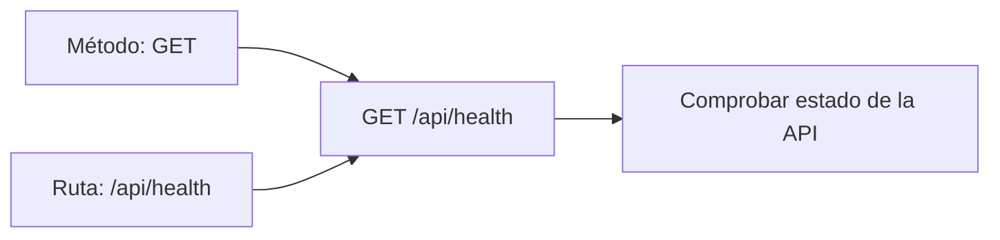
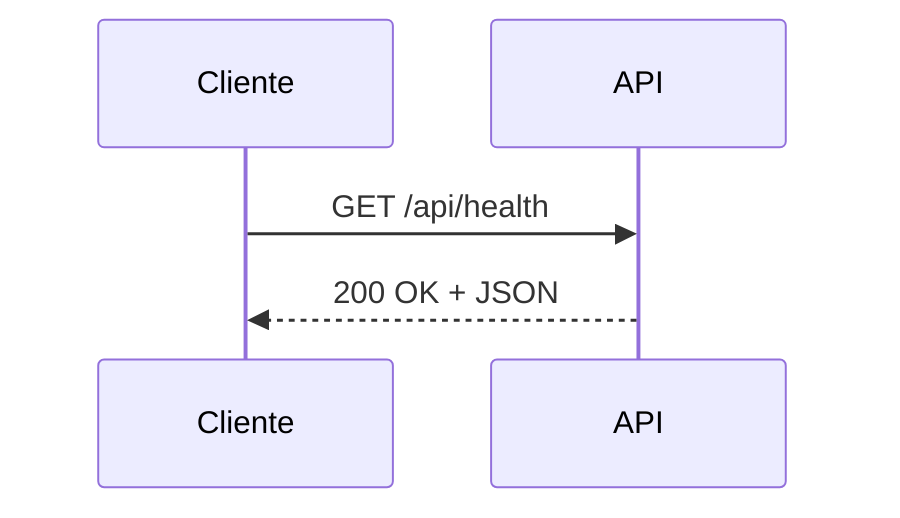
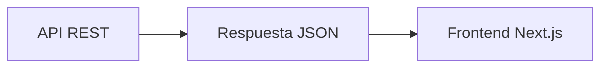
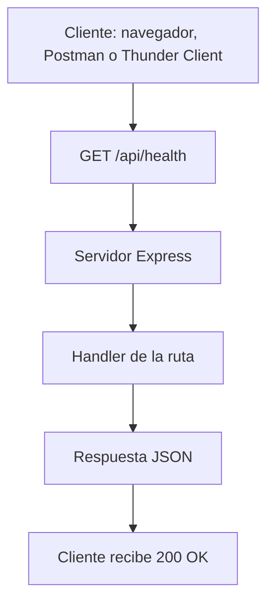

# Día 3: Primer endpoint

En el día 2 preparamos la base técnica del proyecto. Inicializamos el
repositorio como proyecto Node.js, instalamos Express, configuramos TypeScript,
creamos la carpeta `src/` y conseguimos arrancar un servidor básico en local.

Hoy vamos a crear nuestro **primer endpoint real de la API**.

Un endpoint es una ruta concreta a la que un cliente puede hacer una petición.
En nuestro caso, vamos a crear un endpoint muy habitual en APIs reales:

```http
GET /api/health
```

Este endpoint servirá para comprobar si el servidor está funcionando
correctamente. Aunque parece una ruta muy simple, es una pieza importante en
muchos proyectos profesionales. Sirve para verificar que la API está viva, que
responde y que puede ser monitorizada por otras herramientas.

!!! abstract "Objetivo del día"
    Crear `GET /api/health`, devolver una respuesta JSON con estado `200 OK` y
    probar el endpoint desde navegador, Thunder Client o Postman.

Al finalizar el día deberíamos tener una API que responda correctamente en:

```text
http://localhost:3000/api/health
```

## Qué vamos a trabajar hoy

| Concepto | Qué aprenderemos |
| --- | --- |
| Endpoint | Qué representa una URL concreta de una API |
| Ruta | Cómo definir caminos como `/api/health` |
| Método `GET` | Cómo consultar información sin modificar datos |
| Request | Qué envía el cliente |
| Response | Qué devuelve el servidor |
| JSON | Formato habitual de respuesta en APIs REST |
| Status code `200` | Cómo indicar que una petición ha ido bien |
| Organización inicial de rutas | Cómo empezar a ordenar endpoints |
| Pruebas HTTP | Cómo comprobar rutas con navegador, Thunder Client o Postman |

El objetivo principal será entender cómo se define una ruta en Express y cómo se
devuelve una respuesta JSON al cliente.

## Qué es un endpoint

Un **endpoint** es una URL concreta de una API que permite realizar una acción.

| Endpoint | Significado |
| --- | --- |
| `GET /api/health` | Quiero comprobar si la API está funcionando |
| `GET /api/users` | Quiero obtener la lista de usuarios |
| `POST /api/auth/login` | Quiero iniciar sesión |

Una API no es una única dirección. Una API está formada por muchos endpoints, y
cada endpoint representa una operación concreta.

## Partes de un endpoint

Un endpoint suele tener dos partes importantes:

```text
Método HTTP + Ruta
```

Por ejemplo:

```http
GET /api/health
```

| Parte | Valor | Qué indica |
| --- | --- | --- |
| Método HTTP | `GET` | Qué queremos hacer |
| Ruta | `/api/health` | Sobre qué parte de la API queremos actuar |



En este caso usamos `GET` porque solo queremos consultar información. No estamos
creando, modificando ni eliminando nada.

## Qué es una ruta

Una **ruta** es el camino que escribimos después del dominio o del puerto.

Si nuestro servidor está en:

```text
http://localhost:3000
```

Y creamos esta ruta:

```text
/api/health
```

La URL completa será:

```text
http://localhost:3000/api/health
```

En Express podemos crear esa ruta así:

```ts
app.get("/api/health", (req, res) => {
  res.json({
    status: "ok"
  });
});
```

Esto significa:

```text
Cuando llegue una petición GET a /api/health, responde con un JSON.
```

## Qué es GET

`GET` es uno de los métodos HTTP más importantes.

Se utiliza para **obtener información** del servidor.

| Petición | Uso |
| --- | --- |
| `GET /api/health` | Comprobar si la API funciona |
| `GET /api/users` | Obtener usuarios |
| `GET /api/users/1` | Obtener el usuario con id `1` |
| `GET /api/users/me` | Obtener mi perfil |

!!! note "Diseño REST"
    Una petición `GET` normalmente no debería modificar datos. Solo consulta
    información. Esto nos ayuda a diseñar APIs más claras y predecibles.

## Request y Response

Cuando un cliente se comunica con una API, se produce un intercambio:

```text
Request  → petición que envía el cliente
Response → respuesta que devuelve el servidor
```



En Express lo vemos así:

```ts
app.get("/api/health", (req, res) => {
  res.json({
    status: "ok"
  });
});
```

Aquí aparecen dos objetos importantes:

| Objeto | Significado |
| --- | --- |
| `req` | Request: contiene información de la petición |
| `res` | Response: permite construir la respuesta |

En este primer endpoint no necesitamos leer datos de `req`, porque el cliente no
nos envía información especial. Solo necesitamos usar `res` para devolver la
respuesta.

## Qué es JSON

JSON es un formato de texto muy utilizado para intercambiar datos entre
aplicaciones.

```json
{
  "status": "ok",
  "message": "UserManager API funcionando"
}
```

JSON se parece mucho a un objeto de JavaScript, pero se utiliza como formato de
intercambio.

Una API REST suele devolver datos en JSON porque es un formato:

```text
Ligero
Fácil de leer
Fácil de generar
Fácil de consumir desde frontend
Compatible con muchos lenguajes
```

Cuando más adelante conectemos el frontend Next.js, ese frontend recibirá
respuestas JSON de nuestra API.



## Qué es un status code

Un **status code** es un código numérico que indica el resultado de una petición
HTTP.

Por ejemplo:

```text
200 OK
```

Significa que la petición se ha realizado correctamente.

En nuestro endpoint `/api/health`, si todo está bien, devolveremos un `200 OK`.

=== "Forma simple"

    ```ts
    res.json({
      status: "ok"
    });
    ```

    Express devolverá automáticamente `200`.

=== "Forma explícita"

    ```ts
    res.status(200).json({
      status: "ok"
    });
    ```

En este reto intentaremos usar los códigos de estado de forma clara.

| Código | Uso |
| --- | --- |
| `200 OK` | Todo ha ido bien |
| `201 Created` | Se ha creado un recurso |
| `400 Bad Request` | La petición contiene datos incorrectos |
| `401 Unauthorized` | Falta autenticación |
| `403 Forbidden` | No hay permisos suficientes |
| `404 Not Found` | Recurso no encontrado |
| `409 Conflict` | Conflicto, por ejemplo email duplicado |
| `500 Server Error` | Error interno |

Hoy solo trabajaremos con:

```text
200 OK
```

## Qué es un endpoint de health

Un endpoint de **health** es una ruta que permite comprobar si una API está
funcionando.

Suele llamarse de distintas formas:

```text
/health
/api/health
/status
/ping
```

Nosotros usaremos:

```http
GET /api/health
```

Este endpoint puede ser útil para:

```text
Comprobar si el servidor está encendido.
Verificar que la API responde.
Probar el despliegue.
Monitorizar el estado de la aplicación.
Confirmar que el backend está disponible antes de conectar el frontend.
```

En proyectos más avanzados, el endpoint de health puede comprobar también si hay
conexión con la base de datos. De momento solo comprobaremos que el servidor
Express está funcionando.

## Diferencia entre `/` y `/api/health`

En el día 2 creamos una ruta básica:

```http
GET /
```

Respondía algo parecido a:

```json
{
  "message": "UserManager API"
}
```

Hoy vamos a crear una ruta más propia de una API:

```http
GET /api/health
```

Usamos `/api` porque nos ayuda a separar las rutas de la API de otras posibles
rutas de una aplicación web.

| Ruta | Uso |
| --- | --- |
| `/` | Página principal o mensaje básico |
| `/api/health` | Endpoint de API |
| `/api/users` | Recurso `users` |
| `/api/auth` | Recurso `auth` |

En este reto todas las rutas importantes empezarán por:

```text
/api
```

## Flujo de la petición de hoy

La petición que vamos a crear hoy tendrá este recorrido:



El resultado esperado será algo como:

```json
{
  "status": "ok",
  "message": "UserManager API funcionando",
  "timestamp": "2026-01-01T10:00:00.000Z"
}
```

El campo `timestamp` nos permitirá ver cuándo se generó la respuesta.

## Parte guiada

### Paso 1: Abrir el proyecto

Abre el repositorio del reto:

```text
usermanager-api
```

Entra en la carpeta del proyecto:

```bash
cd usermanager-api
```

Comprueba que tienes la estructura del día anterior:

```text
usermanager-api/
  README.md
  package.json
  package-lock.json
  tsconfig.json
  src/
    server.ts
  docs/
    dia-01-diseno-inicial.md
    dia-02-preparacion-proyecto.md
```

### Paso 2: Arrancar el servidor actual

Antes de modificar nada, comprueba que el servidor sigue funcionando.

```bash
npm run dev
```

Deberías ver algo parecido a:

```text
Servidor escuchando en http://localhost:3000
```

Abre en el navegador:

```text
http://localhost:3000
```

Si recibes la respuesta del día anterior, podemos continuar.

### Paso 3: Abrir `src/server.ts`

Abre el archivo:

```text
src/server.ts
```

Seguramente tendrás algo parecido a esto:

```ts
import express from "express";

const app = express();
const PORT = 3000;

app.use(express.json());

app.get("/", (req, res) => {
  res.json({
    message: "UserManager API"
  });
});

app.listen(PORT, () => {
  console.log(`Servidor escuchando en http://localhost:${PORT}`);
});
```

### Paso 4: Añadir el endpoint `/api/health`

Debajo de la ruta `/`, añade esta nueva ruta:

```ts
app.get("/api/health", (req, res) => {
  res.status(200).json({
    status: "ok",
    message: "UserManager API funcionando",
    timestamp: new Date().toISOString()
  });
});
```

El archivo completo quedaría así:

```ts
import express from "express";

const app = express();
const PORT = 3000;

app.use(express.json());

app.get("/", (req, res) => {
  res.json({
    message: "UserManager API"
  });
});

app.get("/api/health", (req, res) => {
  res.status(200).json({
    status: "ok",
    message: "UserManager API funcionando",
    timestamp: new Date().toISOString()
  });
});

app.listen(PORT, () => {
  console.log(`Servidor escuchando en http://localhost:${PORT}`);
});
```

### Paso 5: Entender el código

Vamos a analizar la ruta:

```ts
app.get("/api/health", (req, res) => {
  res.status(200).json({
    status: "ok",
    message: "UserManager API funcionando",
    timestamp: new Date().toISOString()
  });
});
```

| Parte | Qué hace |
| --- | --- |
| `app.get` | Define una ruta `GET` |
| `"/api/health"` | Ruta que escuchará el servidor |
| `(req, res)` | Función que se ejecuta cuando llega la petición |
| `res.status(200)` | Indica que la petición ha ido bien |
| `.json({...})` | Devuelve una respuesta en formato JSON |
| `new Date()` | Crea una fecha actual |
| `toISOString()` | Convierte la fecha a texto en formato estándar |

El campo `timestamp` cambiará cada vez que hagamos una petición.

### Paso 6: Probar desde el navegador

Abre:

```text
http://localhost:3000/api/health
```

Deberías ver algo parecido a:

```json
{
  "status": "ok",
  "message": "UserManager API funcionando",
  "timestamp": "2026-01-01T10:00:00.000Z"
}
```

El valor de `timestamp` será diferente en tu caso.

### Paso 7: Probar desde Thunder Client o Postman

Crea una nueva petición:

```http
GET http://localhost:3000/api/health
```

Pulsa **Send**.

Comprueba tres cosas:

```text
Que el status code sea 200.
Que la respuesta sea JSON.
Que aparezcan status, message y timestamp.
```

En Thunder Client o Postman deberías ver algo parecido a:

```text
Status: 200 OK
```

Y en el cuerpo de la respuesta:

```json
{
  "status": "ok",
  "message": "UserManager API funcionando",
  "timestamp": "2026-01-01T10:00:00.000Z"
}
```

### Paso 8: Probar una ruta incorrecta

Ahora prueba esta URL:

```http
GET http://localhost:3000/api/no-existe
```

Seguramente Express devolverá una página o mensaje indicando que no puede
encontrar esa ruta.

Esto es normal. Todavía no hemos configurado un error `404` personalizado. Más
adelante crearemos un middleware para que los errores tengan un formato JSON
claro.

Por ahora, lo importante es entender que:

```text
/api/health existe y responde.
/api/no-existe no existe y falla.
```

### Paso 9: Añadir un comentario al código

Encima de la ruta `/api/health`, añade un comentario explicativo:

```ts
// Endpoint para comprobar que la API está funcionando
app.get("/api/health", (req, res) => {
  res.status(200).json({
    status: "ok",
    message: "UserManager API funcionando",
    timestamp: new Date().toISOString()
  });
});
```

!!! note "Comentarios"
    Los comentarios no deben usarse para explicar cosas obvias todo el tiempo,
    pero al principio nos ayudan a entender la intención del código.

### Paso 10: Actualizar el README

Actualiza el `README.md` para añadir la nueva ruta de prueba.

````md title="README.md"
## Endpoints disponibles

### Health

```http
GET /api/health
```

Respuesta esperada:

```json
{
  "status": "ok",
  "message": "UserManager API funcionando",
  "timestamp": "2026-01-01T10:00:00.000Z"
}
```
````

Si ya tienes una sección de documentación del reto, añade también el enlace del
día 3 cuando crees el documento.

### Paso 11: Crear el documento del día 3

Dentro de la carpeta `docs/`, crea un nuevo archivo:

```text
docs/dia-03-primer-endpoint.md
```

En este documento añade:

````md title="docs/dia-03-primer-endpoint.md"
# Día 3: Primer endpoint

## Qué he hecho

- He creado el endpoint `GET /api/health`.
- He devuelto una respuesta JSON.
- He usado el status code `200`.
- He probado la ruta desde navegador.
- He probado la ruta desde Thunder Client o Postman.
- He probado una ruta incorrecta para comprobar qué ocurre.

## Endpoint creado

```http
GET /api/health
```

## Respuesta obtenida

```json
{
  "status": "ok",
  "message": "UserManager API funcionando",
  "timestamp": "..."
}
```

## Explicación personal

El endpoint `/api/health` sirve para comprobar que la API está funcionando
correctamente. Cuando recibe una petición `GET`, devuelve un JSON con el estado
de la aplicación.
````

### Paso 12: Actualizar el índice del README

Añade el enlace al documento del día 3:

```md
## Documentación del reto

- [Día 1 - Diseño inicial](docs/dia-01-diseno-inicial.md)
- [Día 2 - Preparación del proyecto](docs/dia-02-preparacion-proyecto.md)
- [Día 3 - Primer endpoint](docs/dia-03-primer-endpoint.md)
```

### Paso 13: Guardar cambios en Git

Comprueba los cambios:

```bash
git status
```

Añade los archivos:

```bash
git add .
```

Crea un commit:

```bash
git commit -m "Dia 3 - Crear endpoint de health"
```

Sube los cambios:

```bash
git push
```

## Parte libre

Ahora toca practicar un poco sin copiar exactamente la guía.

### Tarea libre 1: Mejorar la respuesta de `/api/health`

Añade algún campo más a la respuesta.

```json title="Ejemplo"
{
  "status": "ok",
  "message": "UserManager API funcionando",
  "timestamp": "2026-01-01T10:00:00.000Z",
  "version": "1.0.0",
  "environment": "development"
}
```

Puedes añadir los campos que quieras, siempre que la respuesta siga siendo JSON.

### Tarea libre 2: Crear un endpoint `/api/ping`

Crea una nueva ruta:

```http
GET /api/ping
```

Debe devolver una respuesta sencilla:

```json
{
  "message": "pong"
}
```

Este tipo de ruta se usa a veces para comprobar que un servidor responde
rápidamente.

### Tarea libre 3: Comparar `/`, `/api/health` y `/api/ping`

En el documento del día 3, añade una tabla comparando las tres rutas:

| Ruta | Método | Para qué sirve |
| --- | --- | --- |
| `/` | `GET` | Mensaje inicial de la API |
| `/api/health` | `GET` | Comprobar el estado de la API |
| `/api/ping` | `GET` | Comprobar respuesta rápida del servidor |

Puedes añadir tu propia explicación.

### Tarea libre 4: Crear una pequeña colección de pruebas

Crea en Thunder Client o Postman una pequeña colección llamada:

```text
UserManager API - Día 3
```

Incluye al menos estas peticiones:

```text
GET http://localhost:3000/
GET http://localhost:3000/api/health
GET http://localhost:3000/api/ping
```

Después, en el documento del día 3, añade una sección llamada:

```md
## Pruebas realizadas
```

Y completa una tabla como esta:

| Petición | Código esperado | Resultado obtenido |
| --- | ---: | --- |
| `GET /` | 200 | |
| `GET /api/health` | 200 | |
| `GET /api/ping` | 200 | |

La idea es empezar a acostumbrarnos a guardar y organizar las pruebas de la API,
no solo a probar rutas sueltas.

## Entrega recomendada del día 3

Las respuestas no se entregan como archivo suelto. Deben quedar dentro del
repositorio de GitHub.

Al finalizar el día 3, el repositorio debería tener esta estructura aproximada:

```text
usermanager-api/
  README.md
  package.json
  package-lock.json
  tsconfig.json
  src/
    server.ts
  docs/
    dia-01-diseno-inicial.md
    dia-02-preparacion-proyecto.md
    dia-03-primer-endpoint.md
```

El documento del día 3 deberá estar en:

```text
docs/dia-03-primer-endpoint.md
```

Y deberá incluir:

- Resumen de lo realizado.
- Endpoint creado.
- Respuesta obtenida.
- Explicación personal del endpoint `/api/health`.
- Tabla comparativa de rutas.
- Tabla de pruebas realizadas con Thunder Client o Postman.

En el foro, se compartirá el enlace actualizado al repositorio.

```text title="Mensaje de ejemplo"
Hola, comparto el avance del día 3 del reto UserManager API:

https://github.com/usuario/usermanager-api

He añadido el endpoint GET /api/health y la documentación del día 3 en:
docs/dia-03-primer-endpoint.md
```

## Cierre del día

Hoy hemos creado el primer endpoint real de nuestra API.

Aunque técnicamente es una ruta sencilla, hemos trabajado conceptos muy
importantes:

```text
Endpoint
Método GET
Ruta
Request
Response
JSON
Status code
Pruebas con cliente HTTP
```

A partir de ahora, cada vez que creemos una nueva funcionalidad, seguiremos un
ciclo parecido:

```text
Crear ruta.
Devolver respuesta.
Probar con cliente HTTP.
Documentar.
Subir cambios a GitHub.
```

!!! success "Idea clave"
    Una API se construye endpoint a endpoint, probando cada pequeña pieza antes
    de seguir avanzando.
