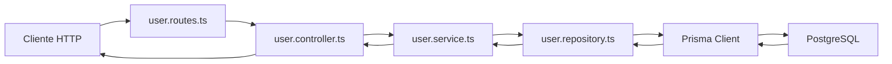
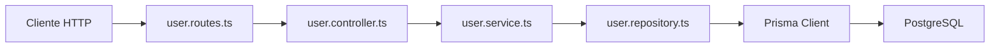

# Día 30: CRUD persistente ordenado con Prisma y capas

En los últimos días hemos transformado bastante la estructura del proyecto.

Primero usamos Prisma directamente desde rutas temporales de debug.

Después empezamos a separar responsabilidades:

| Día | Paso |
| --- | --- |
| Día 26 | Separar rutas |
| Día 27 | Crear controladores |
| Día 28 | Crear servicios |
| Día 29 | Crear repositorios con Prisma |

Ahora el proyecto ya tiene una arquitectura parecida a esta:

`Route → Controller → Service → Repository → Prisma → PostgreSQL`.

Hasta ahora, muchas rutas seguían estando bajo un prefijo temporal:

`/api/debug/prisma/users`.

Ese prefijo nos sirvió para aprender sin romper el proyecto, pero una API real no debería exponer sus operaciones principales como rutas de debug.

Hoy vamos a dar un paso importante: crear el CRUD persistente real de usuarios.

Trabajaremos con rutas definitivas:

- `GET /api/users`
- `GET /api/users/:id`
- `POST /api/users`
- `PATCH /api/users/:id`
- `DELETE /api/users/:id`

Estas rutas usarán PostgreSQL mediante Prisma, pero respetando la arquitectura por capas.

!!! info "Idea principal"
    El CRUD ya no será una prueba temporal: será una parte real de la API organizada por capas.

## ¿Qué vamos a trabajar hoy?

Hoy trabajaremos estos conceptos:

- CRUD persistente.
- Rutas reales.
- `user.routes.ts`.
- `user.controller.ts`.
- `user.service.ts`.
- `user.repository.ts`.
- `GET /api/users`.
- `GET /api/users/:id`.
- `POST /api/users`.
- `PATCH /api/users/:id`.
- `DELETE /api/users/:id`.
- Borrado lógico.
- Actualización parcial.
- Validación por capas.
- Prisma `update`.
- Prisma `findMany`.
- Prisma `create`.

El producto del día será un CRUD real de usuarios funcionando con Prisma y arquitectura por capas.

Al finalizar, las rutas temporales de debug podrán seguir existiendo si queremos, pero ya tendremos un conjunto de endpoints reales para usuarios.

## Qué significa CRUD

CRUD es un acrónimo formado por cuatro operaciones básicas:

- Create.
- Read.
- Update.
- Delete.

En español:

- Crear.
- Leer.
- Actualizar.
- Eliminar.

En una API REST, estas operaciones suelen relacionarse con métodos HTTP:

| Operación                   | Método HTTP | Ruta             |
| --------------------------- | ----------- | ---------------- |
| Crear usuario               | `POST`      | `/api/users`     |
| Listar usuarios             | `GET`       | `/api/users`     |
| Consultar usuario           | `GET`       | `/api/users/:id` |
| Actualizar usuario          | `PATCH`     | `/api/users/:id` |
| Eliminar/desactivar usuario | `DELETE`    | `/api/users/:id` |

En nuestro proyecto, el borrado será lógico.

Eso significa que no eliminaremos físicamente el usuario de la base de datos.

En su lugar, cambiaremos:

`isActive: true`

por:

`isActive: false`.

## Por qué usamos borrado lógico

En muchas aplicaciones reales no se eliminan usuarios de forma definitiva.

En lugar de borrar el registro, se marca como inactivo.

Esto permite:

- Conservar historial.
- Evitar pérdida accidental de información.
- Restaurar cuentas si hace falta.
- Mantener referencias futuras.
- Controlar mejor la seguridad.

Por eso, en nuestro modelo tenemos:

```prisma
isActive Boolean @default(true)
```

Y el endpoint:

`DELETE /api/users/:id`

hará realmente una desactivación:

`isActive = false`.

La respuesta podrá decir:

```json
{
  "message": "Usuario desactivado correctamente"
}
```

## Flujo completo de una petición

Cuando el cliente haga:

`GET /api/users/1`.

El flujo será:



Cada capa tendrá una responsabilidad:

| Capa       | Responsabilidad                         |
| ---------- | --------------------------------------- |
| Route      | Define URL y método HTTP                |
| Controller | Lee `req`, llama al servicio y responde |
| Service    | Aplica reglas de negocio                |
| Repository | Consulta o modifica datos               |
| Prisma     | Se comunica con PostgreSQL              |
| PostgreSQL | Guarda los datos reales                 |

## Qué rutas vamos a crear

Hoy crearemos un nuevo archivo:

`src/routes/user.routes.ts`.

Y montaremos estas rutas:

- `GET /api/users`
- `GET /api/users/:id`
- `POST /api/users`
- `PATCH /api/users/:id`
- `DELETE /api/users/:id`

Estas serán rutas reales del proyecto.

Dejaremos de depender de:

`/api/debug/prisma/users`.

Las rutas de debug pueden quedarse temporalmente, pero ya no serán las principales.

## Qué funciones necesitaremos

### En el repositorio

Añadiremos funciones como:

- `updateUser`
- `deactivateUser`

Ya tenemos otras del día 29:

- `findAllUsers`
- `findActiveUsers`
- `findUserById`
- `findUserByEmail`
- `createUser`

### En el servicio

Añadiremos funciones como:

- `updateUserService`
- `deactivateUserService`
- `createUserService`

También podemos renombrar:

`createDebugUserService`

a:

`createUserService`.

Porque ya no será una función temporal de debug.

### En el controlador

Añadiremos o ajustaremos funciones como:

- `listUsers`
- `getUserById`
- `createUserController`
- `updateUserController`
- `deleteUserController`

Los nombres pueden variar, pero deben ser claros.

## Qué ocurre con `passwordHash`

Todavía no estamos en la fase de seguridad.

El hash real con `bcrypt` llegará más adelante.

Por eso, hoy seguiremos usando un valor temporal:

`hash_temporal_${password}`.

Esto no es seguro para una aplicación real, pero nos permite seguir avanzando con el CRUD persistente.

!!! danger "Regla importante"
    La API nunca debe devolver `passwordHash`.

Aunque todavía sea temporal, `passwordHash` sigue siendo un dato privado.

## Parte guiada

### Paso 1: Abrir el proyecto

Abre una terminal y entra en el repositorio:

```bash
cd usermanager-api
```

Comprueba que tienes una estructura parecida a:

```text
src/
  prisma.ts
  server.ts
  controllers/
    health.controller.ts
    user.controller.ts
  errors/
    AppError.ts
  repositories/
    user.repository.ts
  routes/
    health.routes.ts
    debug-prisma.routes.ts
  services/
    user.service.ts
```

### Paso 2: Crear `user.routes.ts`

Dentro de `src/routes/`, crea:

```text
src/routes/user.routes.ts
```

Añade:

```ts
import { Router } from "express";
import {
  createUserController,
  deleteUserController,
  getUserById,
  listUsers,
  updateUserController
} from "../controllers/user.controller";

export const userRouter = Router();

userRouter.get("/", listUsers);

userRouter.get("/:id", getUserById);

userRouter.post("/", createUserController);

userRouter.patch("/:id", updateUserController);

userRouter.delete("/:id", deleteUserController);
```

Este archivo define las rutas reales de usuarios.

Recuerda que el prefijo `/api/users` se añadirá en `server.ts`.

### Paso 3: Montar `userRouter` en `server.ts`

Abre:

```text
src/server.ts
```

Importa el router:

```ts
import { userRouter } from "./routes/user.routes";
```

Después monta la ruta:

```ts
app.use("/api/users", userRouter);
```

La zona de rutas podría quedar así:

```ts
app.use("/api/health", healthRouter);
app.use("/api/users", userRouter);
app.use("/api/debug/prisma", debugPrismaRouter);
```

Puedes mantener las rutas de debug por ahora.

Más adelante podremos eliminarlas.

## Ampliar el repositorio

### Paso 4: Abrir `user.repository.ts`

Abre:

```text
src/repositories/user.repository.ts
```

Ya deberías tener funciones como:

- `findAllUsers`
- `findActiveUsers`
- `findUserById`
- `findUserByEmail`
- `createUser`

Ahora añadiremos funciones para actualizar y desactivar.

### Paso 5: Añadir tipo `UpdateUserData`

Debajo de `CreateUserData`, añade:

```ts
type UpdateUserData = {
  name?: string;
  email?: string;
  isActive?: boolean;
};
```

Este tipo representa los campos que permitiremos modificar por ahora.

No permitiremos modificar desde aquí:

- `id`
- `passwordHash`
- `role`
- `createdAt`
- `updatedAt`

El rol lo trabajaremos más adelante, cuando lleguemos a autorización.

La contraseña también tendrá su propio endpoint en la fase de seguridad.

### Paso 6: Crear `updateUser`

Añade en `user.repository.ts`:

```ts
export function updateUser(id: number, data: UpdateUserData) {
  return prisma.user.update({
    where: {
      id
    },
    data,
    select: userSafeSelect
  });
}
```

Esta función actualiza parcialmente un usuario.

Prisma se encargará de actualizar automáticamente:

`updatedAt`

porque en el modelo definimos:

```prisma
updatedAt DateTime @updatedAt
```

### Paso 7: Crear `deactivateUser`

Añade:

```ts
export function deactivateUser(id: number) {
  return prisma.user.update({
    where: {
      id
    },
    data: {
      isActive: false
    },
    select: userSafeSelect
  });
}
```

Esto será nuestro borrado lógico.

### Paso 8: Revisar repositorio actualizado

El repositorio debe tener ahora funciones como:

```ts
export function findAllUsers() {
  // ...
}

export function findActiveUsers() {
  // ...
}

export function findUserById(id: number) {
  // ...
}

export function findUserByEmail(email: string) {
  // ...
}

export function createUser(data: CreateUserData) {
  // ...
}

export function updateUser(id: number, data: UpdateUserData) {
  // ...
}

export function deactivateUser(id: number) {
  // ...
}
```

El repositorio ya cubre operaciones básicas del CRUD.

## Ampliar el servicio

### Paso 9: Abrir `user.service.ts`

Abre:

```text
src/services/user.service.ts
```

Actualiza el import del repositorio:

```ts
import {
  createUser,
  deactivateUser,
  findAllUsers,
  findUserByEmail,
  findUserById,
  updateUser
} from "../repositories/user.repository";
```

Si sigues usando usuarios activos en debug, conserva también:

```ts
findActiveUsers
```

### Paso 10: Renombrar `getUsersService`

Podemos dejar el nombre:

```ts
getUsersService
```

O renombrarlo a:

```ts
listUsersService
```

Para las rutas reales, usaremos:

```ts
export async function listUsersService() {
  return findAllUsers();
}
```

Si quieres mantener compatibilidad con las rutas de debug, puedes dejar ambas:

```ts
export async function listUsersService() {
  return findAllUsers();
}

export async function getUsersService() {
  return listUsersService();
}
```

Así no rompes las rutas anteriores.

### Paso 11: Mantener `getUserByIdService`

Debe quedar así:

```ts
export async function getUserByIdService(id: number) {
  const user = await findUserById(id);

  if (!user) {
    throw new AppError("Usuario no encontrado", 404, { id });
  }

  return user;
}
```

Esta función sigue siendo válida para rutas reales y rutas de debug.

### Paso 12: Crear tipo `CreateUserInput`

Sustituye o complementa el tipo de debug:

```ts
type CreateUserInput = {
  name: unknown;
  email: unknown;
  password: unknown;
};
```

Si tenías:

```ts
CreateDebugUserInput
```

puedes renombrarlo a `CreateUserInput`.

### Paso 13: Crear `createUserService`

Añade esta función o renombra la anterior:

```ts
export async function createUserService(input: CreateUserInput) {
  const { name, email, password } = input;

  if (!isNonEmptyString(name)) {
    throw new AppError("El nombre debe ser un texto no vacío", 400);
  }

  if (!isNonEmptyString(email)) {
    throw new AppError("El email debe ser un texto no vacío", 400);
  }

  if (!isNonEmptyString(password)) {
    throw new AppError("La contraseña debe ser un texto no vacío", 400);
  }

  const cleanName = name.trim();
  const cleanEmail = normalizeEmail(email);
  const cleanPassword = password.trim();

  if (!isValidBasicEmail(cleanEmail)) {
    throw new AppError("El email no tiene un formato válido", 400);
  }

  if (cleanPassword.length < 6) {
    throw new AppError("La contraseña debe tener al menos 6 caracteres", 400);
  }

  const existingUser = await findUserByEmail(cleanEmail);

  if (existingUser) {
    throw new AppError("El email ya está registrado", 409, {
      email: cleanEmail
    });
  }

  return createUser({
    name: cleanName,
    email: cleanEmail,
    passwordHash: `hash_temporal_${cleanPassword}`
  });
}
```

Y si quieres mantener la función de debug:

```ts
export async function createDebugUserService(input: CreateUserInput) {
  return createUserService(input);
}
```

### Paso 14: Crear tipo `UpdateUserInput`

Añade:

```ts
type UpdateUserInput = {
  name?: unknown;
  email?: unknown;
  isActive?: unknown;
};
```

Usamos `unknown` porque los datos vienen del body.

No debemos confiar en ellos directamente.

### Paso 15: Crear `updateUserService`

Añade:

```ts
export async function updateUserService(id: number, input: UpdateUserInput) {
  const currentUser = await findUserById(id);

  if (!currentUser) {
    throw new AppError("Usuario no encontrado", 404, { id });
  }

  const dataToUpdate: {
    name?: string;
    email?: string;
    isActive?: boolean;
  } = {};

  if (input.name !== undefined) {
    if (!isNonEmptyString(input.name)) {
      throw new AppError("El nombre debe ser un texto no vacío", 400);
    }

    dataToUpdate.name = input.name.trim();
  }

  if (input.email !== undefined) {
    if (!isNonEmptyString(input.email)) {
      throw new AppError("El email debe ser un texto no vacío", 400);
    }

    const cleanEmail = normalizeEmail(input.email);

    if (!isValidBasicEmail(cleanEmail)) {
      throw new AppError("El email no tiene un formato válido", 400);
    }

    const existingUser = await findUserByEmail(cleanEmail);

    if (existingUser && existingUser.id !== id) {
      throw new AppError("El email ya está registrado", 409, {
        email: cleanEmail
      });
    }

    dataToUpdate.email = cleanEmail;
  }

  if (input.isActive !== undefined) {
    if (typeof input.isActive !== "boolean") {
      throw new AppError("isActive debe ser true o false", 400);
    }

    dataToUpdate.isActive = input.isActive;
  }

  const hasChanges = Object.keys(dataToUpdate).length > 0;

  if (!hasChanges) {
    throw new AppError("Debes enviar al menos un campo para actualizar", 400);
  }

  return updateUser(id, dataToUpdate);
}
```

Esta función aplica varias reglas:

- El usuario debe existir.
- El nombre no puede estar vacío.
- El email debe ser válido.
- El email no puede pertenecer a otro usuario.
- `isActive` debe ser booleano.
- Debe enviarse al menos un campo.

### Paso 16: Crear `deactivateUserService`

Añade:

```ts
export async function deactivateUserService(id: number) {
  const user = await findUserById(id);

  if (!user) {
    throw new AppError("Usuario no encontrado", 404, { id });
  }

  if (!user.isActive) {
    throw new AppError("El usuario ya estaba desactivado", 409, { id });
  }

  return deactivateUser(id);
}
```

Esto implementa el borrado lógico.

Si el usuario ya está inactivo, devolvemos un error `409 Conflict`.

### Paso 17: Revisar servicios principales

Al final, `user.service.ts` debe tener funciones como:

```ts
export async function listUsersService() {
  return findAllUsers();
}

export async function getUserByIdService(id: number) {
  // ...
}

export async function createUserService(input: CreateUserInput) {
  // ...
}

export async function updateUserService(id: number, input: UpdateUserInput) {
  // ...
}

export async function deactivateUserService(id: number) {
  // ...
}
```

Si mantienes rutas de debug, puedes conservar también:

```ts
getUsersService
getActiveUsersService
createDebugUserService
```

pero la API real usará las nuevas funciones.

## Ampliar el controlador

### Paso 18: Abrir `user.controller.ts`

Abre:

```text
src/controllers/user.controller.ts
```

Importa los nuevos servicios:

```ts
import {
  createUserService,
  deactivateUserService,
  getUserByIdService,
  listUsersService,
  updateUserService
} from "../services/user.service";
```

Si todavía tienes rutas de debug en el mismo controlador, también conservarás los imports que necesites.

### Paso 19: Crear `listUsers`

Añade:

```ts
export async function listUsers(
  req: Request,
  res: Response,
  next: NextFunction
) {
  try {
    const users = await listUsersService();

    return res.status(200).json({
      message: "Usuarios obtenidos correctamente",
      total: users.length,
      data: users
    });
  } catch (error) {
    next(error);
  }
}
```

### Paso 20: Revisar `getUserById`

Ya lo teníamos.

Debe quedar parecido a:

```ts
export async function getUserById(
  req: Request,
  res: Response,
  next: NextFunction
) {
  try {
    const id = Number(req.params.id);

    if (Number.isNaN(id)) {
      throw new AppError("El ID debe ser un número", 400, {
        received: req.params.id
      });
    }

    const user = await getUserByIdService(id);

    return res.status(200).json({
      message: "Usuario obtenido correctamente",
      data: user
    });
  } catch (error) {
    next(error);
  }
}
```

### Paso 21: Crear `createUserController`

Añade:

```ts
export async function createUserController(
  req: Request,
  res: Response,
  next: NextFunction
) {
  try {
    const createdUser = await createUserService(req.body);

    return res.status(201).json({
      message: "Usuario creado correctamente",
      data: createdUser
    });
  } catch (error) {
    next(error);
  }
}
```

### Paso 22: Crear `updateUserController`

Añade:

```ts
export async function updateUserController(
  req: Request,
  res: Response,
  next: NextFunction
) {
  try {
    const id = Number(req.params.id);

    if (Number.isNaN(id)) {
      throw new AppError("El ID debe ser un número", 400, {
        received: req.params.id
      });
    }

    const updatedUser = await updateUserService(id, req.body);

    return res.status(200).json({
      message: "Usuario actualizado correctamente",
      data: updatedUser
    });
  } catch (error) {
    next(error);
  }
}
```

### Paso 23: Crear `deleteUserController`

Añade:

```ts
export async function deleteUserController(
  req: Request,
  res: Response,
  next: NextFunction
) {
  try {
    const id = Number(req.params.id);

    if (Number.isNaN(id)) {
      throw new AppError("El ID debe ser un número", 400, {
        received: req.params.id
      });
    }

    const deactivatedUser = await deactivateUserService(id);

    return res.status(200).json({
      message: "Usuario desactivado correctamente",
      data: deactivatedUser
    });
  } catch (error) {
    next(error);
  }
}
```

Aunque el método HTTP sea `DELETE`, internamente estamos haciendo:

`isActive = false`.

## Probar las rutas reales

### Paso 24: Arrancar servidor

Ejecuta:

```bash
npm run dev
```

Asegúrate también de que PostgreSQL está funcionando:

```bash
docker compose up -d
```

### Paso 25: Probar listado

`GET http://localhost:3000/api/users`

Respuesta esperada:

```json
{
  "message": "Usuarios obtenidos correctamente",
  "total": 3,
  "data": [
    {
      "id": 1,
      "name": "Admin Principal",
      "email": "admin@email.com",
      "role": "ADMIN",
      "isActive": true,
      "createdAt": "...",
      "updatedAt": "..."
    }
  ]
}
```

Comprueba que no aparece:

`passwordHash`.

### Paso 26: Probar consulta por ID

`GET http://localhost:3000/api/users/1`

Casos a probar:

| Caso | Resultado |
| --- | --- |
| ID existente | `200` |
| ID inexistente | `404` |
| ID no numérico | `400` |

Ejemplos:

- `GET /api/users/999`
- `GET /api/users/abc`

### Paso 27: Probar creación

`POST http://localhost:3000/api/users`

Body:

```json
{
  "name": "Usuario CRUD",
  "email": "usuario.crud@email.com",
  "password": "123456"
}
```

Respuesta esperada:

`201 Created`.

### Paso 28: Probar actualización

`PATCH http://localhost:3000/api/users/4`

Body:

```json
{
  "name": "Usuario CRUD Actualizado",
  "email": "usuario.crud.actualizado@email.com"
}
```

Respuesta esperada:

`200 OK`.

También puedes probar solo un campo:

```json
{
  "name": "Nuevo Nombre"
}
```

O:

```json
{
  "isActive": true
}
```

### Paso 29: Probar actualización sin campos

`PATCH http://localhost:3000/api/users/4`

Body:

```json
{}
```

Respuesta esperada:

`400 Bad Request`.

Mensaje esperado:

```json
{
  "error": "Debes enviar al menos un campo para actualizar"
}
```

### Paso 30: Probar email duplicado en actualización

Intenta actualizar un usuario con un email que ya exista.

Ejemplo:

```json
{
  "email": "admin@email.com"
}
```

Respuesta esperada:

`409 Conflict`.

### Paso 31: Probar desactivación

`DELETE http://localhost:3000/api/users/4`

Respuesta esperada:

```json
{
  "message": "Usuario desactivado correctamente",
  "data": {
    "id": 4,
    "isActive": false
  }
}
```

La respuesta real incluirá más campos seguros.

Después comprueba en Prisma Studio que `isActive` está en `false`.

### Paso 32: Probar desactivación repetida

Vuelve a enviar:

`DELETE http://localhost:3000/api/users/4`

Respuesta esperada:

`409 Conflict`.

Mensaje:

```json
{
  "error": "El usuario ya estaba desactivado"
}
```

## Comprobar con Prisma Studio

Abre Prisma Studio:

```bash
npm run prisma:studio
```

Revisa la tabla:

`User`.

Comprueba:

- El usuario creado aparece.
- Los cambios de `PATCH` se han guardado.
- El `DELETE` ha cambiado `isActive` a `false`.
- `updatedAt` cambia al modificar.

Esto confirma que el CRUD real ya trabaja contra PostgreSQL.

## Comparación entre rutas debug y rutas reales

| Tipo de ruta | Ejemplo                   | Uso                              |
| ------------ | ------------------------- | -------------------------------- |
| Debug        | `/api/debug/prisma/users` | Aprendizaje y pruebas temporales |
| Real         | `/api/users`              | Endpoint principal de la API     |

A partir de ahora, las rutas importantes serán:

- `GET /api/users`
- `GET /api/users/:id`
- `POST /api/users`
- `PATCH /api/users/:id`
- `DELETE /api/users/:id`

Las rutas de debug pueden mantenerse mientras aprendemos, pero no deberían ser la base final del proyecto.

## Crear el documento del día 30

Dentro de la carpeta `docs/`, crea:

```text
docs/dia-30-crud-persistente-ordenado.md
```

Añade este contenido inicial:

````md
# Día 30 - CRUD persistente ordenado con Prisma y capas

## Qué he hecho

- He creado user.routes.ts.
- He montado userRouter en server.ts.
- He creado rutas reales de usuario.
- He añadido updateUser en el repositorio.
- He añadido deactivateUser en el repositorio.
- He creado createUserService.
- He creado updateUserService.
- He creado deactivateUserService.
- He creado controladores para crear, actualizar y desactivar usuarios.
- He probado GET /api/users.
- He probado GET /api/users/:id.
- He probado POST /api/users.
- He probado PATCH /api/users/:id.
- He probado DELETE /api/users/:id.
- He comprobado los cambios con Prisma Studio.

## Rutas reales creadas

| Método | Ruta | Acción |
| --- | --- |---|
| GET | `/api/users` | Listar usuarios |
| GET | `/api/users/:id` | Consultar usuario |
| POST | `/api/users` | Crear usuario |
| PATCH | `/api/users/:id` | Actualizar usuario |
| DELETE | `/api/users/:id` | Desactivar usuario |

## Flujo actual

```text
Route → Controller → Service → Repository → Prisma → PostgreSQL
```

## Archivos modificados o creados

```text
src/routes/user.routes.ts
src/controllers/user.controller.ts
src/services/user.service.ts
src/repositories/user.repository.ts
src/server.ts
```

## Borrado lógico

El endpoint DELETE no elimina físicamente el usuario.

En su lugar, actualiza:

```text
isActive = false
```

Esto permite conservar el registro en la base de datos.

## Explicación personal

El CRUD persistente permite que la API gestione usuarios reales guardados en PostgreSQL. La arquitectura por capas ayuda a que cada parte del código tenga una responsabilidad clara.
````

## Añadir diagrama Mermaid

Añade al documento:



Explicación sugerida:

```md
El CRUD real de usuarios sigue el flujo completo por capas. Las rutas no acceden a Prisma directamente y los controladores tampoco. El acceso a datos queda concentrado en el repositorio.
```

## Actualizar el README

Añade una sección:

````md
## CRUD persistente de usuarios

La API ya tiene rutas reales para gestionar usuarios con PostgreSQL y Prisma.

Rutas principales:

| Método | Ruta | Acción |
| --- | --- |---|
| GET | `/api/users` | Listar usuarios |
| GET | `/api/users/:id` | Consultar usuario |
| POST | `/api/users` | Crear usuario |
| PATCH | `/api/users/:id` | Actualizar usuario |
| DELETE | `/api/users/:id` | Desactivar usuario |

Flujo interno:

```text
Route → Controller → Service → Repository → Prisma → PostgreSQL
```

El borrado es lógico:

```text
DELETE /api/users/:id → isActive = false
```

La API nunca devuelve `passwordHash`.
````

## Actualizar el índice del README

Añade el enlace:

```md
- [Día 30 - CRUD persistente ordenado](docs/dia-30-crud-persistente-ordenado.md)
```

El bloque debería quedar parecido a:

```md
## Documentación del reto

- [Día 1 - Diseño inicial](docs/dia-01-diseno-inicial.md)
- [Día 2 - Preparación del proyecto](docs/dia-02-preparacion-proyecto.md)
- [Día 3 - Primer endpoint](docs/dia-03-primer-endpoint.md)
- [Día 4 - Métodos HTTP](docs/dia-04-metodos-http.md)
- [Día 5 - JSON, body, params y headers](docs/dia-05-json-body-params-headers.md)
- [Día 6 - Cliente HTTP y depuración](docs/dia-06-cliente-http-depuracion.md)
- [Día 7 - Listado de usuarios en memoria](docs/dia-07-listado-usuarios.md)
- [Día 8 - Consultar usuario por ID](docs/dia-08-consultar-usuario-id.md)
- [Día 9 - Crear usuarios en memoria](docs/dia-09-crear-usuarios.md)
- [Día 10 - Actualizar usuarios en memoria](docs/dia-10-actualizar-usuarios.md)
- [Día 11 - Eliminar o desactivar usuarios en memoria](docs/dia-11-eliminar-desactivar-usuarios.md)
- [Día 12 - Validación manual básica](docs/dia-12-validacion-manual-basica.md)
- [Día 13 - Validación de email y duplicados](docs/dia-13-validacion-email-duplicados.md)
- [Día 14 - Códigos de estado HTTP](docs/dia-14-codigos-estado-http.md)
- [Día 15 - Middleware centralizado de errores](docs/dia-15-middleware-errores.md)
- [Día 16 - Base de datos y persistencia](docs/dia-16-base-datos-persistencia.md)
- [Día 17 - PostgreSQL con Docker Compose](docs/dia-17-postgresql-docker-compose.md)
- [Día 18 - Diseño del modelo persistente User](docs/dia-18-diseno-modelo-persistente-user.md)
- [Día 19 - ORM o acceso a datos](docs/dia-19-orm-acceso-datos.md)
- [Día 20 - Instalación y configuración inicial de Prisma](docs/dia-20-instalacion-prisma.md)
- [Día 21 - Modelo Prisma User](docs/dia-21-modelo-prisma-user.md)
- [Día 22 - Primera migración con Prisma](docs/dia-22-primera-migracion-prisma.md)
- [Día 23 - Prisma Studio](docs/dia-23-prisma-studio.md)
- [Día 24 - Seed de datos iniciales](docs/dia-24-seed-datos-iniciales.md)
- [Día 25 - Consultas básicas con Prisma Client](docs/dia-25-consultas-basicas-prisma.md)
- [Día 26 - Separar rutas](docs/dia-26-separar-rutas.md)
- [Día 27 - Controladores](docs/dia-27-controladores.md)
- [Día 28 - Servicios](docs/dia-28-servicios.md)
- [Día 29 - Repositorio con Prisma](docs/dia-29-repositorio-prisma.md)
- [Día 30 - CRUD persistente ordenado](docs/dia-30-crud-persistente-ordenado.md)
```

## Guardar cambios en Git

Comprueba los cambios:

```bash
git status
```

Añade los archivos:

```bash
git add .
```

Crea un commit:

```bash
git commit -m "Dia 30 - Crear CRUD persistente ordenado"
```

Sube los cambios:

```bash
git push
```

## Problemas frecuentes

### Error: no se encuentra `userRouter`

Revisa el import en `server.ts`:

```ts
import { userRouter } from "./routes/user.routes";
```

Y comprueba que el archivo exporta:

```ts
export const userRouter = Router();
```

### `GET /api/users` devuelve 404

Comprueba que has montado el router:

```ts
app.use("/api/users", userRouter);
```

Y que dentro de `user.routes.ts` tienes:

```ts
userRouter.get("/", listUsers);
```

### `PATCH` no actualiza nada

Comprueba que envías un body válido:

```json
{
  "name": "Nuevo nombre"
}
```

También revisa que tienes:

```ts
app.use(express.json());
```

antes de montar rutas en `server.ts`.

### El email duplicado no se detecta

Comprueba que en `updateUserService` haces:

```ts
const existingUser = await findUserByEmail(cleanEmail);

if (existingUser && existingUser.id !== id) {
  throw new AppError("El email ya está registrado", 409);
}
```

### `DELETE` borra físicamente el usuario

No deberíamos usar:

```ts
prisma.user.delete(...)
```

En este reto usamos borrado lógico:

```ts
prisma.user.update({
  where: { id },
  data: { isActive: false }
});
```

### Aparece `passwordHash` en la respuesta

Revisa el repositorio.

Todas las funciones que devuelven usuarios deben usar:

```ts
select: userSafeSelect
```

## Parte libre

### Tarea libre 1: Añadir filtro de usuarios activos

Modifica `GET /api/users` para aceptar una query opcional:

```text
GET /api/users?active=true
GET /api/users?active=false
```

Opciones:

| Query | Resultado |
| --- | --- |
| `active=true` | Solo usuarios activos |
| `active=false` | Solo usuarios inactivos |
| Sin `active` | Todos los usuarios |

### Tarea libre 2: Crear endpoint de reactivación

Crea una ruta:

```text
PATCH /api/users/:id/reactivate
```

Debe cambiar:

`isActive = true`.

Recuerda seguir el flujo:

`Route → Controller → Service → Repository`.

### Tarea libre 3: Documentar el CRUD

Añade al documento una tabla con ejemplos de body:

| Método   | Ruta             | Body necesario               |
| -------- | ---------------- | ---------------------------- |
| `POST`   | `/api/users`     | `name`, `email`, `password`  |
| `PATCH`  | `/api/users/:id` | `name`, `email` o `isActive` |
| `DELETE` | `/api/users/:id` | ninguno                      |

### Tarea libre 4: Comparar CRUD en memoria y CRUD persistente

Completa esta tabla:

| Operación  | En memoria                  | Con Prisma             |
| ---------- | --------------------------- | ---------------------- |
| Listar     | `users`                     | `findAllUsers()`       |
| Buscar     | `users.find(...)`           | `findUserById(id)`     |
| Crear      | `users.push(...)`           | `createUser(data)`     |
| Actualizar | modificar array             | `updateUser(id, data)` |
| Desactivar | cambiar `isActive` en array | `deactivateUser(id)`   |

### Tarea libre 5: Preparar el día 31

Añade una sección:

```md
## Preparación para limpieza y refactor
```

Responde:

- ¿Qué rutas de debug pueden eliminarse?
- ¿Qué nombres de funciones podrían mejorarse?
- ¿Qué código se repite?
- ¿Qué validaciones podrían extraerse?
- ¿Qué archivos han crecido demasiado?

## Entrega recomendada del día 30

Las respuestas no se entregan como archivo suelto. Deben quedar dentro del repositorio de GitHub.

Al finalizar el día 30, el repositorio debería tener esta estructura aproximada:

```text
usermanager-api/
  .env.example
  .gitignore
  docker-compose.yml
  README.md
  package.json
  package-lock.json
  tsconfig.json
  prisma/
    schema.prisma
    seed.ts
    migrations/
      <timestamp>_init/
        migration.sql
  src/
    prisma.ts
    server.ts
    controllers/
      health.controller.ts
      user.controller.ts
    errors/
      AppError.ts
    repositories/
      user.repository.ts
    routes/
      health.routes.ts
      debug-prisma.routes.ts
      user.routes.ts
    services/
      user.service.ts
  docs/
    dia-01-diseno-inicial.md
    dia-02-preparacion-proyecto.md
    dia-03-primer-endpoint.md
    dia-04-metodos-http.md
    dia-05-json-body-params-headers.md
    dia-06-cliente-http-depuracion.md
    dia-07-listado-usuarios.md
    dia-08-consultar-usuario-id.md
    dia-09-crear-usuarios.md
    dia-10-actualizar-usuarios.md
    dia-11-eliminar-desactivar-usuarios.md
    dia-12-validacion-manual-basica.md
    dia-13-validacion-email-duplicados.md
    dia-14-codigos-estado-http.md
    dia-15-middleware-errores.md
    dia-16-base-datos-persistencia.md
    dia-17-postgresql-docker-compose.md
    dia-18-diseno-modelo-persistente-user.md
    dia-19-orm-acceso-datos.md
    dia-20-instalacion-prisma.md
    dia-21-modelo-prisma-user.md
    dia-22-primera-migracion-prisma.md
    dia-23-prisma-studio.md
    dia-24-seed-datos-iniciales.md
    dia-25-consultas-basicas-prisma.md
    dia-26-separar-rutas.md
    dia-27-controladores.md
    dia-28-servicios.md
    dia-29-repositorio-prisma.md
    dia-30-crud-persistente-ordenado.md
```

El documento del día 30 deberá estar en:

```text
docs/dia-30-crud-persistente-ordenado.md
```

Y deberá incluir:

- Resumen de lo realizado.
- Rutas reales creadas.
- Flujo actual por capas.
- Archivos modificados o creados.
- Explicación del borrado lógico.
- Diagrama `Route → Controller → Service → Repository → Prisma → PostgreSQL`.
- Comparación entre rutas debug y rutas reales.
- Pruebas realizadas.
- Problemas encontrados.
- Preparación para limpieza y refactor.

En el foro, se compartirá el enlace actualizado al repositorio.

Ejemplo de mensaje:

```text
Hola, comparto el avance del día 30 del reto UserManager API:

https://github.com/usuario/usermanager-api

He creado el CRUD persistente real de usuarios usando Prisma y arquitectura por capas. La documentación está en:

docs/dia-30-crud-persistente-ordenado.md
```

## Cierre del día

Hoy hemos convertido el trabajo de los últimos días en un CRUD real y persistente.

Ya no dependemos solo de rutas temporales de debug. Ahora la API tiene endpoints reales para gestionar usuarios:

- `GET /api/users`
- `GET /api/users/:id`
- `POST /api/users`
- `PATCH /api/users/:id`
- `DELETE /api/users/:id`

Y todos ellos siguen el flujo completo:

`Route → Controller → Service → Repository → Prisma → PostgreSQL`.

Hoy hemos trabajado:

- CRUD persistente.
- Rutas reales.
- `user.routes.ts`.
- Controladores de usuario.
- Servicios de usuario.
- Repositorios de usuario.
- Prisma `update`.
- Borrado lógico.
- Validación de actualización.
- Email duplicado.
- Prisma Studio.

Este es uno de los días más importantes del reto, porque ya tenemos una API que empieza a parecerse a un backend real.

!!! success "Idea clave"
    Un CRUD persistente no consiste solo en que las rutas funcionen, sino en que cada operación esté organizada en capas claras, mantenibles y conectadas a una base de datos real.
