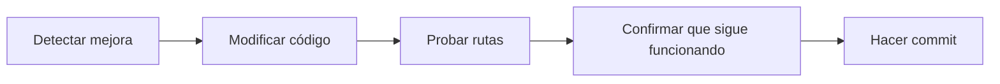
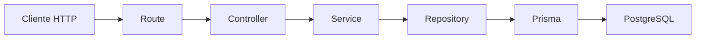

# Día 31: Limpieza y refactor del proyecto

En el día 30 conseguimos un avance muy importante: creamos el CRUD persistente real de usuarios.

Ya tenemos rutas como:

- `GET /api/users`
- `GET /api/users/:id`
- `POST /api/users`
- `PATCH /api/users/:id`
- `DELETE /api/users/:id`

Y estas rutas siguen el flujo completo por capas:

`Route → Controller → Service → Repository → Prisma → PostgreSQL`.

Eso significa que el proyecto ya tiene una estructura bastante cercana a una API real.

Sin embargo, después de tantos días de evolución, es normal que hayan quedado restos de código temporal, nombres mejorables, rutas de debug, funciones duplicadas o validaciones repetidas.

Esto pasa en cualquier proyecto real.

Primero hacemos que funcione.

Después limpiamos.

Hoy vamos a dedicar el día a limpiar y refactorizar.

Refactorizar significa mejorar la estructura interna del código sin cambiar lo que hace desde fuera.

La API debería seguir funcionando igual, pero el código debería quedar más claro.

!!! info "Idea principal"
    Refactorizar no consiste en añadir funciones nuevas, sino en mejorar el código para que sea más fácil de mantener.

## ¿Qué vamos a trabajar hoy?

Hoy trabajaremos estos conceptos:

- Refactor.
- Limpieza de código.
- Deuda técnica.
- Rutas temporales.
- Nombres coherentes.
- Código duplicado.
- Validaciones reutilizables.
- Estructura de carpetas.
- Responsabilidades por capa.
- Pruebas de regresión manuales.
- README actualizado.

El producto del día será un proyecto más limpio, coherente y preparado para la fase de seguridad.

El resultado esperado será que el CRUD siga funcionando igual, pero con menos código temporal y una estructura más clara.

## Qué es refactorizar

Refactorizar es modificar el código para mejorar su estructura sin cambiar su comportamiento externo.

Por ejemplo, esto sería refactorizar:

- Renombrar una función para que sea más clara.
- Mover una validación repetida a una función auxiliar.
- Eliminar rutas temporales que ya no se usan.
- Separar código en archivos más coherentes.
- Quitar imports innecesarios.
- Actualizar documentación para reflejar la estructura real.

Esto no sería refactorizar:

- Añadir login.
- Crear JWT.
- Cambiar el modelo de base de datos.
- Añadir nuevos roles.
- Crear un frontend.

Hoy no vamos a introducir seguridad todavía.

Eso empezará en el día 32.

## Por qué es importante limpiar ahora

Durante el reto hemos ido construyendo el proyecto poco a poco.

Eso ha sido útil para aprender.

Pero también ha dejado una evolución natural:

- Primero rutas en `server.ts`.
- Después rutas separadas.
- Después controladores.
- Después servicios.
- Después repositorios.
- Después rutas reales.

Es posible que ahora tengamos:

- Rutas de debug que ya no hacen falta.
- Funciones con nombres antiguos.
- Servicios llamados `createDebugUserService`.
- Imports que ya no se usan.
- Código duplicado.
- README con referencias mezcladas.
- Documentación que necesita actualizarse.

Si no limpiamos ahora, la siguiente fase será más difícil.

La fase de seguridad añadirá:

- `bcrypt`
- `register`
- `login`
- JWT.
- Middleware de autenticación.
- Roles.
- Rutas protegidas.

Conviene empezar esa fase con el proyecto ordenado.

## Qué vamos a limpiar hoy

Hoy revisaremos especialmente:

- `server.ts`
- `routes/`
- `controllers/`
- `services/`
- `repositories/`
- `errors/`
- `README.md`
- Rutas de debug.
- Nombres de funciones.
- Validaciones repetidas.

El objetivo no es reescribir todo.

El objetivo es dejar el código más coherente.

## Estado ideal del proyecto después de hoy

Después del refactor, una estructura razonable sería:

```text
src/
  prisma.ts
  server.ts
  controllers/
    health.controller.ts
    user.controller.ts
  errors/
    AppError.ts
  repositories/
    user.repository.ts
  routes/
    health.routes.ts
    user.routes.ts
  services/
    user.service.ts
  utils/
    string.utils.ts
    parse.utils.ts
```

Opcionalmente, si todavía queremos conservar las rutas de debug, podemos moverlas o dejarlas claramente marcadas como temporales.

Pero para el reto, una buena decisión es dejar como rutas principales:

- `GET /api/health`
- `GET /api/users`
- `GET /api/users/:id`
- `POST /api/users`
- `PATCH /api/users/:id`
- `DELETE /api/users/:id`

Y eliminar o apartar:

`/api/debug/prisma/...`.

## Refactor no significa romper

!!! warning "Regla importante"
    Después de cada cambio importante, probamos que la API sigue funcionando.

No queremos hacer diez cambios de golpe y descubrir al final que todo falla.

El flujo recomendado será:

- Cambiar poco.
- Guardar.
- Probar.
- Confirmar.
- Seguir.

Visualmente:



## Parte guiada

### Paso 1: Abrir el proyecto

Abre una terminal y entra en el repositorio:

```bash
cd usermanager-api
```

Comprueba que tienes una estructura parecida a:

```text
src/
  prisma.ts
  server.ts
  controllers/
  errors/
  repositories/
  routes/
  services/
```

### Paso 2: Crear una rama opcional de refactor

Este paso es opcional, pero recomendable.

Puedes crear una rama para trabajar la limpieza:

```bash
git checkout -b dia-31-refactor
```

Si estás trabajando de forma sencilla en el reto, también puedes continuar directamente en la rama principal.

Lo importante es hacer cambios controlados.

### Paso 3: Revisar que el proyecto funciona antes de tocar nada

Antes de refactorizar, comprueba que todo funciona.

Arranca PostgreSQL:

```bash
docker compose up -d
```

Arranca la API:

```bash
npm run dev
```

Prueba:

- `GET http://localhost:3000/api/health`
- `GET http://localhost:3000/api/users`
- `GET http://localhost:3000/api/users/1`

Si algo falla antes de refactorizar, primero hay que resolverlo.

No tiene sentido limpiar sobre una base rota.

## Limpiar rutas de debug

### Paso 4: Decidir qué hacer con las rutas debug

Durante los días anteriores usamos rutas temporales como:

- `/api/debug/prisma/users`
- `/api/debug/prisma/users-active`

Estas rutas nos sirvieron para aprender Prisma.

Pero ahora ya tenemos rutas reales:

- `/api/users`
- `/api/users/:id`

Hoy podemos hacer una de estas dos cosas:

- Opción A: eliminar las rutas de debug.
- Opción B: mantenerlas, pero claramente separadas como temporales.

Para este reto, recomiendo la opción A.

Así dejamos el proyecto más limpio antes de seguridad.

### Paso 5: Eliminar montaje de `debugPrismaRouter`

Abre:

```text
src/server.ts
```

Si tienes este import:

```ts
import { debugPrismaRouter } from "./routes/debug-prisma.routes";
```

elimínalo.

Después elimina el montaje:

```ts
app.use("/api/debug/prisma", debugPrismaRouter);
```

La zona de rutas debería quedar parecida a:

```ts
app.use("/api/health", healthRouter);
app.use("/api/users", userRouter);
```

Si tienes middlewares de 404 y errores, recuerda que van después de las rutas.

### Paso 6: Eliminar o archivar `debug-prisma.routes.ts`

Si ya no vas a usar las rutas de debug, elimina:

```text
src/routes/debug-prisma.routes.ts
```

Si prefieres conservarlo como referencia, puedes moverlo a una carpeta temporal:

```text
src/routes/_deprecated/debug-prisma.routes.ts
```

Pero lo más limpio para el alumnado es eliminarlo.

## Limpiar controladores

### Paso 7: Revisar `user.controller.ts`

Abre:

```text
src/controllers/user.controller.ts
```

Busca funciones antiguas de debug como:

- `getActiveUsers`
- `getUsers`
- `createDebugUser`

Si ya no se usan en `user.routes.ts`, elimínalas.

El controlador debería centrarse en las rutas reales:

- `listUsers`
- `getUserById`
- `createUserController`
- `updateUserController`
- `deleteUserController`

Una versión limpia podría tener esta forma:

```ts
import { Request, Response, NextFunction } from "express";
import { AppError } from "../errors/AppError";
import {
  createUserService,
  deactivateUserService,
  getUserByIdService,
  listUsersService,
  updateUserService
} from "../services/user.service";

export async function listUsers(
  req: Request,
  res: Response,
  next: NextFunction
) {
  try {
    const users = await listUsersService();

    return res.status(200).json({
      message: "Usuarios obtenidos correctamente",
      total: users.length,
      data: users
    });
  } catch (error) {
    next(error);
  }
}

export async function getUserById(
  req: Request,
  res: Response,
  next: NextFunction
) {
  try {
    const id = Number(req.params.id);

    if (Number.isNaN(id)) {
      throw new AppError("El ID debe ser un número", 400, {
        received: req.params.id
      });
    }

    const user = await getUserByIdService(id);

    return res.status(200).json({
      message: "Usuario obtenido correctamente",
      data: user
    });
  } catch (error) {
    next(error);
  }
}

export async function createUserController(
  req: Request,
  res: Response,
  next: NextFunction
) {
  try {
    const createdUser = await createUserService(req.body);

    return res.status(201).json({
      message: "Usuario creado correctamente",
      data: createdUser
    });
  } catch (error) {
    next(error);
  }
}

export async function updateUserController(
  req: Request,
  res: Response,
  next: NextFunction
) {
  try {
    const id = Number(req.params.id);

    if (Number.isNaN(id)) {
      throw new AppError("El ID debe ser un número", 400, {
        received: req.params.id
      });
    }

    const updatedUser = await updateUserService(id, req.body);

    return res.status(200).json({
      message: "Usuario actualizado correctamente",
      data: updatedUser
    });
  } catch (error) {
    next(error);
  }
}

export async function deleteUserController(
  req: Request,
  res: Response,
  next: NextFunction
) {
  try {
    const id = Number(req.params.id);

    if (Number.isNaN(id)) {
      throw new AppError("El ID debe ser un número", 400, {
        received: req.params.id
      });
    }

    const deactivatedUser = await deactivateUserService(id);

    return res.status(200).json({
      message: "Usuario desactivado correctamente",
      data: deactivatedUser
    });
  } catch (error) {
    next(error);
  }
}
```

### Paso 8: Detectar código repetido en controladores

En `getUserById`, `updateUserController` y `deleteUserController` repetimos esta lógica:

```ts
const id = Number(req.params.id);

if (Number.isNaN(id)) {
  throw new AppError("El ID debe ser un número", 400, {
    received: req.params.id
  });
}
```

Esto funciona, pero se repite.

Vamos a extraerlo.

## Crear utilidades

### Paso 9: Crear carpeta `utils`

Dentro de `src/`, crea:

```text
src/utils/
```

La estructura quedará:

```text
src/
  controllers/
  errors/
  repositories/
  routes/
  services/
  utils/
```

### Paso 10: Crear `parse.utils.ts`

Dentro de `src/utils/`, crea:

```text
src/utils/parse.utils.ts
```

Añade:

```ts
import { AppError } from "../errors/AppError";

export function parseIdParam(value: string) {
  const id = Number(value);

  if (Number.isNaN(id)) {
    throw new AppError("El ID debe ser un número", 400, {
      received: value
    });
  }

  return id;
}
```

Esta función transforma un parámetro de ruta en número o lanza un error.

### Paso 11: Usar `parseIdParam` en el controlador

En `user.controller.ts`, importa:

```ts
import { parseIdParam } from "../utils/parse.utils";
```

Ahora cambia:

```ts
const id = Number(req.params.id);

if (Number.isNaN(id)) {
  throw new AppError("El ID debe ser un número", 400, {
    received: req.params.id
  });
}
```

por:

```ts
const id = parseIdParam(req.params.id);
```

Hazlo en:

- `getUserById`
- `updateUserController`
- `deleteUserController`

El controlador queda más limpio.

### Paso 12: Revisar si `AppError` sigue siendo necesario en el controlador

Después de usar `parseIdParam`, puede que `user.controller.ts` ya no necesite importar `AppError`.

Si no lo usa directamente, elimina el import:

```ts
import { AppError } from "../errors/AppError";
```

Eliminar imports innecesarios también es refactor.

## Extraer utilidades de texto

### Paso 13: Crear `string.utils.ts`

En `src/utils/`, crea:

```text
src/utils/string.utils.ts
```

Añade:

```ts
export function isNonEmptyString(value: unknown): value is string {
  return typeof value === "string" && value.trim().length > 0;
}

export function normalizeEmail(email: string): string {
  return email.trim().toLowerCase();
}

export function isValidBasicEmail(email: string): boolean {
  return email.includes("@") && email.includes(".");
}
```

Estas funciones probablemente estaban dentro de:

```text
user.service.ts
```

Ahora las movemos a una utilidad reutilizable.

### Paso 14: Usar utilidades en `user.service.ts`

Abre:

```text
src/services/user.service.ts
```

Elimina estas funciones si estaban dentro:

```ts
function isNonEmptyString(...)
function normalizeEmail(...)
function isValidBasicEmail(...)
```

Importa las nuevas utilidades:

```ts
import {
  isNonEmptyString,
  isValidBasicEmail,
  normalizeEmail
} from "../utils/string.utils";
```

El servicio queda más centrado en reglas de negocio y menos en utilidades básicas.

## Limpiar servicios

### Paso 15: Revisar nombres en `user.service.ts`

El servicio debería tener nombres orientados a rutas reales, no a debug.

Revisa si todavía tienes:

```text
createDebugUserService
getUsersService
getActiveUsersService
```

Si ya no se usan, elimínalos.

Quédate con funciones principales:

```text
listUsersService
getUserByIdService
createUserService
updateUserService
deactivateUserService
```

El archivo debería tener una estructura parecida a:

```ts
import { AppError } from "../errors/AppError";
import {
  createUser,
  deactivateUser,
  findAllUsers,
  findUserByEmail,
  findUserById,
  updateUser
} from "../repositories/user.repository";
import {
  isNonEmptyString,
  isValidBasicEmail,
  normalizeEmail
} from "../utils/string.utils";

type CreateUserInput = {
  name: unknown;
  email: unknown;
  password: unknown;
};

type UpdateUserInput = {
  name?: unknown;
  email?: unknown;
  isActive?: unknown;
};

export async function listUsersService() {
  return findAllUsers();
}

export async function getUserByIdService(id: number) {
  const user = await findUserById(id);

  if (!user) {
    throw new AppError("Usuario no encontrado", 404, { id });
  }

  return user;
}

export async function createUserService(input: CreateUserInput) {
  // validación y creación
}

export async function updateUserService(id: number, input: UpdateUserInput) {
  // validación y actualización
}

export async function deactivateUserService(id: number) {
  // borrado lógico
}
```

### Paso 16: Revisar que el servicio no usa Express

En `user.service.ts` no deberían aparecer:

- `Request`
- `Response`
- `NextFunction`
- `req`
- `res`
- `next`
- `res.status`
- `res.json`

Si aparecen, algo está mezclado.

El servicio no debe saber de Express.

## Limpiar repositorio

### Paso 17: Revisar `user.repository.ts`

Abre:

```text
src/repositories/user.repository.ts
```

El repositorio debe contener acceso a datos.

Puede tener funciones como:

- `findAllUsers`
- `findUserById`
- `findUserByEmail`
- `createUser`
- `updateUser`
- `deactivateUser`

Si tienes funciones que ya no se usan, como:

`findActiveUsers`

puedes decidir:

- Eliminarla si no se usa.
- Mantenerla si la usarás para filtros próximos.

Una opción razonable es mantenerla solo si vas a implementar pronto filtros de usuarios activos.

Si no, elimínala para dejar el repositorio más limpio.

### Paso 18: Comprobar que el repositorio no contiene reglas de negocio

En `user.repository.ts` no debería haber validaciones como:

- La contraseña debe tener 6 caracteres.
- El email debe tener `@`.
- El usuario ya estaba desactivado.

El repositorio solo debe consultar o modificar datos.

## Limpiar rutas

### Paso 19: Revisar `user.routes.ts`

Abre:

```text
src/routes/user.routes.ts
```

Debe estar limpio y claro:

```ts
import { Router } from "express";
import {
  createUserController,
  deleteUserController,
  getUserById,
  listUsers,
  updateUserController
} from "../controllers/user.controller";

export const userRouter = Router();

userRouter.get("/", listUsers);
userRouter.get("/:id", getUserById);
userRouter.post("/", createUserController);
userRouter.patch("/:id", updateUserController);
userRouter.delete("/:id", deleteUserController);
```

Este archivo no debe importar:

- `prisma`
- `AppError`
- Servicios.

Solo debe conocer controladores.

### Paso 20: Revisar `server.ts`

Abre:

```text
src/server.ts
```

Debe quedar centrado en configuración general.

Ejemplo:

```ts
import express from "express";
import { healthRouter } from "./routes/health.routes";
import { userRouter } from "./routes/user.routes";

const app = express();
const PORT = process.env.PORT || 3000;

app.use(express.json());

app.use("/api/health", healthRouter);
app.use("/api/users", userRouter);

// Middleware 404
// Middleware de errores

app.listen(PORT, () => {
  console.log(`Servidor escuchando en http://localhost:${PORT}`);
});
```

Si ya tienes `notFoundMiddleware` y `errorMiddleware`, recuerda dejarlos después de las rutas:

```ts
app.use(notFoundMiddleware);
app.use(errorMiddleware);
```

## Probar después del refactor

### Paso 21: Arrancar la API

Ejecuta:

```bash
npm run dev
```

### Paso 22: Probar health

`GET http://localhost:3000/api/health`

Debe responder:

```json
{
  "status": "ok",
  "message": "UserManager API funcionando",
  "timestamp": "..."
}
```

### Paso 23: Probar listado de usuarios

`GET http://localhost:3000/api/users`

Debe devolver usuarios sin `passwordHash`.

### Paso 24: Probar usuario por ID

`GET http://localhost:3000/api/users/1`

Casos:

| Petición | Resultado |
| --- | --- |
| `GET /api/users/1` | `200` si existe |
| `GET /api/users/999` | `404` |
| `GET /api/users/abc` | `400` |

### Paso 25: Probar creación

`POST http://localhost:3000/api/users`

Body:

```json
{
  "name": "Usuario Refactor",
  "email": "usuario.refactor@email.com",
  "password": "123456"
}
```

Debe devolver:

`201 Created`.

### Paso 26: Probar actualización

`PATCH http://localhost:3000/api/users/4`

Body:

```json
{
  "name": "Usuario Refactor Actualizado"
}
```

Debe devolver:

`200 OK`.

### Paso 27: Probar desactivación

`DELETE http://localhost:3000/api/users/4`

Debe devolver:

`200 OK`.

Y cambiar:

`isActive = false`.

### Paso 28: Comprobar con Prisma Studio

Abre Prisma Studio:

```bash
npm run prisma:studio
```

Comprueba:

- El usuario creado existe.
- La actualización se ha guardado.
- La desactivación cambia `isActive`.
- `updatedAt` cambia cuando corresponde.

## Revisar TypeScript y build

### Paso 29: Ejecutar build

Ejecuta:

```bash
npm run build
```

Esto comprueba que TypeScript compila correctamente.

Si aparecen errores, revisa:

- Imports incorrectos.
- Funciones eliminadas que todavía se usan.
- Tipos mal escritos.
- Archivos movidos.

### Paso 30: Revisar imports no usados

Revisa especialmente:

```text
user.controller.ts
user.service.ts
user.repository.ts
server.ts
```

Elimina imports que ya no se usan.

Ejemplos típicos:

```ts
import { AppError } from "../errors/AppError";
```

si el archivo ya no lo usa.

## Actualizar documentación

### Paso 31: Actualizar README

Actualiza el README para que refleje la estructura real después del refactor.

Añade o ajusta una sección como esta:

````md
## Arquitectura actual

El proyecto sigue una arquitectura por capas:

```text
Route → Controller → Service → Repository → Prisma → PostgreSQL
```

Estructura principal:

```text
src/
  prisma.ts
  server.ts
  controllers/
    health.controller.ts
    user.controller.ts
  errors/
    AppError.ts
  repositories/
    user.repository.ts
  routes/
    health.routes.ts
    user.routes.ts
  services/
    user.service.ts
  utils/
    parse.utils.ts
    string.utils.ts
```

Rutas principales:

| Método | Ruta | Acción |
| --- | --- |---|
| GET | `/api/health` | Comprobar estado de la API |
| GET | `/api/users` | Listar usuarios |
| GET | `/api/users/:id` | Consultar usuario |
| POST | `/api/users` | Crear usuario |
| PATCH | `/api/users/:id` | Actualizar usuario |
| DELETE | `/api/users/:id` | Desactivar usuario |
````

### Paso 32: Actualizar índice del README

Añade:

```md
- [Día 31 - Limpieza y refactor](docs/dia-31-limpieza-refactor.md)
```

El bloque debería quedar parecido a:

```md
## Documentación del reto

- [Día 1 - Diseño inicial](docs/dia-01-diseno-inicial.md)
- [Día 2 - Preparación del proyecto](docs/dia-02-preparacion-proyecto.md)
- [Día 3 - Primer endpoint](docs/dia-03-primer-endpoint.md)
- [Día 4 - Métodos HTTP](docs/dia-04-metodos-http.md)
- [Día 5 - JSON, body, params y headers](docs/dia-05-json-body-params-headers.md)
- [Día 6 - Cliente HTTP y depuración](docs/dia-06-cliente-http-depuracion.md)
- [Día 7 - Listado de usuarios en memoria](docs/dia-07-listado-usuarios.md)
- [Día 8 - Consultar usuario por ID](docs/dia-08-consultar-usuario-id.md)
- [Día 9 - Crear usuarios en memoria](docs/dia-09-crear-usuarios.md)
- [Día 10 - Actualizar usuarios en memoria](docs/dia-10-actualizar-usuarios.md)
- [Día 11 - Eliminar o desactivar usuarios en memoria](docs/dia-11-eliminar-desactivar-usuarios.md)
- [Día 12 - Validación manual básica](docs/dia-12-validacion-manual-basica.md)
- [Día 13 - Validación de email y duplicados](docs/dia-13-validacion-email-duplicados.md)
- [Día 14 - Códigos de estado HTTP](docs/dia-14-codigos-estado-http.md)
- [Día 15 - Middleware centralizado de errores](docs/dia-15-middleware-errores.md)
- [Día 16 - Base de datos y persistencia](docs/dia-16-base-datos-persistencia.md)
- [Día 17 - PostgreSQL con Docker Compose](docs/dia-17-postgresql-docker-compose.md)
- [Día 18 - Diseño del modelo persistente User](docs/dia-18-diseno-modelo-persistente-user.md)
- [Día 19 - ORM o acceso a datos](docs/dia-19-orm-acceso-datos.md)
- [Día 20 - Instalación y configuración inicial de Prisma](docs/dia-20-instalacion-prisma.md)
- [Día 21 - Modelo Prisma User](docs/dia-21-modelo-prisma-user.md)
- [Día 22 - Primera migración con Prisma](docs/dia-22-primera-migracion-prisma.md)
- [Día 23 - Prisma Studio](docs/dia-23-prisma-studio.md)
- [Día 24 - Seed de datos iniciales](docs/dia-24-seed-datos-iniciales.md)
- [Día 25 - Consultas básicas con Prisma Client](docs/dia-25-consultas-basicas-prisma.md)
- [Día 26 - Separar rutas](docs/dia-26-separar-rutas.md)
- [Día 27 - Controladores](docs/dia-27-controladores.md)
- [Día 28 - Servicios](docs/dia-28-servicios.md)
- [Día 29 - Repositorio con Prisma](docs/dia-29-repositorio-prisma.md)
- [Día 30 - CRUD persistente ordenado](docs/dia-30-crud-persistente-ordenado.md)
- [Día 31 - Limpieza y refactor](docs/dia-31-limpieza-refactor.md)
```

## Crear el documento del día 31

Dentro de la carpeta `docs/`, crea:

```text
docs/dia-31-limpieza-refactor.md
```

Añade este contenido inicial:

````md
# Día 31 - Limpieza y refactor

## Qué he hecho

- He revisado el proyecto después de crear el CRUD persistente.
- He eliminado o apartado rutas temporales de debug.
- He limpiado server.ts.
- He revisado user.routes.ts.
- He limpiado user.controller.ts.
- He revisado user.service.ts.
- He revisado user.repository.ts.
- He creado utilidades reutilizables.
- He creado parse.utils.ts.
- He creado string.utils.ts.
- He eliminado imports innecesarios.
- He comprobado que las rutas principales siguen funcionando.
- He ejecutado npm run build.
- He actualizado el README.

## Estructura después del refactor

```text
src/
  prisma.ts
  server.ts
  controllers/
    health.controller.ts
    user.controller.ts
  errors/
    AppError.ts
  repositories/
    user.repository.ts
  routes/
    health.routes.ts
    user.routes.ts
  services/
    user.service.ts
  utils/
    parse.utils.ts
    string.utils.ts
```

## Rutas principales

| Método | Ruta | Acción |
| --- | --- |---|
| GET | `/api/health` | Estado de la API |
| GET | `/api/users` | Listar usuarios |
| GET | `/api/users/:id` | Consultar usuario |
| POST | `/api/users` | Crear usuario |
| PATCH | `/api/users/:id` | Actualizar usuario |
| DELETE | `/api/users/:id` | Desactivar usuario |

## Cambios de refactor

| Antes | Después |
| --- | --- |
| Rutas temporales de debug | Rutas reales `/api/users` |
| Parseo de ID repetido | `parseIdParam` |
| Funciones de string dentro del servicio | `string.utils.ts` |
| Imports no usados | Imports limpiados |
| README desactualizado | README actualizado |

## Flujo actual

```text
Route → Controller → Service → Repository → Prisma → PostgreSQL
```

## Explicación personal

Refactorizar permite mejorar la estructura del código sin cambiar el comportamiento externo de la API. Después de este día, el proyecto queda más limpio y preparado para empezar la fase de seguridad.
````

### Paso 33: Añadir diagrama Mermaid

Añade al documento:



### Paso 34: Añadir checklist de pruebas

Añade:

```md
## Checklist de pruebas después del refactor

| Prueba | Resultado |
| --- | --- |
| `GET /api/health` | |
| `GET /api/users` | |
| `GET /api/users/1` | |
| `GET /api/users/abc` | |
| `POST /api/users` | |
| `PATCH /api/users/:id` | |
| `DELETE /api/users/:id` | |
| `npm run build` | |
```

## Guardar cambios en Git

### Paso 35: Revisar cambios

Ejecuta:

```bash
git status
```

Comprueba que los cambios tienen sentido.

### Paso 36: Añadir archivos

```bash
git add .
```

### Paso 37: Crear commit

```bash
git commit -m "Dia 31 - Limpiar y refactorizar proyecto"
```

### Paso 38: Subir cambios

```bash
git push
```

Si has trabajado en una rama, puedes subirla:

```bash
git push origin dia-31-refactor
```

## Problemas frecuentes

### La API deja de arrancar después de eliminar debug

Revisa `server.ts`.

Puede que hayas eliminado el archivo:

```text
debug-prisma.routes.ts
```

pero todavía tengas el import:

```ts
import { debugPrismaRouter } from "./routes/debug-prisma.routes";
```

Elimina también el import y el `app.use`.

### Un controlador importa una función que ya no existe

Revisa imports en:

```text
user.controller.ts
user.routes.ts
user.service.ts
```

Si eliminaste una función de debug, asegúrate de que ningún archivo la sigue usando.

### `parseIdParam` no encuentra `AppError`

Desde `src/utils/parse.utils.ts`, el import correcto es:

```ts
import { AppError } from "../errors/AppError";
```

### Aparece un error de TypeScript tras mover funciones

Ejecuta:

```bash
npm run build
```

Lee el error con calma.

Los errores habituales serán:

- Import incorrecto.
- Función eliminada pero aún usada.
- Tipo no exportado.
- Ruta relativa mal escrita.

### Se ha roto una ruta después del refactor

Comprueba el flujo:

- `server.ts` monta `userRouter`.
- `user.routes.ts` llama al controller.
- Controller llama al service.
- Service llama al repository.
- Repository llama a Prisma.

El fallo suele estar en uno de esos enlaces.

### La respuesta incluye `passwordHash`

Revisa el repositorio.

Todas las funciones que devuelven usuarios deben usar:

```ts
select: userSafeSelect
```

## Parte libre

### Tarea libre 1: Crear una lista de deuda técnica

Añade al documento una sección:

```md
## Deuda técnica pendiente
```

Incluye cosas que todavía quedan por mejorar.

Ejemplos:

- `passwordHash` temporal.
- Validación manual mejorable.
- No hay tests automáticos.
- No hay autenticación.
- No hay autorización por roles.
- No hay DTOs separados.
- No hay paginación.

### Tarea libre 2: Mejorar nombres de funciones

Revisa si los nombres son claros.

Ejemplos:

- `deleteUserController` realmente desactiva.
- `deactivateUserService` es más preciso.
- `deactivateUser` en repository es correcto.

Puedes decidir si el controlador debería llamarse:

`deactivateUserController`

en lugar de:

`deleteUserController`.

Si lo cambias, actualiza también `user.routes.ts`.

### Tarea libre 3: Crear tabla de responsabilidades final

Completa:

| Archivo              | Responsabilidad |
| -------------------- | --------------- |
| `server.ts`          |                 |
| `user.routes.ts`     |                 |
| `user.controller.ts` |                 |
| `user.service.ts`    |                 |
| `user.repository.ts` |                 |
| `prisma.ts`          |                 |
| `AppError.ts`        |                 |
| `parse.utils.ts`     |                 |
| `string.utils.ts`    |                 |

### Tarea libre 4: Revisar README como si fueras otra persona

Lee el README e intenta responder:

- ¿Cómo instalo el proyecto?
- ¿Cómo arranco PostgreSQL?
- ¿Cómo ejecuto migraciones?
- ¿Cómo ejecuto el seed?
- ¿Qué rutas principales tiene la API?
- ¿Cuál es la arquitectura actual?

Si alguna respuesta no está clara, mejora el README.

### Tarea libre 5: Preparar el día 32

Añade una sección:

```md
## Preparación para seguridad
```

Responde:

- ¿Dónde estamos guardando `passwordHash` temporal?
- ¿Qué funciones se verán afectadas por `bcrypt`?
- ¿Qué endpoints necesitarán autenticación?
- ¿Qué rutas deberían estar protegidas en el futuro?

Pistas:

- `POST /api/auth/register`
- `POST /api/auth/login`
- `GET /api/users`
- `PATCH /api/users/:id`
- `DELETE /api/users/:id`

## Entrega recomendada del día 31

Las respuestas no se entregan como archivo suelto. Deben quedar dentro del repositorio de GitHub.

Al finalizar el día 31, el repositorio debería tener esta estructura aproximada:

```text
usermanager-api/
  .env.example
  .gitignore
  docker-compose.yml
  README.md
  package.json
  package-lock.json
  tsconfig.json
  prisma/
    schema.prisma
    seed.ts
    migrations/
      <timestamp>_init/
        migration.sql
  src/
    prisma.ts
    server.ts
    controllers/
      health.controller.ts
      user.controller.ts
    errors/
      AppError.ts
    repositories/
      user.repository.ts
    routes/
      health.routes.ts
      user.routes.ts
    services/
      user.service.ts
    utils/
      parse.utils.ts
      string.utils.ts
  docs/
    dia-01-diseno-inicial.md
    dia-02-preparacion-proyecto.md
    dia-03-primer-endpoint.md
    dia-04-metodos-http.md
    dia-05-json-body-params-headers.md
    dia-06-cliente-http-depuracion.md
    dia-07-listado-usuarios.md
    dia-08-consultar-usuario-id.md
    dia-09-crear-usuarios.md
    dia-10-actualizar-usuarios.md
    dia-11-eliminar-desactivar-usuarios.md
    dia-12-validacion-manual-basica.md
    dia-13-validacion-email-duplicados.md
    dia-14-codigos-estado-http.md
    dia-15-middleware-errores.md
    dia-16-base-datos-persistencia.md
    dia-17-postgresql-docker-compose.md
    dia-18-diseno-modelo-persistente-user.md
    dia-19-orm-acceso-datos.md
    dia-20-instalacion-prisma.md
    dia-21-modelo-prisma-user.md
    dia-22-primera-migracion-prisma.md
    dia-23-prisma-studio.md
    dia-24-seed-datos-iniciales.md
    dia-25-consultas-basicas-prisma.md
    dia-26-separar-rutas.md
    dia-27-controladores.md
    dia-28-servicios.md
    dia-29-repositorio-prisma.md
    dia-30-crud-persistente-ordenado.md
    dia-31-limpieza-refactor.md
```

El documento del día 31 deberá estar en:

```text
docs/dia-31-limpieza-refactor.md
```

Y deberá incluir:

- Resumen de lo realizado.
- Estructura después del refactor.
- Rutas principales.
- Cambios de refactor.
- Flujo actual.
- Diagrama de arquitectura.
- Checklist de pruebas.
- Deuda técnica pendiente.
- Tabla de responsabilidades final.
- Preparación para seguridad.

En el foro, se compartirá el enlace actualizado al repositorio.

Ejemplo de mensaje:

```text
Hola, comparto el avance del día 31 del reto UserManager API:

https://github.com/usuario/usermanager-api

He limpiado y refactorizado el proyecto después de crear el CRUD persistente. La documentación está en:

docs/dia-31-limpieza-refactor.md
```

## Cierre del día

Hoy no hemos añadido una gran funcionalidad nueva, pero hemos hecho algo igual de importante: mejorar la calidad interna del proyecto.

El CRUD ya funcionaba, pero ahora el código está más limpio y preparado para crecer.

Hoy hemos trabajado:

- Refactor.
- Limpieza de rutas debug.
- `server.ts` más limpio.
- Controladores más claros.
- Servicios más centrados.
- Repositorios revisados.
- Utilidades reutilizables.
- README actualizado.
- Build de TypeScript.
- Checklist de pruebas.
- Deuda técnica.

Este día prepara directamente la fase de seguridad.

A partir del próximo día empezaremos a trabajar con contraseñas seguras mediante `bcrypt`.

!!! success "Idea clave"
    Un proyecto no mejora solo añadiendo funcionalidades; también mejora cuando limpiamos, renombramos, eliminamos lo temporal y dejamos cada responsabilidad en su sitio.
