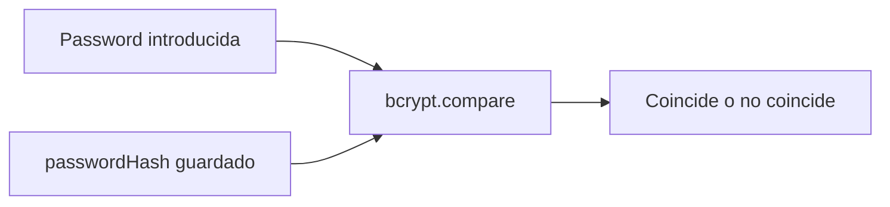
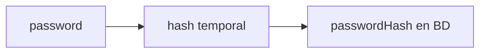
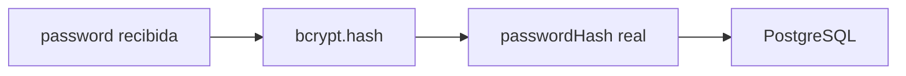
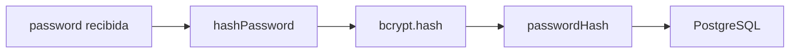

# Día 32: Contraseñas seguras con `bcrypt`

El **Día 32** abre la fase de **seguridad** de la nueva calendarización: dejamos de generar `passwordHash` temporales y empezamos a usar `bcrypt` para hashear contraseñas antes de guardarlas. Usaremos el paquete `bcrypt`, que está pensado para hashear contraseñas en Node.js, junto con sus tipos para TypeScript.

En el día 31 limpiamos y refactorizamos el proyecto.

Después de crear el CRUD persistente, revisamos la estructura, eliminamos código temporal y dejamos el backend preparado para empezar una nueva fase: **seguridad**.

Hasta ahora, cuando creábamos usuarios, usábamos un valor temporal para `passwordHash`.

Por ejemplo:

```ts
passwordHash: `hash_temporal_${cleanPassword}`
```

Esto nos permitió avanzar con el CRUD sin meternos todavía en seguridad.

Pero ese enfoque no es válido para una aplicación real.

Una API nunca debe guardar contraseñas en texto plano ni usar hashes falsos.

A partir de hoy vamos a usar una librería especializada: `bcrypt`.

`bcrypt` nos permite transformar una contraseña en un hash seguro antes de guardarla en la base de datos.

!!! info "Idea principal"
    La contraseña entra en la API, pero nunca debe guardarse tal cual en la base de datos.

## ¿Qué vamos a trabajar hoy?

Hoy trabajaremos estos conceptos:

- Seguridad.
- Contraseñas.
- Hash.
- `bcrypt`.
- Salt rounds.
- `password`.
- `passwordHash`.
- `hashPassword`.
- `comparePassword`.
- No guardar texto plano.
- No devolver `passwordHash`.
- Seed con hashes reales.

El producto del día será tener contraseñas hasheadas con `bcrypt` antes de guardarse en PostgreSQL.

El resultado esperado será que al crear usuarios ya no se guarde:

```text
hash_temporal_123456
```

sino un hash real generado por `bcrypt`.

## El problema actual

En nuestro servicio de usuarios probablemente tenemos algo parecido a esto:

```ts
return createUser({
  name: cleanName,
  email: cleanEmail,
  passwordHash: `hash_temporal_${cleanPassword}`
});
```

Esto era aceptable como paso temporal, pero tiene varios problemas:

- El hash no es real.
- La contraseña sigue siendo reconocible.
- No protege realmente los datos.
- No nos sirve para implementar login seguro.
- No es una práctica profesional.

Si alguien accediera a la base de datos y viera:

```text
hash_temporal_123456
```

podría deducir fácilmente la contraseña original.

Eso es justo lo que queremos evitar.

## Qué es un hash de contraseña

Un hash es una transformación de un dato original en una cadena diferente.

Por ejemplo, una contraseña como:

```text
123456
```

podría convertirse en algo parecido a:

```text
$2b$10$G4K1Lw7fZkR8Gk...
```

La idea es que la aplicación guarde el hash, no la contraseña.

Cuando el usuario quiera iniciar sesión, no compararemos la contraseña directamente con la base de datos.

Haremos esto:



Hoy nos centraremos sobre todo en generar hashes.

La comparación será muy importante en el login, que llegará en los próximos días.

## Password frente a passwordHash

Es importante diferenciar estos dos conceptos:

| Concepto       | Qué es                                              | Dónde debe estar    |
| -------------- | --------------------------------------------------- | ------------------- |
| `password`     | Contraseña que escribe el usuario                   | Solo en la petición |
| `passwordHash` | Resultado seguro generado a partir de la contraseña | Base de datos       |

La API puede recibir esto:

```json
{
  "name": "Ana García",
  "email": "ana@email.com",
  "password": "123456"
}
```

Pero en la base de datos guardará algo como:

```text
passwordHash = "$2b$10$..."
```

Nunca guardará:

```text
password = "123456"
```

## Qué son los salt rounds

Cuando usamos `bcrypt`, indicamos un número de rondas.

Por ejemplo:

```ts
const SALT_ROUNDS = 10;
```

Ese número influye en el coste del cálculo.

A mayor número, más trabajo cuesta generar el hash.

Para este reto usaremos:

`10`.

Es un valor habitual para desarrollo y suficientemente claro para aprender.

Más adelante, en un proyecto real, podríamos ajustar ese valor según rendimiento y necesidades de seguridad.

## Flujo seguro al crear usuario

El flujo actual puede ser:



Después de hoy será:



El usuario enviará `password`.

El servicio validará esa contraseña.

Después llamará a una utilidad de seguridad:

`hashPassword`.

Y finalmente guardará el resultado en:

`passwordHash`.

## Qué archivos vamos a tocar hoy

Hoy trabajaremos principalmente con estos archivos:

- `package.json`
- `src/services/user.service.ts`
- `src/utils/password.utils.ts`
- `prisma/seed.ts`
- `README.md`
- `docs/dia-32-bcrypt-passwords.md`

También comprobaremos los datos con:

Prisma Studio.

## Parte guiada

### Paso 1: Abrir el proyecto

Abre una terminal y entra en el repositorio:

```bash
cd usermanager-api
```

Comprueba que el proyecto compila antes de tocar nada:

```bash
npm run build
```

### Paso 2: Instalar `bcrypt`

Instala la librería:

```bash
npm install bcrypt
```

Instala también los tipos para TypeScript:

```bash
npm install -D @types/bcrypt
```

Después revisa `package.json`.

Deberías ver algo parecido a:

```json
"dependencies": {
  "@prisma/client": "...",
  "bcrypt": "..."
},
"devDependencies": {
  "@types/bcrypt": "...",
  "prisma": "...",
  "tsx": "...",
  "typescript": "..."
}
```

### Paso 3: Crear `password.utils.ts`

Dentro de `src/utils/`, crea:

```text
src/utils/password.utils.ts
```

Añade:

```ts
import bcrypt from "bcrypt";

const SALT_ROUNDS = 10;

export async function hashPassword(password: string) {
  return bcrypt.hash(password, SALT_ROUNDS);
}

export async function comparePassword(password: string, passwordHash: string) {
  return bcrypt.compare(password, passwordHash);
}
```

Aunque hoy usaremos principalmente `hashPassword`, dejamos también preparada `comparePassword` para el login.

### Paso 4: Entender `hashPassword`

La función:

```ts
export async function hashPassword(password: string) {
  return bcrypt.hash(password, SALT_ROUNDS);
}
```

recibe una contraseña en texto plano y devuelve un hash.

Ejemplo conceptual:

`123456 → $2b$10$...`

Ese hash será lo que guardaremos en la base de datos.

### Paso 5: Entender `comparePassword`

La función:

```ts
export async function comparePassword(password: string, passwordHash: string) {
  return bcrypt.compare(password, passwordHash);
}
```

servirá más adelante para login.

No necesitaremos recuperar la contraseña original.

Solo comprobaremos si la contraseña introducida coincide con el hash guardado.

Ejemplo conceptual:

- `comparePassword("123456", "$2b$10$...") → true`
- `comparePassword("otra", "$2b$10$...") → false`

## Modificar creación de usuarios

### Paso 6: Abrir `user.service.ts`

Abre:

```text
src/services/user.service.ts
```

Busca la función:

`createUserService`.

Dentro debería haber algo parecido a:

```ts
return createUser({
  name: cleanName,
  email: cleanEmail,
  passwordHash: `hash_temporal_${cleanPassword}`
});
```

Ese es el código que vamos a sustituir.

### Paso 7: Importar `hashPassword`

En `user.service.ts`, añade:

```ts
import { hashPassword } from "../utils/password.utils";
```

### Paso 8: Generar un hash real

Dentro de `createUserService`, antes de llamar a `createUser`, añade:

```ts
const passwordHash = await hashPassword(cleanPassword);
```

Después cambia la creación por:

```ts
return createUser({
  name: cleanName,
  email: cleanEmail,
  passwordHash
});
```

La parte final de `createUserService` debería quedar así:

```ts
  const existingUser = await findUserByEmail(cleanEmail);

  if (existingUser) {
    throw new AppError("El email ya está registrado", 409, {
      email: cleanEmail
    });
  }

  const passwordHash = await hashPassword(cleanPassword);

  return createUser({
    name: cleanName,
    email: cleanEmail,
    passwordHash
  });
}
```

Ahora ya no guardamos un hash temporal.

### Paso 9: Revisar que no devolvemos `passwordHash`

Aunque ahora el hash sea real, la regla sigue siendo la misma:

!!! danger "Regla importante"
    `passwordHash` nunca se devuelve al cliente.

Revisa:

`src/repositories/user.repository.ts`.

Asegúrate de que las funciones de creación y consulta usan:

```ts
select: userSafeSelect
```

Y que `userSafeSelect` no incluye:

`passwordHash`.

## Actualizar el seed

### Paso 10: Abrir `prisma/seed.ts`

Actualmente el seed puede tener algo como:

```ts
passwordHash: "hash_temporal_admin123"
```

Eso ya no nos interesa.

Queremos que los usuarios iniciales también tengan hashes reales.

### Paso 11: Importar `bcrypt` en el seed

En `prisma/seed.ts`, añade:

```ts
import bcrypt from "bcrypt";
```

### Paso 12: Crear constante `SALT_ROUNDS`

Añade:

```ts
const SALT_ROUNDS = 10;
```

### Paso 13: Generar hashes iniciales

Dentro de `main`, antes de crear usuarios, añade:

```ts
const adminPasswordHash = await bcrypt.hash("admin123", SALT_ROUNDS);
const userPasswordHash = await bcrypt.hash("user123", SALT_ROUNDS);
const inactivePasswordHash = await bcrypt.hash("inactive123", SALT_ROUNDS);
```

### Paso 14: Sustituir hashes temporales

Cambia:

```ts
passwordHash: "hash_temporal_admin123"
```

por:

```ts
passwordHash: adminPasswordHash
```

Cambia:

```ts
passwordHash: "hash_temporal_user123"
```

por:

```ts
passwordHash: userPasswordHash
```

Cambia:

```ts
passwordHash: "hash_temporal_inactive123"
```

por:

```ts
passwordHash: inactivePasswordHash
```

### Paso 15: Actualizar también usuarios existentes

En el seed del día 24 usamos:

```ts
update: {}
```

Eso significa que si el usuario ya existe, no se actualiza.

Ahora queremos que el seed pueda actualizar el `passwordHash` de los usuarios iniciales.

Cambia cada `update: {}` por algo como:

```ts
update: {
  passwordHash: adminPasswordHash
}
```

Para el admin.

Para el usuario normal:

```ts
update: {
  passwordHash: userPasswordHash
}
```

Para el inactivo:

```ts
update: {
  passwordHash: inactivePasswordHash
}
```

Así, si ya existían con hashes temporales, el seed los actualizará.

### Paso 16: Seed actualizado completo

El seed debería quedar parecido a esto:

```ts
import bcrypt from "bcrypt";
import { PrismaClient, Role } from "@prisma/client";

const prisma = new PrismaClient();
const SALT_ROUNDS = 10;

async function main() {
  const adminPasswordHash = await bcrypt.hash("admin123", SALT_ROUNDS);
  const userPasswordHash = await bcrypt.hash("user123", SALT_ROUNDS);
  const inactivePasswordHash = await bcrypt.hash("inactive123", SALT_ROUNDS);

  const admin = await prisma.user.upsert({
    where: {
      email: "admin@email.com"
    },
    update: {
      passwordHash: adminPasswordHash
    },
    create: {
      name: "Admin Principal",
      email: "admin@email.com",
      passwordHash: adminPasswordHash,
      role: Role.ADMIN,
      isActive: true
    }
  });

  const user = await prisma.user.upsert({
    where: {
      email: "user@email.com"
    },
    update: {
      passwordHash: userPasswordHash
    },
    create: {
      name: "Usuario Demo",
      email: "user@email.com",
      passwordHash: userPasswordHash,
      role: Role.USER,
      isActive: true
    }
  });

  const inactiveUser = await prisma.user.upsert({
    where: {
      email: "inactive@email.com"
    },
    update: {
      passwordHash: inactivePasswordHash
    },
    create: {
      name: "Usuario Inactivo",
      email: "inactive@email.com",
      passwordHash: inactivePasswordHash,
      role: Role.USER,
      isActive: false
    }
  });

  console.log("Seed ejecutado correctamente:");
  console.log({ admin, user, inactiveUser });
}

main()
  .then(async () => {
    await prisma.$disconnect();
  })
  .catch(async (error) => {
    console.error("Error ejecutando el seed:", error);
    await prisma.$disconnect();
    process.exit(1);
  });
```

## Probar el cambio

### Paso 17: Ejecutar el seed

Ejecuta:

```bash
npm run prisma:seed
```

O:

```bash
npx prisma db seed
```

Esto actualizará los usuarios iniciales.

### Paso 18: Abrir Prisma Studio

Ejecuta:

```bash
npm run prisma:studio
```

Entra en la tabla:

`User`.

Revisa el campo:

`passwordHash`.

Deberías ver valores parecidos a:

`$2b$10$...`

Ya no deberías ver:

- `hash_temporal_admin123`
- `hash_temporal_user123`
- `hash_temporal_inactive123`

### Paso 19: Crear un usuario nuevo desde la API

Arranca la API:

```bash
npm run dev
```

Crea un usuario:

`POST http://localhost:3000/api/users`

Body:

```json
{
  "name": "Usuario Seguro",
  "email": "usuario.seguro@email.com",
  "password": "123456"
}
```

Respuesta esperada:

`201 Created`.

La respuesta no debe incluir:

`passwordHash`.

### Paso 20: Comprobar el usuario en Prisma Studio

Vuelve a Prisma Studio.

Busca:

`usuario.seguro@email.com`.

Comprueba que `passwordHash` tiene formato de hash `bcrypt`.

Debería empezar de forma parecida a:

`$2b$10$`.

Esto confirma que el servicio está usando `hashPassword`.

## Probar comparación de contraseña

### Paso 21: Crear script temporal de prueba

Para comprobar que `comparePassword` funciona, puedes crear un archivo temporal:

```text
src/debug-password.ts
```

Añade:

```ts
import { comparePassword, hashPassword } from "./utils/password.utils";

async function main() {
  const password = "123456";
  const hash = await hashPassword(password);

  console.log("Password:", password);
  console.log("Hash:", hash);

  const isCorrect = await comparePassword("123456", hash);
  const isIncorrect = await comparePassword("otra-password", hash);

  console.log("Coincide password correcta:", isCorrect);
  console.log("Coincide password incorrecta:", isIncorrect);
}

main();
```

Ejecuta:

```bash
npx tsx src/debug-password.ts
```

Resultado esperado:

- `Coincide password correcta: true`
- `Coincide password incorrecta: false`

Después puedes eliminar el archivo temporal:

`src/debug-password.ts`.

O dejarlo fuera del commit si solo era una prueba.

## Actualizar documentación del README

### Paso 22: Añadir sección de seguridad

En el README, añade:

````md
## Seguridad de contraseñas

El proyecto usa `bcrypt` para hashear contraseñas antes de guardarlas en la base de datos.

Instalación:

```bash
npm install bcrypt
npm install -D @types/bcrypt
```

Utilidades principales:

```text
src/utils/password.utils.ts
```

Funciones:

```ts
hashPassword(password)
comparePassword(password, passwordHash)
```

Reglas:

- La API recibe `password`.
- La base de datos guarda `passwordHash`.
- La contraseña en texto plano nunca se guarda.
- `passwordHash` nunca se devuelve al cliente.
````

### Paso 23: Actualizar arquitectura

En la sección de estructura, añade:

```text
src/utils/password.utils.ts
```

La estructura debería quedar parecida a:

```text
src/
  prisma.ts
  server.ts
  controllers/
  errors/
  repositories/
  routes/
  services/
  utils/
    parse.utils.ts
    string.utils.ts
    password.utils.ts
```

### Paso 24: Actualizar índice del README

Añade:

```md
- [Día 32 - Contraseñas seguras con bcrypt](docs/dia-32-bcrypt-passwords.md)
```

El bloque debería quedar parecido a:

```md
## Documentación del reto

- [Día 1 - Diseño inicial](docs/dia-01-diseno-inicial.md)
- [Día 2 - Preparación del proyecto](docs/dia-02-preparacion-proyecto.md)
- [Día 3 - Primer endpoint](docs/dia-03-primer-endpoint.md)
- [Día 4 - Métodos HTTP](docs/dia-04-metodos-http.md)
- [Día 5 - JSON, body, params y headers](docs/dia-05-json-body-params-headers.md)
- [Día 6 - Cliente HTTP y depuración](docs/dia-06-cliente-http-depuracion.md)
- [Día 7 - Listado de usuarios en memoria](docs/dia-07-listado-usuarios.md)
- [Día 8 - Consultar usuario por ID](docs/dia-08-consultar-usuario-id.md)
- [Día 9 - Crear usuarios en memoria](docs/dia-09-crear-usuarios.md)
- [Día 10 - Actualizar usuarios en memoria](docs/dia-10-actualizar-usuarios.md)
- [Día 11 - Eliminar o desactivar usuarios en memoria](docs/dia-11-eliminar-desactivar-usuarios.md)
- [Día 12 - Validación manual básica](docs/dia-12-validacion-manual-basica.md)
- [Día 13 - Validación de email y duplicados](docs/dia-13-validacion-email-duplicados.md)
- [Día 14 - Códigos de estado HTTP](docs/dia-14-codigos-estado-http.md)
- [Día 15 - Middleware centralizado de errores](docs/dia-15-middleware-errores.md)
- [Día 16 - Base de datos y persistencia](docs/dia-16-base-datos-persistencia.md)
- [Día 17 - PostgreSQL con Docker Compose](docs/dia-17-postgresql-docker-compose.md)
- [Día 18 - Diseño del modelo persistente User](docs/dia-18-diseno-modelo-persistente-user.md)
- [Día 19 - ORM o acceso a datos](docs/dia-19-orm-acceso-datos.md)
- [Día 20 - Instalación y configuración inicial de Prisma](docs/dia-20-instalacion-prisma.md)
- [Día 21 - Modelo Prisma User](docs/dia-21-modelo-prisma-user.md)
- [Día 22 - Primera migración con Prisma](docs/dia-22-primera-migracion-prisma.md)
- [Día 23 - Prisma Studio](docs/dia-23-prisma-studio.md)
- [Día 24 - Seed de datos iniciales](docs/dia-24-seed-datos-iniciales.md)
- [Día 25 - Consultas básicas con Prisma Client](docs/dia-25-consultas-basicas-prisma.md)
- [Día 26 - Separar rutas](docs/dia-26-separar-rutas.md)
- [Día 27 - Controladores](docs/dia-27-controladores.md)
- [Día 28 - Servicios](docs/dia-28-servicios.md)
- [Día 29 - Repositorio con Prisma](docs/dia-29-repositorio-prisma.md)
- [Día 30 - CRUD persistente ordenado](docs/dia-30-crud-persistente-ordenado.md)
- [Día 31 - Limpieza y refactor](docs/dia-31-limpieza-refactor.md)
- [Día 32 - Contraseñas seguras con bcrypt](docs/dia-32-bcrypt-passwords.md)
```

## Crear el documento del día 32

Dentro de la carpeta `docs/`, crea:

```text
docs/dia-32-bcrypt-passwords.md
```

Añade este contenido inicial:

````md
# Día 32 - Contraseñas seguras con bcrypt

## Qué he hecho

- He instalado bcrypt.
- He instalado los tipos de bcrypt para TypeScript.
- He creado password.utils.ts.
- He creado hashPassword.
- He creado comparePassword.
- He sustituido passwordHash temporal por un hash real.
- He actualizado createUserService.
- He actualizado el seed para generar hashes reales.
- He ejecutado el seed.
- He comprobado los hashes en Prisma Studio.
- He creado un usuario desde la API y he comprobado que se guarda con hash bcrypt.

## Dependencias instaladas

```bash
npm install bcrypt
npm install -D @types/bcrypt
```

## Archivo creado

```text
src/utils/password.utils.ts
```

## Funciones creadas

```ts
hashPassword(password)
comparePassword(password, passwordHash)
```

## Diferencia entre password y passwordHash

| Campo | Significado |
| --- | --- |
| `password` | Contraseña que llega en la petición |
| `passwordHash` | Hash seguro que se guarda en la base de datos |

## Regla de seguridad

```text
La contraseña en texto plano nunca se guarda.
passwordHash nunca se devuelve al cliente.
```

## Cambios en el seed

Los usuarios iniciales ya no usan valores temporales como:

```text
hash_temporal_admin123
```

Ahora usan hashes reales generados con bcrypt.

## Explicación personal

bcrypt permite convertir una contraseña en un hash seguro antes de guardarla. De esta forma, aunque alguien accediera a la base de datos, no vería la contraseña original.
````

### Paso 25: Añadir diagrama Mermaid

Añade al documento:



### Paso 26: Añadir checklist de comprobación

Añade:

```md
## Checklist de comprobación

| Prueba | Resultado |
| --- | --- |
| `npm install bcrypt` ejecutado | |
| `password.utils.ts` creado | |
| `createUserService` usa `hashPassword` | |
| El seed usa bcrypt | |
| `npm run prisma:seed` funciona | |
| Prisma Studio muestra hashes reales | |
| `POST /api/users` crea usuario con hash real | |
| La respuesta no incluye `passwordHash` | |
| `npm run build` funciona | |
```

## Probar build

### Paso 27: Compilar TypeScript

Ejecuta:

```bash
npm run build
```

Si hay errores, revisa:

- Imports de `bcrypt`.
- Tipos de `@types/bcrypt`.
- Ruta de `password.utils.ts`.
- Imports en `user.service.ts`.
- Imports en `seed.ts`.

## Guardar cambios en Git

### Paso 28: Revisar cambios

```bash
git status
```

Deberías ver cambios en:

- `package.json`
- `package-lock.json`
- `src/utils/password.utils.ts`
- `src/services/user.service.ts`
- `prisma/seed.ts`
- `README.md`
- `docs/dia-32-bcrypt-passwords.md`

### Paso 29: Añadir archivos

```bash
git add .
```

### Paso 30: Crear commit

```bash
git commit -m "Dia 32 - Hashear contrasenas con bcrypt"
```

### Paso 31: Subir cambios

```bash
git push
```

## Problemas frecuentes

### Error al importar bcrypt

Si usas:

```ts
import bcrypt from "bcrypt";
```

y TypeScript da problemas, revisa que en `tsconfig.json` tienes:

```json
"esModuleInterop": true
```

Si aun así fallara, puedes usar:

```ts
import * as bcrypt from "bcrypt";
```

### Error: no encuentra tipos de bcrypt

Instala:

```bash
npm install -D @types/bcrypt
```

### El seed sigue mostrando hashes temporales

Revisa que has cambiado los tres usuarios:

- `admin`
- `user`
- `inactiveUser`

Y que has ejecutado:

```bash
npm run prisma:seed
```

### Los usuarios existentes no se actualizan

Recuerda que si el seed tiene:

```ts
update: {}
```

no actualizará usuarios existentes.

Cambia a:

```ts
update: {
  passwordHash: adminPasswordHash
}
```

### La respuesta de la API muestra `passwordHash`

Esto no debería pasar.

Revisa:

`src/repositories/user.repository.ts`.

Y asegúrate de que todas las funciones usan:

```ts
select: userSafeSelect
```

### `comparePassword` devuelve false siempre

Comprueba que estás comparando:

- La contraseña original.
- Con el `passwordHash` generado por `bcrypt`.

No compares dos hashes generados por separado, porque bcrypt añade sal y pueden ser distintos aunque la contraseña sea la misma.

## Parte libre

### Tarea libre 1: Explicar por qué no guardamos password

Añade una sección:

```md
## Por qué no guardamos password
```

Explica con tus palabras por qué la base de datos debe guardar `passwordHash` y no `password`.

### Tarea libre 2: Probar `comparePassword`

Crea un script temporal o una prueba manual para comprobar:

- Contraseña correcta: `true`.
- Contraseña incorrecta: `false`.

Después documenta el resultado.

### Tarea libre 3: Revisar usuarios antiguos

Comprueba en Prisma Studio si hay usuarios creados antes del día 32 con hashes temporales.

Si los hay, puedes:

- Actualizarlos manualmente.
- Borrarlos.
- Recrearlos desde la API.
- Dejarlos documentados como datos antiguos de prueba.

### Tarea libre 4: Mejorar el seed

Añade una pequeña sección al seed con comentarios:

```ts
// Estos passwords son solo para entorno de desarrollo.
// En producción no se deberían usar credenciales predecibles.
```

### Tarea libre 5: Preparar el día 33

Añade una sección:

```md
## Preparación para registro
```

Responde:

- ¿Qué diferencia habrá entre `POST /api/users` y `POST /api/auth/register`?
- ¿Debe `register` devolver `passwordHash`?
- ¿Qué campos necesitará el registro?
- ¿Qué pasará si el email ya existe?

Pistas:

- `POST /api/auth/register`
- `name`
- `email`
- `password`
- `role` por defecto `USER`
- `isActive` por defecto `true`

## Entrega recomendada del día 32

Las respuestas no se entregan como archivo suelto. Deben quedar dentro del repositorio de GitHub.

Al finalizar el día 32, el repositorio debería tener esta estructura aproximada:

```text
usermanager-api/
  .env.example
  .gitignore
  docker-compose.yml
  README.md
  package.json
  package-lock.json
  tsconfig.json
  prisma/
    schema.prisma
    seed.ts
    migrations/
      <timestamp>_init/
        migration.sql
  src/
    prisma.ts
    server.ts
    controllers/
      health.controller.ts
      user.controller.ts
    errors/
      AppError.ts
    repositories/
      user.repository.ts
    routes/
      health.routes.ts
      user.routes.ts
    services/
      user.service.ts
    utils/
      parse.utils.ts
      string.utils.ts
      password.utils.ts
  docs/
    dia-01-diseno-inicial.md
    dia-02-preparacion-proyecto.md
    dia-03-primer-endpoint.md
    dia-04-metodos-http.md
    dia-05-json-body-params-headers.md
    dia-06-cliente-http-depuracion.md
    dia-07-listado-usuarios.md
    dia-08-consultar-usuario-id.md
    dia-09-crear-usuarios.md
    dia-10-actualizar-usuarios.md
    dia-11-eliminar-desactivar-usuarios.md
    dia-12-validacion-manual-basica.md
    dia-13-validacion-email-duplicados.md
    dia-14-codigos-estado-http.md
    dia-15-middleware-errores.md
    dia-16-base-datos-persistencia.md
    dia-17-postgresql-docker-compose.md
    dia-18-diseno-modelo-persistente-user.md
    dia-19-orm-acceso-datos.md
    dia-20-instalacion-prisma.md
    dia-21-modelo-prisma-user.md
    dia-22-primera-migracion-prisma.md
    dia-23-prisma-studio.md
    dia-24-seed-datos-iniciales.md
    dia-25-consultas-basicas-prisma.md
    dia-26-separar-rutas.md
    dia-27-controladores.md
    dia-28-servicios.md
    dia-29-repositorio-prisma.md
    dia-30-crud-persistente-ordenado.md
    dia-31-limpieza-refactor.md
    dia-32-bcrypt-passwords.md
```

El documento del día 32 deberá estar en:

```text
docs/dia-32-bcrypt-passwords.md
```

Y deberá incluir:

- Resumen de lo realizado.
- Dependencias instaladas.
- Archivo `password.utils.ts`.
- Funciones `hashPassword` y `comparePassword`.
- Diferencia entre `password` y `passwordHash`.
- Regla de seguridad.
- Cambios en el seed.
- Diagrama del flujo de hash.
- Checklist de comprobación.
- Pruebas realizadas.
- Preparación para registro.

En el foro, se compartirá el enlace actualizado al repositorio.

Ejemplo de mensaje:

```text
Hola, comparto el avance del día 32 del reto UserManager API:

https://github.com/usuario/usermanager-api

He empezado la fase de seguridad usando bcrypt para hashear contraseñas antes de guardarlas. La documentación está en:

docs/dia-32-bcrypt-passwords.md
```

## Cierre del día

Hoy hemos dado el primer paso real en seguridad.

Hasta ahora teníamos un CRUD persistente, pero las contraseñas todavía se gestionaban de forma temporal. A partir de hoy, la API ya genera hashes reales con `bcrypt`.

Hoy hemos trabajado:

- `bcrypt`.
- Hash de contraseñas.
- `password`.
- `passwordHash`.
- `hashPassword`.
- `comparePassword`.
- Seed con hashes reales.
- No devolver `passwordHash`.
- Prisma Studio.
- Build de TypeScript.

Este día prepara directamente el registro y el login.

En el próximo paso crearemos el endpoint:

`POST /api/auth/register`.

!!! success "Idea clave"
    Una contraseña nunca debe guardarse tal cual; la API debe transformarla en un hash seguro antes de almacenarla en la base de datos.
