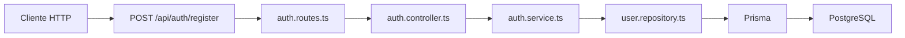
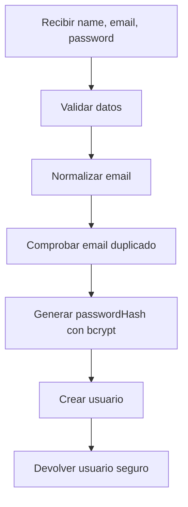
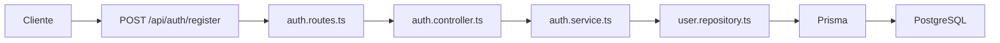

# Día 33: Registro de usuarios

En el día 32 empezamos la fase de seguridad.

Hasta ese momento, las contraseñas se guardaban con valores temporales como:

`hash_temporal_123456`.

Después del día 32, el proyecto ya usa `bcrypt` para generar hashes reales:

`password → bcrypt.hash → passwordHash`.

También creamos una utilidad:

`src/utils/password.utils.ts`

con funciones como:

```ts
hashPassword(password)
comparePassword(password, passwordHash)
```

Hoy vamos a crear el primer endpoint específico de autenticación:

`POST /api/auth/register`.

Este endpoint permitirá registrar nuevos usuarios.

Hasta ahora ya teníamos:

`POST /api/users`

pero esa ruta pertenece al CRUD de usuarios.

A partir de ahora vamos a separar dos conceptos:

- Crear usuarios desde el CRUD.
- Registrar usuarios desde autenticación.

!!! info "Idea principal"
    El registro es el punto de entrada para que un usuario cree su propia cuenta.

## ¿Qué vamos a trabajar hoy?

Hoy trabajaremos estos conceptos:

- Registro.
- Auth.
- `POST /api/auth/register`.
- `auth.routes.ts`.
- `auth.controller.ts`.
- `auth.service.ts`.
- Reutilización de `bcrypt`.
- Validación de datos.
- Email duplicado.
- Rol por defecto `USER`.
- Usuario activo por defecto.
- Separación entre CRUD y autenticación.

El producto del día será el endpoint `POST /api/auth/register` funcionando.

El resultado esperado será que podamos registrar usuarios nuevos desde una ruta específica de autenticación.

## Diferencia entre crear usuario y registrar usuario

En el día 30 creamos el CRUD persistente de usuarios.

Una de las rutas era:

`POST /api/users`.

Esa ruta crea usuarios desde el módulo de usuarios.

Más adelante, cuando tengamos roles y permisos, lo normal será que esa ruta quede reservada para administradores.

En cambio, el registro será:

`POST /api/auth/register`.

Esta ruta representará el alta de una cuenta por parte de un usuario.

Podemos verlo así:

| Ruta                      | Uso actual               | Uso futuro   |
| ------------------------- | ------------------------ | ------------ |
| `POST /api/users`         | Crear usuario desde CRUD | Solo ADMIN   |
| `POST /api/auth/register` | Registro de cuenta       | Ruta pública |

Hoy todavía no aplicaremos permisos.

Eso llegará más adelante.

Pero ya empezamos a separar responsabilidades.

## Qué debe hacer el registro

El endpoint de registro debe recibir:

```json
{
  "name": "Usuario Nuevo",
  "email": "nuevo@email.com",
  "password": "123456"
}
```

Después debe aplicar estas reglas:

- `name` es obligatorio.
- `email` es obligatorio.
- `password` es obligatorio.
- `email` debe tener formato válido.
- `password` debe tener al menos 6 caracteres.
- `email` no puede estar repetido.
- `password` debe transformarse en `passwordHash` con `bcrypt`.
- `role` debe ser `USER` por defecto.
- `isActive` debe ser `true` por defecto.
- `passwordHash` nunca se devuelve al cliente.

La respuesta correcta será algo parecido a:

```json
{
  "message": "Usuario registrado correctamente",
  "data": {
    "id": 5,
    "name": "Usuario Nuevo",
    "email": "nuevo@email.com",
    "role": "USER",
    "isActive": true,
    "createdAt": "...",
    "updatedAt": "..."
  }
}
```

Observa que no aparece:

`passwordHash`.

## Qué no haremos todavía

Hoy no haremos login.

Tampoco generaremos token JWT.

Eso llegará en los próximos días:

| Día | Tema |
| --- | --- |
| Día 33 | Registro |
| Día 34 | Login |
| Día 35 | JWT |
| Día 36 | Middleware de autenticación |
| Día 37 | Roles y permisos |

Por tanto, después del registro no devolveremos todavía un token.

Hoy solo devolveremos el usuario creado de forma segura.

## Flujo del registro

El flujo será:



Dentro del servicio ocurrirá la parte de seguridad:



## Qué archivos vamos a crear

Hoy crearemos tres archivos nuevos:

- `src/routes/auth.routes.ts`
- `src/controllers/auth.controller.ts`
- `src/services/auth.service.ts`

Y modificaremos:

- `src/server.ts`
- `README.md`
- `docs/dia-33-auth-register.md`

La estructura quedará así:

```text
src/
  prisma.ts
  server.ts
  controllers/
    auth.controller.ts
    health.controller.ts
    user.controller.ts
  errors/
    AppError.ts
  repositories/
    user.repository.ts
  routes/
    auth.routes.ts
    health.routes.ts
    user.routes.ts
  services/
    auth.service.ts
    user.service.ts
  utils/
    parse.utils.ts
    password.utils.ts
    string.utils.ts
```

## Parte guiada

### Paso 1: Abrir el proyecto

Abre una terminal y entra en el repositorio:

```bash
cd usermanager-api
```

Comprueba que el proyecto compila antes de empezar:

```bash
npm run build
```

### Paso 2: Crear `auth.service.ts`

Dentro de `src/services/`, crea:

```text
src/services/auth.service.ts
```

Este archivo contendrá la lógica de autenticación.

Hoy solo tendrá registro.

Más adelante tendrá login.

### Paso 3: Preparar imports del servicio

Añade:

```ts
import { AppError } from "../errors/AppError";
import { createUser, findUserByEmail } from "../repositories/user.repository";
import { hashPassword } from "../utils/password.utils";
import {
  isNonEmptyString,
  isValidBasicEmail,
  normalizeEmail
} from "../utils/string.utils";
```

Usaremos:

| Elemento | Para qué sirve |
| --- | --- |
| `AppError` | Gestionar errores controlados |
| `createUser` | Crear usuario en base de datos |
| `findUserByEmail` | Comprobar duplicados |
| `hashPassword` | Generar `passwordHash` real |
| `string.utils` | Validar y normalizar datos |

### Paso 4: Crear tipo `RegisterInput`

Añade:

```ts
type RegisterInput = {
  name: unknown;
  email: unknown;
  password: unknown;
};
```

Usamos `unknown` porque los datos vienen del body de la petición.

No debemos confiar en ellos directamente.

### Paso 5: Crear `registerService`

Añade esta función:

```ts
export async function registerService(input: RegisterInput) {
  const { name, email, password } = input;

  if (!isNonEmptyString(name)) {
    throw new AppError("El nombre debe ser un texto no vacío", 400);
  }

  if (!isNonEmptyString(email)) {
    throw new AppError("El email debe ser un texto no vacío", 400);
  }

  if (!isNonEmptyString(password)) {
    throw new AppError("La contraseña debe ser un texto no vacío", 400);
  }

  const cleanName = name.trim();
  const cleanEmail = normalizeEmail(email);
  const cleanPassword = password.trim();

  if (!isValidBasicEmail(cleanEmail)) {
    throw new AppError("El email no tiene un formato válido", 400);
  }

  if (cleanPassword.length < 6) {
    throw new AppError("La contraseña debe tener al menos 6 caracteres", 400);
  }

  const existingUser = await findUserByEmail(cleanEmail);

  if (existingUser) {
    throw new AppError("El email ya está registrado", 409, {
      email: cleanEmail
    });
  }

  const passwordHash = await hashPassword(cleanPassword);

  return createUser({
    name: cleanName,
    email: cleanEmail,
    passwordHash
  });
}
```

Esta función hace todo el proceso de registro.

### Paso 6: Analizar qué hace `registerService`

La función realiza estos pasos:

- Recibe datos.
- Valida `name`.
- Valida `email`.
- Valida `password`.
- Normaliza `email`.
- Comprueba formato básico de `email`.
- Comprueba longitud mínima de `password`.
- Comprueba si el `email` ya existe.
- Genera `passwordHash` con `bcrypt`.
- Crea el usuario.
- Devuelve usuario seguro.

La creación final no indica `role` ni `isActive`:

```ts
return createUser({
  name: cleanName,
  email: cleanEmail,
  passwordHash
});
```

Esto permite que Prisma aplique los valores por defecto:

- `role → USER`
- `isActive → true`

## Crear controlador de auth

### Paso 7: Crear `auth.controller.ts`

Dentro de `src/controllers/`, crea:

```text
src/controllers/auth.controller.ts
```

Añade:

```ts
import { Request, Response, NextFunction } from "express";
import { registerService } from "../services/auth.service";

export async function registerController(
  req: Request,
  res: Response,
  next: NextFunction
) {
  try {
    const user = await registerService(req.body);

    return res.status(201).json({
      message: "Usuario registrado correctamente",
      data: user
    });
  } catch (error) {
    next(error);
  }
}
```

Este controlador se encarga de:

- Recibir la petición.
- Llamar al servicio.
- Responder con `201`.
- Pasar errores al middleware.

No valida directamente los campos.

La validación está en el servicio.

## Crear rutas de auth

### Paso 8: Crear `auth.routes.ts`

Dentro de `src/routes/`, crea:

```text
src/routes/auth.routes.ts
```

Añade:

```ts
import { Router } from "express";
import { registerController } from "../controllers/auth.controller";

export const authRouter = Router();

authRouter.post("/register", registerController);
```

Esta ruta interna será:

`/register`.

El prefijo `/api/auth` se añadirá en `server.ts`.

### Paso 9: Montar `authRouter` en `server.ts`

Abre:

```text
src/server.ts
```

Importa el router:

```ts
import { authRouter } from "./routes/auth.routes";
```

Después móntalo:

```ts
app.use("/api/auth", authRouter);
```

La sección de rutas debería quedar parecida a:

```ts
app.use("/api/health", healthRouter);
app.use("/api/auth", authRouter);
app.use("/api/users", userRouter);
```

El orden no es crítico aquí, pero es habitual dejar `auth` antes de rutas protegidas.

## Probar el registro

### Paso 10: Arrancar PostgreSQL

Ejecuta:

```bash
docker compose up -d
```

### Paso 11: Arrancar la API

Ejecuta:

```bash
npm run dev
```

### Paso 12: Probar registro correcto

Haz una petición:

`POST http://localhost:3000/api/auth/register`

Body:

```json
{
  "name": "Usuario Registro",
  "email": "usuario.registro@email.com",
  "password": "123456"
}
```

Respuesta esperada:

`201 Created`.

Respuesta aproximada:

```json
{
  "message": "Usuario registrado correctamente",
  "data": {
    "id": 6,
    "name": "Usuario Registro",
    "email": "usuario.registro@email.com",
    "role": "USER",
    "isActive": true,
    "createdAt": "...",
    "updatedAt": "..."
  }
}
```

Comprueba que no aparece:

`passwordHash`.

### Paso 13: Comprobar en Prisma Studio

Abre Prisma Studio:

```bash
npm run prisma:studio
```

Entra en:

`User`.

Busca:

`usuario.registro@email.com`.

Comprueba que:

- `role` es `USER`.
- `isActive` es `true`.
- `passwordHash` empieza con algo parecido a `$2b$10$`.

## Probar errores

### Paso 14: Email duplicado

Repite la misma petición:

```json
{
  "name": "Usuario Registro",
  "email": "usuario.registro@email.com",
  "password": "123456"
}
```

Respuesta esperada:

`409 Conflict`.

Mensaje esperado:

```json
{
  "error": "El email ya está registrado"
}
```

### Paso 15: Email inválido

Prueba:

```json
{
  "name": "Usuario Malo",
  "email": "correo-sin-formato",
  "password": "123456"
}
```

Respuesta esperada:

`400 Bad Request`.

### Paso 16: Password corta

Prueba:

```json
{
  "name": "Usuario Password Corta",
  "email": "password.corta@email.com",
  "password": "123"
}
```

Respuesta esperada:

`400 Bad Request`.

### Paso 17: Name vacío

Prueba:

```json
{
  "name": "",
  "email": "sin.nombre@email.com",
  "password": "123456"
}
```

Respuesta esperada:

`400 Bad Request`.

### Paso 18: Intentar enviar un rol

Prueba enviar un body con `role`:

```json
{
  "name": "Usuario Rol",
  "email": "usuario.rol@email.com",
  "password": "123456",
  "role": "ADMIN"
}
```

El usuario debe crearse como:

`USER`.

Esto ocurre porque `registerService` ignora el campo `role`.

En el registro público no permitimos que un usuario elija ser administrador.

## Revisar diferencias con `POST /api/users`

### Paso 19: Comparar endpoints

Ahora tenemos dos formas de crear usuarios:

- `POST /api/users`
- `POST /api/auth/register`

Por ahora pueden parecer parecidas.

Pero conceptualmente no son lo mismo.

| Endpoint                  | Responsabilidad                            |
| ------------------------- | ------------------------------------------ |
| `POST /api/auth/register` | Registro público de usuarios               |
| `POST /api/users`         | Creación de usuarios desde gestión interna |

Más adelante:

- `POST /api/auth/register` será público.
- `POST /api/users` será solo para `ADMIN`.

## Revisar si hay duplicación

### Paso 20: Comparar `createUserService` y `registerService`

Es posible que `createUserService` y `registerService` se parezcan mucho.

Eso es normal.

Ambas crean usuarios, pero tienen intenciones distintas.

Podríamos reutilizar una función común, pero hoy no es necesario complicar más el proyecto.

De momento, lo importante es entender la separación:

- `user.service.ts`: lógica del módulo usuarios.
- `auth.service.ts`: lógica de autenticación.

En un proyecto real, podríamos extraer una función interna compartida.

## Ejecutar build

### Paso 21: Compilar TypeScript

Ejecuta:

```bash
npm run build
```

Si aparece algún error, revisa:

- Imports de `auth.routes.ts`.
- Imports de `auth.controller.ts`.
- Imports de `auth.service.ts`.
- Montaje en `server.ts`.
- Rutas relativas.

## Actualizar README

### Paso 22: Añadir sección de Auth

En el README, añade:

````md
## Autenticación

El proyecto ya incluye una primera ruta de autenticación para registro de usuarios.

Ruta:

`POST /api/auth/register`

Body esperado:

```json
{
  "name": "Usuario Nuevo",
  "email": "nuevo@email.com",
  "password": "123456"
}
```

Respuesta correcta:

`201 Created`.

Reglas:

- El email no puede estar repetido.
- La contraseña se guarda como `passwordHash` usando `bcrypt`.
- El usuario se registra con `role USER` por defecto.
- El usuario se registra activo por defecto.
- `passwordHash` nunca se devuelve al cliente.

Todavía no se genera token JWT. Eso se añadirá más adelante.
````

### Paso 23: Actualizar arquitectura

Añade los nuevos archivos a la estructura:

```text
src/
  controllers/
    auth.controller.ts
  routes/
    auth.routes.ts
  services/
    auth.service.ts
```

La estructura puede quedar así:

```text
src/
  prisma.ts
  server.ts
  controllers/
    auth.controller.ts
    health.controller.ts
    user.controller.ts
  errors/
    AppError.ts
  repositories/
    user.repository.ts
  routes/
    auth.routes.ts
    health.routes.ts
    user.routes.ts
  services/
    auth.service.ts
    user.service.ts
  utils/
    parse.utils.ts
    password.utils.ts
    string.utils.ts
```

### Paso 24: Actualizar índice del README

Añade:

```md
- [Día 33 - Registro de usuarios](docs/dia-33-auth-register.md)
```

El bloque debería quedar parecido a:

```md
## Documentación del reto

- [Día 1 - Diseño inicial](docs/dia-01-diseno-inicial.md)
- [Día 2 - Preparación del proyecto](docs/dia-02-preparacion-proyecto.md)
- [Día 3 - Primer endpoint](docs/dia-03-primer-endpoint.md)
- [Día 4 - Métodos HTTP](docs/dia-04-metodos-http.md)
- [Día 5 - JSON, body, params y headers](docs/dia-05-json-body-params-headers.md)
- [Día 6 - Cliente HTTP y depuración](docs/dia-06-cliente-http-depuracion.md)
- [Día 7 - Listado de usuarios en memoria](docs/dia-07-listado-usuarios.md)
- [Día 8 - Consultar usuario por ID](docs/dia-08-consultar-usuario-id.md)
- [Día 9 - Crear usuarios en memoria](docs/dia-09-crear-usuarios.md)
- [Día 10 - Actualizar usuarios en memoria](docs/dia-10-actualizar-usuarios.md)
- [Día 11 - Eliminar o desactivar usuarios en memoria](docs/dia-11-eliminar-desactivar-usuarios.md)
- [Día 12 - Validación manual básica](docs/dia-12-validacion-manual-basica.md)
- [Día 13 - Validación de email y duplicados](docs/dia-13-validacion-email-duplicados.md)
- [Día 14 - Códigos de estado HTTP](docs/dia-14-codigos-estado-http.md)
- [Día 15 - Middleware centralizado de errores](docs/dia-15-middleware-errores.md)
- [Día 16 - Base de datos y persistencia](docs/dia-16-base-datos-persistencia.md)
- [Día 17 - PostgreSQL con Docker Compose](docs/dia-17-postgresql-docker-compose.md)
- [Día 18 - Diseño del modelo persistente User](docs/dia-18-diseno-modelo-persistente-user.md)
- [Día 19 - ORM o acceso a datos](docs/dia-19-orm-acceso-datos.md)
- [Día 20 - Instalación y configuración inicial de Prisma](docs/dia-20-instalacion-prisma.md)
- [Día 21 - Modelo Prisma User](docs/dia-21-modelo-prisma-user.md)
- [Día 22 - Primera migración con Prisma](docs/dia-22-primera-migracion-prisma.md)
- [Día 23 - Prisma Studio](docs/dia-23-prisma-studio.md)
- [Día 24 - Seed de datos iniciales](docs/dia-24-seed-datos-iniciales.md)
- [Día 25 - Consultas básicas con Prisma Client](docs/dia-25-consultas-basicas-prisma.md)
- [Día 26 - Separar rutas](docs/dia-26-separar-rutas.md)
- [Día 27 - Controladores](docs/dia-27-controladores.md)
- [Día 28 - Servicios](docs/dia-28-servicios.md)
- [Día 29 - Repositorio con Prisma](docs/dia-29-repositorio-prisma.md)
- [Día 30 - CRUD persistente ordenado](docs/dia-30-crud-persistente-ordenado.md)
- [Día 31 - Limpieza y refactor](docs/dia-31-limpieza-refactor.md)
- [Día 32 - Contraseñas seguras con bcrypt](docs/dia-32-bcrypt-passwords.md)
- [Día 33 - Registro de usuarios](docs/dia-33-auth-register.md)
```

## Crear el documento del día 33

Dentro de la carpeta `docs/`, crea:

```text
docs/dia-33-auth-register.md
```

Añade este contenido inicial:

````md
# Día 33 - Registro de usuarios

## Qué he hecho

- He creado auth.service.ts.
- He creado registerService.
- He creado auth.controller.ts.
- He creado registerController.
- He creado auth.routes.ts.
- He montado authRouter en server.ts.
- He creado el endpoint POST /api/auth/register.
- He validado name, email y password.
- He comprobado email duplicado.
- He usado bcrypt mediante hashPassword.
- He comprobado que el usuario se crea como USER.
- He comprobado que el usuario se crea activo.
- He comprobado que passwordHash no se devuelve al cliente.
- He probado errores de validación.
- He ejecutado npm run build.

## Endpoint creado

```text
POST /api/auth/register
```

## Body esperado

```json
{
  "name": "Usuario Nuevo",
  "email": "nuevo@email.com",
  "password": "123456"
}
```

## Respuesta correcta

```text
201 Created
```

## Reglas del registro

```text
name es obligatorio.
email es obligatorio.
password es obligatorio.
email debe tener formato válido.
password debe tener al menos 6 caracteres.
email no puede estar repetido.
password se guarda como passwordHash.
role se asigna como USER por defecto.
isActive se asigna como true por defecto.
passwordHash nunca se devuelve.
```

## Archivos creados

```text
src/routes/auth.routes.ts
src/controllers/auth.controller.ts
src/services/auth.service.ts
```

## Flujo del registro

```text
Route → Controller → Service → Repository → Prisma → PostgreSQL
```

## Diferencia entre endpoints

| Endpoint | Uso |
| --- | --- |
| `POST /api/auth/register` | Registro público de usuarios |
| `POST /api/users` | Creación de usuarios desde gestión interna |

## Explicación personal

El registro permite que un usuario cree su propia cuenta. La contraseña no se guarda en texto plano, sino que se transforma en passwordHash usando bcrypt antes de guardarse en PostgreSQL.
````

### Paso 25: Añadir diagrama Mermaid

Añade al documento:



### Paso 26: Añadir checklist de pruebas

Añade:

```md
## Checklist de pruebas

| Prueba | Resultado |
| --- | --- |
| `POST /api/auth/register` con datos correctos | |
| Registro con email duplicado | |
| Registro con email inválido | |
| Registro con password corta | |
| Registro con name vacío | |
| Intento de enviar `role: ADMIN` | |
| Prisma Studio muestra `role: USER` | |
| Prisma Studio muestra `isActive: true` | |
| Prisma Studio muestra `passwordHash` con bcrypt | |
| La respuesta no devuelve `passwordHash` | |
| `npm run build` funciona | |
```

## Guardar cambios en Git

### Paso 27: Revisar cambios

Ejecuta:

```bash
git status
```

Deberías ver cambios en:

```text
src/routes/auth.routes.ts
src/controllers/auth.controller.ts
src/services/auth.service.ts
src/server.ts
README.md
docs/dia-33-auth-register.md
```

### Paso 28: Añadir archivos

```bash
git add .
```

### Paso 29: Crear commit

```bash
git commit -m "Dia 33 - Crear registro de usuarios"
```

### Paso 30: Subir cambios

```bash
git push
```

## Problemas frecuentes

### `POST /api/auth/register` devuelve 404

Revisa que en `server.ts` tienes:

```ts
app.use("/api/auth", authRouter);
```

Y que en `auth.routes.ts` tienes:

```ts
authRouter.post("/register", registerController);
```

La ruta final será:

`POST /api/auth/register`.

### Error de importación de `authRouter`

Revisa el import:

```ts
import { authRouter } from "./routes/auth.routes";
```

Desde `server.ts`, la ruta es:

`./routes/auth.routes`.

### El registro devuelve `passwordHash`

Revisa el repositorio:

`src/repositories/user.repository.ts`.

La función `createUser` debe usar:

```ts
select: userSafeSelect
```

Y `userSafeSelect` no debe incluir `passwordHash`.

### El usuario se crea como ADMIN

El registro no debe aceptar el rol enviado por el cliente.

En `registerService`, la llamada debe ser:

```ts
return createUser({
  name: cleanName,
  email: cleanEmail,
  passwordHash
});
```

No incluyas:

```ts
role: input.role
```

### El email duplicado devuelve 500

Comprueba que antes de crear el usuario haces:

```ts
const existingUser = await findUserByEmail(cleanEmail);
```

Y después:

```ts
if (existingUser) {
  throw new AppError("El email ya está registrado", 409);
}
```

### El passwordHash sigue siendo temporal

Revisa que estás usando:

```ts
const passwordHash = await hashPassword(cleanPassword);
```

Y no:

```ts
passwordHash: `hash_temporal_${cleanPassword}`
```

## Parte libre

### Tarea libre 1: Documentar la diferencia entre register y create user

Añade al documento una sección:

```md
## Diferencia entre registro y creación de usuarios
```

Explica con tus palabras por qué existen:

- `POST /api/auth/register`
- `POST /api/users`

### Tarea libre 2: Ignorar campos no permitidos

Prueba a enviar:

```json
{
  "name": "Usuario Hacker",
  "email": "hacker@email.com",
  "password": "123456",
  "role": "ADMIN",
  "isActive": false
}
```

Comprueba en Prisma Studio que el usuario se crea como:

- `role USER`
- `isActive true`

### Tarea libre 3: Crear tabla de errores

Completa:

| Caso            | Código esperado | Mensaje |
| --------------- | --------------- | ------- |
| Name vacío      |                 |         |
| Email vacío     |                 |         |
| Email inválido  |                 |         |
| Password vacía  |                 |         |
| Password corta  |                 |         |
| Email duplicado |                 |         |

### Tarea libre 4: Pensar en respuesta de registro

Responde:

- ¿Debe `register` devolver solo usuario?
- ¿Debe devolver token?
- ¿Por qué todavía no devolvemos token en el día 33?

Pista:

> El token JWT se añadirá después del login y de la generación de tokens.

### Tarea libre 5: Preparar el día 34

Añade una sección:

```md
## Preparación para login
```

Responde:

- ¿Qué necesitará el login?
- ¿Qué campos enviará el usuario?
- ¿Qué debe comprobar la API?
- ¿Qué función de `password.utils` usaremos?
- ¿Por qué necesitaremos acceder a `passwordHash`?

Pistas:

- `POST /api/auth/login`
- `email`
- `password`
- `comparePassword`
- `findUserByEmailWithPassword`
- Usuario activo.

## Entrega recomendada del día 33

Las respuestas no se entregan como archivo suelto. Deben quedar dentro del repositorio de GitHub.

Al finalizar el día 33, el repositorio debería tener esta estructura aproximada:

```text
usermanager-api/
  .env.example
  .gitignore
  docker-compose.yml
  README.md
  package.json
  package-lock.json
  tsconfig.json
  prisma/
    schema.prisma
    seed.ts
    migrations/
      <timestamp>_init/
        migration.sql
  src/
    prisma.ts
    server.ts
    controllers/
      auth.controller.ts
      health.controller.ts
      user.controller.ts
    errors/
      AppError.ts
    repositories/
      user.repository.ts
    routes/
      auth.routes.ts
      health.routes.ts
      user.routes.ts
    services/
      auth.service.ts
      user.service.ts
    utils/
      parse.utils.ts
      password.utils.ts
      string.utils.ts
  docs/
    dia-01-diseno-inicial.md
    dia-02-preparacion-proyecto.md
    dia-03-primer-endpoint.md
    dia-04-metodos-http.md
    dia-05-json-body-params-headers.md
    dia-06-cliente-http-depuracion.md
    dia-07-listado-usuarios.md
    dia-08-consultar-usuario-id.md
    dia-09-crear-usuarios.md
    dia-10-actualizar-usuarios.md
    dia-11-eliminar-desactivar-usuarios.md
    dia-12-validacion-manual-basica.md
    dia-13-validacion-email-duplicados.md
    dia-14-codigos-estado-http.md
    dia-15-middleware-errores.md
    dia-16-base-datos-persistencia.md
    dia-17-postgresql-docker-compose.md
    dia-18-diseno-modelo-persistente-user.md
    dia-19-orm-acceso-datos.md
    dia-20-instalacion-prisma.md
    dia-21-modelo-prisma-user.md
    dia-22-primera-migracion-prisma.md
    dia-23-prisma-studio.md
    dia-24-seed-datos-iniciales.md
    dia-25-consultas-basicas-prisma.md
    dia-26-separar-rutas.md
    dia-27-controladores.md
    dia-28-servicios.md
    dia-29-repositorio-prisma.md
    dia-30-crud-persistente-ordenado.md
    dia-31-limpieza-refactor.md
    dia-32-bcrypt-passwords.md
    dia-33-auth-register.md
```

El documento del día 33 deberá estar en:

```text
docs/dia-33-auth-register.md
```

Y deberá incluir:

- Resumen de lo realizado.
- Endpoint creado.
- Body esperado.
- Respuesta correcta.
- Reglas del registro.
- Archivos creados.
- Flujo del registro.
- Diferencia entre `register` y `POST /api/users`.
- Diagrama Mermaid.
- Checklist de pruebas.
- Tabla de errores.
- Preparación para login.

En el foro, se compartirá el enlace actualizado al repositorio.

Ejemplo de mensaje:

```text
Hola, comparto el avance del día 33 del reto UserManager API:

https://github.com/usuario/usermanager-api

He creado el endpoint de registro POST /api/auth/register usando bcrypt y arquitectura por capas. La documentación está en:

docs/dia-33-auth-register.md
```

## Cierre del día

Hoy hemos creado el primer endpoint real de autenticación.

Ya no solo tenemos un CRUD de usuarios. Ahora tenemos una ruta específica para que un usuario pueda registrarse:

`POST /api/auth/register`.

Hoy hemos trabajado:

- `auth.routes.ts`.
- `auth.controller.ts`.
- `auth.service.ts`.
- Registro.
- Validación.
- Email duplicado.
- `bcrypt`.
- `passwordHash`.
- Rol `USER` por defecto.
- Usuario activo por defecto.
- Separación entre CRUD y auth.

Todavía no hay login ni token.

Eso vendrá en los próximos días.

!!! success "Idea clave"
    El registro crea una cuenta de usuario de forma segura, guardando un `passwordHash` generado con `bcrypt` y evitando que el cliente pueda decidir campos sensibles como el rol.
