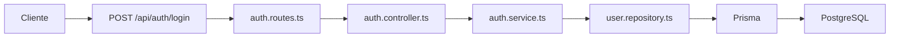
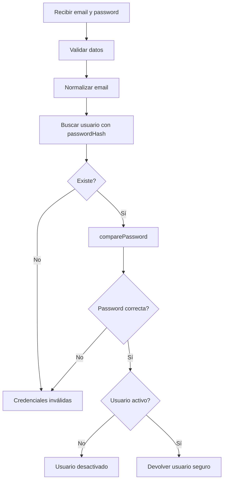
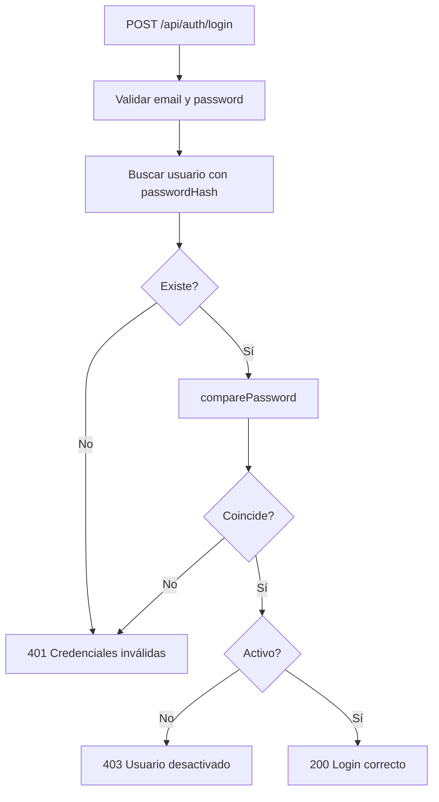

# Día 34: Login de usuarios

En el día 33 creamos el endpoint de registro:

`POST /api/auth/register`.

Ese endpoint permite crear una cuenta nueva de usuario.

También dejamos clara una idea importante: el registro guarda `passwordHash`, no `password`.

En el día 32 ya habíamos creado la utilidad:

`src/utils/password.utils.ts`

con estas funciones:

```ts
hashPassword(password)
comparePassword(password, passwordHash)
```

Hasta ahora hemos usado principalmente `hashPassword`, porque necesitábamos guardar contraseñas de forma segura.

Hoy usaremos la otra función:

`comparePassword`.

El objetivo será crear el endpoint:

`POST /api/auth/login`.

Este endpoint permitirá comprobar si un usuario puede iniciar sesión.

!!! info "Idea principal"
    En el login no comparamos contraseñas en texto plano; comparamos la contraseña recibida contra el `passwordHash` guardado usando `bcrypt`.

## ¿Qué vamos a trabajar hoy?

Hoy trabajaremos estos conceptos:

- Login.
- Autenticación.
- `POST /api/auth/login`.
- `comparePassword`.
- `passwordHash`.
- Credenciales inválidas.
- Usuario inactivo.
- `findUserByEmailWithPassword`.
- Respuesta segura.
- No devolver `passwordHash`.
- Preparación para JWT.

El producto del día será el endpoint `POST /api/auth/login` funcionando.

El resultado esperado será poder enviar email y password y comprobar si el usuario puede iniciar sesión.

## Qué hará el login

El endpoint recibirá un body como este:

```json
{
  "email": "user@email.com",
  "password": "user123"
}
```

Después hará estos pasos:

- Validar que `email` y `password` existen.
- Normalizar `email`.
- Buscar el usuario por email.
- Leer internamente su `passwordHash`.
- Comparar `password` con `passwordHash` usando `bcrypt`.
- Comprobar que el usuario está activo.
- Devolver una respuesta segura.

Si todo va bien, responderá:

```json
{
  "message": "Login correcto",
  "data": {
    "user": {
      "id": 2,
      "name": "Usuario Demo",
      "email": "user@email.com",
      "role": "USER",
      "isActive": true,
      "createdAt": "...",
      "updatedAt": "..."
    }
  }
}
```

Todavía no devolveremos token.

Eso llegará en el día 35.

## Qué no haremos todavía

Hoy no generaremos JWT.

No devolveremos algo como:

```json
{
  "token": "..."
}
```

Tampoco protegeremos rutas.

Eso llegará en los próximos días:

| Día | Tema |
| --- | --- |
| Día 34 | Login |
| Día 35 | JWT |
| Día 36 | Middleware de autenticación |
| Día 37 | Roles y permisos |

Hoy solo comprobaremos credenciales.

## Registro frente a login

Registro y login son dos operaciones distintas.

| Acción   | Endpoint                  | Qué hace                                       |
| -------- | ------------------------- | ---------------------------------------------- |
| Registro | `POST /api/auth/register` | Crea una cuenta nueva                          |
| Login    | `POST /api/auth/login`    | Comprueba credenciales de una cuenta existente |

El registro recibe:

```json
{
  "name": "Usuario Nuevo",
  "email": "nuevo@email.com",
  "password": "123456"
}
```

El login recibe:

```json
{
  "email": "nuevo@email.com",
  "password": "123456"
}
```

En el login no enviamos `name`, porque la cuenta ya existe.

## Por qué necesitamos leer `passwordHash`

Hasta ahora, en el repositorio de usuarios hemos intentado no devolver nunca:

`passwordHash`.

Eso está bien.

Pero para hacer login necesitamos leerlo internamente.

No para devolverlo al cliente, sino para comparar:

`password introducida + passwordHash guardado → comparePassword`.

Por eso crearemos una función especial en el repositorio:

`findUserByEmailWithPassword`.

Esta función sí incluirá `passwordHash`.

Pero solo debe usarse dentro de la lógica de autenticación.

!!! warning "Regla importante"
    El backend puede leer `passwordHash` internamente para validar login, pero nunca debe enviarlo al cliente.

## Flujo del login

El flujo general será:



Dentro del servicio:



## Archivos que vamos a tocar

Hoy modificaremos:

- `src/repositories/user.repository.ts`
- `src/services/auth.service.ts`
- `src/controllers/auth.controller.ts`
- `src/routes/auth.routes.ts`
- `README.md`
- `docs/dia-34-auth-login.md`

La estructura general seguirá siendo:

```text
src/
  controllers/
    auth.controller.ts
    health.controller.ts
    user.controller.ts
  errors/
    AppError.ts
  repositories/
    user.repository.ts
  routes/
    auth.routes.ts
    health.routes.ts
    user.routes.ts
  services/
    auth.service.ts
    user.service.ts
  utils/
    parse.utils.ts
    password.utils.ts
    string.utils.ts
```

## Parte guiada

### Paso 1: Abrir el proyecto

Abre una terminal y entra en el repositorio:

```bash
cd usermanager-api
```

Comprueba que todo compila antes de empezar:

```bash
npm run build
```

## Modificar el repositorio

### Paso 2: Abrir `user.repository.ts`

Abre:

```text
src/repositories/user.repository.ts
```

Actualmente tendrás un selector seguro parecido a:

```ts
const userSafeSelect = {
  id: true,
  name: true,
  email: true,
  role: true,
  isActive: true,
  createdAt: true,
  updatedAt: true
} as const;
```

Este selector no incluye `passwordHash`, y eso es correcto para respuestas públicas.

### Paso 3: Crear un selector interno para login

Debajo de `userSafeSelect`, añade:

```ts
const userWithPasswordSelect = {
  id: true,
  name: true,
  email: true,
  passwordHash: true,
  role: true,
  isActive: true,
  createdAt: true,
  updatedAt: true
} as const;
```

Este selector solo debe usarse en operaciones internas de autenticación.

### Paso 4: Crear `findUserByEmailWithPassword`

Añade esta función en `user.repository.ts`:

```ts
export function findUserByEmailWithPassword(email: string) {
  return prisma.user.findUnique({
    where: {
      email
    },
    select: userWithPasswordSelect
  });
}
```

Esta función devuelve también `passwordHash`.

No debe usarse para respuestas normales de la API.

### Paso 5: Revisar repositorio

Ahora el repositorio tendrá dos funciones parecidas:

```ts
export function findUserByEmail(email: string) {
  return prisma.user.findUnique({
    where: {
      email
    },
    select: userSafeSelect
  });
}
```

y:

```ts
export function findUserByEmailWithPassword(email: string) {
  return prisma.user.findUnique({
    where: {
      email
    },
    select: userWithPasswordSelect
  });
}
```

La diferencia es importante:

| Función                       | Incluye `passwordHash` | Uso                |
| ----------------------------- | ---------------------- | ------------------ |
| `findUserByEmail`             | No                     | Respuestas seguras |
| `findUserByEmailWithPassword` | Sí                     | Login interno      |

## Modificar servicio de auth

### Paso 6: Abrir `auth.service.ts`

Abre:

```text
src/services/auth.service.ts
```

Ya debería tener:

`registerService`.

Hoy añadiremos:

`loginService`.

### Paso 7: Añadir imports

En `auth.service.ts`, añade o modifica los imports para incluir:

```ts
import { findUserByEmailWithPassword } from "../repositories/user.repository";
import { comparePassword, hashPassword } from "../utils/password.utils";
```

Si ya importabas `hashPassword`, puedes dejarlo en el mismo import.

También deberías tener:

```ts
import { AppError } from "../errors/AppError";
import { createUser, findUserByEmail } from "../repositories/user.repository";
import {
  isNonEmptyString,
  isValidBasicEmail,
  normalizeEmail
} from "../utils/string.utils";
```

Una versión de imports podría quedar así:

```ts
import { AppError } from "../errors/AppError";
import {
  createUser,
  findUserByEmail,
  findUserByEmailWithPassword
} from "../repositories/user.repository";
import { comparePassword, hashPassword } from "../utils/password.utils";
import {
  isNonEmptyString,
  isValidBasicEmail,
  normalizeEmail
} from "../utils/string.utils";
```

### Paso 8: Crear tipo `LoginInput`

Debajo de `RegisterInput`, añade:

```ts
type LoginInput = {
  email: unknown;
  password: unknown;
};
```

### Paso 9: Crear función para ocultar `passwordHash`

Como `findUserByEmailWithPassword` devuelve `passwordHash`, necesitamos quitarlo antes de devolver el usuario.

Añade esta función auxiliar:

```ts
function removePasswordHash<T extends { passwordHash: string }>(user: T) {
  const { passwordHash, ...safeUser } = user;
  return safeUser;
}
```

Esta función recibe un usuario con `passwordHash` y devuelve el resto de campos.

### Paso 10: Crear `loginService`

Añade esta función:

```ts
export async function loginService(input: LoginInput) {
  const { email, password } = input;

  if (!isNonEmptyString(email)) {
    throw new AppError("El email debe ser un texto no vacío", 400);
  }

  if (!isNonEmptyString(password)) {
    throw new AppError("La contraseña debe ser un texto no vacío", 400);
  }

  const cleanEmail = normalizeEmail(email);
  const cleanPassword = password.trim();

  if (!isValidBasicEmail(cleanEmail)) {
    throw new AppError("El email no tiene un formato válido", 400);
  }

  const user = await findUserByEmailWithPassword(cleanEmail);

  if (!user) {
    throw new AppError("Credenciales inválidas", 401);
  }

  const passwordMatches = await comparePassword(
    cleanPassword,
    user.passwordHash
  );

  if (!passwordMatches) {
    throw new AppError("Credenciales inválidas", 401);
  }

  if (!user.isActive) {
    throw new AppError("El usuario está desactivado", 403);
  }

  const safeUser = removePasswordHash(user);

  return {
    user: safeUser
  };
}
```

Esta función hace el login completo.

### Paso 11: Por qué usamos “Credenciales inválidas”

Cuando el email no existe o la contraseña es incorrecta, devolvemos el mismo mensaje:

`Credenciales inválidas`.

Esto evita dar demasiada información.

No conviene responder:

`El email no existe`

o:

`La contraseña es incorrecta`

porque eso podría ayudar a descubrir qué emails están registrados.

Para el alumnado, esta es una buena práctica básica de seguridad.

### Paso 12: Revisar `auth.service.ts`

El archivo tendrá ahora dos funciones principales:

- `registerService`
- `loginService`

Una estructura aproximada:

```ts
import { AppError } from "../errors/AppError";
import {
  createUser,
  findUserByEmail,
  findUserByEmailWithPassword
} from "../repositories/user.repository";
import { comparePassword, hashPassword } from "../utils/password.utils";
import {
  isNonEmptyString,
  isValidBasicEmail,
  normalizeEmail
} from "../utils/string.utils";

type RegisterInput = {
  name: unknown;
  email: unknown;
  password: unknown;
};

type LoginInput = {
  email: unknown;
  password: unknown;
};

function removePasswordHash<T extends { passwordHash: string }>(user: T) {
  const { passwordHash, ...safeUser } = user;
  return safeUser;
}

export async function registerService(input: RegisterInput) {
  // ...
}

export async function loginService(input: LoginInput) {
  // ...
}
```

## Modificar controlador de auth

### Paso 13: Abrir `auth.controller.ts`

Abre:

```text
src/controllers/auth.controller.ts
```

Actualmente tendrás:

```ts
import { registerService } from "../services/auth.service";
```

Modifícalo para importar también `loginService`:

```ts
import { loginService, registerService } from "../services/auth.service";
```

### Paso 14: Crear `loginController`

Debajo de `registerController`, añade:

```ts
export async function loginController(
  req: Request,
  res: Response,
  next: NextFunction
) {
  try {
    const result = await loginService(req.body);

    return res.status(200).json({
      message: "Login correcto",
      data: result
    });
  } catch (error) {
    next(error);
  }
}
```

El controlador no compara contraseñas.

Solo llama al servicio.

## Modificar rutas de auth

### Paso 15: Abrir `auth.routes.ts`

Abre:

```text
src/routes/auth.routes.ts
```

Ahora tendrá algo como:

```ts
import { Router } from "express";
import { registerController } from "../controllers/auth.controller";

export const authRouter = Router();

authRouter.post("/register", registerController);
```

### Paso 16: Añadir `loginController`

Modifica el import:

```ts
import {
  loginController,
  registerController
} from "../controllers/auth.controller";
```

Añade la ruta:

```ts
authRouter.post("/register", registerController);
authRouter.post("/login", loginController);
```

La ruta final será:

`POST /api/auth/login`

porque en `server.ts` ya tenemos:

```ts
app.use("/api/auth", authRouter);
```

## Probar login

### Paso 17: Arrancar PostgreSQL

Ejecuta:

```bash
docker compose up -d
```

### Paso 18: Ejecutar seed

Para tener usuarios conocidos, ejecuta:

```bash
npm run prisma:seed
```

Recuerda las credenciales del seed:

| Usuario          | Email                | Password      |
| ---------------- | -------------------- | ------------- |
| Admin Principal  | `admin@email.com`    | `admin123`    |
| Usuario Demo     | `user@email.com`     | `user123`     |
| Usuario Inactivo | `inactive@email.com` | `inactive123` |

### Paso 19: Arrancar API

Ejecuta:

```bash
npm run dev
```

### Paso 20: Login correcto con usuario normal

Petición:

`POST http://localhost:3000/api/auth/login`

Body:

```json
{
  "email": "user@email.com",
  "password": "user123"
}
```

Respuesta esperada:

`200 OK`.

Respuesta aproximada:

```json
{
  "message": "Login correcto",
  "data": {
    "user": {
      "id": 2,
      "name": "Usuario Demo",
      "email": "user@email.com",
      "role": "USER",
      "isActive": true,
      "createdAt": "...",
      "updatedAt": "..."
    }
  }
}
```

Comprueba que no aparece:

`passwordHash`.

### Paso 21: Login correcto con admin

Body:

```json
{
  "email": "admin@email.com",
  "password": "admin123"
}
```

Respuesta esperada:

`200 OK`.

El usuario debe tener:

`role: ADMIN`.

### Paso 22: Password incorrecta

Body:

```json
{
  "email": "user@email.com",
  "password": "incorrecta"
}
```

Respuesta esperada:

`401 Unauthorized`.

Mensaje:

```json
{
  "error": "Credenciales inválidas"
}
```

### Paso 23: Email inexistente

Body:

```json
{
  "email": "noexiste@email.com",
  "password": "user123"
}
```

Respuesta esperada:

`401 Unauthorized`.

Mensaje:

```json
{
  "error": "Credenciales inválidas"
}
```

Observa que usamos el mismo mensaje que con password incorrecta.

### Paso 24: Usuario inactivo

Body:

```json
{
  "email": "inactive@email.com",
  "password": "inactive123"
}
```

Respuesta esperada:

`403 Forbidden`.

Mensaje:

```json
{
  "error": "El usuario está desactivado"
}
```

### Paso 25: Email inválido

Body:

```json
{
  "email": "correo-sin-formato",
  "password": "123456"
}
```

Respuesta esperada:

`400 Bad Request`.

### Paso 26: Password vacía

Body:

```json
{
  "email": "user@email.com",
  "password": ""
}
```

Respuesta esperada:

`400 Bad Request`.

## Comprobar que no se devuelve `passwordHash`

Revisa todas las respuestas de login.

Nunca debe aparecer:

`passwordHash`.

Aunque internamente lo hemos usado, lo eliminamos con:

```ts
const safeUser = removePasswordHash(user);
```

Esto es clave.

La aplicación puede leer información sensible internamente, pero no debe enviarla al cliente.

## Ejecutar build

### Paso 27: Compilar TypeScript

Ejecuta:

```bash
npm run build
```

Si aparece un error, revisa:

- Import de `loginService`.
- Import de `loginController`.
- Ruta `authRouter.post("/login", loginController)`.
- `findUserByEmailWithPassword` exportado correctamente.
- `comparePassword` importado correctamente.

## Actualizar README

### Paso 28: Añadir documentación del login

En el README, dentro de la sección de autenticación, añade:

````md
### Login

Ruta:

```text
POST /api/auth/login
```

Body esperado:

```json
{
  "email": "user@email.com",
  "password": "user123"
}
```

Respuesta correcta:

```text
200 OK
```

Respuesta aproximada:

```json
{
  "message": "Login correcto",
  "data": {
    "user": {
      "id": 2,
      "name": "Usuario Demo",
      "email": "user@email.com",
      "role": "USER",
      "isActive": true
    }
  }
}
```

Reglas:

- El email debe existir.
- La contraseña debe coincidir con el `passwordHash`.
- El usuario debe estar activo.
- `passwordHash` nunca se devuelve.
- Todavía no se devuelve token JWT.
````

### Paso 29: Actualizar índice del README

Añade:

```md
- [Día 34 - Login de usuarios](docs/dia-34-auth-login.md)
```

El bloque debería quedar parecido a:

```md
## Documentación del reto

- [Día 1 - Diseño inicial](docs/dia-01-diseno-inicial.md)
- [Día 2 - Preparación del proyecto](docs/dia-02-preparacion-proyecto.md)
- [Día 3 - Primer endpoint](docs/dia-03-primer-endpoint.md)
- [Día 4 - Métodos HTTP](docs/dia-04-metodos-http.md)
- [Día 5 - JSON, body, params y headers](docs/dia-05-json-body-params-headers.md)
- [Día 6 - Cliente HTTP y depuración](docs/dia-06-cliente-http-depuracion.md)
- [Día 7 - Listado de usuarios en memoria](docs/dia-07-listado-usuarios.md)
- [Día 8 - Consultar usuario por ID](docs/dia-08-consultar-usuario-id.md)
- [Día 9 - Crear usuarios en memoria](docs/dia-09-crear-usuarios.md)
- [Día 10 - Actualizar usuarios en memoria](docs/dia-10-actualizar-usuarios.md)
- [Día 11 - Eliminar o desactivar usuarios en memoria](docs/dia-11-eliminar-desactivar-usuarios.md)
- [Día 12 - Validación manual básica](docs/dia-12-validacion-manual-basica.md)
- [Día 13 - Validación de email y duplicados](docs/dia-13-validacion-email-duplicados.md)
- [Día 14 - Códigos de estado HTTP](docs/dia-14-codigos-estado-http.md)
- [Día 15 - Middleware centralizado de errores](docs/dia-15-middleware-errores.md)
- [Día 16 - Base de datos y persistencia](docs/dia-16-base-datos-persistencia.md)
- [Día 17 - PostgreSQL con Docker Compose](docs/dia-17-postgresql-docker-compose.md)
- [Día 18 - Diseño del modelo persistente User](docs/dia-18-diseno-modelo-persistente-user.md)
- [Día 19 - ORM o acceso a datos](docs/dia-19-orm-acceso-datos.md)
- [Día 20 - Instalación y configuración inicial de Prisma](docs/dia-20-instalacion-prisma.md)
- [Día 21 - Modelo Prisma User](docs/dia-21-modelo-prisma-user.md)
- [Día 22 - Primera migración con Prisma](docs/dia-22-primera-migracion-prisma.md)
- [Día 23 - Prisma Studio](docs/dia-23-prisma-studio.md)
- [Día 24 - Seed de datos iniciales](docs/dia-24-seed-datos-iniciales.md)
- [Día 25 - Consultas básicas con Prisma Client](docs/dia-25-consultas-basicas-prisma.md)
- [Día 26 - Separar rutas](docs/dia-26-separar-rutas.md)
- [Día 27 - Controladores](docs/dia-27-controladores.md)
- [Día 28 - Servicios](docs/dia-28-servicios.md)
- [Día 29 - Repositorio con Prisma](docs/dia-29-repositorio-prisma.md)
- [Día 30 - CRUD persistente ordenado](docs/dia-30-crud-persistente-ordenado.md)
- [Día 31 - Limpieza y refactor](docs/dia-31-limpieza-refactor.md)
- [Día 32 - Contraseñas seguras con bcrypt](docs/dia-32-bcrypt-passwords.md)
- [Día 33 - Registro de usuarios](docs/dia-33-auth-register.md)
- [Día 34 - Login de usuarios](docs/dia-34-auth-login.md)
```

## Crear el documento del día 34

Dentro de la carpeta `docs/`, crea:

```text
docs/dia-34-auth-login.md
```

Añade este contenido inicial:

````md
# Día 34 - Login de usuarios

## Qué he hecho

- He creado findUserByEmailWithPassword en el repositorio.
- He creado un selector interno que incluye passwordHash.
- He creado loginService.
- He usado comparePassword para comprobar contraseñas.
- He comprobado si el usuario existe.
- He comprobado si la contraseña es correcta.
- He comprobado si el usuario está activo.
- He creado loginController.
- He añadido POST /api/auth/login.
- He probado login correcto con USER.
- He probado login correcto con ADMIN.
- He probado password incorrecta.
- He probado email inexistente.
- He probado usuario inactivo.
- He comprobado que passwordHash no se devuelve.
- He ejecutado npm run build.

## Endpoint creado

```text
POST /api/auth/login
```

## Body esperado

```json
{
  "email": "user@email.com",
  "password": "user123"
}
```

## Respuesta correcta

```text
200 OK
```

## Respuesta aproximada

```json
{
  "message": "Login correcto",
  "data": {
    "user": {
      "id": 2,
      "name": "Usuario Demo",
      "email": "user@email.com",
      "role": "USER",
      "isActive": true
    }
  }
}
```

## Reglas del login

```text
email es obligatorio.
password es obligatoria.
email debe tener formato válido.
Si el email no existe, se devuelven credenciales inválidas.
Si la password no coincide, se devuelven credenciales inválidas.
Si el usuario está inactivo, no puede iniciar sesión.
passwordHash se usa internamente, pero nunca se devuelve.
Todavía no se genera JWT.
```

## Flujo del login

```text
Route → Controller → Service → Repository → Prisma → PostgreSQL
```

## Función especial del repositorio

```text
findUserByEmailWithPassword
```

Esta función permite leer passwordHash internamente para comparar la contraseña con bcrypt.

## Explicación personal

El login comprueba que un usuario existe, que la contraseña enviada coincide con el hash guardado y que la cuenta está activa. Aunque el backend lee passwordHash internamente, nunca lo devuelve al cliente.
````

### Paso 30: Añadir diagrama Mermaid

Añade al documento:



### Paso 31: Añadir checklist de pruebas

Añade:

```md
## Checklist de pruebas

| Prueba | Resultado |
| --- | --- |
| Login correcto con USER | |
| Login correcto con ADMIN | |
| Password incorrecta | |
| Email inexistente | |
| Usuario inactivo | |
| Email inválido | |
| Password vacía | |
| La respuesta no devuelve passwordHash | |
| `npm run build` funciona | |
```

## Guardar cambios en Git

### Paso 32: Revisar cambios

Ejecuta:

```bash
git status
```

Deberías ver cambios en:

- `src/repositories/user.repository.ts`
- `src/services/auth.service.ts`
- `src/controllers/auth.controller.ts`
- `src/routes/auth.routes.ts`
- `README.md`
- `docs/dia-34-auth-login.md`

### Paso 33: Añadir archivos

```bash
git add .
```

### Paso 34: Crear commit

```bash
git commit -m "Dia 34 - Crear login de usuarios"
```

### Paso 35: Subir cambios

```bash
git push
```

## Problemas frecuentes

### `POST /api/auth/login` devuelve 404

Revisa que en `auth.routes.ts` tienes:

```ts
authRouter.post("/login", loginController);
```

Y que en `server.ts` tienes:

```ts
app.use("/api/auth", authRouter);
```

### Error: `loginController` no existe

Comprueba que está exportado en:

```text
auth.controller.ts
```

Debe ser:

```ts
export async function loginController(...)
```

### Error: `loginService` no existe

Comprueba que está exportado en:

```text
auth.service.ts
```

Debe ser:

```ts
export async function loginService(...)
```

### El login siempre devuelve credenciales inválidas

Comprueba:

- Que el seed se ha ejecutado después de usar `bcrypt`.
- Que la contraseña enviada coincide con la del seed.
- Que `findUserByEmailWithPassword` devuelve `passwordHash`.
- Que `comparePassword` recibe `password` y `passwordHash` en ese orden.

El orden correcto es:

```ts
comparePassword(cleanPassword, user.passwordHash)
```

### La respuesta devuelve passwordHash

Revisa que usas:

```ts
const safeUser = removePasswordHash(user);
```

Y que devuelves:

```ts
return {
  user: safeUser
};
```

No devuelvas directamente:

```ts
return { user };
```

### Usuario inactivo devuelve login correcto

Revisa que tienes:

```ts
if (!user.isActive) {
  throw new AppError("El usuario está desactivado", 403);
}
```

después de comprobar la contraseña.

### Email inexistente y password incorrecta dan mensajes distintos

Para este reto usaremos el mismo mensaje:

`Credenciales inválidas`.

Tanto si el usuario no existe como si la contraseña no coincide.

## Parte libre

### Tarea libre 1: Documentar códigos de respuesta

Completa esta tabla:

| Caso                | Código | Mensaje |
| ------------------- | ------ | ------- |
| Login correcto      |        |         |
| Email vacío         |        |         |
| Password vacía      |        |         |
| Email inválido      |        |         |
| Email inexistente   |        |         |
| Password incorrecta |        |         |
| Usuario inactivo    |        |         |

### Tarea libre 2: Explicar por qué no decimos si falla el email o la contraseña

Añade una sección:

```md
## Por qué usamos credenciales inválidas
```

Explica con tus palabras por qué es mejor no decir:

`El email no existe.`

o:

`La contraseña es incorrecta.`

### Tarea libre 3: Probar login con usuario registrado ayer

Usa un usuario creado con:

`POST /api/auth/register`.

Después intenta hacer login con:

`POST /api/auth/login`.

Documenta el resultado.

### Tarea libre 4: Revisar función `findUserByEmailWithPassword`

Explica:

- ¿Por qué necesitamos una función que sí lea `passwordHash`?
- ¿Por qué esa función no debe usarse para respuestas normales?
- ¿Qué pasaría si devolviéramos `passwordHash` al cliente?

### Tarea libre 5: Preparar el día 35

Añade una sección:

```md
## Preparación para JWT
```

Responde:

- ¿Qué debería devolver el login además del usuario?
- ¿Qué datos mínimos debería contener un token?
- ¿Por qué no debemos meter `passwordHash` en el token?
- ¿Dónde guardaremos `JWT_SECRET`?
- ¿Qué duración podría tener el token?

Pistas:

- `id`
- `email`
- `role`
- `JWT_SECRET`
- `expiresIn`

## Entrega recomendada del día 34

Las respuestas no se entregan como archivo suelto. Deben quedar dentro del repositorio de GitHub.

Al finalizar el día 34, el repositorio debería tener esta estructura aproximada:

```text
usermanager-api/
  .env.example
  .gitignore
  docker-compose.yml
  README.md
  package.json
  package-lock.json
  tsconfig.json
  prisma/
    schema.prisma
    seed.ts
    migrations/
      <timestamp>_init/
        migration.sql
  src/
    prisma.ts
    server.ts
    controllers/
      auth.controller.ts
      health.controller.ts
      user.controller.ts
    errors/
      AppError.ts
    repositories/
      user.repository.ts
    routes/
      auth.routes.ts
      health.routes.ts
      user.routes.ts
    services/
      auth.service.ts
      user.service.ts
    utils/
      parse.utils.ts
      password.utils.ts
      string.utils.ts
  docs/
    dia-01-diseno-inicial.md
    dia-02-preparacion-proyecto.md
    dia-03-primer-endpoint.md
    dia-04-metodos-http.md
    dia-05-json-body-params-headers.md
    dia-06-cliente-http-depuracion.md
    dia-07-listado-usuarios.md
    dia-08-consultar-usuario-id.md
    dia-09-crear-usuarios.md
    dia-10-actualizar-usuarios.md
    dia-11-eliminar-desactivar-usuarios.md
    dia-12-validacion-manual-basica.md
    dia-13-validacion-email-duplicados.md
    dia-14-codigos-estado-http.md
    dia-15-middleware-errores.md
    dia-16-base-datos-persistencia.md
    dia-17-postgresql-docker-compose.md
    dia-18-diseno-modelo-persistente-user.md
    dia-19-orm-acceso-datos.md
    dia-20-instalacion-prisma.md
    dia-21-modelo-prisma-user.md
    dia-22-primera-migracion-prisma.md
    dia-23-prisma-studio.md
    dia-24-seed-datos-iniciales.md
    dia-25-consultas-basicas-prisma.md
    dia-26-separar-rutas.md
    dia-27-controladores.md
    dia-28-servicios.md
    dia-29-repositorio-prisma.md
    dia-30-crud-persistente-ordenado.md
    dia-31-limpieza-refactor.md
    dia-32-bcrypt-passwords.md
    dia-33-auth-register.md
    dia-34-auth-login.md
```

El documento del día 34 deberá estar en:

```text
docs/dia-34-auth-login.md
```

Y deberá incluir:

- Resumen de lo realizado.
- Endpoint creado.
- Body esperado.
- Respuesta correcta.
- Reglas del login.
- Función `findUserByEmailWithPassword`.
- Flujo del login.
- Diagrama Mermaid.
- Checklist de pruebas.
- Tabla de códigos de respuesta.
- Explicación de credenciales inválidas.
- Preparación para JWT.

En el foro, se compartirá el enlace actualizado al repositorio.

Ejemplo de mensaje:

```text
Hola, comparto el avance del día 34 del reto UserManager API:

https://github.com/usuario/usermanager-api

He creado el endpoint de login POST /api/auth/login usando bcrypt para comparar contraseñas. La documentación está en:

docs/dia-34-auth-login.md
```

## Cierre del día

Hoy hemos completado la primera versión del login.

Ya tenemos:

- `POST /api/auth/register`
- `POST /api/auth/login`

El login comprueba:

- Que el email existe.
- Que la contraseña coincide con el `passwordHash`.
- Que el usuario está activo.

Y devuelve una respuesta segura sin `passwordHash`.

Hoy hemos trabajado:

- Login.
- `comparePassword`.
- `passwordHash` interno.
- `findUserByEmailWithPassword`.
- Credenciales inválidas.
- Usuario inactivo.
- `auth.controller.ts`.
- `auth.service.ts`.
- `auth.routes.ts`.

Todavía falta una pieza fundamental: devolver un token.

Eso llegará en el día 35 con JWT.

!!! success "Idea clave"
    El login no consiste en recuperar una contraseña, sino en comparar de forma segura la contraseña recibida con el hash guardado.
