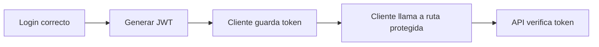
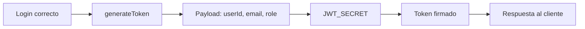

# Día 35: Generación de token JWT

El **Día 35** introduce **JWT**: el login dejará de devolver solo el usuario y empezará a devolver un token firmado. Usaremos `jsonwebtoken`, que proporciona métodos como `sign` para crear tokens y `verify` para comprobarlos; en este día nos centraremos sobre todo en generarlos.

En el día 34 creamos el endpoint de login:

`POST /api/auth/login`.

Ese endpoint ya comprueba:

- Que el email existe.
- Que la contraseña coincide con el `passwordHash`.
- Que el usuario está activo.

Si todo va bien, devuelve una respuesta como:

```json
{
  "message": "Login correcto",
  "data": {
    "user": {
      "id": 2,
      "name": "Usuario Demo",
      "email": "user@email.com",
      "role": "USER",
      "isActive": true
    }
  }
}
```

Esto está bien como primer paso, pero todavía falta una pieza fundamental.

Cuando un usuario inicia sesión correctamente, la API necesita entregarle una prueba de autenticación para que pueda usarla en futuras peticiones.

Esa prueba será un token: JWT.

JWT significa **JSON Web Token**.

Hoy vamos a modificar el login para que, además del usuario, devuelva un token.

!!! info "Idea principal"
    El login correcto genera un token que el cliente podrá enviar más adelante para acceder a rutas protegidas.

## ¿Qué vamos a trabajar hoy?

Hoy trabajaremos estos conceptos:

- JWT.
- Token.
- `jsonwebtoken`.
- Payload.
- Firma.
- `JWT_SECRET`.
- `expiresIn`.
- `.env`.
- `generateToken`.
- Login con token.
- Datos seguros en el token.
- Preparación para middleware de autenticación.

El producto del día será que `POST /api/auth/login` devuelva un token JWT.

El resultado esperado será que el login devuelva una respuesta parecida a:

```json
{
  "message": "Login correcto",
  "data": {
    "user": {
      "id": 2,
      "name": "Usuario Demo",
      "email": "user@email.com",
      "role": "USER",
      "isActive": true
    },
    "token": "eyJhbGciOiJIUzI1NiIs..."
  }
}
```

## Qué es un JWT

Un JWT es un token firmado que permite transportar información entre cliente y servidor.

Normalmente se usa así:

- El usuario hace login.
- La API comprueba credenciales.
- La API genera un token.
- El cliente guarda el token.
- El cliente envía el token en futuras peticiones.
- La API verifica el token.

Visualmente:



Hoy solo haremos la parte de generación.

La verificación llegará en el día 36.

## Qué contiene un JWT

Un JWT suele tener tres partes:

- Header.
- Payload.
- Signature.

Un token puede verse así:

```text
xxxxx.yyyyy.zzzzz
```

Cada parte tiene una función:

| Parte     | Qué contiene                                                   |
| --------- | -------------------------------------------------------------- |
| Header    | Información sobre el tipo de token y algoritmo                 |
| Payload   | Datos que queremos incluir                                     |
| Signature | Firma que permite comprobar que el token no ha sido manipulado |

En nuestro caso, el payload incluirá datos mínimos del usuario:

- `id`
- `email`
- `role`

No incluiremos:

- `password`
- `passwordHash`
- Datos sensibles innecesarios.

## Qué datos meteremos en el token

El token debe contener la información mínima necesaria para identificar al usuario.

Usaremos:

```ts
{
  userId: user.id,
  email: user.email,
  role: user.role
}
```

No meteremos el nombre porque no es necesario para autorizar.

No meteremos `passwordHash` porque es sensible.

No meteremos toda la ficha del usuario porque el token debe ser ligero.

!!! warning "Regla importante"
    Un token no debe convertirse en una copia completa del usuario.

## Qué es `JWT_SECRET`

Para firmar un token necesitamos una clave secreta.

La llamaremos:

`JWT_SECRET`.

Esta clave debe estar en el archivo:

`.env`.

Ejemplo:

```env
JWT_SECRET="cambia_esta_clave_en_produccion"
JWT_EXPIRES_IN="1h"
```

No debemos escribir la clave directamente en el código.

Incorrecto:

```ts
const secret = "mi_clave_secreta";
```

Correcto:

```ts
const secret = process.env.JWT_SECRET;
```

Así podemos usar distintas claves según el entorno.

## Qué significa `expiresIn`

Los tokens no deberían durar para siempre.

Por eso indicaremos una duración:

`JWT_EXPIRES_IN="1h"`.

Eso significa que el token caducará en una hora.

Para este reto, una hora es un valor cómodo.

Más adelante podríamos usar:

- `15m`
- `2h`
- `1d`

De momento usaremos:

`1h`.

## Qué no haremos todavía

Hoy no protegeremos rutas.

Es decir, aunque el login devuelva token, todavía no lo usaremos para bloquear:

- `GET /api/users`
- `PATCH /api/users/:id`
- `DELETE /api/users/:id`

Eso será el día 36.

Hoy solo queremos que el login devuelva un token válido.

La progresión será:

| Día | Tema |
| --- | --- |
| Día 35 | Generar JWT |
| Día 36 | Middleware de autenticación |
| Día 37 | Roles y permisos |

## Archivos que vamos a tocar

Hoy trabajaremos con:

- `package.json`
- `.env`
- `.env.example`
- `src/utils/jwt.utils.ts`
- `src/services/auth.service.ts`
- `README.md`
- `docs/dia-35-jwt.md`

La estructura añadirá:

`src/utils/jwt.utils.ts`.

## Parte guiada

### Paso 1: Abrir el proyecto

Abre una terminal y entra en el repositorio:

```bash
cd usermanager-api
```

Comprueba que todo compila antes de empezar:

```bash
npm run build
```

### Paso 2: Instalar `jsonwebtoken`

Instala la librería:

```bash
npm install jsonwebtoken
```

Instala también sus tipos:

```bash
npm install -D @types/jsonwebtoken
```

Después revisa `package.json`.

Deberías ver algo parecido a:

```json
"dependencies": {
  "@prisma/client": "...",
  "bcrypt": "...",
  "jsonwebtoken": "..."
},
"devDependencies": {
  "@types/bcrypt": "...",
  "@types/jsonwebtoken": "...",
  "prisma": "...",
  "tsx": "...",
  "typescript": "..."
}
```

### Paso 3: Configurar variables de entorno

Abre:

```text
.env
```

Añade:

```env
JWT_SECRET="cambia_esta_clave_en_produccion"
JWT_EXPIRES_IN="1h"
```

Importante:

!!! danger "Importante"
    `JWT_SECRET` no debe subirse a Git si `.env` está ignorado.

### Paso 4: Actualizar `.env.example`

Abre:

```text
.env.example
```

Añade:

```env
JWT_SECRET="pon_aqui_una_clave_secreta"
JWT_EXPIRES_IN="1h"
```

El archivo `.env.example` sí puede subirse, porque no contiene secretos reales.

Sirve como plantilla para otros desarrolladores.

## Crear utilidad JWT

### Paso 5: Crear `jwt.utils.ts`

Dentro de `src/utils/`, crea:

```text
src/utils/jwt.utils.ts
```

Añade:

```ts
import jwt from "jsonwebtoken";
import { AppError } from "../errors/AppError";

type JwtPayload = {
  userId: number;
  email: string;
  role: string;
};

function getJwtSecret() {
  const secret = process.env.JWT_SECRET;

  if (!secret) {
    throw new AppError("JWT_SECRET no está configurado", 500);
  }

  return secret;
}

function getJwtExpiresIn() {
  return process.env.JWT_EXPIRES_IN || "1h";
}

export function generateToken(payload: JwtPayload) {
  return jwt.sign(payload, getJwtSecret(), {
    expiresIn: getJwtExpiresIn()
  });
}
```

Esta utilidad concentra la creación del token.

### Paso 6: Entender `JwtPayload`

El tipo:

```ts
type JwtPayload = {
  userId: number;
  email: string;
  role: string;
};
```

define qué datos meteremos dentro del token.

Usamos:

- `userId`
- `email`
- `role`

porque son datos útiles para identificar y autorizar al usuario.

### Paso 7: Entender `getJwtSecret`

La función:

```ts
function getJwtSecret() {
  const secret = process.env.JWT_SECRET;

  if (!secret) {
    throw new AppError("JWT_SECRET no está configurado", 500);
  }

  return secret;
}
```

evita firmar tokens si falta la clave secreta.

Eso es importante porque un token sin una clave bien configurada no tendría sentido.

### Paso 8: Entender `generateToken`

La función:

```ts
export function generateToken(payload: JwtPayload) {
  return jwt.sign(payload, getJwtSecret(), {
    expiresIn: getJwtExpiresIn()
  });
}
```

firma el token usando:

- `payload`
- `JWT_SECRET`
- `expiresIn`

El resultado será una cadena de texto larga.

## Posible ajuste por tipos de TypeScript

En algunas versiones de TypeScript o de `@types/jsonwebtoken`, `expiresIn` puede dar problemas de tipo si viene directamente de `process.env`.

Si TypeScript se queja, puedes hacer una versión ligeramente más explícita:

```ts
import jwt, { SignOptions } from "jsonwebtoken";
import { AppError } from "../errors/AppError";

type JwtPayload = {
  userId: number;
  email: string;
  role: string;
};

function getJwtSecret() {
  const secret = process.env.JWT_SECRET;

  if (!secret) {
    throw new AppError("JWT_SECRET no está configurado", 500);
  }

  return secret;
}

function getJwtSignOptions(): SignOptions {
  return {
    expiresIn: process.env.JWT_EXPIRES_IN || "1h"
  };
}

export function generateToken(payload: JwtPayload) {
  return jwt.sign(payload, getJwtSecret(), getJwtSignOptions());
}
```

Usa esta versión si te resulta más cómoda.

Lo importante es que el token se firme usando `JWT_SECRET`.

## Modificar el login

### Paso 9: Abrir `auth.service.ts`

Abre:

```text
src/services/auth.service.ts
```

Busca la función:

`loginService`.

Actualmente devuelve algo parecido a:

```ts
return {
  user: safeUser
};
```

Queremos que devuelva también:

`token`.

### Paso 10: Importar `generateToken`

Añade:

```ts
import { generateToken } from "../utils/jwt.utils";
```

### Paso 11: Generar token dentro de `loginService`

Después de obtener `safeUser`, añade:

```ts
const token = generateToken({
  userId: user.id,
  email: user.email,
  role: user.role
});
```

Después cambia el return:

```ts
return {
  user: safeUser,
  token
};
```

La parte final de `loginService` debería quedar así:

```ts
  const safeUser = removePasswordHash(user);

  const token = generateToken({
    userId: user.id,
    email: user.email,
    role: user.role
  });

  return {
    user: safeUser,
    token
  };
}
```

### Paso 12: Revisar que `passwordHash` no va al token

El token debe generarse con:

```ts
{
  userId: user.id,
  email: user.email,
  role: user.role
}
```

No con:

```ts
{
  passwordHash: user.passwordHash
}
```

!!! danger "Regla importante"
    Nunca meter `passwordHash` dentro del token.

## Probar login con token

### Paso 13: Arrancar PostgreSQL

Ejecuta:

```bash
docker compose up -d
```

### Paso 14: Ejecutar seed

Ejecuta:

```bash
npm run prisma:seed
```

Así tendrás usuarios conocidos:

| Email                | Password      | Role    |
| -------------------- | ------------- | ------- |
| `admin@email.com`    | `admin123`    | `ADMIN` |
| `user@email.com`     | `user123`     | `USER`  |
| `inactive@email.com` | `inactive123` | `USER`  |

### Paso 15: Arrancar API

Ejecuta:

```bash
npm run dev
```

### Paso 16: Login correcto

Petición:

`POST http://localhost:3000/api/auth/login`

Body:

```json
{
  "email": "user@email.com",
  "password": "user123"
}
```

Respuesta esperada:

```json
{
  "message": "Login correcto",
  "data": {
    "user": {
      "id": 2,
      "name": "Usuario Demo",
      "email": "user@email.com",
      "role": "USER",
      "isActive": true,
      "createdAt": "...",
      "updatedAt": "..."
    },
    "token": "eyJhbGciOiJIUzI1NiIs..."
  }
}
```

El token será una cadena larga.

### Paso 17: Login con admin

Body:

```json
{
  "email": "admin@email.com",
  "password": "admin123"
}
```

La respuesta debe incluir:

`role: ADMIN`.

Y también un token.

### Paso 18: Login incorrecto

Prueba password incorrecta:

```json
{
  "email": "user@email.com",
  "password": "incorrecta"
}
```

Respuesta esperada:

`401 Unauthorized`.

En ese caso no debe devolver token.

### Paso 19: Usuario inactivo

Prueba:

```json
{
  "email": "inactive@email.com",
  "password": "inactive123"
}
```

Respuesta esperada:

`403 Forbidden`.

Tampoco debe devolver token.

## Comprobar el token

### Paso 20: Copiar el token

Copia el token devuelto por el login.

Debe tener un aspecto similar a:

`eyJhbGciOiJIUzI1NiIsInR5cCI6IkpXVCJ9...`

No hace falta memorizarlo.

Solo debemos comprobar que se genera.

### Paso 21: Observar sus partes

Un JWT suele tener tres partes separadas por puntos:

`parte1.parte2.parte3`.

Ejemplo:

`xxxxx.yyyyy.zzzzz`.

Puedes comprobar visualmente que hay dos puntos.

Esto indica que tiene tres bloques:

- Header.
- Payload.
- Signature.

### Paso 22: No usar todavía el token

Aunque ya tenemos token, hoy todavía no lo usaremos para proteger rutas.

Todavía no haremos:

`Authorization: Bearer token`.

Eso será el día 36.

Hoy solo comprobamos que el login genera token.

## Ejecutar build

### Paso 23: Compilar TypeScript

Ejecuta:

```bash
npm run build
```

Si aparece algún error, revisa:

- Import de `jsonwebtoken`.
- Tipos de `@types/jsonwebtoken`.
- `jwt.utils.ts`.
- `generateToken`.
- `JWT_EXPIRES_IN`.
- Import de `generateToken` en `auth.service.ts`.

## Actualizar README

### Paso 24: Actualizar sección de login

En el README, dentro de autenticación, actualiza el login:

````md
### Login

Ruta:

```text
POST /api/auth/login
```

Body esperado:

```json
{
  "email": "user@email.com",
  "password": "user123"
}
```

Respuesta correcta:

```json
{
  "message": "Login correcto",
  "data": {
    "user": {
      "id": 2,
      "name": "Usuario Demo",
      "email": "user@email.com",
      "role": "USER",
      "isActive": true
    },
    "token": "eyJhbGciOiJIUzI1NiIs..."
  }
}
```

El token es un JWT firmado con `JWT_SECRET`.

Variables necesarias:

```env
JWT_SECRET="cambia_esta_clave_en_produccion"
JWT_EXPIRES_IN="1h"
```

Reglas:

- El token se genera solo si el login es correcto.
- El token contiene `userId`, `email` y `role`.
- El token no contiene `password` ni `passwordHash`.
- Todavía no se usa para proteger rutas.
````

### Paso 25: Actualizar estructura

Añade:

`src/utils/jwt.utils.ts`.

La estructura puede quedar así:

```text
src/
  prisma.ts
  server.ts
  controllers/
    auth.controller.ts
    health.controller.ts
    user.controller.ts
  errors/
    AppError.ts
  repositories/
    user.repository.ts
  routes/
    auth.routes.ts
    health.routes.ts
    user.routes.ts
  services/
    auth.service.ts
    user.service.ts
  utils/
    jwt.utils.ts
    parse.utils.ts
    password.utils.ts
    string.utils.ts
```

### Paso 26: Actualizar índice del README

Añade:

```md
- [Día 35 - Generación de token JWT](docs/dia-35-jwt.md)
```

El bloque debería quedar parecido a:

```md
## Documentación del reto

- [Día 1 - Diseño inicial](docs/dia-01-diseno-inicial.md)
- [Día 2 - Preparación del proyecto](docs/dia-02-preparacion-proyecto.md)
- [Día 3 - Primer endpoint](docs/dia-03-primer-endpoint.md)
- [Día 4 - Métodos HTTP](docs/dia-04-metodos-http.md)
- [Día 5 - JSON, body, params y headers](docs/dia-05-json-body-params-headers.md)
- [Día 6 - Cliente HTTP y depuración](docs/dia-06-cliente-http-depuracion.md)
- [Día 7 - Listado de usuarios en memoria](docs/dia-07-listado-usuarios.md)
- [Día 8 - Consultar usuario por ID](docs/dia-08-consultar-usuario-id.md)
- [Día 9 - Crear usuarios en memoria](docs/dia-09-crear-usuarios.md)
- [Día 10 - Actualizar usuarios en memoria](docs/dia-10-actualizar-usuarios.md)
- [Día 11 - Eliminar o desactivar usuarios en memoria](docs/dia-11-eliminar-desactivar-usuarios.md)
- [Día 12 - Validación manual básica](docs/dia-12-validacion-manual-basica.md)
- [Día 13 - Validación de email y duplicados](docs/dia-13-validacion-email-duplicados.md)
- [Día 14 - Códigos de estado HTTP](docs/dia-14-codigos-estado-http.md)
- [Día 15 - Middleware centralizado de errores](docs/dia-15-middleware-errores.md)
- [Día 16 - Base de datos y persistencia](docs/dia-16-base-datos-persistencia.md)
- [Día 17 - PostgreSQL con Docker Compose](docs/dia-17-postgresql-docker-compose.md)
- [Día 18 - Diseño del modelo persistente User](docs/dia-18-diseno-modelo-persistente-user.md)
- [Día 19 - ORM o acceso a datos](docs/dia-19-orm-acceso-datos.md)
- [Día 20 - Instalación y configuración inicial de Prisma](docs/dia-20-instalacion-prisma.md)
- [Día 21 - Modelo Prisma User](docs/dia-21-modelo-prisma-user.md)
- [Día 22 - Primera migración con Prisma](docs/dia-22-primera-migracion-prisma.md)
- [Día 23 - Prisma Studio](docs/dia-23-prisma-studio.md)
- [Día 24 - Seed de datos iniciales](docs/dia-24-seed-datos-iniciales.md)
- [Día 25 - Consultas básicas con Prisma Client](docs/dia-25-consultas-basicas-prisma.md)
- [Día 26 - Separar rutas](docs/dia-26-separar-rutas.md)
- [Día 27 - Controladores](docs/dia-27-controladores.md)
- [Día 28 - Servicios](docs/dia-28-servicios.md)
- [Día 29 - Repositorio con Prisma](docs/dia-29-repositorio-prisma.md)
- [Día 30 - CRUD persistente ordenado](docs/dia-30-crud-persistente-ordenado.md)
- [Día 31 - Limpieza y refactor](docs/dia-31-limpieza-refactor.md)
- [Día 32 - Contraseñas seguras con bcrypt](docs/dia-32-bcrypt-passwords.md)
- [Día 33 - Registro de usuarios](docs/dia-33-auth-register.md)
- [Día 34 - Login de usuarios](docs/dia-34-auth-login.md)
- [Día 35 - Generación de token JWT](docs/dia-35-jwt.md)
```

## Crear el documento del día 35

Dentro de la carpeta `docs/`, crea:

```text
docs/dia-35-jwt.md
```

Añade este contenido inicial:

````md
# Día 35 - Generación de token JWT

## Qué he hecho

- He instalado jsonwebtoken.
- He instalado los tipos de jsonwebtoken para TypeScript.
- He añadido JWT_SECRET en .env.
- He añadido JWT_EXPIRES_IN en .env.
- He actualizado .env.example.
- He creado jwt.utils.ts.
- He creado generateToken.
- He modificado loginService para generar token.
- He añadido userId, email y role al payload.
- He comprobado que passwordHash no se mete en el token.
- He probado login correcto con USER.
- He probado login correcto con ADMIN.
- He comprobado que el login incorrecto no devuelve token.
- He ejecutado npm run build.

## Dependencias instaladas

```bash
npm install jsonwebtoken
npm install -D @types/jsonwebtoken
```

## Variables de entorno añadidas

```env
JWT_SECRET="cambia_esta_clave_en_produccion"
JWT_EXPIRES_IN="1h"
```

## Archivo creado

```text
src/utils/jwt.utils.ts
```

## Función creada

```ts
generateToken(payload)
```

## Payload del token

```ts
{
  userId: user.id,
  email: user.email,
  role: user.role
}
```

## Regla de seguridad

```text
El token no debe contener password ni passwordHash.
```

## Respuesta de login actualizada

```json
{
  "message": "Login correcto",
  "data": {
    "user": {
      "id": 2,
      "email": "user@email.com",
      "role": "USER"
    },
    "token": "eyJhbGciOiJIUzI1NiIs..."
  }
}
```

## Explicación personal

JWT permite que el servidor entregue un token firmado tras un login correcto. Ese token podrá usarse más adelante para acceder a rutas protegidas.
````

### Paso 27: Añadir diagrama Mermaid

Añade al documento:



### Paso 28: Añadir checklist de pruebas

Añade:

```md
## Checklist de pruebas

| Prueba | Resultado |
| --- | --- |
| `jsonwebtoken` instalado | |
| `@types/jsonwebtoken` instalado | |
| `JWT_SECRET` configurado | |
| `JWT_EXPIRES_IN` configurado | |
| `jwt.utils.ts` creado | |
| Login correcto devuelve token | |
| Login incorrecto no devuelve token | |
| Token contiene tres partes separadas por puntos | |
| Token no contiene passwordHash | |
| `npm run build` funciona | |
```

## Guardar cambios en Git

### Paso 29: Revisar cambios

Ejecuta:

```bash
git status
```

Deberías ver cambios en:

- `package.json`
- `package-lock.json`
- `.env.example`
- `src/utils/jwt.utils.ts`
- `src/services/auth.service.ts`
- `README.md`
- `docs/dia-35-jwt.md`

### Paso 30: Añadir archivos

```bash
git add .
```

### Paso 31: Crear commit

```bash
git commit -m "Dia 35 - Generar token JWT en login"
```

### Paso 32: Subir cambios

```bash
git push
```

## Problemas frecuentes

### Error: no se encuentra `jsonwebtoken`

Ejecuta:

```bash
npm install jsonwebtoken
```

### Error de tipos de jsonwebtoken

Ejecuta:

```bash
npm install -D @types/jsonwebtoken
```

### Error con `expiresIn`

Algunas versiones de tipos de TypeScript pueden ser estrictas con `expiresIn`.

Usa la versión con `SignOptions`:

```ts
import jwt, { SignOptions } from "jsonwebtoken";
```

Y:

```ts
function getJwtSignOptions(): SignOptions {
  return {
    expiresIn: process.env.JWT_EXPIRES_IN || "1h"
  };
}
```

### Error: `JWT_SECRET no está configurado`

Revisa tu archivo:

```text
.env
```

Debe contener:

```env
JWT_SECRET="cambia_esta_clave_en_produccion"
```

Después reinicia el servidor.

### El login no devuelve token

Revisa que en `loginService` tienes:

```ts
const token = generateToken({
  userId: user.id,
  email: user.email,
  role: user.role
});
```

Y que devuelves:

```ts
return {
  user: safeUser,
  token
};
```

### El token incluye demasiados datos

No generes el token con el usuario completo.

Evita:

```ts
generateToken(user)
```

Usa solo:

```ts
generateToken({
  userId: user.id,
  email: user.email,
  role: user.role
});
```

### Login incorrecto devuelve token

El token solo debe generarse después de:

- Comprobar usuario.
- Comprobar password.
- Comprobar `isActive`.

Si cualquiera de esos pasos falla, debe lanzarse un error antes de generar el token.

## Parte libre

### Tarea libre 1: Inspeccionar visualmente el token

Copia un token generado y comprueba que tiene tres partes:

`header.payload.signature`.

No hace falta decodificarlo todavía.

Solo comprueba su estructura.

### Tarea libre 2: Explicar qué datos van en el payload

Añade una sección:

```md
## Payload del JWT
```

Explica por qué usamos:

- `userId`
- `email`
- `role`

Y por qué no usamos:

- `password`
- `passwordHash`
- Nombre completo.
- Todos los datos del usuario.

### Tarea libre 3: Probar duración del token

Cambia temporalmente en `.env`:

```env
JWT_EXPIRES_IN="10m"
```

Reinicia el servidor y genera un nuevo token.

Documenta que la duración se configura desde variable de entorno.

Después vuelve a dejar:

```env
JWT_EXPIRES_IN="1h"
```

### Tarea libre 4: Mejorar seguridad de `.env.example`

Añade un comentario o explicación en el README:

> `JWT_SECRET` debe cambiarse en cada entorno y no debe compartirse públicamente.

### Tarea libre 5: Preparar el día 36

Añade una sección:

```md
## Preparación para middleware de autenticación
```

Responde:

- ¿Cómo enviará el cliente el token?
- ¿Qué cabecera HTTP usaremos?
- ¿Qué formato tendrá `Authorization`?
- ¿Qué debe hacer la API con el token?
- ¿Qué pasará si el token falta o es inválido?

Pistas:

- `Authorization: Bearer <token>`
- `jwt.verify`
- `req.user`
- `401 Unauthorized`

## Entrega recomendada del día 35

Las respuestas no se entregan como archivo suelto. Deben quedar dentro del repositorio de GitHub.

Al finalizar el día 35, el repositorio debería tener esta estructura aproximada:

```text
usermanager-api/
  .env.example
  .gitignore
  docker-compose.yml
  README.md
  package.json
  package-lock.json
  tsconfig.json
  prisma/
    schema.prisma
    seed.ts
    migrations/
      <timestamp>_init/
        migration.sql
  src/
    prisma.ts
    server.ts
    controllers/
      auth.controller.ts
      health.controller.ts
      user.controller.ts
    errors/
      AppError.ts
    repositories/
      user.repository.ts
    routes/
      auth.routes.ts
      health.routes.ts
      user.routes.ts
    services/
      auth.service.ts
      user.service.ts
    utils/
      jwt.utils.ts
      parse.utils.ts
      password.utils.ts
      string.utils.ts
  docs/
    dia-01-diseno-inicial.md
    dia-02-preparacion-proyecto.md
    dia-03-primer-endpoint.md
    dia-04-metodos-http.md
    dia-05-json-body-params-headers.md
    dia-06-cliente-http-depuracion.md
    dia-07-listado-usuarios.md
    dia-08-consultar-usuario-id.md
    dia-09-crear-usuarios.md
    dia-10-actualizar-usuarios.md
    dia-11-eliminar-desactivar-usuarios.md
    dia-12-validacion-manual-basica.md
    dia-13-validacion-email-duplicados.md
    dia-14-codigos-estado-http.md
    dia-15-middleware-errores.md
    dia-16-base-datos-persistencia.md
    dia-17-postgresql-docker-compose.md
    dia-18-diseno-modelo-persistente-user.md
    dia-19-orm-acceso-datos.md
    dia-20-instalacion-prisma.md
    dia-21-modelo-prisma-user.md
    dia-22-primera-migracion-prisma.md
    dia-23-prisma-studio.md
    dia-24-seed-datos-iniciales.md
    dia-25-consultas-basicas-prisma.md
    dia-26-separar-rutas.md
    dia-27-controladores.md
    dia-28-servicios.md
    dia-29-repositorio-prisma.md
    dia-30-crud-persistente-ordenado.md
    dia-31-limpieza-refactor.md
    dia-32-bcrypt-passwords.md
    dia-33-auth-register.md
    dia-34-auth-login.md
    dia-35-jwt.md
```

El documento del día 35 deberá estar en:

```text
docs/dia-35-jwt.md
```

Y deberá incluir:

- Resumen de lo realizado.
- Dependencias instaladas.
- Variables de entorno añadidas.
- Archivo `jwt.utils.ts`.
- Función `generateToken`.
- Payload del token.
- Regla de seguridad.
- Respuesta de login actualizada.
- Diagrama Mermaid.
- Checklist de pruebas.
- Preparación para middleware de autenticación.

En el foro, se compartirá el enlace actualizado al repositorio.

Ejemplo de mensaje:

```text
Hola, comparto el avance del día 35 del reto UserManager API:

https://github.com/usuario/usermanager-api

He modificado el login para generar un token JWT firmado. La documentación está en:

docs/dia-35-jwt.md
```

## Cierre del día

Hoy hemos completado una pieza clave del sistema de autenticación.

El login ya no solo comprueba credenciales, sino que devuelve un JWT firmado:

`POST /api/auth/login → user + token`.

Hoy hemos trabajado:

- JWT.
- `jsonwebtoken`.
- `JWT_SECRET`.
- `JWT_EXPIRES_IN`.
- `generateToken`.
- Payload.
- Firma.
- Login con token.
- Variables de entorno.
- Seguridad del token.

Todavía no usamos el token para proteger rutas.

Eso llegará en el día 36, cuando creemos un middleware de autenticación.

!!! success "Idea clave"
    Un JWT permite que, tras un login correcto, el cliente pueda demostrar en futuras peticiones que ya ha sido autenticado.
