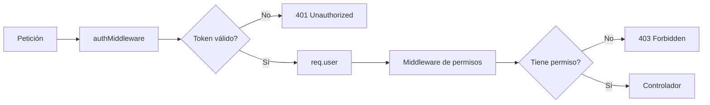
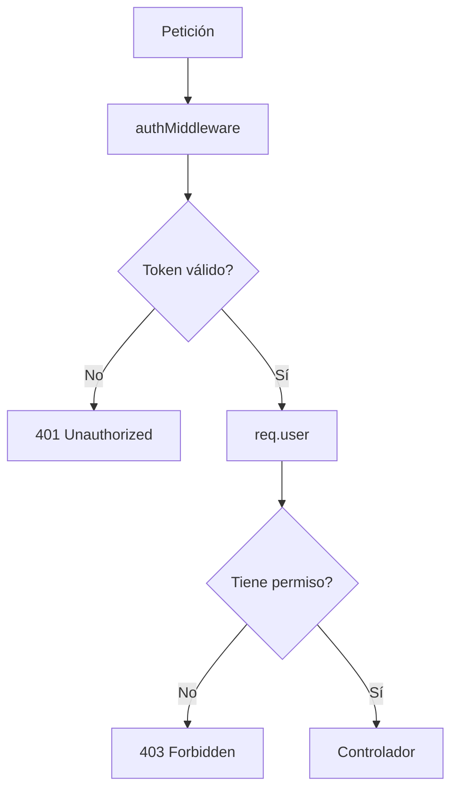

# Día 37: Roles y permisos

En el día 36 creamos el middleware de autenticación.

A partir de ese momento, algunas rutas dejaron de ser públicas y empezaron a exigir un token JWT:

`Authorization: Bearer <token>`

El middleware verifica el token y guarda los datos del usuario autenticado en:

`req.user`.

Concretamente, en el token tenemos:

```ts
{
  userId: 2,
  email: "user@email.com",
  role: "USER"
}
```

Hasta ahora hemos resuelto la primera gran pregunta de seguridad:

**¿El usuario está autenticado?**

Pero todavía no hemos resuelto la segunda:

**¿El usuario autenticado tiene permiso para hacer esta acción?**

Hoy vamos a trabajar con autorización.

!!! info "Idea principal"
    Autenticación significa saber quién eres; autorización significa saber qué puedes hacer.

## ¿Qué vamos a trabajar hoy?

Hoy trabajaremos estos conceptos:

- Roles.
- Permisos.
- `USER`.
- `ADMIN`.
- Autenticación.
- Autorización.
- `403 Forbidden`.
- `requireRole`.
- `requireSelfOrAdmin`.
- Rutas protegidas.
- Rutas solo para `ADMIN`.
- Rutas para el propio usuario.
- `GET /api/users/me`.

El producto del día será:

**Rutas de usuario protegidas por roles y permisos.**

El resultado esperado será que:

- Un `ADMIN` pueda gestionar usuarios.
- Un `USER` solo pueda consultar o modificar sus propios datos.
- Un `USER` no pueda listar todos los usuarios.
- Un `USER` no pueda eliminar usuarios.
- Un `USER` no pueda crear usuarios desde `/api/users`.

## Autenticación frente a autorización

Es importante separar estos dos conceptos.

| Concepto      | Pregunta que responde | Ejemplo                                 |
| ------------- | --------------------- | --------------------------------------- |
| Autenticación | ¿Quién eres?          | El token dice que eres `user@email.com` |
| Autorización  | ¿Qué puedes hacer?    | Solo un `ADMIN` puede listar usuarios   |

En el día 36 hicimos autenticación.

Hoy haremos autorización.

Un usuario puede estar autenticado y aun así no tener permiso para una acción.

Por ejemplo:

Un `USER` autenticado intenta hacer `GET /api/users`.

La API sabe quién es, pero no debe dejarle acceder al listado completo.

La respuesta correcta será:

`403 Forbidden`.

## Códigos 401 y 403

A partir de hoy usaremos con más claridad dos códigos:

| Código             | Significado                               | Cuándo usarlo                      |
| ------------------ | ----------------------------------------- | ---------------------------------- |
| `401 Unauthorized` | No estás autenticado                      | Falta token o token inválido       |
| `403 Forbidden`    | Estás autenticado, pero no tienes permiso | Eres USER y la ruta requiere ADMIN |

Ejemplo:

- `GET /api/users` sin token: `401`.
- `GET /api/users` con token de `USER`: `403`.
- `GET /api/users` con token de `ADMIN`: `200`.

Esta diferencia es muy importante en APIs reales.

## Roles del proyecto

Nuestro modelo Prisma ya tiene un enum:

```prisma
enum Role {
  USER
  ADMIN
}
```

Y el modelo `User` tiene:

```prisma
role Role @default(USER)
```

Eso significa que, por defecto, un usuario registrado será:

`USER`.

Solo un administrador debería poder crear o modificar usuarios con privilegios especiales.

## Reglas de permisos

A partir de hoy aplicaremos estas reglas:

| Ruta                                        | Permiso                     |
| ------------------------------------------- | --------------------------- |
| `GET /api/users`                            | Solo `ADMIN`                |
| `POST /api/users`                           | Solo `ADMIN`                |
| `DELETE /api/users/:id`                     | Solo `ADMIN`                |
| `GET /api/users/me`                         | Usuario autenticado         |
| `GET /api/users/:id`                        | `ADMIN` o el propio usuario |
| `PATCH /api/users/:id`                      | `ADMIN` o el propio usuario |
| `PATCH /api/users/:id` cambiando `isActive` | Solo `ADMIN`                |

Todavía no crearemos rutas específicas para cambiar roles.

Eso podría hacerse más adelante con endpoints como:

- `PATCH /api/users/:id/role`
- `PATCH /api/users/:id/status`

Hoy nos centraremos en proteger el CRUD actual.

## Flujo de permisos

El flujo de una ruta protegida será:



Primero autenticamos.

Después autorizamos.

No tiene sentido comprobar permisos si no sabemos quién es el usuario.

## Archivos que vamos a tocar

Hoy trabajaremos con:

- `src/middlewares/role.middleware.ts`
- `src/routes/user.routes.ts`
- `src/controllers/user.controller.ts`
- `src/services/user.service.ts`
- `README.md`
- `docs/dia-37-roles-permisos.md`

La estructura quedará así:

```text
src/
  controllers/
    auth.controller.ts
    health.controller.ts
    user.controller.ts
  errors/
    AppError.ts
  middlewares/
    auth.middleware.ts
    role.middleware.ts
  repositories/
    user.repository.ts
  routes/
    auth.routes.ts
    health.routes.ts
    user.routes.ts
  services/
    auth.service.ts
    user.service.ts
  types/
    auth.types.ts
  utils/
    jwt.utils.ts
    parse.utils.ts
    password.utils.ts
    string.utils.ts
```

## Parte guiada

### Paso 1: Abrir el proyecto

Abre una terminal y entra en el repositorio:

```bash
cd usermanager-api
```

Antes de empezar, comprueba que todo compila:

```bash
npm run build
```

## Crear middleware de roles

### Paso 2: Crear `role.middleware.ts`

Dentro de `src/middlewares/`, crea:

```text
src/middlewares/role.middleware.ts
```

Añade:

```ts
import { Response, NextFunction } from "express";
import { Role } from "@prisma/client";
import { AppError } from "../errors/AppError";
import { AuthenticatedRequest } from "../types/auth.types";

export function requireRole(...allowedRoles: Role[]) {
  return function (
    req: AuthenticatedRequest,
    res: Response,
    next: NextFunction
  ) {
    try {
      if (!req.user) {
        throw new AppError("Usuario no autenticado", 401);
      }

      if (!allowedRoles.includes(req.user.role)) {
        throw new AppError("No tienes permiso para realizar esta acción", 403);
      }

      next();
    } catch (error) {
      next(error);
    }
  };
}
```

Este middleware permite proteger rutas por rol.

### Paso 3: Entender `requireRole`

La función se usará así:

```ts
requireRole(Role.ADMIN)
```

Esto significa:

Solo usuarios con rol `ADMIN` pueden continuar.

También podríamos permitir varios roles:

```ts
requireRole(Role.ADMIN, Role.USER)
```

Aunque para una ruta autenticada esto sería casi equivalente a no filtrar por rol.

### Paso 4: Crear `requireSelfOrAdmin`

En el mismo archivo, añade:

```ts
export function requireSelfOrAdmin(
  req: AuthenticatedRequest,
  res: Response,
  next: NextFunction
) {
  try {
    if (!req.user) {
      throw new AppError("Usuario no autenticado", 401);
    }

    const requestedUserId = Number(req.params.id);

    if (Number.isNaN(requestedUserId)) {
      throw new AppError("El ID debe ser un número", 400, {
        received: req.params.id
      });
    }

    const isAdmin = req.user.role === Role.ADMIN;
    const isSelf = req.user.userId === requestedUserId;

    if (!isAdmin && !isSelf) {
      throw new AppError("No tienes permiso para acceder a este usuario", 403);
    }

    next();
  } catch (error) {
    next(error);
  }
}
```

Este middleware permite dos casos:

- `ADMIN` puede acceder a cualquier usuario.
- `USER` solo puede acceder a su propio usuario.

### Paso 5: Revisar `role.middleware.ts` completo

El archivo debería quedar así:

```ts
import { Response, NextFunction } from "express";
import { Role } from "@prisma/client";
import { AppError } from "../errors/AppError";
import { AuthenticatedRequest } from "../types/auth.types";

export function requireRole(...allowedRoles: Role[]) {
  return function (
    req: AuthenticatedRequest,
    res: Response,
    next: NextFunction
  ) {
    try {
      if (!req.user) {
        throw new AppError("Usuario no autenticado", 401);
      }

      if (!allowedRoles.includes(req.user.role)) {
        throw new AppError("No tienes permiso para realizar esta acción", 403);
      }

      next();
    } catch (error) {
      next(error);
    }
  };
}

export function requireSelfOrAdmin(
  req: AuthenticatedRequest,
  res: Response,
  next: NextFunction
) {
  try {
    if (!req.user) {
      throw new AppError("Usuario no autenticado", 401);
    }

    const requestedUserId = Number(req.params.id);

    if (Number.isNaN(requestedUserId)) {
      throw new AppError("El ID debe ser un número", 400, {
        received: req.params.id
      });
    }

    const isAdmin = req.user.role === Role.ADMIN;
    const isSelf = req.user.userId === requestedUserId;

    if (!isAdmin && !isSelf) {
      throw new AppError("No tienes permiso para acceder a este usuario", 403);
    }

    next();
  } catch (error) {
    next(error);
  }
}
```

## Crear endpoint `/api/users/me`

Hasta ahora tenemos:

`GET /api/auth/me`,

que devuelve el contenido del token.

Pero también nos interesa tener una ruta de usuario real:

`GET /api/users/me`.

Esta ruta devolverá los datos completos y seguros del usuario autenticado desde la base de datos.

### Paso 6: Crear servicio `getCurrentUserService`

Abre:

```text
src/services/user.service.ts
```

Añade:

```ts
export async function getCurrentUserService(userId: number) {
  return getUserByIdService(userId);
}
```

Esta función reutiliza la lógica existente.

Si el usuario no existe, `getUserByIdService` ya lanzará un error `404`.

### Paso 7: Crear controlador `getCurrentUser`

Abre:

```text
src/controllers/user.controller.ts
```

Importa el tipo:

```ts
import { AuthenticatedRequest } from "../types/auth.types";
```

Importa el servicio si no lo tienes:

```ts
import {
  createUserService,
  deactivateUserService,
  getCurrentUserService,
  getUserByIdService,
  listUsersService,
  updateUserService
} from "../services/user.service";
```

Añade este controlador:

```ts
export async function getCurrentUser(
  req: AuthenticatedRequest,
  res: Response,
  next: NextFunction
) {
  try {
    if (!req.user) {
      throw new AppError("Usuario no autenticado", 401);
    }

    const user = await getCurrentUserService(req.user.userId);

    return res.status(200).json({
      message: "Usuario autenticado obtenido correctamente",
      data: user
    });
  } catch (error) {
    next(error);
  }
}
```

Este controlador devuelve el usuario autenticado desde la base de datos, no solo desde el token.

## Proteger rutas de usuario

### Paso 8: Abrir `user.routes.ts`

Abre:

```text
src/routes/user.routes.ts
```

Actualmente debería tener algo parecido a:

```ts
import { Router } from "express";
import {
  createUserController,
  deleteUserController,
  getUserById,
  listUsers,
  updateUserController
} from "../controllers/user.controller";
import { authMiddleware } from "../middlewares/auth.middleware";

export const userRouter = Router();

userRouter.use(authMiddleware);

userRouter.get("/", listUsers);
userRouter.get("/:id", getUserById);
userRouter.post("/", createUserController);
userRouter.patch("/:id", updateUserController);
userRouter.delete("/:id", deleteUserController);
```

### Paso 9: Importar roles y middlewares

Añade:

```ts
import { Role } from "@prisma/client";
import {
  requireRole,
  requireSelfOrAdmin
} from "../middlewares/role.middleware";
```

Y añade `getCurrentUser` al import de controladores:

```ts
import {
  createUserController,
  deleteUserController,
  getCurrentUser,
  getUserById,
  listUsers,
  updateUserController
} from "../controllers/user.controller";
```

### Paso 10: Ajustar rutas con permisos

Sustituye las rutas por:

```ts
export const userRouter = Router();

userRouter.use(authMiddleware);

userRouter.get("/me", getCurrentUser);

userRouter.get("/", requireRole(Role.ADMIN), listUsers);

userRouter.post("/", requireRole(Role.ADMIN), createUserController);

userRouter.get("/:id", requireSelfOrAdmin, getUserById);

userRouter.patch("/:id", requireSelfOrAdmin, updateUserController);

userRouter.delete("/:id", requireRole(Role.ADMIN), deleteUserController);
```

Muy importante: la ruta `/me` debe ir antes de `/:id`.

Si ponemos primero `/:id`, Express interpretará `me` como si fuera un ID.

### Paso 11: Revisar permisos aplicados

Las rutas quedan así:

| Ruta                    | Middleware                              |
| ----------------------- | --------------------------------------- |
| `GET /api/users/me`     | `authMiddleware`                        |
| `GET /api/users`        | `authMiddleware` + `requireRole(ADMIN)` |
| `POST /api/users`       | `authMiddleware` + `requireRole(ADMIN)` |
| `GET /api/users/:id`    | `authMiddleware` + `requireSelfOrAdmin` |
| `PATCH /api/users/:id`  | `authMiddleware` + `requireSelfOrAdmin` |
| `DELETE /api/users/:id` | `authMiddleware` + `requireRole(ADMIN)` |

Con esto empezamos a tener reglas reales de autorización.

## Evitar que USER cambie `isActive`

Ahora mismo `PATCH /api/users/:id` permite que un usuario modifique sus propios datos.

Pero si el body incluye:

```json
{
  "isActive": false
}
```

podría cambiar su estado.

Eso debería ser una acción administrativa.

Vamos a impedir que un `USER` cambie `isActive`.

### Paso 12: Modificar `updateUserController`

Abre:

```text
src/controllers/user.controller.ts
```

Busca:

```ts
export async function updateUserController(...)
```

Dentro, después de obtener el ID, añade esta validación:

```ts
if (
  req.user?.role !== "ADMIN" &&
  Object.prototype.hasOwnProperty.call(req.body, "isActive")
) {
  throw new AppError("Solo un ADMIN puede cambiar el estado de un usuario", 403);
}
```

La función quedará aproximadamente así:

```ts
export async function updateUserController(
  req: AuthenticatedRequest,
  res: Response,
  next: NextFunction
) {
  try {
    const id = parseIdParam(req.params.id);

    if (
      req.user?.role !== "ADMIN" &&
      Object.prototype.hasOwnProperty.call(req.body, "isActive")
    ) {
      throw new AppError(
        "Solo un ADMIN puede cambiar el estado de un usuario",
        403
      );
    }

    const updatedUser = await updateUserService(id, req.body);

    return res.status(200).json({
      message: "Usuario actualizado correctamente",
      data: updatedUser
    });
  } catch (error) {
    next(error);
  }
}
```

Para poder acceder a `req.user`, cambia el tipo de `req` de `Request` a `AuthenticatedRequest`.

### Paso 13: Revisar imports del controlador

En `user.controller.ts` necesitarás:

```ts
import { Response, NextFunction } from "express";
import { AppError } from "../errors/AppError";
import { AuthenticatedRequest } from "../types/auth.types";
import { parseIdParam } from "../utils/parse.utils";
```

Si algún controlador no usa `req.user`, puede seguir usando `Request`.

Pero para simplificar, puedes usar `AuthenticatedRequest` en los controladores de usuario.

## Probar con usuario ADMIN

### Paso 14: Arrancar servicios

Ejecuta:

```bash
docker compose up -d
npm run dev
```

### Paso 15: Login como ADMIN

Petición:

```text
POST http://localhost:3000/api/auth/login
```

Body:

```json
{
  "email": "admin@email.com",
  "password": "admin123"
}
```

Copia el token.

Lo llamaremos:

```text
TOKEN_ADMIN
```

### Paso 16: ADMIN lista usuarios

Petición:

```text
GET http://localhost:3000/api/users
```

Cabecera:

```text
Authorization: Bearer TOKEN_ADMIN
```

Resultado esperado:

```text
200 OK
```

### Paso 17: ADMIN crea usuario

Petición:

```text
POST http://localhost:3000/api/users
```

Cabecera:

```text
Authorization: Bearer TOKEN_ADMIN
```

Body:

```json
{
  "name": "Usuario Creado por Admin",
  "email": "admin.crea@email.com",
  "password": "123456"
}
```

Resultado esperado:

```text
201 Created
```

### Paso 18: ADMIN consulta cualquier usuario

Petición:

```text
GET http://localhost:3000/api/users/2
```

Cabecera:

```text
Authorization: Bearer TOKEN_ADMIN
```

Resultado esperado:

```text
200 OK
```

### Paso 19: ADMIN desactiva usuario

Petición:

```text
DELETE http://localhost:3000/api/users/2
```

Cabecera:

```text
Authorization: Bearer TOKEN_ADMIN
```

Resultado esperado:

```text
200 OK
```

Si haces esta prueba con el usuario demo del seed, recuerda que después quedará inactivo.

Puedes reactivar manualmente en Prisma Studio o volver a ejecutar el seed si lo necesitas.

## Probar con usuario USER

### Paso 20: Login como USER

Petición:

```text
POST http://localhost:3000/api/auth/login
```

Body:

```json
{
  "email": "user@email.com",
  "password": "user123"
}
```

Copia el token.

Lo llamaremos:

```text
TOKEN_USER
```

### Paso 21: USER intenta listar usuarios

Petición:

```text
GET http://localhost:3000/api/users
```

Cabecera:

```text
Authorization: Bearer TOKEN_USER
```

Resultado esperado:

```text
403 Forbidden
```

Mensaje esperado:

```json
{
  "error": "No tienes permiso para realizar esta acción"
}
```

### Paso 22: USER consulta su perfil con `/me`

Petición:

```text
GET http://localhost:3000/api/users/me
```

Cabecera:

```text
Authorization: Bearer TOKEN_USER
```

Resultado esperado:

```text
200 OK
```

### Paso 23: USER consulta su propio ID

Si el usuario demo tiene ID 2:

```text
GET http://localhost:3000/api/users/2
```

Cabecera:

```text
Authorization: Bearer TOKEN_USER
```

Resultado esperado:

```text
200 OK
```

### Paso 24: USER intenta consultar otro usuario

Por ejemplo:

```text
GET http://localhost:3000/api/users/1
```

Cabecera:

```text
Authorization: Bearer TOKEN_USER
```

Resultado esperado:

```text
403 Forbidden
```

### Paso 25: USER actualiza su propio nombre

Petición:

```text
PATCH http://localhost:3000/api/users/2
```

Cabecera:

```text
Authorization: Bearer TOKEN_USER
```

Body:

```json
{
  "name": "Usuario Demo Actualizado"
}
```

Resultado esperado:

```text
200 OK
```

### Paso 26: USER intenta cambiar `isActive`

Petición:

```text
PATCH http://localhost:3000/api/users/2
```

Cabecera:

```text
Authorization: Bearer TOKEN_USER
```

Body:

```json
{
  "isActive": false
}
```

Resultado esperado:

```text
403 Forbidden
```

Mensaje esperado:

```json
{
  "error": "Solo un ADMIN puede cambiar el estado de un usuario"
}
```

### Paso 27: USER intenta eliminar usuario

Petición:

```text
DELETE http://localhost:3000/api/users/2
```

Cabecera:

```text
Authorization: Bearer TOKEN_USER
```

Resultado esperado:

```text
403 Forbidden
```

## Ejecutar build

### Paso 28: Compilar TypeScript

Ejecuta:

```bash
npm run build
```

Si aparece algún error, revisa:

- Imports de `Role`.
- Imports de `requireRole`.
- Imports de `requireSelfOrAdmin`.
- Tipos de `AuthenticatedRequest`.
- Uso de `req.user`.
- Orden de rutas `/me` y `/:id`.

## Actualizar README

### Paso 29: Añadir sección de roles y permisos

En el README, añade:

````md
## Roles y permisos

El proyecto distingue entre dos roles:

```text
USER
ADMIN
```

Reglas principales:

| Ruta | Permiso |
| --- | --- |
| `GET /api/users` | Solo ADMIN |
| `POST /api/users` | Solo ADMIN |
| `GET /api/users/me` | Usuario autenticado |
| `GET /api/users/:id` | ADMIN o el propio usuario |
| `PATCH /api/users/:id` | ADMIN o el propio usuario |
| `DELETE /api/users/:id` | Solo ADMIN |

Middlewares creados:

```text
requireRole
requireSelfOrAdmin
```

Códigos importantes:

```text
401 → No autenticado
403 → Autenticado, pero sin permiso
```
````

### Paso 30: Actualizar estructura

Añade:

```text
src/middlewares/role.middleware.ts
```

La estructura puede quedar así:

```text
src/
  controllers/
    auth.controller.ts
    health.controller.ts
    user.controller.ts
  errors/
    AppError.ts
  middlewares/
    auth.middleware.ts
    role.middleware.ts
  repositories/
    user.repository.ts
  routes/
    auth.routes.ts
    health.routes.ts
    user.routes.ts
  services/
    auth.service.ts
    user.service.ts
  types/
    auth.types.ts
  utils/
    jwt.utils.ts
    parse.utils.ts
    password.utils.ts
    string.utils.ts
```

### Paso 31: Actualizar índice del README

Añade:

```md
- [Día 37 - Roles y permisos](docs/dia-37-roles-permisos.md)
```

El bloque debería quedar parecido a:

```md
## Documentación del reto

- [Día 1 - Diseño inicial](docs/dia-01-diseno-inicial.md)
- [Día 2 - Preparación del proyecto](docs/dia-02-preparacion-proyecto.md)
- [Día 3 - Primer endpoint](docs/dia-03-primer-endpoint.md)
- [Día 4 - Métodos HTTP](docs/dia-04-metodos-http.md)
- [Día 5 - JSON, body, params y headers](docs/dia-05-json-body-params-headers.md)
- [Día 6 - Cliente HTTP y depuración](docs/dia-06-cliente-http-depuracion.md)
- [Día 7 - Listado de usuarios en memoria](docs/dia-07-listado-usuarios.md)
- [Día 8 - Consultar usuario por ID](docs/dia-08-consultar-usuario-id.md)
- [Día 9 - Crear usuarios en memoria](docs/dia-09-crear-usuarios.md)
- [Día 10 - Actualizar usuarios en memoria](docs/dia-10-actualizar-usuarios.md)
- [Día 11 - Eliminar o desactivar usuarios en memoria](docs/dia-11-eliminar-desactivar-usuarios.md)
- [Día 12 - Validación manual básica](docs/dia-12-validacion-manual-basica.md)
- [Día 13 - Validación de email y duplicados](docs/dia-13-validacion-email-duplicados.md)
- [Día 14 - Códigos de estado HTTP](docs/dia-14-codigos-estado-http.md)
- [Día 15 - Middleware centralizado de errores](docs/dia-15-middleware-errores.md)
- [Día 16 - Base de datos y persistencia](docs/dia-16-base-datos-persistencia.md)
- [Día 17 - PostgreSQL con Docker Compose](docs/dia-17-postgresql-docker-compose.md)
- [Día 18 - Diseño del modelo persistente User](docs/dia-18-diseno-modelo-persistente-user.md)
- [Día 19 - ORM o acceso a datos](docs/dia-19-orm-acceso-datos.md)
- [Día 20 - Instalación y configuración inicial de Prisma](docs/dia-20-instalacion-prisma.md)
- [Día 21 - Modelo Prisma User](docs/dia-21-modelo-prisma-user.md)
- [Día 22 - Primera migración con Prisma](docs/dia-22-primera-migracion-prisma.md)
- [Día 23 - Prisma Studio](docs/dia-23-prisma-studio.md)
- [Día 24 - Seed de datos iniciales](docs/dia-24-seed-datos-iniciales.md)
- [Día 25 - Consultas básicas con Prisma Client](docs/dia-25-consultas-basicas-prisma.md)
- [Día 26 - Separar rutas](docs/dia-26-separar-rutas.md)
- [Día 27 - Controladores](docs/dia-27-controladores.md)
- [Día 28 - Servicios](docs/dia-28-servicios.md)
- [Día 29 - Repositorio con Prisma](docs/dia-29-repositorio-prisma.md)
- [Día 30 - CRUD persistente ordenado](docs/dia-30-crud-persistente-ordenado.md)
- [Día 31 - Limpieza y refactor](docs/dia-31-limpieza-refactor.md)
- [Día 32 - Contraseñas seguras con bcrypt](docs/dia-32-bcrypt-passwords.md)
- [Día 33 - Registro de usuarios](docs/dia-33-auth-register.md)
- [Día 34 - Login de usuarios](docs/dia-34-auth-login.md)
- [Día 35 - Generación de token JWT](docs/dia-35-jwt.md)
- [Día 36 - Middleware de autenticación](docs/dia-36-auth-middleware.md)
- [Día 37 - Roles y permisos](docs/dia-37-roles-permisos.md)
```

## Crear el documento del día 37

Dentro de la carpeta `docs/`, crea:

```text
docs/dia-37-roles-permisos.md
```

Añade este contenido inicial:

````md
# Día 37 - Roles y permisos

## Qué he hecho

- He diferenciado autenticación y autorización.
- He creado role.middleware.ts.
- He creado requireRole.
- He creado requireSelfOrAdmin.
- He protegido GET /api/users para ADMIN.
- He protegido POST /api/users para ADMIN.
- He protegido DELETE /api/users/:id para ADMIN.
- He permitido GET /api/users/:id al ADMIN o al propio usuario.
- He permitido PATCH /api/users/:id al ADMIN o al propio usuario.
- He creado GET /api/users/me.
- He evitado que USER pueda cambiar isActive.
- He probado rutas con token de ADMIN.
- He probado rutas con token de USER.
- He comprobado respuestas 401 y 403.
- He ejecutado npm run build.

## Roles del proyecto

```text
USER
ADMIN
```

## Reglas de permisos

| Ruta | Permiso |
| --- | --- |
| `GET /api/users` | Solo ADMIN |
| `POST /api/users` | Solo ADMIN |
| `GET /api/users/me` | Usuario autenticado |
| `GET /api/users/:id` | ADMIN o el propio usuario |
| `PATCH /api/users/:id` | ADMIN o el propio usuario |
| `DELETE /api/users/:id` | Solo ADMIN |

## Middlewares creados

```text
requireRole
requireSelfOrAdmin
```

## Diferencia entre 401 y 403

| Código | Significado |
| --- | --- |
| 401 | No autenticado |
| 403 | Autenticado, pero sin permiso |

## Flujo de seguridad

```text
authMiddleware → req.user → middleware de permisos → controlador
```

## Explicación personal

Autenticación significa comprobar quién es el usuario mediante un token. Autorización significa comprobar si ese usuario tiene permiso para realizar una acción concreta.
````

### Paso 32: Añadir diagrama Mermaid

Añade al documento:



### Paso 33: Añadir checklist de pruebas

Añade:

```md
## Checklist de pruebas

| Prueba | Resultado |
| --- | --- |
| ADMIN puede hacer `GET /api/users` | |
| USER no puede hacer `GET /api/users` | |
| ADMIN puede hacer `POST /api/users` | |
| USER no puede hacer `POST /api/users` | |
| USER puede hacer `GET /api/users/me` | |
| USER puede consultar su propio ID | |
| USER no puede consultar otro ID | |
| USER puede actualizar su nombre | |
| USER no puede cambiar `isActive` | |
| USER no puede hacer `DELETE /api/users/:id` | |
| ADMIN puede hacer `DELETE /api/users/:id` | |
| `npm run build` funciona | |
```

## Guardar cambios en Git

### Paso 34: Revisar cambios

Ejecuta:

```bash
git status
```

Deberías ver cambios en:

- `src/middlewares/role.middleware.ts`
- `src/routes/user.routes.ts`
- `src/controllers/user.controller.ts`
- `src/services/user.service.ts`
- `README.md`
- `docs/dia-37-roles-permisos.md`

### Paso 35: Añadir archivos

```bash
git add .
```

### Paso 36: Crear commit

```bash
git commit -m "Dia 37 - Aplicar roles y permisos"
```

### Paso 37: Subir cambios

```bash
git push
```

## Problemas frecuentes

### `GET /api/users/me` devuelve error de ID

Comprueba el orden de rutas en `user.routes.ts`.

Correcto:

```ts
userRouter.get("/me", getCurrentUser);
userRouter.get("/:id", requireSelfOrAdmin, getUserById);
```

Incorrecto:

```ts
userRouter.get("/:id", requireSelfOrAdmin, getUserById);
userRouter.get("/me", getCurrentUser);
```

Si `/:id` va antes, Express interpreta `me` como si fuera un ID.

### `USER` puede listar usuarios

Revisa que tienes:

```ts
userRouter.get("/", requireRole(Role.ADMIN), listUsers);
```

### `USER` puede eliminar usuarios

Revisa que tienes:

```ts
userRouter.delete("/:id", requireRole(Role.ADMIN), deleteUserController);
```

### `USER` puede cambiar `isActive`

Revisa la validación en `updateUserController`:

```ts
if (
  req.user?.role !== "ADMIN" &&
  Object.prototype.hasOwnProperty.call(req.body, "isActive")
) {
  throw new AppError("Solo un ADMIN puede cambiar el estado de un usuario", 403);
}
```

### `ADMIN` recibe `403`

Comprueba el token.

Puede que estés usando un token de `USER`.

Haz login con:

```json
{
  "email": "admin@email.com",
  "password": "admin123"
}
```

y copia el token nuevo.

### El `role` no aparece en `req.user`

Revisa que el token se genera con:

```ts
generateToken({
  userId: user.id,
  email: user.email,
  role: user.role
});
```

Y que `verifyToken` valida y devuelve el payload completo.

## Parte libre

### Tarea libre 1: Crear tabla de permisos completa

Completa esta tabla:

| Ruta                  | Sin token | Token USER | Token ADMIN |
| --------------------- | --------- | ---------- | ----------- |
| `GET /api/users`      |           |            |             |
| `POST /api/users`     |           |            |             |
| `GET /api/users/me`   |           |            |             |
| `GET /api/users/1`    |           |            |             |
| `PATCH /api/users/2`  |           |            |             |
| `DELETE /api/users/2` |           |            |             |

### Tarea libre 2: Explicar 401 frente a 403

Añade una sección:

```md
## 401 frente a 403
```

Explica con tus palabras la diferencia entre no estar autenticado y no tener permiso.

### Tarea libre 3: Probar actualización de otro usuario

Haz login con `USER` y prueba modificar otro usuario:

```text
PATCH /api/users/1
```

Documenta el resultado esperado.

### Tarea libre 4: Probar creación con USER

Haz login con `USER` y prueba:

```text
POST /api/users
```

Documenta por qué debe fallar.

### Tarea libre 5: Preparar el día 38

Añade una sección:

```md
## Preparación para conexión con frontend
```

Responde:

- ¿Qué endpoints necesitará consumir el frontend?
- ¿Qué URL base tendrá la API?
- ¿Qué endpoints son públicos?
- ¿Qué endpoints requieren token?
- ¿Qué endpoints requieren `ADMIN`?
- ¿Dónde se guardará el token en el cliente?

Pistas:

- `POST /api/auth/register`
- `POST /api/auth/login`
- `GET /api/users/me`
- `GET /api/users`
- `Authorization: Bearer token`

## Entrega recomendada del día 37

Las respuestas no se entregan como archivo suelto. Deben quedar dentro del repositorio de GitHub.

Al finalizar el día 37, el repositorio debería tener esta estructura aproximada:

```text
usermanager-api/
  .env.example
  .gitignore
  docker-compose.yml
  README.md
  package.json
  package-lock.json
  tsconfig.json
  prisma/
    schema.prisma
    seed.ts
    migrations/
      <timestamp>_init/
        migration.sql
  src/
    prisma.ts
    server.ts
    controllers/
      auth.controller.ts
      health.controller.ts
      user.controller.ts
    errors/
      AppError.ts
    middlewares/
      auth.middleware.ts
      role.middleware.ts
    repositories/
      user.repository.ts
    routes/
      auth.routes.ts
      health.routes.ts
      user.routes.ts
    services/
      auth.service.ts
      user.service.ts
    types/
      auth.types.ts
    utils/
      jwt.utils.ts
      parse.utils.ts
      password.utils.ts
      string.utils.ts
  docs/
    dia-01-diseno-inicial.md
    dia-02-preparacion-proyecto.md
    dia-03-primer-endpoint.md
    dia-04-metodos-http.md
    dia-05-json-body-params-headers.md
    dia-06-cliente-http-depuracion.md
    dia-07-listado-usuarios.md
    dia-08-consultar-usuario-id.md
    dia-09-crear-usuarios.md
    dia-10-actualizar-usuarios.md
    dia-11-eliminar-desactivar-usuarios.md
    dia-12-validacion-manual-basica.md
    dia-13-validacion-email-duplicados.md
    dia-14-codigos-estado-http.md
    dia-15-middleware-errores.md
    dia-16-base-datos-persistencia.md
    dia-17-postgresql-docker-compose.md
    dia-18-diseno-modelo-persistente-user.md
    dia-19-orm-acceso-datos.md
    dia-20-instalacion-prisma.md
    dia-21-modelo-prisma-user.md
    dia-22-primera-migracion-prisma.md
    dia-23-prisma-studio.md
    dia-24-seed-datos-iniciales.md
    dia-25-consultas-basicas-prisma.md
    dia-26-separar-rutas.md
    dia-27-controladores.md
    dia-28-servicios.md
    dia-29-repositorio-prisma.md
    dia-30-crud-persistente-ordenado.md
    dia-31-limpieza-refactor.md
    dia-32-bcrypt-passwords.md
    dia-33-auth-register.md
    dia-34-auth-login.md
    dia-35-jwt.md
    dia-36-auth-middleware.md
    dia-37-roles-permisos.md
```

El documento del día 37 deberá estar en:

```text
docs/dia-37-roles-permisos.md
```

Y deberá incluir:

- Resumen de lo realizado.
- Roles del proyecto.
- Reglas de permisos.
- Middlewares creados.
- Diferencia entre `401` y `403`.
- Flujo de seguridad.
- Diagrama Mermaid.
- Checklist de pruebas.
- Tabla de permisos completa.
- Preparación para conexión con frontend.

En el foro, se compartirá el enlace actualizado al repositorio.

Ejemplo de mensaje:

```text
Hola, comparto el avance del día 37 del reto UserManager API:

https://github.com/usuario/usermanager-api

He aplicado roles y permisos para distinguir acciones de USER y ADMIN. La documentación está en:

docs/dia-37-roles-permisos.md
```

## Cierre del día

Hoy hemos cerrado la fase principal de seguridad.

Ya no basta con tener un token válido. Ahora la API también comprueba qué rol tiene el usuario y qué acción intenta realizar.

El proyecto ya distingue entre:

- Usuario no autenticado.
- Usuario autenticado sin permiso.
- Usuario autenticado con permiso.

Hoy hemos trabajado:

- Roles.
- Permisos.
- `USER`.
- `ADMIN`.
- `requireRole`.
- `requireSelfOrAdmin`.
- `GET /api/users/me`.
- `401 Unauthorized`.
- `403 Forbidden`.
- Autorización.

A partir del próximo día empezaremos a conectar el backend con un frontend preparado.

!!! success "Idea clave"
    Un sistema seguro no solo comprueba que el usuario ha iniciado sesión; también comprueba si tiene permiso para ejecutar cada acción.
