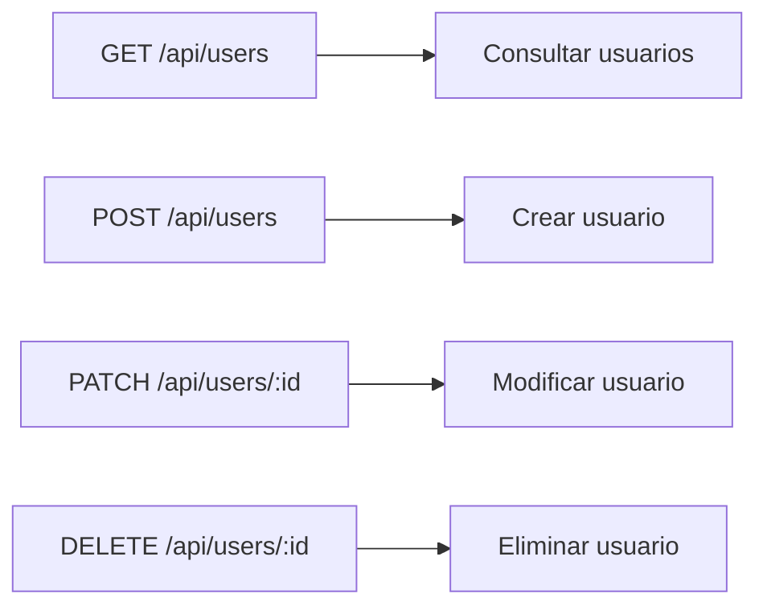
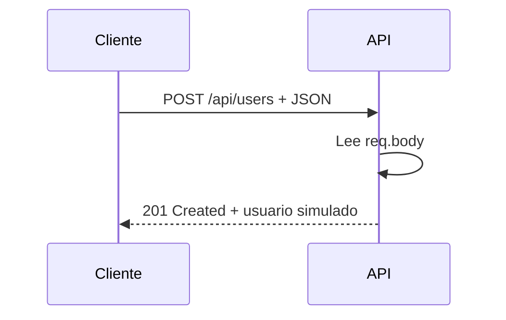
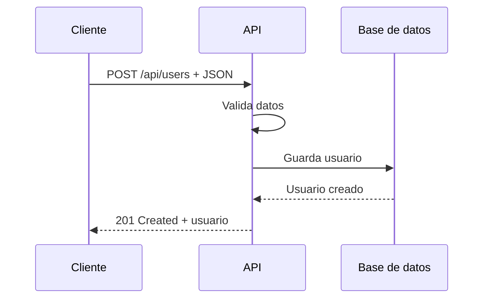

# Día 4: Métodos HTTP

En el día 3 creamos nuestro primer endpoint real:

```http
GET /api/health
```

Ese endpoint nos permitió comprobar que la API estaba funcionando correctamente
y nos sirvió para trabajar conceptos básicos como endpoint, ruta, respuesta JSON
y código de estado `200 OK`.

Hoy vamos a dar un paso más importante: vamos a conocer los **métodos HTTP
principales** que usaremos durante todo el reto.

En una API REST, no basta con tener rutas. También necesitamos indicar **qué
acción queremos realizar** sobre esas rutas. Para eso usamos métodos HTTP como:

```text
GET
POST
PATCH
DELETE
```

!!! abstract "Objetivo del día"
    Entender qué significa cada método HTTP y preparar una primera simulación
    de endpoints de usuarios.

Hoy todavía no vamos a crear el CRUD completo de usuarios. Eso lo haremos más
adelante. La idea es que empecemos a ver que no es lo mismo pedir información,
crear un recurso, modificarlo o eliminarlo.

## Qué vamos a trabajar hoy

| Concepto | Qué aprenderemos |
| --- | --- |
| Métodos HTTP | Cómo expresar acciones sobre recursos |
| `GET` | Consultar información |
| `POST` | Crear información |
| `PATCH` | Modificar parcialmente un recurso |
| `DELETE` | Eliminar o desactivar un recurso |
| CRUD | Relación entre operaciones básicas y métodos HTTP |
| Body | Cómo enviar datos al servidor |
| Parámetros de ruta | Cómo trabajar con rutas dinámicas |
| Respuestas simuladas | Cómo practicar sin base de datos |
| Códigos de estado | Cómo comunicar qué ha ocurrido |
| Pruebas HTTP | Cómo probar con Thunder Client o Postman |

Al final del día tendremos varias rutas temporales que nos permitirán probar
cómo se comporta una API cuando recibe distintos tipos de peticiones.

## Qué son los métodos HTTP

Los métodos HTTP indican la acción que queremos realizar sobre un recurso.

Por ejemplo, si el recurso es:

```text
/users
```

Podemos hacer diferentes acciones sobre ese recurso:

```text
Consultar usuarios
Crear usuarios
Modificar usuarios
Eliminar usuarios
```

Cada acción se representa con un método HTTP diferente.



La combinación entre método y ruta es lo que da significado a un endpoint.

!!! note "Misma ruta, distinta acción"
    No es lo mismo `GET /api/users` que `POST /api/users`. La ruta es parecida,
    pero la acción es diferente.

## GET: Obtener información

El método `GET` se usa para pedir información al servidor.

| Ejemplo | Uso |
| --- | --- |
| `GET /api/health` | Comprobar si la API funciona |
| `GET /api/users` | Obtener usuarios |
| `GET /api/users/1` | Obtener el usuario con id `1` |
| `GET /api/users/me` | Obtener mi perfil |

En general, una petición `GET` no debería modificar datos. Solo consulta
información.

```json title="Respuesta posible de GET /api/users"
[
  {
    "id": 1,
    "name": "Ana García",
    "email": "ana@email.com",
    "role": "USER",
    "isActive": true
  }
]
```

## POST: Crear información

El método `POST` se usa normalmente para crear un nuevo recurso.

| Ejemplo | Uso |
| --- | --- |
| `POST /api/users` | Crear un usuario |
| `POST /api/auth/register` | Registrar un usuario |
| `POST /api/auth/login` | Iniciar sesión |

```json title="Body de la petición"
{
  "name": "Carlos Pérez",
  "email": "carlos@email.com",
  "password": "123456"
}
```

```json title="Respuesta posible"
{
  "id": 2,
  "name": "Carlos Pérez",
  "email": "carlos@email.com",
  "role": "USER",
  "isActive": true
}
```

Cuando se crea un recurso correctamente, lo habitual es devolver:

```text
201 Created
```

## PATCH: Modificar parte de un recurso

El método `PATCH` se usa para modificar parcialmente un recurso.

Por ejemplo, si un usuario tiene estos datos:

```json
{
  "id": 1,
  "name": "Ana García",
  "email": "ana@email.com",
  "role": "USER",
  "isActive": true
}
```

Podríamos modificar solo el nombre:

```json
{
  "name": "Ana Martínez"
}
```

Endpoint:

```http
PATCH /api/users/1
```

Este método es útil porque no obliga a enviar todos los datos del usuario, solo
los que queremos cambiar.

Ejemplos que usaremos durante el reto:

```http
PATCH /api/users/:id
PATCH /api/users/me/password
PATCH /api/users/:id/role
PATCH /api/users/:id/status
```

## DELETE: Eliminar un recurso

El método `DELETE` se usa para eliminar un recurso.

```http
DELETE /api/users/1
```

Significa:

```text
Quiero eliminar el usuario con id 1.
```

En proyectos reales, muchas veces no se borra el usuario definitivamente. En
lugar de eso, se hace un **borrado lógico**.

```text
isActive = false
```

Esto permite conservar el historial del usuario y evitar pérdidas de
información.

!!! tip "Recomendación"
    Durante el reto podremos decidir cómo tratar esta operación, pero la opción
    recomendada será desactivar el usuario en lugar de borrarlo físicamente.

## CRUD

CRUD es una palabra muy utilizada en desarrollo backend.

Hace referencia a las cuatro operaciones básicas que se pueden hacer sobre
datos:

| Operación | Significado |
| --- | --- |
| Create | Crear |
| Read | Leer |
| Update | Actualizar |
| Delete | Eliminar |

En una API REST, CRUD suele relacionarse con métodos HTTP así:

| Operación | Método HTTP | Ejemplo |
| --- | --- | --- |
| Create | `POST` | `POST /api/users` |
| Read | `GET` | `GET /api/users` |
| Read | `GET` | `GET /api/users/:id` |
| Update | `PATCH` | `PATCH /api/users/:id` |
| Delete | `DELETE` | `DELETE /api/users/:id` |

Nuestro primer CRUD será el de usuarios. Todavía no lo vamos a implementar del
todo, pero hoy dejaremos preparadas las rutas de forma simulada.

## Body de una petición

El **body** es el cuerpo de una petición HTTP.

Se utiliza para enviar datos al servidor, especialmente en peticiones como
`POST` o `PATCH`.

```json title="Body para crear un usuario"
{
  "name": "Laura Martínez",
  "email": "laura@email.com",
  "password": "123456"
}
```

En Express podemos leer ese body gracias a esta línea que ya añadimos en días
anteriores:

```ts
app.use(express.json());
```

Sin esa línea, Express no interpretaría correctamente los datos enviados en
formato JSON.

```ts
app.post("/api/users", (req, res) => {
  console.log(req.body);

  res.status(201).json({
    message: "Usuario recibido"
  });
});
```

Aquí `req.body` contiene los datos enviados por el cliente.

## Parámetros de ruta

Un parámetro de ruta es una parte variable de la URL.

```http
GET /api/users/1
GET /api/users/2
GET /api/users/25
```

No tendría sentido crear una ruta diferente para cada usuario. En Express usamos
una ruta dinámica:

```ts
app.get("/api/users/:id", (req, res) => {
  const { id } = req.params;

  res.json({
    message: `Usuario con id ${id}`
  });
});
```

La parte `:id` indica que ese fragmento de la ruta es variable.

En Express podemos acceder a ese valor mediante:

```ts
req.params
```

| Petición | Valor recibido |
| --- | --- |
| `GET /api/users/7` | `req.params.id = "7"` |

!!! warning "Importante"
    Los parámetros de ruta llegan como texto. Si necesitamos usarlos como
    número, tendremos que convertirlos más adelante.

## Códigos de estado que usaremos hoy

Hoy empezaremos a usar varios códigos HTTP.

| Código | Cuándo usarlo |
| --- | --- |
| `200 OK` | La petición se ha realizado correctamente |
| `201 Created` | Se ha creado un recurso |
| `400 Bad Request` | La petición está mal formada o faltan datos |
| `404 Not Found` | El recurso no existe |

En esta sesión todavía no haremos validaciones reales completas, pero sí
empezaremos a responder con códigos más adecuados.

| Petición | Código esperado |
| --- | --- |
| `GET /api/users` | `200 OK` |
| `POST /api/users` | `201 Created` |
| `GET /api/users/999` | `404 Not Found` |
| `POST /api/users` sin body correcto | `400 Bad Request` |

!!! note "Diseño de API"
    Una API bien diseñada no solo devuelve datos. También comunica
    correctamente qué ha pasado.

## Flujo de una petición POST

Cuando un cliente crea un usuario, el flujo sería parecido a este:



Hoy no guardaremos todavía usuarios de verdad. Solo simularemos la respuesta.

Más adelante, el flujo será más completo:



## Parte guiada

### Paso 1: Abrir el proyecto

Abre el repositorio del reto:

```text
usermanager-api
```

Entra en la carpeta del proyecto:

```bash
cd usermanager-api
```

Comprueba que tienes la estructura del día anterior:

```text
usermanager-api/
  README.md
  package.json
  package-lock.json
  tsconfig.json
  src/
    server.ts
  docs/
    dia-01-diseno-inicial.md
    dia-02-preparacion-proyecto.md
    dia-03-primer-endpoint.md
```

### Paso 2: Arrancar el servidor

Ejecuta:

```bash
npm run dev
```

Comprueba que el servidor funciona visitando:

```text
http://localhost:3000/api/health
```

Si recibes la respuesta correcta, puedes continuar.

### Paso 3: Abrir `src/server.ts`

Abre el archivo:

```text
src/server.ts
```

Tendrás algo parecido a esto:

```ts
import express from "express";

const app = express();
const PORT = 3000;

app.use(express.json());

app.get("/", (req, res) => {
  res.json({
    message: "UserManager API"
  });
});

app.get("/api/health", (req, res) => {
  res.status(200).json({
    status: "ok",
    message: "UserManager API funcionando",
    timestamp: new Date().toISOString()
  });
});

app.listen(PORT, () => {
  console.log(`Servidor escuchando en http://localhost:${PORT}`);
});
```

### Paso 4: Crear una ruta GET para usuarios

Añade esta ruta debajo de `/api/health`:

```ts
app.get("/api/users", (req, res) => {
  res.status(200).json({
    message: "Listado de usuarios",
    data: []
  });
});
```

Esta ruta todavía no devuelve usuarios reales. Devuelve un array vacío para
simular que todavía no tenemos datos.

```http title="Prueba"
GET http://localhost:3000/api/users
```

```json title="Respuesta esperada"
{
  "message": "Listado de usuarios",
  "data": []
}
```

### Paso 5: Crear una ruta GET por ID

Añade esta ruta:

```ts
app.get("/api/users/:id", (req, res) => {
  const { id } = req.params;

  res.status(200).json({
    message: "Detalle de usuario",
    id: id
  });
});
```

```http title="Prueba"
GET http://localhost:3000/api/users/1
```

```json title="Respuesta esperada"
{
  "message": "Detalle de usuario",
  "id": "1"
}
```

Fíjate en que el valor `"1"` aparece como texto. Esto ocurre porque los
parámetros de ruta llegan como string.

### Paso 6: Crear una ruta POST para usuarios

Añade esta ruta:

```ts
app.post("/api/users", (req, res) => {
  const userData = req.body;

  res.status(201).json({
    message: "Usuario recibido para crear",
    data: userData
  });
});
```

```http title="Prueba"
POST http://localhost:3000/api/users
```

En el body envía JSON:

```json
{
  "name": "Carlos Pérez",
  "email": "carlos@email.com",
  "password": "123456"
}
```

```json title="Respuesta esperada"
{
  "message": "Usuario recibido para crear",
  "data": {
    "name": "Carlos Pérez",
    "email": "carlos@email.com",
    "password": "123456"
  }
}
```

!!! warning "Simulación"
    De momento estamos devolviendo también la contraseña porque solo estamos
    simulando. Más adelante aprenderemos a no devolver nunca contraseñas.

### Paso 7: Crear una ruta PATCH para usuarios

Añade esta ruta:

```ts
app.patch("/api/users/:id", (req, res) => {
  const { id } = req.params;
  const changes = req.body;

  res.status(200).json({
    message: "Usuario recibido para actualizar",
    id: id,
    changes: changes
  });
});
```

```http title="Prueba"
PATCH http://localhost:3000/api/users/1
```

Body:

```json
{
  "name": "Carlos Actualizado"
}
```

```json title="Respuesta esperada"
{
  "message": "Usuario recibido para actualizar",
  "id": "1",
  "changes": {
    "name": "Carlos Actualizado"
  }
}
```

### Paso 8: Crear una ruta DELETE para usuarios

Añade esta ruta:

```ts
app.delete("/api/users/:id", (req, res) => {
  const { id } = req.params;

  res.status(200).json({
    message: "Usuario recibido para eliminar o desactivar",
    id: id
  });
});
```

```http title="Prueba"
DELETE http://localhost:3000/api/users/1
```

```json title="Respuesta esperada"
{
  "message": "Usuario recibido para eliminar o desactivar",
  "id": "1"
}
```

### Paso 9: Revisar el archivo completo

El archivo `src/server.ts` debería quedar parecido a esto:

```ts
import express from "express";

const app = express();
const PORT = 3000;

app.use(express.json());

app.get("/", (req, res) => {
  res.json({
    message: "UserManager API"
  });
});

app.get("/api/health", (req, res) => {
  res.status(200).json({
    status: "ok",
    message: "UserManager API funcionando",
    timestamp: new Date().toISOString()
  });
});

app.get("/api/users", (req, res) => {
  res.status(200).json({
    message: "Listado de usuarios",
    data: []
  });
});

app.get("/api/users/:id", (req, res) => {
  const { id } = req.params;

  res.status(200).json({
    message: "Detalle de usuario",
    id: id
  });
});

app.post("/api/users", (req, res) => {
  const userData = req.body;

  res.status(201).json({
    message: "Usuario recibido para crear",
    data: userData
  });
});

app.patch("/api/users/:id", (req, res) => {
  const { id } = req.params;
  const changes = req.body;

  res.status(200).json({
    message: "Usuario recibido para actualizar",
    id: id,
    changes: changes
  });
});

app.delete("/api/users/:id", (req, res) => {
  const { id } = req.params;

  res.status(200).json({
    message: "Usuario recibido para eliminar o desactivar",
    id: id
  });
});

app.listen(PORT, () => {
  console.log(`Servidor escuchando en http://localhost:${PORT}`);
});
```

### Paso 10: Crear una colección de pruebas del día 4

En Thunder Client o Postman crea una colección llamada:

```text
UserManager API - Día 4
```

Añade estas peticiones:

```http
GET    http://localhost:3000/api/users
GET    http://localhost:3000/api/users/1
POST   http://localhost:3000/api/users
PATCH  http://localhost:3000/api/users/1
DELETE http://localhost:3000/api/users/1
```

Para las peticiones `POST` y `PATCH`, recuerda configurar el body en formato
JSON.

=== "Body POST"

    ```json
    {
      "name": "Carlos Pérez",
      "email": "carlos@email.com",
      "password": "123456"
    }
    ```

=== "Body PATCH"

    ```json
    {
      "name": "Carlos Actualizado"
    }
    ```

### Paso 11: Actualizar el README

Añade una sección con los nuevos endpoints simulados:

````md title="README.md"
## Endpoints simulados de usuarios

```http
GET /api/users
GET /api/users/:id
POST /api/users
PATCH /api/users/:id
DELETE /api/users/:id
```

Estos endpoints todavía no trabajan con datos reales. De momento sirven para
practicar métodos HTTP, rutas, parámetros y body.
````

### Paso 12: Crear el documento del día 4

Dentro de la carpeta `docs/`, crea un archivo:

```text
docs/dia-04-metodos-http.md
```

Añade este contenido inicial:

````md title="docs/dia-04-metodos-http.md"
# Día 4: Métodos HTTP

## Qué he hecho

- He creado rutas simuladas para usuarios.
- He probado `GET /api/users`.
- He probado `GET /api/users/:id`.
- He probado `POST /api/users` enviando JSON.
- He probado `PATCH /api/users/:id` enviando JSON.
- He probado `DELETE /api/users/:id`.
- He creado una colección de pruebas en Thunder Client o Postman.

## Endpoints trabajados

```http
GET /api/users
GET /api/users/:id
POST /api/users
PATCH /api/users/:id
DELETE /api/users/:id
```

## Explicación personal

GET sirve para obtener información.
POST sirve para crear información.
PATCH sirve para modificar parte de un recurso.
DELETE sirve para eliminar o desactivar un recurso.
````

### Paso 13: Añadir tabla de pruebas realizadas

En el mismo documento, añade una tabla como esta:

| Petición | Método | Código esperado | Resultado obtenido |
| --- | --- | ---: | --- |
| `/api/users` | `GET` | 200 | |
| `/api/users/1` | `GET` | 200 | |
| `/api/users` | `POST` | 201 | |
| `/api/users/1` | `PATCH` | 200 | |
| `/api/users/1` | `DELETE` | 200 | |

Completa la última columna con el resultado real obtenido en tus pruebas.

### Paso 14: Actualizar el índice del README

Añade el enlace al documento del día 4:

```md
## Documentación del reto

- [Día 1 - Diseño inicial](docs/dia-01-diseno-inicial.md)
- [Día 2 - Preparación del proyecto](docs/dia-02-preparacion-proyecto.md)
- [Día 3 - Primer endpoint](docs/dia-03-primer-endpoint.md)
- [Día 4 - Métodos HTTP](docs/dia-04-metodos-http.md)
```

### Paso 15: Guardar cambios en Git

Comprueba los cambios:

```bash
git status
```

Añade los archivos:

```bash
git add .
```

Crea un commit:

```bash
git commit -m "Dia 4 - Practicar metodos HTTP"
```

Sube los cambios:

```bash
git push
```

## Parte libre

Ahora toca practicar un poco más sin seguir todos los pasos guiados.

### Tarea libre 1: Añadir una ruta para consultar tu propio perfil

Crea una ruta simulada:

```http
GET /api/users/me
```

Debe devolver un usuario inventado.

```json title="Ejemplo"
{
  "id": 1,
  "name": "Usuario de prueba",
  "email": "usuario@email.com",
  "role": "USER",
  "isActive": true
}
```

Esta ruta más adelante servirá para consultar los datos del usuario autenticado.

### Tarea libre 2: Añadir una ruta para cambiar estado

Crea una ruta simulada:

```http
PATCH /api/users/:id/status
```

Debe recibir en el body algo como:

```json
{
  "isActive": false
}
```

Y devolver una respuesta parecida a:

```json
{
  "message": "Estado de usuario recibido para actualizar",
  "id": "1",
  "isActive": false
}
```

Esta ruta nos servirá más adelante para que un administrador pueda activar o
desactivar usuarios.

### Tarea libre 3: Añadir una ruta para cambiar rol

Crea una ruta simulada:

```http
PATCH /api/users/:id/role
```

Debe recibir en el body algo como:

```json
{
  "role": "ADMIN"
}
```

Y devolver una respuesta parecida a:

```json
{
  "message": "Rol de usuario recibido para actualizar",
  "id": "1",
  "role": "ADMIN"
}
```

Todavía no vamos a comprobar permisos. Solo estamos practicando rutas y métodos.

### Tarea libre 4: Completar una tabla de métodos HTTP

En el documento del día 4, añade una tabla explicando con tus palabras cuándo
usarías cada método:

| Método | ¿Para qué sirve? | Ejemplo en UserManager API |
| --- | --- | --- |
| `GET` | | |
| `POST` | | |
| `PATCH` | | |
| `DELETE` | | |

La explicación debe estar escrita con tus palabras, no copiada literalmente.

## Entrega recomendada del día 4

Las respuestas no se entregan como archivo suelto. Deben quedar dentro del
repositorio de GitHub.

Al finalizar el día 4, el repositorio debería tener esta estructura aproximada:

```text
usermanager-api/
  README.md
  package.json
  package-lock.json
  tsconfig.json
  src/
    server.ts
  docs/
    dia-01-diseno-inicial.md
    dia-02-preparacion-proyecto.md
    dia-03-primer-endpoint.md
    dia-04-metodos-http.md
```

El documento del día 4 deberá estar en:

```text
docs/dia-04-metodos-http.md
```

Y deberá incluir:

- Resumen de lo realizado.
- Endpoints trabajados.
- Explicación personal de `GET`, `POST`, `PATCH` y `DELETE`.
- Tabla de pruebas realizadas.
- Tabla de métodos HTTP completada.

En el foro, se compartirá el enlace actualizado al repositorio.

```text title="Mensaje de ejemplo"
Hola, comparto el avance del día 4 del reto UserManager API:

https://github.com/usuario/usermanager-api

He añadido endpoints simulados para practicar GET, POST, PATCH y DELETE, y la
documentación del día 4 en:
docs/dia-04-metodos-http.md
```

## Cierre del día

Hoy hemos trabajado una de las ideas más importantes de una API REST: los
métodos HTTP.

Hemos visto que una misma ruta puede representar acciones distintas según el
método utilizado:

```text
GET    → consultar
POST   → crear
PATCH  → modificar
DELETE → eliminar
```

También hemos empezado a trabajar con:

```text
Body
Parámetros de ruta
Códigos de estado
Colecciones de pruebas
Endpoints simulados
```

Aunque todavía no estamos guardando datos reales, ya estamos construyendo el
esqueleto de lo que será nuestro CRUD de usuarios.

!!! success "Idea clave"
    En una API REST, la ruta indica el recurso y el método HTTP indica la acción
    que queremos realizar sobre ese recurso.
