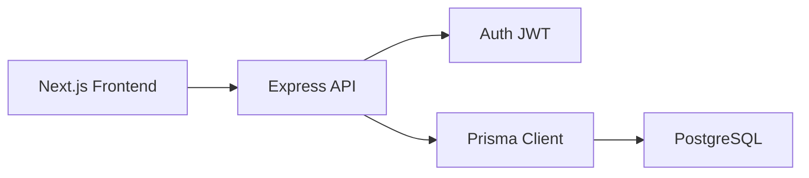

# Día 40: Documentación, demo y cierre

Llegamos al cierre de UserManager API. Hoy revisaremos el producto completo,
prepararemos una demo breve y dejaremos instrucciones suficientes para que
otra persona pueda arrancarlo desde cero.

!!! info "Idea principal"
    Un proyecto termina cuando funciona, se entiende y otra persona puede
    ejecutarlo sin depender de explicaciones orales.

## ¿Qué vamos a trabajar hoy?

- Revisión final de backend y frontend.
- README principal y README del frontend.
- Inventario de endpoints, usuarios y permisos.
- Capturas útiles.
- Guion de demo.
- Mejoras futuras.

El producto del día será:

**UserManager API documentada, verificable y preparada para una demo final.**

## Arquitectura final



En Prisma 7, el cliente se genera en `src/generated/prisma/client` y se
configura con `PrismaPg`. Esta decisión debe quedar reflejada en la
documentación técnica y no sustituirse por ejemplos antiguos.

## Arrancar todo desde cero

### Backend

```bash
docker compose up -d
npm install
npm run prisma:generate
npm run prisma:seed
npm run dev
```

### Frontend

```bash
cd frontend
npm install
cp .env.example .env.local
npm run dev
```

La API estará normalmente en `http://localhost:3000` y el frontend en
`http://localhost:3001`.

## Tabla final de endpoints públicos

| Método | Endpoint | Descripción |
| --- | --- | --- |
| `GET` | `/api/health` | Comprobar el estado de la API |
| `POST` | `/api/auth/register` | Registrar un usuario `USER` |
| `POST` | `/api/auth/login` | Validar credenciales y devolver JWT |

## Endpoints autenticados

| Método | Endpoint | Permiso |
| --- | --- | --- |
| `GET` | `/api/auth/me` | Usuario autenticado |
| `GET` | `/api/users/me` | Usuario autenticado |
| `GET` | `/api/users/:id` | `ADMIN` o el propio usuario |
| `PATCH` | `/api/users/:id` | `ADMIN` o el propio usuario |

## Endpoints ADMIN

| Método | Endpoint | Descripción |
| --- | --- | --- |
| `GET` | `/api/users` | Listar usuarios |
| `POST` | `/api/users` | Crear usuario |
| `DELETE` | `/api/users/:id` | Desactivar usuario |

## Usuarios de prueba

| Email | Contraseña | Rol | Estado |
| --- | --- | --- | --- |
| `admin@email.com` | `admin123` | `ADMIN` | Activo |
| `user@email.com` | `user123` | `USER` | Activo |
| `inactive@email.com` | `inactive123` | `USER` | Inactivo |

## Roles y permisos

| Acción | USER | ADMIN |
| --- | --- | --- |
| Registrarse e iniciar sesión | Sí | Sí |
| Ver el propio perfil | Sí | Sí |
| Editar el propio nombre | Sí | Sí |
| Ver otro usuario | No | Sí |
| Listar usuarios | No | Sí |
| Crear desde `/api/users` | No | Sí |
| Cambiar `isActive` | No | Sí |
| Desactivar usuarios | No | Sí |

## Revisión final del backend

- [ ] PostgreSQL arranca con Docker Compose.
- [ ] `npm run prisma:generate` termina correctamente.
- [ ] El seed puede ejecutarse más de una vez sin duplicar datos.
- [ ] `npm run build` compila.
- [ ] Los errores usan códigos HTTP coherentes.
- [ ] `passwordHash` nunca aparece en respuestas.
- [ ] Las rutas públicas, autenticadas y ADMIN tienen sus middlewares.
- [ ] CORS permite `http://localhost:3001`.
- [ ] La documentación menciona Prisma 7, el cliente generado y `PrismaPg`.

## Revisión final del frontend

- [ ] Existe `frontend/.env.local`.
- [ ] `npm run build` compila.
- [ ] Registro y login muestran errores legibles.
- [ ] El JWT se guarda y se envía en `Authorization`.
- [ ] Dashboard consulta y edita el perfil.
- [ ] USER recibe `403` en el panel admin.
- [ ] ADMIN lista, crea y desactiva usuarios.
- [ ] Logout elimina el estado local.
- [ ] La interfaz se puede usar en móvil y escritorio.

## Documentación que debe quedar actualizada

El README principal debe explicar el producto, requisitos, variables, comandos
y rutas. `frontend/README.md` debe describir la instalación, las pantallas, los
endpoints consumidos y las cuentas de prueba.

Antes de cerrar, simula que acabas de descargar el proyecto: sigue únicamente
los README y anota cualquier paso que falte.

## Capturas recomendadas

1. Inicio del frontend.
2. Login correcto como USER.
3. Dashboard con el perfil.
4. Respuesta `403` del panel admin con USER.
5. Tabla de usuarios con ADMIN.
6. Creación o desactivación de un usuario.
7. Prisma Studio confirmando el cambio.
8. Petición en Network con el token parcialmente oculto.

Las capturas deben demostrar comportamiento, no solo decorar la entrega.

## Guion de demo final

1. Arrancar PostgreSQL.
2. Ejecutar seed.
3. Arrancar backend.
4. Arrancar frontend.
5. Login como USER.
6. Ver perfil.
7. Intentar entrar al panel admin y comprobar `403`.
8. Logout.
9. Login como ADMIN.
10. Listar usuarios.
11. Crear usuario.
12. Desactivar usuario.
13. Comprobar datos en Prisma Studio.

Una demo de cinco minutos necesita un orden claro. Ten abiertas las terminales,
limpia datos accidentales antes de empezar y explica qué esperas antes de cada
acción.

## Prueba general previa a la demo

| Comprobación | Resultado esperado |
| --- | --- |
| Health | `200` |
| Login USER | `200` y JWT |
| Panel admin como USER | `403` |
| Login ADMIN | `200` y JWT |
| Listado ADMIN | `200` |
| Alta ADMIN | `201` |
| Persistencia | El dato aparece en Prisma Studio |
| Logout | Token eliminado; ruta protegida devuelve `401` |

## Problemas frecuentes

### La demo depende de datos creados manualmente

Repara el seed. La demo debe partir de un estado conocido.

### Un README funciona solo en tu ordenador

Elimina rutas absolutas y secretos. Declara requisitos, variables y puertos.

### El frontend funciona, pero `npm run build` falla

El modo desarrollo puede no mostrar todos los errores. Revisa el primer error
de TypeScript y vuelve a compilar después de corregirlo.

### La sesión anterior cambia el resultado

Pulsa Logout o limpia `localStorage` antes de iniciar el guion.

## Posibles mejoras futuras

- Refresh tokens.
- Tests automáticos.
- Paginación.
- Buscador de usuarios.
- Validación con Zod.
- Mejor gestión de errores en frontend.
- Despliegue.
- Dockerizar frontend.
- Roles más avanzados.
- Cambio de contraseña.
- Recuperación de contraseña.

Estas mejoras no son requisitos del reto. Cada una introduce decisiones nuevas
que conviene trabajar por separado.

## Parte libre

Elige una mejora futura y escribe una propuesta de una página: problema que
resuelve, cambios de backend, cambios de frontend, riesgos y una primera prueba
de aceptación. No es necesario implementarla.

## Entrega recomendada

- Repositorio con ambos README actualizados.
- Comandos de compilación superados.
- Checklist final.
- Capturas seleccionadas.
- Guion de demo.
- Lista breve de mejoras futuras priorizadas.

## Cierre del reto

Empezamos con HTTP y una ruta de salud. Terminamos conectando una interfaz real
a una API con PostgreSQL, Prisma, contraseñas cifradas, JWT y autorización.

Más importante que la cantidad de código es comprender el recorrido completo de
una petición y saber comprobar cada decisión.

!!! success "Idea clave"
    Un proyecto está listo para enseñarse cuando funciona, se puede arrancar desde cero y explica con claridad qué hace cada parte.
