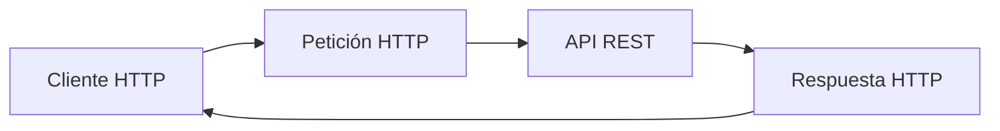
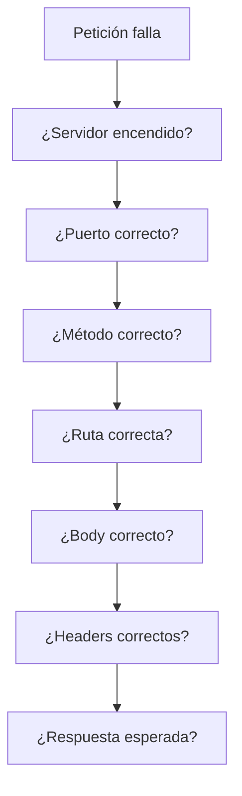

# Día 6: Cliente HTTP y depuración

En los días anteriores hemos creado la base de nuestra API y hemos empezado a
trabajar con rutas, métodos HTTP, JSON, body, params, query params y headers.

Ya tenemos varias rutas funcionando, como:

```http
GET /api/health
GET /api/users
POST /api/users
PATCH /api/users/:id
DELETE /api/users/:id
```

Además, hemos creado rutas temporales de debug para entender cómo viajan los
datos dentro de una petición HTTP.

Hoy vamos a centrarnos en una habilidad muy importante para cualquier persona
que desarrolle backend: **probar y depurar peticiones HTTP correctamente**.

!!! abstract "Objetivo del día"
    Aprender a probar la API con Thunder Client o Postman, organizar
    colecciones de peticiones y depurar errores habituales sin cambiar código al
    azar.

Cuando una API no funciona, no siempre el problema está en el código. A veces el
error está en:

```text
La URL
El método HTTP
El body
Los headers
El puerto
El servidor apagado
El formato JSON
El Content-Type
```

Por eso, antes de empezar con el CRUD real de usuarios, vamos a dedicar este día
a aprender a probar bien nuestra API.

## Qué vamos a trabajar hoy

| Concepto | Qué aprenderemos |
| --- | --- |
| Cliente HTTP | Enviar peticiones a una API |
| Colecciones de peticiones | Organizar pruebas reutilizables |
| Request | Revisar qué enviamos |
| Response | Revisar qué responde la API |
| Status code | Interpretar el resultado de la petición |
| Headers | Probar metadatos y tokens |
| Body JSON | Enviar datos al servidor |
| Errores frecuentes | Reconocer fallos comunes |
| Depuración | Seguir un orden para encontrar el problema |
| Documentación de pruebas | Registrar qué se ha probado |

La pregunta central de hoy será:

```text
Cuando una petición falla, ¿cómo puedo saber qué está fallando?
```

## Qué es un cliente HTTP

Un **cliente HTTP** es una herramienta que nos permite enviar peticiones a una
API y analizar la respuesta.

Cuando usamos una API, normalmente hay un cliente y un servidor.



Durante el desarrollo, el cliente puede ser:

```text
Un navegador
Thunder Client
Postman
Un frontend
Una app móvil
Otro backend
```

En nuestro caso, durante estas primeras fases usaremos principalmente **Thunder
Client** o **Postman**.

## Por qué no basta con el navegador

El navegador nos sirve para probar algunas rutas sencillas, por ejemplo:

```http
GET http://localhost:3000/api/health
```

Pero se queda corto cuando necesitamos probar cosas más completas.

| Necesidad | Por qué el navegador se queda corto |
| --- | --- |
| `POST` con body JSON | No es cómodo enviar cuerpos JSON |
| `PATCH` con datos | No se puede preparar fácilmente la petición |
| `DELETE` | No hay una interfaz directa para probarlo |
| Headers personalizados | No se añaden cómodamente |
| `Authorization: Bearer token` | Necesitamos configurar headers |
| Colecciones de pruebas | El navegador no organiza pruebas |

Por eso usamos herramientas como Thunder Client o Postman. Estas herramientas
nos permiten construir peticiones completas y ver claramente la respuesta.

## Thunder Client y Postman

### Thunder Client

Thunder Client es una extensión de Visual Studio Code que permite probar APIs
sin salir del editor.

Es cómodo porque:

```text
Está integrado en VS Code.
Es ligero.
Permite guardar colecciones.
Permite enviar body JSON.
Permite añadir headers.
Permite revisar status code y respuesta.
```

### Postman

Postman es una herramienta muy utilizada en el mundo profesional para probar y
documentar APIs.

Permite:

```text
Crear colecciones.
Guardar entornos.
Enviar peticiones complejas.
Documentar APIs.
Compartir pruebas con otros desarrolladores.
Automatizar algunas comprobaciones.
```

!!! tip "Lo importante"
    Para este reto podéis usar cualquiera de las dos herramientas. Lo importante
    no es la herramienta concreta, sino aprender a probar bien una API.

## Partes que debemos revisar

Cuando una petición no funciona, tenemos que revisar varias partes.



Una petición HTTP tiene varias zonas importantes:

```text
Método
URL
Headers
Body
Status code de respuesta
Body de respuesta
```

```http title="Petición"
POST http://localhost:3000/api/users
Content-Type: application/json
```

```json title="Body"
{
  "name": "Ana García",
  "email": "ana@email.com",
  "password": "123456"
}
```

```json title="Respuesta"
{
  "message": "Usuario recibido para crear",
  "data": {
    "name": "Ana García",
    "email": "ana@email.com",
    "password": "123456"
  }
}
```

## Status codes y depuración

Los códigos de estado nos ayudan a entender qué ha pasado.

| Código | Significado |
| --- | --- |
| `200 OK` | La petición ha ido bien |
| `201 Created` | Se ha creado un recurso |
| `400 Bad Request` | La petición está mal formada |
| `401 Unauthorized` | Falta autenticación |
| `403 Forbidden` | No hay permisos |
| `404 Not Found` | La ruta o recurso no existe |
| `409 Conflict` | Hay un conflicto, como un email duplicado |
| `500 Server Error` | Ha fallado el servidor |

Durante estos primeros días veremos sobre todo `200`, `201` y `404`. Más
adelante empezaremos a provocar y controlar errores como `400`, `401`, `403`,
`409` y `500`.

!!! note "Buena práctica"
    No mires solo el JSON de respuesta. Revisa siempre también el **status
    code**.

## Errores frecuentes al probar APIs

Cuando una petición falla, estos son algunos errores muy habituales:

| Error | Ejemplo | Qué revisar |
| --- | --- | --- |
| Servidor apagado | `http://localhost:3000/api/health` no responde | Ejecutar `npm run dev` |
| Puerto incorrecto | Probar `localhost:3001` cuando la API usa `3000` | Revisar `const PORT = 3000` |
| Ruta mal escrita | `/api/healt` en lugar de `/api/health` | Revisar URL exacta |
| Método incorrecto | Enviar `GET /api/users` cuando quieres crear | Revisar método HTTP |
| Body mal configurado | Enviar texto plano en lugar de JSON | Revisar body y `Content-Type` |
| Falta `express.json()` | `req.body` llega vacío o mal | Revisar `app.use(express.json())` |
| Header incorrecto | `Authorization` mal escrito | Revisar nombre y valor del header |

```json title="Body JSON correcto"
{
  "name": "Ana",
  "email": "ana@email.com"
}
```

## Cómo pensar cuando algo falla

Cuando algo falla, no hay que cambiar código al azar.

Conviene seguir un orden:

1. ¿Está arrancado el servidor?
2. ¿Estoy usando el puerto correcto?
3. ¿La ruta existe?
4. ¿Estoy usando el método correcto?
5. ¿El body está en JSON?
6. ¿Los headers están bien?
7. ¿Qué status code devuelve?
8. ¿Qué mensaje aparece en la respuesta?
9. ¿Qué aparece en la terminal?

!!! tip "La terminal cuenta"
    La terminal también es muy importante. Muchas veces el error real aparece
    allí.

## Colecciones de pruebas

Una colección es un grupo de peticiones guardadas.

En lugar de escribir cada vez las URLs desde cero, podemos guardar nuestras
pruebas organizadas.

```text title="Ejemplo de organización"
UserManager API
  Día 3
    GET /
    GET /api/health
    GET /api/ping

  Día 4
    GET /api/users
    GET /api/users/1
    POST /api/users
    PATCH /api/users/1
    DELETE /api/users/1

  Día 5
    POST /api/debug/body
    GET /api/debug/params/25
    GET /api/debug/query?role=ADMIN
    GET /api/debug/headers
```

Esto nos permitirá volver a probar rápidamente la API cuando hagamos cambios.

## Documentar pruebas

No basta con probar una vez y olvidarse.

Durante este reto iremos documentando las pruebas en los archivos de `docs/`.

| Petición | Método | Código esperado | Código obtenido | Observaciones |
| --- | --- | ---: | ---: | --- |
| `/api/health` | `GET` | 200 | 200 | Correcto |
| `/api/users` | `GET` | 200 | 200 | Devuelve array vacío |
| `/api/no-existe` | `GET` | 404 | 404 | Ruta inexistente |

Esto nos ayuda a ver el progreso y a detectar errores.

## Parte guiada

### Paso 1: Abrir el proyecto

Abre el repositorio:

```text
usermanager-api
```

Entra en la carpeta:

```bash
cd usermanager-api
```

Arranca el servidor:

```bash
npm run dev
```

Comprueba que responde:

```http
GET http://localhost:3000/api/health
```

### Paso 2: Crear una colección general

En Thunder Client o Postman, crea una colección llamada:

```text
UserManager API
```

Dentro de esa colección puedes crear carpetas o secciones por día:

```text
Día 3 - Primer endpoint
Día 4 - Métodos HTTP
Día 5 - Body params headers
Día 6 - Depuración
```

La organización no tiene que ser perfecta, pero sí clara.

### Paso 3: Añadir peticiones básicas

Añade estas peticiones a la colección:

```http
GET http://localhost:3000/
GET http://localhost:3000/api/health
GET http://localhost:3000/api/users
GET http://localhost:3000/api/users/1
```

Comprueba que todas responden correctamente y completa una tabla con los códigos
obtenidos.

### Paso 4: Añadir peticiones con body

Añade esta petición:

```http
POST http://localhost:3000/api/users
```

```json title="Body JSON"
{
  "name": "Ana García",
  "email": "ana@email.com",
  "password": "123456"
}
```

Comprueba que la API devuelve los datos recibidos.

Después añade:

```http
PATCH http://localhost:3000/api/users/1
```

```json title="Body JSON"
{
  "name": "Ana Actualizada"
}
```

Comprueba que la API devuelve el ID y los cambios recibidos.

### Paso 5: Añadir peticiones de debug

Añade estas peticiones del día anterior:

```http
POST   http://localhost:3000/api/debug/body
GET    http://localhost:3000/api/debug/params/25
GET    http://localhost:3000/api/debug/query?role=ADMIN&isActive=true
GET    http://localhost:3000/api/debug/headers
PATCH  http://localhost:3000/api/debug/users/7?notify=true
```

En la petición de headers añade:

```http
Authorization: Bearer token-de-prueba
```

En la petición combinada añade también body:

```json
{
  "name": "Nombre actualizado"
}
```

### Paso 6: Crear una ruta temporal para depuración

Añade en `src/server.ts` una ruta temporal:

```ts
app.post("/api/debug/request", (req, res) => {
  res.status(200).json({
    message: "Información completa de la petición",
    method: req.method,
    path: req.path,
    params: req.params,
    query: req.query,
    headers: req.headers,
    body: req.body
  });
});
```

Esta ruta nos permite ver en una sola respuesta mucha información de la petición.

```http title="Prueba"
POST http://localhost:3000/api/debug/request?source=thunder
x-client-name: thunder-client
```

```json title="Body"
{
  "example": "datos de prueba"
}
```

```json title="Respuesta esperada"
{
  "message": "Información completa de la petición",
  "method": "POST",
  "path": "/api/debug/request",
  "params": {},
  "query": {
    "source": "thunder"
  },
  "headers": {
    "...": "..."
  },
  "body": {
    "example": "datos de prueba"
  }
}
```

No hace falta copiar todos los headers en la documentación. Solo entender que
aparecen.

### Paso 7: Provocar un error de ruta inexistente

Prueba esta petición:

```http
GET http://localhost:3000/api/ruta-inventada
```

Anota:

```text
Código obtenido
Respuesta obtenida
Qué crees que significa
```

Todavía no tenemos un middleware `404` personalizado, así que Express responderá
de forma básica.

### Paso 8: Provocar un error de método incorrecto

Prueba esta petición:

```http
POST http://localhost:3000/api/health
```

Recuerda que nosotros hemos creado:

```http
GET /api/health
```

Pero no hemos creado:

```http
POST /api/health
```

Anota qué ocurre. Esto nos ayuda a entender que método y ruta funcionan juntos.

### Paso 9: Provocar un error de JSON mal formado

En Thunder Client o Postman, prueba a enviar un JSON incorrecto en una petición
`POST`.

```json title="JSON incorrecto"
{
  "name": "Ana",
  "email": "ana@email.com",
}
```

Ese JSON tiene un error: sobra la coma final.

Comprueba qué respuesta aparece y mira también la terminal. La idea no es dejar
el proyecto roto, sino aprender a reconocer errores de formato.

Después corrige el JSON.

### Paso 10: Añadir logs temporales en el servidor

En la ruta:

```ts
app.post("/api/users", (req, res) => {
  const userData = req.body;

  res.status(201).json({
    message: "Usuario recibido para crear",
    data: userData
  });
});
```

Añade un `console.log` temporal:

```ts
app.post("/api/users", (req, res) => {
  const userData = req.body;

  console.log("Body recibido en POST /api/users:", userData);

  res.status(201).json({
    message: "Usuario recibido para crear",
    data: userData
  });
});
```

Vuelve a probar:

```http
POST http://localhost:3000/api/users
```

Y observa la terminal.

!!! note "Depurar no es solo mirar la respuesta"
    También podemos usar la terminal para comprobar qué está llegando al
    servidor.

### Paso 11: Crear el documento del día 6

Dentro de la carpeta `docs/`, crea un archivo:

```text
docs/dia-06-cliente-http-depuracion.md
```

Añade este contenido inicial:

````md title="docs/dia-06-cliente-http-depuracion.md"
# Día 6: Cliente HTTP y depuración

## Qué he hecho

- He organizado una colección de pruebas de la API.
- He probado rutas básicas.
- He probado peticiones con body.
- He probado peticiones con params, query params y headers.
- He creado una ruta temporal de depuración.
- He provocado errores controlados para entender qué ocurre.
- He revisado respuestas y códigos de estado.

## Colección creada

Nombre de la colección:

```text
UserManager API
```

## Ruta temporal de depuración

```http
POST /api/debug/request
```

## Explicación personal

Un cliente HTTP sirve para enviar peticiones a una API y analizar las
respuestas. Es útil porque permite probar métodos, headers, body, params y
códigos de estado de una forma más completa que el navegador.
````

### Paso 12: Añadir tabla de pruebas realizadas

En el documento del día 6, añade una tabla como esta:

| Petición | Qué prueba | Código esperado | Código obtenido | Observaciones |
| --- | --- | ---: | ---: | --- |
| `GET /api/health` | Health endpoint | 200 | | |
| `GET /api/users` | Listado simulado | 200 | | |
| `POST /api/users` | Body JSON | 201 | | |
| `PATCH /api/users/1` | Params + body | 200 | | |
| `POST /api/debug/request?source=thunder` | Request completa | 200 | | |
| `GET /api/ruta-inventada` | Ruta inexistente | 404 | | |
| `POST /api/health` | Método incorrecto | 404 | | |

Completa los resultados obtenidos según tus pruebas.

### Paso 13: Actualizar el README

Añade el enlace al documento del día 6:

```md
## Documentación del reto

- [Día 1 - Diseño inicial](docs/dia-01-diseno-inicial.md)
- [Día 2 - Preparación del proyecto](docs/dia-02-preparacion-proyecto.md)
- [Día 3 - Primer endpoint](docs/dia-03-primer-endpoint.md)
- [Día 4 - Métodos HTTP](docs/dia-04-metodos-http.md)
- [Día 5 - JSON, body, params y headers](docs/dia-05-json-body-params-headers.md)
- [Día 6 - Cliente HTTP y depuración](docs/dia-06-cliente-http-depuracion.md)
```

### Paso 14: Guardar cambios en Git

Comprueba los cambios:

```bash
git status
```

Añade los archivos:

```bash
git add .
```

Crea un commit:

```bash
git commit -m "Dia 6 - Organizar pruebas y depurar peticiones"
```

Sube los cambios:

```bash
git push
```

## Parte libre

Ahora toca practicar sin seguir exactamente la guía.

### Tarea libre 1: Crear una petición con header personalizado

Crea una petición a:

```http
POST /api/debug/request
```

Añade un header personalizado:

```http
x-student-name: tu-nombre
```

Añade un body JSON con información inventada:

```json
{
  "message": "Probando headers personalizados"
}
```

En el documento del día 6, anota dónde aparece ese header en la respuesta.

### Tarea libre 2: Crear una prueba de actualización completa

Crea una petición:

```http
PATCH /api/users/5
```

```json title="Body"
{
  "name": "Usuario Modificado",
  "email": "modificado@email.com",
  "isActive": false
}
```

Anota:

```text
Qué viaja en params.
Qué viaja en body.
Qué devuelve la API.
```

### Tarea libre 3: Crear una pequeña guía de depuración

En el documento del día 6, añade una sección llamada:

```md
## Mi guía para depurar una petición
```

Escribe una lista ordenada con los pasos que seguirías cuando una petición no
funciona.

```text title="Ejemplo"
1. Comprobar que el servidor está arrancado.
2. Revisar el método HTTP.
3. Revisar la URL.
4. Revisar el body.
5. Revisar los headers.
6. Mirar el status code.
7. Mirar la terminal.
```

Puedes adaptarla con tus palabras.

### Tarea libre 4: Comparar navegador y cliente HTTP

En el documento del día 6, añade una tabla comparando el navegador con Thunder
Client o Postman.

| Herramienta | Ventajas | Limitaciones |
| --- | --- | --- |
| Navegador | | |
| Thunder Client/Postman | | |

La idea es que expliques por qué para probar una API necesitamos algo más que el
navegador.

## Entrega recomendada del día 6

Las respuestas no se entregan como archivo suelto. Deben quedar dentro del
repositorio de GitHub.

Al finalizar el día 6, el repositorio debería tener esta estructura aproximada:

```text
usermanager-api/
  README.md
  package.json
  package-lock.json
  tsconfig.json
  src/
    server.ts
  docs/
    dia-01-diseno-inicial.md
    dia-02-preparacion-proyecto.md
    dia-03-primer-endpoint.md
    dia-04-metodos-http.md
    dia-05-json-body-params-headers.md
    dia-06-cliente-http-depuracion.md
```

El documento del día 6 deberá estar en:

```text
docs/dia-06-cliente-http-depuracion.md
```

Y deberá incluir:

- Resumen de lo realizado.
- Nombre de la colección de pruebas.
- Ruta temporal de depuración.
- Tabla de pruebas realizadas.
- Resultado de errores provocados.
- Guía personal de depuración.
- Comparación entre navegador y cliente HTTP.

En el foro, se compartirá el enlace actualizado al repositorio.

```text title="Mensaje de ejemplo"
Hola, comparto el avance del día 6 del reto UserManager API:

https://github.com/usuario/usermanager-api

He organizado una colección de pruebas, he creado una ruta temporal de
depuración y he documentado las pruebas del día 6 en:
docs/dia-06-cliente-http-depuracion.md
```

## Cierre del día

Hoy no hemos añadido una gran funcionalidad nueva al producto, pero hemos
trabajado una habilidad fundamental: **probar y depurar una API**.

Antes de construir funcionalidades más complejas, necesitamos saber comprobar
qué está pasando cuando una petición falla.

Hoy hemos practicado:

```text
Crear colecciones de pruebas.
Enviar peticiones con body.
Enviar params y query params.
Enviar headers.
Provocar errores controlados.
Leer status codes.
Mirar la respuesta.
Mirar la terminal.
Documentar pruebas.
```

A partir del próximo día empezaremos con el **CRUD real en memoria** de usuarios.

!!! success "Idea clave"
    Programar una API no es solo escribir endpoints: también es saber probarlos,
    interpretar errores y comprobar que cada petición hace lo que esperamos.
