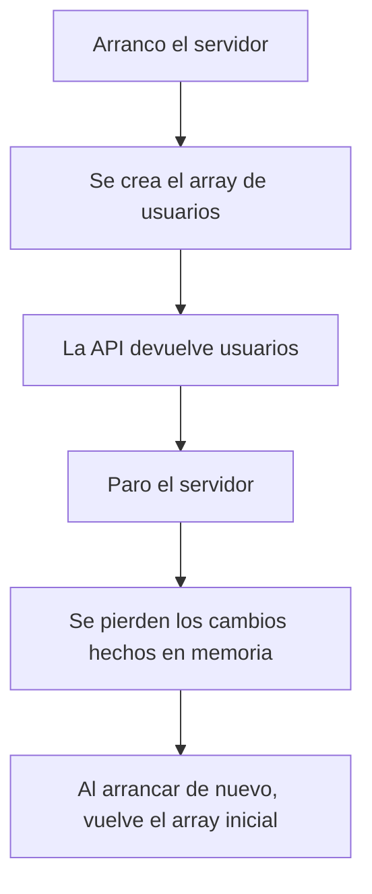
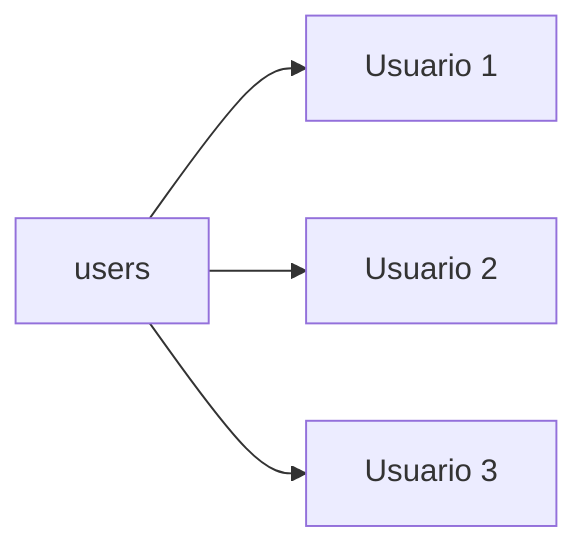
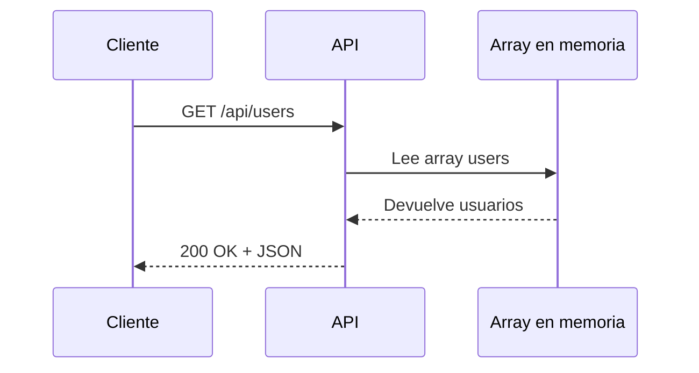

# Día 7: Listado de usuarios en memoria

En el día 6 trabajamos una habilidad muy importante: **probar y depurar
peticiones HTTP**. Organizamos una colección de pruebas, provocamos algunos
errores controlados y aprendimos a revisar método, URL, body, headers, status
code y respuesta.

Hasta ahora hemos creado rutas simuladas. Por ejemplo:

```http
GET /api/users
POST /api/users
PATCH /api/users/:id
DELETE /api/users/:id
```

Pero esas rutas todavía no trabajan con datos reales. Simplemente devuelven
mensajes o los datos recibidos.

Hoy empezamos una nueva fase del reto: el **CRUD de usuarios en memoria**.

Durante unos días vamos a trabajar con un array de usuarios dentro del propio
código. Todavía no usaremos base de datos. Esto nos permitirá entender bien la
lógica de una API antes de añadir más complejidad.

!!! abstract "Objetivo del día"
    Crear un pequeño listado de usuarios en memoria y devolverlo desde
    `GET /api/users` en formato JSON.

Al finalizar el día, nuestra API tendrá una lista inicial de usuarios y será
capaz de devolverla desde:

```http
GET /api/users
```

## Qué vamos a trabajar hoy

| Concepto | Qué aprenderemos |
| --- | --- |
| Datos en memoria | Guardar datos temporalmente en el servidor |
| Array de usuarios | Representar varios usuarios en una variable |
| Objeto usuario | Definir qué campos tiene cada usuario |
| Tipado con TypeScript | Crear un tipo `User` |
| `GET /api/users` | Devolver un listado de usuarios |
| Respuesta JSON | Estructurar la respuesta de la API |
| Datos sensibles | Evitar devolver contraseñas |
| Pruebas HTTP | Comprobar el endpoint con Thunder Client o Postman |

La idea es empezar a convertir nuestras rutas simuladas en rutas que trabajan
con datos.

## Qué significa trabajar en memoria

Cuando decimos que vamos a trabajar **en memoria**, significa que los datos
estarán guardados temporalmente mientras el servidor esté encendido.

```ts title="Array en memoria"
const users = [
  {
    id: 1,
    name: "Ana García",
    email: "ana@email.com",
    role: "USER",
    isActive: true
  }
];
```

Mientras el servidor esté funcionando, podremos usar ese array.

!!! warning "Limitación importante"
    Si paramos y volvemos a arrancar el servidor, los datos volverán a su estado
    inicial. Esto ocurre porque todavía no tenemos base de datos.



Más adelante usaremos una base de datos para que los usuarios se guarden de
forma persistente.

## Por qué empezamos con datos en memoria

Podríamos empezar directamente con una base de datos, pero sería más difícil.

Antes de preocuparnos por Docker, SQL, migraciones o conexión a base de datos,
nos interesa entender:

```text
Cómo se organiza una lista de usuarios.
Cómo devuelve datos una ruta GET.
Cómo se estructura una respuesta JSON.
Cómo evitar devolver datos sensibles.
Cómo probar un endpoint que devuelve varios recursos.
```

Trabajar en memoria nos permite centrarnos en la lógica de la API.

| Ahora | Más adelante |
| --- | --- |
| Array en `server.ts` | Base de datos |
| Datos temporales | Datos persistentes |
| Lógica sencilla | Persistencia real |

La ruta seguirá siendo la misma:

```http
GET /api/users
```

!!! tip "Idea importante"
    El cliente no debería preocuparse de si los datos vienen de un array o de
    una base de datos. El cliente solo consume la API.

## El recurso User

Nuestro recurso principal será el usuario.

De momento, un usuario tendrá estos campos:

| Campo | Descripción |
| --- | --- |
| `id` | Identificador del usuario |
| `name` | Nombre completo |
| `email` | Correo electrónico |
| `role` | Rol: `USER` o `ADMIN` |
| `isActive` | Indica si el usuario está activo |
| `createdAt` | Fecha de creación |
| `updatedAt` | Fecha de última modificación |

Más adelante también tendremos contraseña cifrada, pero no la devolveremos en
los listados.

```json title="Usuario de ejemplo"
{
  "id": 1,
  "name": "Ana García",
  "email": "ana@email.com",
  "role": "USER",
  "isActive": true,
  "createdAt": "2026-01-01T10:00:00.000Z",
  "updatedAt": "2026-01-01T10:00:00.000Z"
}
```

!!! danger "Regla desde el principio"
    La API nunca debe devolver contraseñas. Aunque todavía estemos trabajando
    con datos de prueba, conviene acostumbrarnos a no incluir información
    sensible en las respuestas.

## Qué es un array

Un array es una estructura que permite guardar varios elementos en una misma
variable.

```ts
const numbers = [1, 2, 3, 4];
```

En nuestro caso, no guardaremos números, sino objetos de usuario:

```ts
const users = [
  {
    id: 1,
    name: "Ana García",
    email: "ana@email.com",
    role: "USER",
    isActive: true
  },
  {
    id: 2,
    name: "Carlos Pérez",
    email: "carlos@email.com",
    role: "ADMIN",
    isActive: true
  }
];
```

Cada elemento del array representa un usuario.



Hoy solo necesitaremos devolver ese array desde la API.

## Tipado básico con TypeScript

Como estamos usando TypeScript, podemos definir la forma que debe tener un
usuario.

```ts title="Tipo User"
type User = {
  id: number;
  name: string;
  email: string;
  role: "USER" | "ADMIN";
  isActive: boolean;
  createdAt: string;
  updatedAt: string;
};
```

Esto significa:

| Campo | Tipo esperado |
| --- | --- |
| `id` | `number` |
| `name` | `string` |
| `email` | `string` |
| `role` | `"USER"` o `"ADMIN"` |
| `isActive` | `boolean` |
| `createdAt` | `string` |
| `updatedAt` | `string` |

Gracias a esto, TypeScript nos avisará si intentamos crear un usuario mal
formado.

```ts title="Ejemplo incorrecto"
const user: User = {
  id: "1",
  name: "Ana"
};
```

Ese ejemplo daría problemas porque `id` debería ser un número y faltan campos
obligatorios.

## Respuesta de listado

Cuando un cliente pida:

```http
GET /api/users
```

Podríamos devolver directamente el array:

```json
[
  {
    "id": 1,
    "name": "Ana García",
    "email": "ana@email.com",
    "role": "USER",
    "isActive": true
  }
]
```

Esto es correcto, pero durante el reto vamos a intentar usar una respuesta un
poco más estructurada:

```json
{
  "message": "Listado de usuarios",
  "data": [
    {
      "id": 1,
      "name": "Ana García",
      "email": "ana@email.com",
      "role": "USER",
      "isActive": true
    }
  ]
}
```

Así podremos añadir información adicional más adelante, como:

```text
total de usuarios
página actual
filtros aplicados
mensaje descriptivo
```

```json title="Respuesta con total"
{
  "message": "Listado de usuarios",
  "total": 2,
  "data": []
}
```

## Datos sensibles

Una API debe tener mucho cuidado con los datos que devuelve.

En un usuario podríamos tener datos sensibles como:

```text
password
passwordHash
token
datos personales innecesarios
```

Aunque más adelante guardaremos `passwordHash`, nunca debe aparecer en la
respuesta.

=== "Mal ejemplo"

    ```json
    {
      "id": 1,
      "name": "Ana García",
      "email": "ana@email.com",
      "passwordHash": "$2b$10$..."
    }
    ```

=== "Buen ejemplo"

    ```json
    {
      "id": 1,
      "name": "Ana García",
      "email": "ana@email.com",
      "role": "USER",
      "isActive": true
    }
    ```

La idea es sencilla:

```text
La API solo debe devolver los datos que el cliente necesita.
```

## Flujo del endpoint de hoy

El endpoint de hoy tendrá este flujo:



No habrá todavía base de datos, filtros ni autenticación. Solo queremos que la
API devuelva correctamente un listado de usuarios.

## Parte guiada

### Paso 1: Abrir el proyecto

Abre el repositorio:

```text
usermanager-api
```

Entra en la carpeta:

```bash
cd usermanager-api
```

Arranca el servidor:

```bash
npm run dev
```

Comprueba que sigue funcionando:

```http
GET http://localhost:3000/api/health
```

### Paso 2: Abrir `src/server.ts`

Abre el archivo:

```text
src/server.ts
```

En los días anteriores habremos añadido varias rutas. Hoy vamos a trabajar sobre
la ruta:

```http
GET /api/users
```

De momento probablemente estará así:

```ts
app.get("/api/users", (req, res) => {
  res.status(200).json({
    message: "Listado de usuarios",
    data: []
  });
});
```

La vamos a mejorar para que devuelva usuarios reales en memoria.

### Paso 3: Crear el tipo `User`

Debajo de la definición del puerto, añade este tipo:

```ts
type User = {
  id: number;
  name: string;
  email: string;
  role: "USER" | "ADMIN";
  isActive: boolean;
  createdAt: string;
  updatedAt: string;
};
```

El inicio del archivo debería quedar parecido a esto:

```ts
import express from "express";

const app = express();
const PORT = 3000;

type User = {
  id: number;
  name: string;
  email: string;
  role: "USER" | "ADMIN";
  isActive: boolean;
  createdAt: string;
  updatedAt: string;
};

app.use(express.json());
```

### Paso 4: Crear un array de usuarios

Debajo del tipo `User`, crea un array llamado `users`:

```ts
const users: User[] = [
  {
    id: 1,
    name: "Ana García",
    email: "ana@email.com",
    role: "USER",
    isActive: true,
    createdAt: new Date().toISOString(),
    updatedAt: new Date().toISOString()
  },
  {
    id: 2,
    name: "Carlos Pérez",
    email: "carlos@email.com",
    role: "ADMIN",
    isActive: true,
    createdAt: new Date().toISOString(),
    updatedAt: new Date().toISOString()
  },
  {
    id: 3,
    name: "Laura Martínez",
    email: "laura@email.com",
    role: "USER",
    isActive: false,
    createdAt: new Date().toISOString(),
    updatedAt: new Date().toISOString()
  }
];
```

Ahora tenemos tres usuarios de prueba cargados en memoria.

### Paso 5: Actualizar `GET /api/users`

Busca la ruta:

```ts
app.get("/api/users", (req, res) => {
  res.status(200).json({
    message: "Listado de usuarios",
    data: []
  });
});
```

Y sustitúyela por:

```ts
app.get("/api/users", (req, res) => {
  res.status(200).json({
    message: "Listado de usuarios",
    total: users.length,
    data: users
  });
});
```

Ahora la API devolverá:

```text
mensaje
total de usuarios
array de usuarios
```

### Paso 6: Probar el endpoint

En Thunder Client o Postman, prueba:

```http
GET http://localhost:3000/api/users
```

La respuesta debería ser parecida a esta:

```json
{
  "message": "Listado de usuarios",
  "total": 3,
  "data": [
    {
      "id": 1,
      "name": "Ana García",
      "email": "ana@email.com",
      "role": "USER",
      "isActive": true,
      "createdAt": "2026-01-01T10:00:00.000Z",
      "updatedAt": "2026-01-01T10:00:00.000Z"
    },
    {
      "id": 2,
      "name": "Carlos Pérez",
      "email": "carlos@email.com",
      "role": "ADMIN",
      "isActive": true,
      "createdAt": "2026-01-01T10:00:00.000Z",
      "updatedAt": "2026-01-01T10:00:00.000Z"
    },
    {
      "id": 3,
      "name": "Laura Martínez",
      "email": "laura@email.com",
      "role": "USER",
      "isActive": false,
      "createdAt": "2026-01-01T10:00:00.000Z",
      "updatedAt": "2026-01-01T10:00:00.000Z"
    }
  ]
}
```

Las fechas pueden ser diferentes.

### Paso 7: Revisar el status code

Comprueba en Thunder Client o Postman que el código de estado sea:

```text
200 OK
```

Este endpoint solo consulta datos, por eso usamos `200`.

### Paso 8: Crear una colección o carpeta del día 7

En Thunder Client o Postman, dentro de tu colección general `UserManager API`,
crea una carpeta llamada:

```text
Día 7 - Listado de usuarios
```

Añade y guarda la petición:

```http
GET http://localhost:3000/api/users
```

### Paso 9: Revisar que no devolvemos contraseñas

Observa la respuesta del endpoint.

Debe contener:

```text
id
name
email
role
isActive
createdAt
updatedAt
```

No debe contener:

```text
password
passwordHash
```

Aunque todavía no estamos trabajando con contraseñas reales, es importante
empezar con esta mentalidad.

### Paso 10: Añadir un comentario al array

Encima del array de usuarios, añade un comentario:

```ts
// Datos temporales en memoria. Más adelante se sustituirán por una base de datos.
const users: User[] = [
  {
    id: 1,
    name: "Ana García",
    email: "ana@email.com",
    role: "USER",
    isActive: true,
    createdAt: new Date().toISOString(),
    updatedAt: new Date().toISOString()
  }
];
```

Esto nos recuerda que estos datos son temporales.

### Paso 11: Actualizar el README

Añade o actualiza el endpoint de usuarios:

````md title="README.md"
## Endpoints de usuarios

```http
GET /api/users
```

Devuelve el listado de usuarios cargados en memoria.

Respuesta de ejemplo:

```json
{
  "message": "Listado de usuarios",
  "total": 3,
  "data": []
}
```
````

### Paso 12: Crear el documento del día 7

Dentro de la carpeta `docs/`, crea un archivo:

```text
docs/dia-07-listado-usuarios.md
```

Añade este contenido inicial:

````md title="docs/dia-07-listado-usuarios.md"
# Día 7: Listado de usuarios en memoria

## Qué he hecho

- He creado un tipo User en TypeScript.
- He creado un array de usuarios en memoria.
- He actualizado el endpoint GET /api/users.
- He devuelto un listado de usuarios en formato JSON.
- He añadido el total de usuarios en la respuesta.
- He comprobado que no se devuelven contraseñas.

## Endpoint trabajado

```http
GET /api/users
```

## Respuesta obtenida

```json
{
  "message": "Listado de usuarios",
  "total": 3,
  "data": [
    {
      "id": 1,
      "name": "Ana García",
      "email": "ana@email.com",
      "role": "USER",
      "isActive": true
    }
  ]
}
```

## Explicación personal

Trabajar en memoria significa que los datos están guardados temporalmente
mientras el servidor está encendido. Si reinicio el servidor, los datos vuelven
al estado inicial.
````

### Paso 13: Añadir tabla de comprobación

En el documento del día 7, añade una tabla como esta:

| Comprobación | Resultado |
| --- | --- |
| La ruta `GET /api/users` responde | |
| El status code es `200` | |
| La respuesta contiene `message` | |
| La respuesta contiene `total` | |
| La respuesta contiene `data` | |
| `data` es un array | |
| Los usuarios no incluyen contraseña | |

Completa la columna de resultado.

### Paso 14: Actualizar el índice del README

Añade el enlace al documento del día 7:

```md
## Documentación del reto

- [Día 1 - Diseño inicial](docs/dia-01-diseno-inicial.md)
- [Día 2 - Preparación del proyecto](docs/dia-02-preparacion-proyecto.md)
- [Día 3 - Primer endpoint](docs/dia-03-primer-endpoint.md)
- [Día 4 - Métodos HTTP](docs/dia-04-metodos-http.md)
- [Día 5 - JSON, body, params y headers](docs/dia-05-json-body-params-headers.md)
- [Día 6 - Cliente HTTP y depuración](docs/dia-06-cliente-http-depuracion.md)
- [Día 7 - Listado de usuarios en memoria](docs/dia-07-listado-usuarios.md)
```

### Paso 15: Guardar cambios en Git

Comprueba los cambios:

```bash
git status
```

Añade los archivos:

```bash
git add .
```

Crea un commit:

```bash
git commit -m "Dia 7 - Crear listado de usuarios en memoria"
```

Sube los cambios:

```bash
git push
```

## Parte libre

Ahora toca practicar un poco sin seguir todos los pasos guiados.

### Tarea libre 1: Añadir más usuarios de prueba

Añade al menos dos usuarios más al array `users`.

Deben tener datos diferentes:

```text
name
email
role
isActive
```

Comprueba que el campo `total` cambia correctamente.

### Tarea libre 2: Añadir un usuario inactivo

Añade un usuario con:

```ts
isActive: false
```

Después comprueba que aparece en el listado.

Más adelante usaremos este campo para controlar si un usuario puede iniciar
sesión o no.

### Tarea libre 3: Añadir una ruta de conteo

Crea una nueva ruta:

```http
GET /api/users/count
```

Debe devolver:

```json
{
  "total": 5
}
```

El valor debe calcularse a partir del array:

```ts
users.length
```

!!! warning "Orden de rutas"
    Esta ruta debe colocarse antes de la ruta `GET /api/users/:id` si ya existe
    en tu archivo. Si la colocas después, Express puede interpretar `count` como
    si fuera un `id`.

### Tarea libre 4: Explicar la diferencia entre memoria y base de datos

En el documento del día 7, añade una sección:

```md
## Memoria vs base de datos
```

Y explica con tus palabras:

```text
Qué significa guardar datos en memoria.
Qué problema tiene.
Por qué más adelante necesitaremos una base de datos.
```

## Entrega recomendada del día 7

Las respuestas no se entregan como archivo suelto. Deben quedar dentro del
repositorio de GitHub.

Al finalizar el día 7, el repositorio debería tener esta estructura aproximada:

```text
usermanager-api/
  README.md
  package.json
  package-lock.json
  tsconfig.json
  src/
    server.ts
  docs/
    dia-01-diseno-inicial.md
    dia-02-preparacion-proyecto.md
    dia-03-primer-endpoint.md
    dia-04-metodos-http.md
    dia-05-json-body-params-headers.md
    dia-06-cliente-http-depuracion.md
    dia-07-listado-usuarios.md
```

El documento del día 7 deberá estar en:

```text
docs/dia-07-listado-usuarios.md
```

Y deberá incluir:

- Resumen de lo realizado.
- Endpoint trabajado.
- Respuesta obtenida.
- Explicación personal de datos en memoria.
- Tabla de comprobación.
- Explicación de memoria vs base de datos.

En el foro, se compartirá el enlace actualizado al repositorio.

```text title="Mensaje de ejemplo"
Hola, comparto el avance del día 7 del reto UserManager API:

https://github.com/usuario/usermanager-api

He creado el listado de usuarios en memoria y he documentado el trabajo del día
7 en:
docs/dia-07-listado-usuarios.md
```

## Cierre del día

Hoy hemos empezado el CRUD de usuarios en memoria.

Aunque todavía no tenemos base de datos, ya hemos dado un paso importante:
nuestra API empieza a devolver datos reales desde una estructura interna.

Hoy hemos trabajado:

```text
Array de usuarios.
Tipo User.
Datos en memoria.
Endpoint GET /api/users.
Respuesta JSON estructurada.
Total de usuarios.
Buenas prácticas para no devolver contraseñas.
Pruebas con cliente HTTP.
```

A partir del próximo día trabajaremos la consulta de un usuario concreto por ID.

!!! success "Idea clave"
    Antes de guardar datos en una base de datos, conviene entender cómo queremos
    representar y devolver esos datos desde nuestra API.
