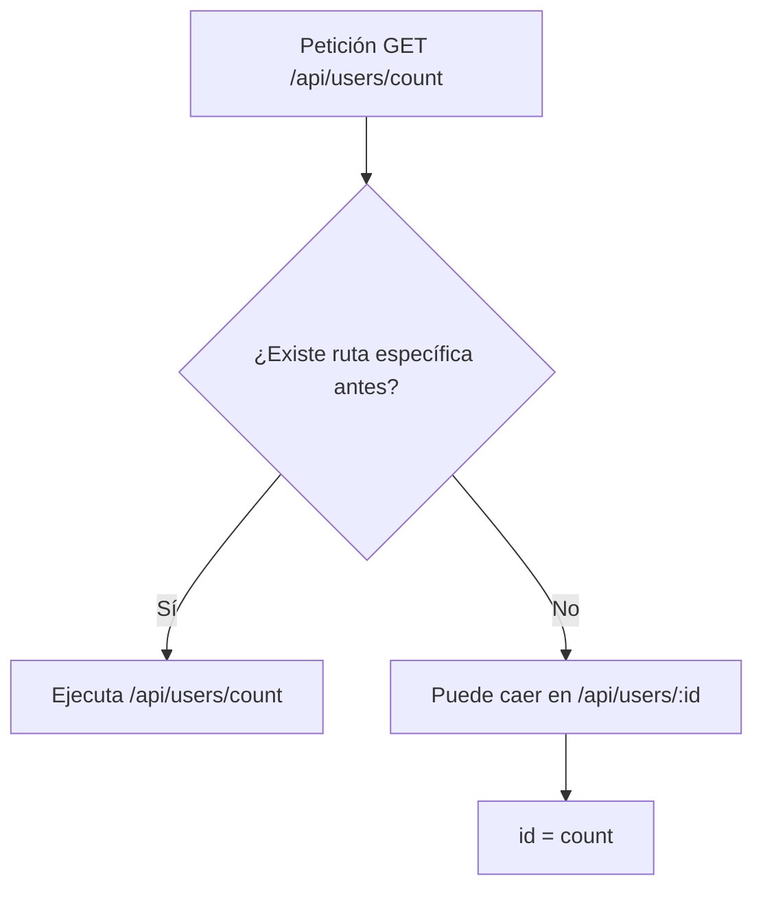
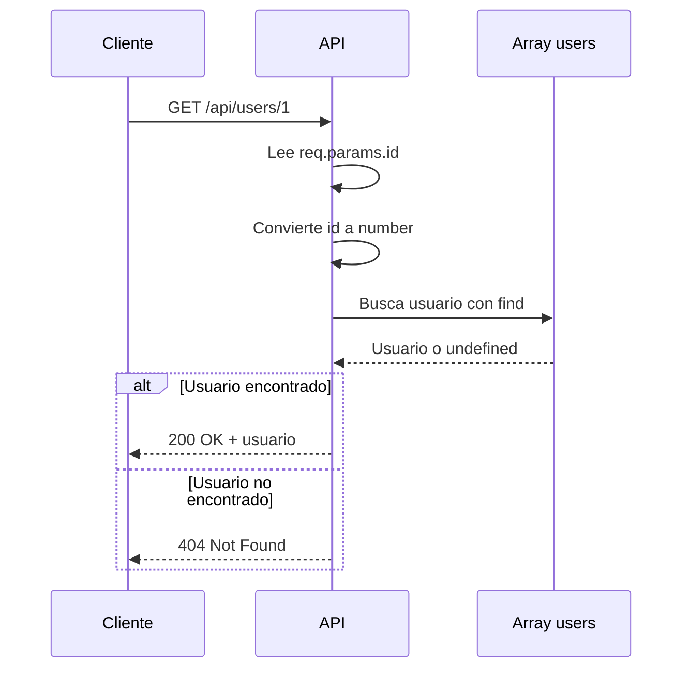

# Día 8: Consultar un usuario por ID

En el día 7 empezamos el CRUD real de usuarios en memoria. Creamos un tipo
`User`, añadimos un array de usuarios de prueba y actualizamos el endpoint:

```http
GET /api/users
```

Ese endpoint nos permite obtener el listado completo de usuarios.

Hoy vamos a dar el siguiente paso: consultar **un único usuario por su
identificador**.

Para ello trabajaremos con esta ruta:

```http
GET /api/users/:id
```

Esta ruta nos permitirá pedir a la API algo como:

```http
GET /api/users/1
```

La API deberá buscar en el array de usuarios si existe un usuario con ese `id`.
Si existe, devolveremos sus datos. Si no existe, devolveremos un error
`404 Not Found`.

!!! abstract "Objetivo del día"
    Buscar un usuario concreto a partir de un parámetro de ruta, validar el ID y
    responder correctamente con `200`, `400` o `404`.

Este día es importante porque empezamos a trabajar una idea muy habitual en APIs
REST: **buscar un recurso concreto a partir de un parámetro de ruta**.

## Qué vamos a trabajar hoy

| Concepto | Qué aprenderemos |
| --- | --- |
| Route params | Leer valores variables de la URL |
| `req.params` | Acceder a parámetros de ruta en Express |
| Conversión de string a number | Convertir IDs recibidos por URL |
| Búsqueda en arrays | Encontrar elementos dentro de `users` |
| `find` | Buscar el primer usuario que cumpla una condición |
| Error `404` | Responder cuando el usuario no existe |
| Validación básica de ID | Detectar IDs no numéricos |
| Orden de rutas en Express | Evitar conflictos entre rutas fijas y dinámicas |
| `GET /api/users/:id` | Consultar un usuario concreto |

El objetivo principal es que la API sea capaz de buscar un usuario concreto
dentro del array `users`.

## Qué es un parámetro de ruta

Un parámetro de ruta es una parte variable dentro de una URL.

```http
GET /api/users/1
GET /api/users/2
GET /api/users/25
```

La estructura es la misma, pero cambia el identificador del usuario.

En Express podemos definir una ruta dinámica así:

```ts
app.get("/api/users/:id", (req, res) => {
  const { id } = req.params;

  res.json({
    id
  });
});
```

La parte importante es:

```text
:id
```

Eso indica que ese fragmento de la ruta puede cambiar.

| Petición | Valor en Express |
| --- | --- |
| `GET /api/users/7` | `req.params.id = "7"` |

## Los params llegan como texto

Aunque en la URL escribamos:

```text
/api/users/7
```

Express recibe ese valor como texto.

| Expresión | Valor |
| --- | --- |
| `req.params.id` | `"7"` |
| ID en nuestro array | `7` |

Esto es importante porque en nuestro array los usuarios tienen el campo `id`
como número:

```ts
{
  id: 1,
  name: "Ana García"
}
```

Por eso, antes de comparar, necesitaremos convertir el parámetro a número:

```ts
const id = Number(req.params.id);
```

```ts title="Ejemplo"
const idParam = req.params.id; // "1"
const id = Number(idParam);    // 1
```

## Qué es `find`

Para buscar un usuario dentro de un array podemos usar el método `find`.

```ts
const user = users.find((user) => user.id === 1);
```

Esto significa:

```text
Recorre el array users y devuelve el primer usuario cuyo id sea 1.
```

Si encuentra un usuario, lo devuelve. Si no encuentra ninguno, devuelve
`undefined`.

=== "Usuario existente"

    ```ts
    const users = [
      { id: 1, name: "Ana" },
      { id: 2, name: "Carlos" }
    ];

    const user = users.find((user) => user.id === 2);
    ```

    Resultado:

    ```ts
    { id: 2, name: "Carlos" }
    ```

=== "Usuario inexistente"

    ```ts
    const user = users.find((user) => user.id === 99);
    ```

    Resultado:

    ```text
    undefined
    ```

## Si el usuario existe

Si el usuario existe, la API debe devolver:

```text
200 OK
```

Y los datos del usuario.

```http title="Petición"
GET /api/users/1
```

```json title="Respuesta"
{
  "message": "Usuario encontrado",
  "data": {
    "id": 1,
    "name": "Ana García",
    "email": "ana@email.com",
    "role": "USER",
    "isActive": true,
    "createdAt": "2026-01-01T10:00:00.000Z",
    "updatedAt": "2026-01-01T10:00:00.000Z"
  }
}
```

## Si el usuario no existe

Si el usuario no existe, no deberíamos devolver un array vacío ni un mensaje
genérico.

Lo correcto es devolver:

```text
404 Not Found
```

```http title="Petición"
GET /api/users/999
```

```json title="Respuesta"
{
  "error": "Usuario no encontrado"
}
```

El código `404` significa:

```text
No se ha encontrado el recurso solicitado.
```

En este caso, el recurso solicitado es el usuario con ID `999`.

## Si el ID no es válido

También puede ocurrir que el cliente llame a una ruta como:

```http
GET /api/users/abc
```

Aquí `abc` no es un ID numérico válido.

Si hacemos:

```ts
Number("abc")
```

El resultado será:

```text
NaN
```

`NaN` significa “Not a Number”.

Podemos comprobar si un valor no es un número con:

```ts
Number.isNaN(id)
```

```ts title="Validación"
const id = Number(req.params.id);

if (Number.isNaN(id)) {
  return res.status(400).json({
    error: "El ID debe ser un número"
  });
}
```

En este caso devolveríamos:

```text
400 Bad Request
```

Porque el cliente ha enviado una petición incorrecta.

## Orden de rutas en Express

En Express, el orden de las rutas importa.

Imaginemos estas dos rutas:

```ts
app.get("/api/users/:id", ...);
app.get("/api/users/count", ...);
```

Si ponemos primero:

```ts
app.get("/api/users/:id", ...);
```

Y después llamamos a:

```http
GET /api/users/count
```

Express puede interpretar que:

```text
id = "count"
```

Por eso, las rutas específicas deben ir antes que las rutas dinámicas.

=== "Orden recomendado"

    ```ts
    app.get("/api/users/count", ...);
    app.get("/api/users/:id", ...);
    ```

=== "Orden problemático"

    ```ts
    app.get("/api/users/:id", ...);
    app.get("/api/users/count", ...);
    ```



Esta idea será importante durante todo el reto.

## Flujo del endpoint de hoy

El endpoint `GET /api/users/:id` seguirá este proceso:



Además, si el ID no es numérico, devolveremos:

```text
400 Bad Request
```

## Parte guiada

### Paso 1: Abrir el proyecto

Abre el repositorio:

```text
usermanager-api
```

Entra en la carpeta:

```bash
cd usermanager-api
```

Arranca el servidor:

```bash
npm run dev
```

Comprueba que el listado de usuarios sigue funcionando:

```http
GET http://localhost:3000/api/users
```

### Paso 2: Revisar el array de usuarios

Abre:

```text
src/server.ts
```

Comprueba que tienes el tipo `User` y el array `users`.

```ts
type User = {
  id: number;
  name: string;
  email: string;
  role: "USER" | "ADMIN";
  isActive: boolean;
  createdAt: string;
  updatedAt: string;
};

const users: User[] = [
  {
    id: 1,
    name: "Ana García",
    email: "ana@email.com",
    role: "USER",
    isActive: true,
    createdAt: new Date().toISOString(),
    updatedAt: new Date().toISOString()
  },
  {
    id: 2,
    name: "Carlos Pérez",
    email: "carlos@email.com",
    role: "ADMIN",
    isActive: true,
    createdAt: new Date().toISOString(),
    updatedAt: new Date().toISOString()
  }
];
```

### Paso 3: Buscar la ruta `GET /api/users/:id`

En días anteriores teníamos una ruta simulada parecida a esta:

```ts
app.get("/api/users/:id", (req, res) => {
  const { id } = req.params;

  res.status(200).json({
    message: "Detalle de usuario",
    id: id
  });
});
```

Hoy vamos a sustituirla por una versión real que busque en el array.

### Paso 4: Validar que el ID sea numérico

Primero modificamos la ruta para convertir el ID a número:

```ts
app.get("/api/users/:id", (req, res) => {
  const id = Number(req.params.id);

  if (Number.isNaN(id)) {
    return res.status(400).json({
      error: "El ID debe ser un número"
    });
  }

  res.status(200).json({
    message: "ID recibido correctamente",
    id
  });
});
```

=== "ID válido"

    ```http
    GET http://localhost:3000/api/users/1
    ```

    ```json
    {
      "message": "ID recibido correctamente",
      "id": 1
    }
    ```

=== "ID inválido"

    ```http
    GET http://localhost:3000/api/users/abc
    ```

    ```json
    {
      "error": "El ID debe ser un número"
    }
    ```

    Código esperado:

    ```text
    400 Bad Request
    ```

### Paso 5: Buscar el usuario con `find`

Ahora añadimos la búsqueda real:

```ts
app.get("/api/users/:id", (req, res) => {
  const id = Number(req.params.id);

  if (Number.isNaN(id)) {
    return res.status(400).json({
      error: "El ID debe ser un número"
    });
  }

  const user = users.find((user) => user.id === id);

  res.status(200).json({
    message: "Usuario encontrado",
    data: user
  });
});
```

Prueba:

```http
GET http://localhost:3000/api/users/1
```

Si existe, deberías recibir el usuario.

!!! warning "Problema pendiente"
    Si el usuario no existe, esta versión devolverá `data: undefined`. Eso no
    es lo más adecuado.

### Paso 6: Devolver 404 si no existe

Actualiza la ruta para controlar el caso en el que no se encuentra el usuario:

```ts
app.get("/api/users/:id", (req, res) => {
  const id = Number(req.params.id);

  if (Number.isNaN(id)) {
    return res.status(400).json({
      error: "El ID debe ser un número"
    });
  }

  const user = users.find((user) => user.id === id);

  if (!user) {
    return res.status(404).json({
      error: "Usuario no encontrado"
    });
  }

  return res.status(200).json({
    message: "Usuario encontrado",
    data: user
  });
});
```

```http title="Prueba"
GET http://localhost:3000/api/users/999
```

```json title="Respuesta esperada"
{
  "error": "Usuario no encontrado"
}
```

Código esperado:

```text
404 Not Found
```

### Paso 7: Comprobar el orden de las rutas

Si en el día 7 creaste una ruta como:

```ts
app.get("/api/users/count", ...);
```

Asegúrate de que está colocada antes de:

```ts
app.get("/api/users/:id", ...);
```

=== "Orden correcto"

    ```ts
    app.get("/api/users", ...);
    app.get("/api/users/count", ...);
    app.get("/api/users/:id", ...);
    ```

=== "Orden problemático"

    ```ts
    app.get("/api/users", ...);
    app.get("/api/users/:id", ...);
    app.get("/api/users/count", ...);
    ```

En el segundo caso, Express puede interpretar `count` como un `id`.

### Paso 8: Probar todos los casos importantes

Prueba estas peticiones:

```http
GET http://localhost:3000/api/users/1
GET http://localhost:3000/api/users/2
GET http://localhost:3000/api/users/999
GET http://localhost:3000/api/users/abc
```

| Petición | Resultado esperado | Código |
| --- | --- | ---: |
| `GET /api/users/1` | Usuario encontrado | 200 |
| `GET /api/users/2` | Usuario encontrado | 200 |
| `GET /api/users/999` | Usuario no encontrado | 404 |
| `GET /api/users/abc` | ID no válido | 400 |

### Paso 9: Crear una colección o carpeta del día 8

En Thunder Client o Postman, dentro de la colección `UserManager API`, crea una
carpeta llamada:

```text
Día 8 - Consultar usuario por ID
```

Añade y guarda estas peticiones:

```http
GET http://localhost:3000/api/users/1
GET http://localhost:3000/api/users/2
GET http://localhost:3000/api/users/999
GET http://localhost:3000/api/users/abc
```

### Paso 10: Actualizar el README

Actualiza la sección de usuarios añadiendo el endpoint de consulta por ID:

````md title="README.md"
## Endpoints de usuarios

```http
GET /api/users
GET /api/users/:id
```

### GET /api/users/:id

Devuelve un usuario concreto a partir de su ID.

Respuesta correcta:

```json
{
  "message": "Usuario encontrado",
  "data": {
    "id": 1,
    "name": "Ana García",
    "email": "ana@email.com",
    "role": "USER",
    "isActive": true
  }
}
```

Posibles errores:

```json
{
  "error": "El ID debe ser un número"
}
```

```json
{
  "error": "Usuario no encontrado"
}
```
````

### Paso 11: Crear el documento del día 8

Dentro de la carpeta `docs/`, crea un archivo:

```text
docs/dia-08-consultar-usuario-id.md
```

Añade este contenido inicial:

````md title="docs/dia-08-consultar-usuario-id.md"
# Día 8: Consultar usuario por ID

## Qué he hecho

- He actualizado el endpoint `GET /api/users/:id`.
- He leído el ID desde `req.params`.
- He convertido el ID de string a number.
- He validado si el ID es numérico.
- He buscado usuarios con `find`.
- He devuelto `404` cuando el usuario no existe.
- He probado diferentes casos desde Thunder Client o Postman.

## Endpoint trabajado

```http
GET /api/users/:id
```

## Casos probados

| Petición | Código esperado | Resultado |
| --- | ---: | --- |
| `GET /api/users/1` | 200 | |
| `GET /api/users/2` | 200 | |
| `GET /api/users/999` | 404 | |
| `GET /api/users/abc` | 400 | |

## Explicación personal

El parámetro `:id` se recibe desde `req.params`. Como llega en formato string,
hay que convertirlo a number antes de compararlo con los id de los usuarios.
````

### Paso 12: Actualizar el índice del README

Añade el enlace al documento del día 8:

```md
## Documentación del reto

- [Día 1 - Diseño inicial](docs/dia-01-diseno-inicial.md)
- [Día 2 - Preparación del proyecto](docs/dia-02-preparacion-proyecto.md)
- [Día 3 - Primer endpoint](docs/dia-03-primer-endpoint.md)
- [Día 4 - Métodos HTTP](docs/dia-04-metodos-http.md)
- [Día 5 - JSON, body, params y headers](docs/dia-05-json-body-params-headers.md)
- [Día 6 - Cliente HTTP y depuración](docs/dia-06-cliente-http-depuracion.md)
- [Día 7 - Listado de usuarios en memoria](docs/dia-07-listado-usuarios.md)
- [Día 8 - Consultar usuario por ID](docs/dia-08-consultar-usuario-id.md)
```

### Paso 13: Guardar cambios en Git

Comprueba los cambios:

```bash
git status
```

Añade los archivos:

```bash
git add .
```

Crea un commit:

```bash
git commit -m "Dia 8 - Consultar usuario por id"
```

Sube los cambios:

```bash
git push
```

## Parte libre

Ahora toca practicar un poco sin seguir todos los pasos guiados.

### Tarea libre 1: Mejorar la respuesta del error 404

Modifica la respuesta cuando el usuario no exista para que incluya también el ID
buscado.

```json title="Ejemplo"
{
  "error": "Usuario no encontrado",
  "id": 999
}
```

### Tarea libre 2: Mejorar la respuesta del error 400

Modifica la respuesta cuando el ID no sea válido para que devuelva algo parecido
a:

```json
{
  "error": "El ID debe ser un número",
  "received": "abc"
}
```

Pista: para conseguirlo, guarda primero el valor original:

```ts
const idParam = req.params.id;
const id = Number(idParam);
```

### Tarea libre 3: Crear una ruta para consultar usuarios activos

Crea una ruta:

```http
GET /api/users/active
```

Debe devolver solo los usuarios que tengan:

```ts
isActive: true
```

Para ello puedes usar:

```ts
const activeUsers = users.filter((user) => user.isActive);
```

!!! warning "Orden de rutas"
    Esta ruta debe estar antes de `GET /api/users/:id`. Si la colocas después,
    Express puede interpretar `active` como si fuera un ID.

### Tarea libre 4: Explicar el orden de rutas

En el documento del día 8, añade una sección:

```md
## Orden de rutas en Express
```

Y explica con tus palabras por qué estas rutas deben estar antes de
`/api/users/:id`:

```text
/api/users/count
/api/users/active
```

La explicación debe mencionar que Express puede interpretar `count` o `active`
como si fueran el parámetro `id`.

## Entrega recomendada del día 8

Las respuestas no se entregan como archivo suelto. Deben quedar dentro del
repositorio de GitHub.

Al finalizar el día 8, el repositorio debería tener esta estructura aproximada:

```text
usermanager-api/
  README.md
  package.json
  package-lock.json
  tsconfig.json
  src/
    server.ts
  docs/
    dia-01-diseno-inicial.md
    dia-02-preparacion-proyecto.md
    dia-03-primer-endpoint.md
    dia-04-metodos-http.md
    dia-05-json-body-params-headers.md
    dia-06-cliente-http-depuracion.md
    dia-07-listado-usuarios.md
    dia-08-consultar-usuario-id.md
```

El documento del día 8 deberá estar en:

```text
docs/dia-08-consultar-usuario-id.md
```

Y deberá incluir:

- Resumen de lo realizado.
- Endpoint trabajado.
- Casos probados.
- Explicación personal de `req.params`.
- Explicación de conversión de string a number.
- Explicación del error `404`.
- Explicación del orden de rutas en Express.

En el foro, se compartirá el enlace actualizado al repositorio.

```text title="Mensaje de ejemplo"
Hola, comparto el avance del día 8 del reto UserManager API:

https://github.com/usuario/usermanager-api

He implementado la consulta de usuario por ID y he documentado el trabajo del
día 8 en:
docs/dia-08-consultar-usuario-id.md
```

## Cierre del día

Hoy hemos completado una parte fundamental del CRUD: consultar un recurso
concreto por su ID.

Hemos trabajado:

```text
Route params.
Conversión de string a number.
Búsqueda en arrays con find.
Respuesta 200 cuando el usuario existe.
Error 404 cuando no existe.
Error 400 cuando el ID no es válido.
Orden de rutas en Express.
```

Este endpoint parece sencillo, pero aparece constantemente en APIs reales.

!!! success "Idea clave"
    Cuando una API recibe un ID en la URL, debe validarlo, buscar el recurso
    correspondiente y responder de forma clara si existe o no existe.
