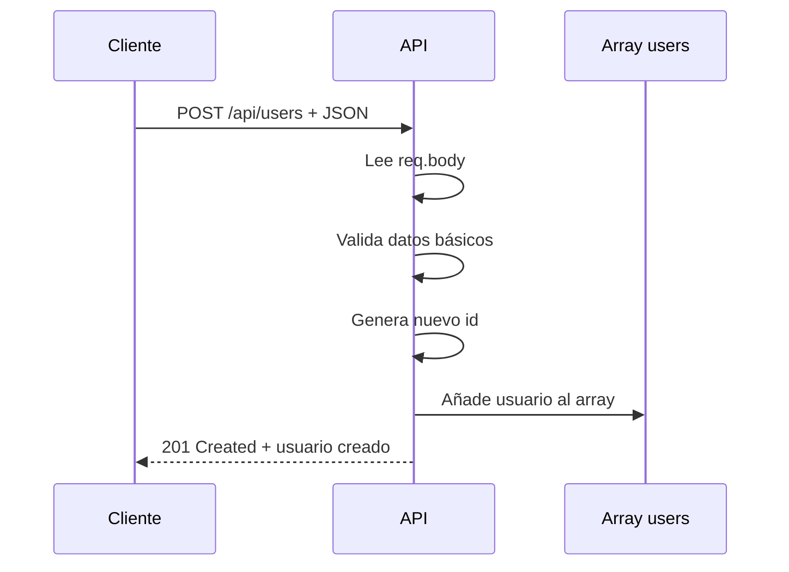
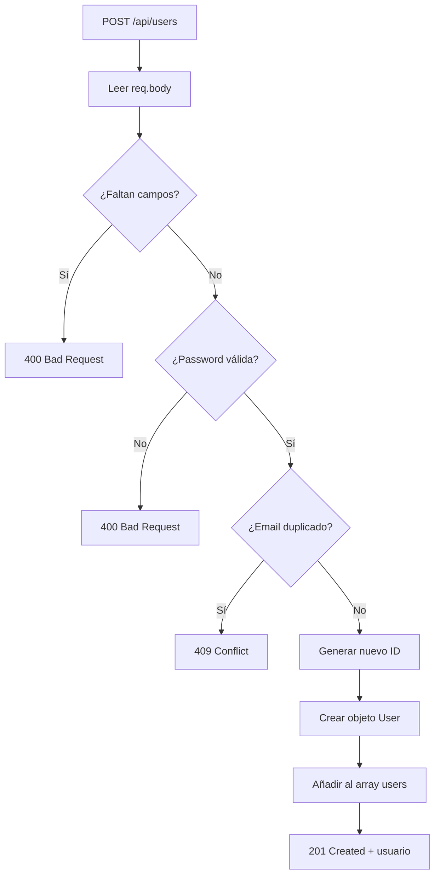

# Día 9: Crear usuarios en memoria

En el día 8 trabajamos la consulta de un usuario concreto mediante su
identificador:

```http
GET /api/users/:id
```

Aprendimos a leer `req.params`, convertir el ID de `string` a `number`, buscar
dentro del array con `find` y responder correctamente cuando el usuario existe,
cuando no existe o cuando el ID no es válido.

Hoy vamos a trabajar la primera operación de creación del CRUD:

```http
POST /api/users
```

Hasta ahora teníamos una ruta `POST /api/users`, pero solo devolvía los datos
recibidos. No añadía realmente el usuario al array.

Hoy haremos que esa ruta cree un usuario nuevo en memoria.

```json title="Body de ejemplo"
{
  "name": "María López",
  "email": "maria@email.com",
  "password": "123456"
}
```

La API deberá crear un nuevo usuario, asignarle un `id`, añadirlo al array
`users` y devolver una respuesta con código:

```text
201 Created
```

!!! abstract "Objetivo del día"
    Implementar correctamente la creación de usuarios en memoria con
    `POST /api/users`, validaciones básicas, control de email duplicado y una
    respuesta segura sin contraseña.

Al finalizar el día, nuestra API ya no solo consultará usuarios: también podrá
crear nuevos usuarios mientras el servidor esté encendido.

## Qué vamos a trabajar hoy

| Concepto | Qué aprenderemos |
| --- | --- |
| `POST` | Crear recursos |
| Creación de recursos | Añadir un nuevo usuario al sistema |
| `req.body` | Leer datos enviados por el cliente |
| Generación de ID | Crear un identificador único |
| Inserción en arrays | Añadir elementos con `push` |
| `201 Created` | Responder cuando se crea un recurso |
| Validación básica | Comprobar datos mínimos |
| Email duplicado | Evitar conflictos de datos |
| `400 Bad Request` | Responder ante datos inválidos |
| `409 Conflict` | Responder ante conflictos |
| Datos sensibles | No devolver contraseñas |

## Qué significa crear un recurso

En una API REST, crear un recurso significa añadir un nuevo elemento al sistema.

En nuestro caso, el recurso será:

```text
users
```

Y la operación será:

```http
POST /api/users
```

El cliente enviará los datos del nuevo usuario en el body de la petición.

```http title="Petición"
POST /api/users
Content-Type: application/json
```

```json title="Body"
{
  "name": "María López",
  "email": "maria@email.com",
  "password": "123456"
}
```

La API recibirá esos datos, creará un usuario nuevo y responderá con el usuario
creado.



## Por qué usamos POST

El método `POST` se utiliza normalmente para crear recursos nuevos.

| Endpoint | Uso |
| --- | --- |
| `POST /api/users` | Crear usuario |
| `POST /api/auth/register` | Registrar usuario |
| `POST /api/auth/login` | Iniciar sesión |

Aunque `login` no crea un usuario, también usa `POST` porque envía datos
sensibles en el body, como email y contraseña.

En el caso de hoy, `POST /api/users` significa:

```text
Quiero crear un nuevo usuario.
```

Si la creación funciona correctamente, lo habitual es responder con:

```text
201 Created
```

## El body de creación

Los datos para crear un usuario viajarán en el body.

```json
{
  "name": "María López",
  "email": "maria@email.com",
  "password": "123456"
}
```

En Express los leemos con:

```ts
req.body
```

```ts
app.post("/api/users", (req, res) => {
  const userData = req.body;

  res.json({
    data: userData
  });
});
```

Pero no deberíamos confiar ciegamente en lo que llega en el body.

=== "Datos incompletos"

    ```json
    {
      "name": "María López"
    }
    ```

=== "Datos incorrectos"

    ```json
    {
      "name": "",
      "email": "",
      "password": "1"
    }
    ```

Por eso empezaremos a hacer una validación básica.

## Validación básica

Hoy no vamos a hacer una validación avanzada, pero sí comprobaremos algunos
mínimos.

Para crear un usuario necesitaremos:

```text
name
email
password
```

Si falta alguno de esos campos, devolveremos:

```text
400 Bad Request
```

```json title="Error"
{
  "error": "name, email y password son obligatorios"
}
```

También comprobaremos que la contraseña tenga una longitud mínima:

```text
password mínimo 6 caracteres
```

```json title="Error"
{
  "error": "La contraseña debe tener al menos 6 caracteres"
}
```

Más adelante mejoraremos la validación con más reglas o incluso con una
librería, pero hoy queremos entender la lógica.

## Email duplicado

En una gestión de usuarios, el email suele ser único.

No tendría sentido tener dos usuarios con el mismo correo:

```text
ana@email.com
ana@email.com
```

Antes de crear un usuario nuevo, comprobaremos si ya existe otro con el mismo
email.

```ts
const existingUser = users.find((user) => user.email === email);
```

Si existe, devolveremos:

```text
409 Conflict
```

```json title="Error"
{
  "error": "El email ya está registrado"
}
```

El código `409 Conflict` se usa cuando la petición no puede completarse porque
entra en conflicto con el estado actual del sistema. En este caso, el conflicto
es que ese email ya existe.

## Generar un nuevo ID

Cuando creamos un usuario, necesitamos asignarle un identificador único.

Como todavía no tenemos base de datos, generaremos el ID manualmente.

=== "Opción sencilla"

    ```ts
    const newId = users.length + 1;
    ```

    Esta solución funciona para empezar, aunque tiene limitaciones. Si algún día
    eliminamos usuarios, podrían repetirse IDs.

=== "Opción recomendada"

    ```ts
    const newId = users.length > 0
      ? Math.max(...users.map((user) => user.id)) + 1
      : 1;
    ```

    Si hay usuarios, busca el ID más alto y suma 1. Si no hay usuarios, el
    primer ID será `1`.

Para este reto usaremos la segunda opción, porque evita algunos problemas.

```text
IDs actuales: 1, 2, 3
Nuevo ID: 4
```

## Crear un objeto de usuario

El cliente enviará:

```json
{
  "name": "María López",
  "email": "maria@email.com",
  "password": "123456"
}
```

Pero nuestro objeto `User` no debe guardar ni devolver `password`.

De momento, como todavía no hemos llegado a seguridad ni bcrypt, simplemente
**no guardaremos la contraseña** en el array.

```ts
const newUser: User = {
  id: newId,
  name,
  email,
  role: "USER",
  isActive: true,
  createdAt: new Date().toISOString(),
  updatedAt: new Date().toISOString()
};
```

Decisiones importantes:

| Campo | Decisión |
| --- | --- |
| `id` | Lo genera la API |
| `role` | Inicialmente será `USER` |
| `isActive` | Empieza como `true` |
| `createdAt` | Se genera automáticamente |
| `updatedAt` | Se genera automáticamente |
| `password` | No se guarda ni se devuelve |

Más adelante, cuando trabajemos seguridad, sustituiremos `password` por
`passwordHash`.

## Añadir el usuario al array

Para añadir un elemento a un array usamos:

```ts
users.push(newUser);
```

Ejemplo:

```ts
const users = [];

users.push({
  id: 1,
  name: "Ana"
});
```

Después de hacer `push`, el array tendrá un nuevo usuario.

Como estamos trabajando en memoria, el usuario existirá mientras el servidor
siga encendido. Si reiniciamos el servidor, volveremos al array inicial.

## Respuesta correcta al crear usuario

Cuando un usuario se crea correctamente, devolveremos:

```text
201 Created
```

Y una respuesta como esta:

```json
{
  "message": "Usuario creado correctamente",
  "data": {
    "id": 4,
    "name": "María López",
    "email": "maria@email.com",
    "role": "USER",
    "isActive": true,
    "createdAt": "2026-01-01T10:00:00.000Z",
    "updatedAt": "2026-01-01T10:00:00.000Z"
  }
}
```

!!! danger "Dato sensible"
    Aunque el cliente haya enviado `password`, no debe aparecer en la respuesta.

## Flujo completo del endpoint

El endpoint de creación seguirá este flujo:



## Parte guiada

### Paso 1: Abrir el proyecto

Abre el repositorio:

```text
usermanager-api
```

Entra en la carpeta:

```bash
cd usermanager-api
```

Arranca el servidor:

```bash
npm run dev
```

Comprueba que el listado de usuarios sigue funcionando:

```http
GET http://localhost:3000/api/users
```

### Paso 2: Revisar el tipo `User`

Abre:

```text
src/server.ts
```

Comprueba que tienes el tipo `User`:

```ts
type User = {
  id: number;
  name: string;
  email: string;
  role: "USER" | "ADMIN";
  isActive: boolean;
  createdAt: string;
  updatedAt: string;
};
```

Hoy todavía no añadiremos `passwordHash` al tipo `User`. Lo haremos más adelante
cuando trabajemos seguridad.

### Paso 3: Buscar la ruta `POST /api/users`

En días anteriores teníamos una ruta simulada parecida a esta:

```ts
app.post("/api/users", (req, res) => {
  const userData = req.body;

  res.status(201).json({
    message: "Usuario recibido para crear",
    data: userData
  });
});
```

Hoy vamos a sustituirla por una versión que cree usuarios de verdad en el array.

### Paso 4: Leer los datos del body

Sustituye la ruta por esta primera versión:

```ts
app.post("/api/users", (req, res) => {
  const { name, email, password } = req.body;

  res.status(200).json({
    message: "Datos recibidos",
    name,
    email,
    password
  });
});
```

```http title="Prueba"
POST http://localhost:3000/api/users
```

```json title="Body"
{
  "name": "María López",
  "email": "maria@email.com",
  "password": "123456"
}
```

Deberías recibir los datos en la respuesta. Esto solo es una prueba intermedia:
después eliminaremos `password` de la respuesta.

### Paso 5: Validar campos obligatorios

Actualiza la ruta:

```ts
app.post("/api/users", (req, res) => {
  const { name, email, password } = req.body;

  if (!name || !email || !password) {
    return res.status(400).json({
      error: "name, email y password son obligatorios"
    });
  }

  res.status(200).json({
    message: "Datos obligatorios recibidos correctamente",
    name,
    email
  });
});
```

```json title="Petición incorrecta"
{
  "name": "María López"
}
```

```json title="Respuesta esperada"
{
  "error": "name, email y password son obligatorios"
}
```

Código esperado:

```text
400 Bad Request
```

### Paso 6: Validar longitud de contraseña

Añade esta comprobación después de los campos obligatorios:

```ts
if (password.length < 6) {
  return res.status(400).json({
    error: "La contraseña debe tener al menos 6 caracteres"
  });
}
```

La ruta quedará así:

```ts
app.post("/api/users", (req, res) => {
  const { name, email, password } = req.body;

  if (!name || !email || !password) {
    return res.status(400).json({
      error: "name, email y password son obligatorios"
    });
  }

  if (password.length < 6) {
    return res.status(400).json({
      error: "La contraseña debe tener al menos 6 caracteres"
    });
  }

  res.status(200).json({
    message: "Datos válidos",
    name,
    email
  });
});
```

```json title="Body de prueba"
{
  "name": "María López",
  "email": "maria@email.com",
  "password": "123"
}
```

```json title="Respuesta esperada"
{
  "error": "La contraseña debe tener al menos 6 caracteres"
}
```

### Paso 7: Comprobar email duplicado

Añade esta comprobación:

```ts
const existingUser = users.find((user) => user.email === email);

if (existingUser) {
  return res.status(409).json({
    error: "El email ya está registrado"
  });
}
```

La ruta quedará así:

```ts
app.post("/api/users", (req, res) => {
  const { name, email, password } = req.body;

  if (!name || !email || !password) {
    return res.status(400).json({
      error: "name, email y password son obligatorios"
    });
  }

  if (password.length < 6) {
    return res.status(400).json({
      error: "La contraseña debe tener al menos 6 caracteres"
    });
  }

  const existingUser = users.find((user) => user.email === email);

  if (existingUser) {
    return res.status(409).json({
      error: "El email ya está registrado"
    });
  }

  res.status(200).json({
    message: "Datos válidos y email disponible",
    name,
    email
  });
});
```

```json title="Body con email duplicado"
{
  "name": "Ana Repetida",
  "email": "ana@email.com",
  "password": "123456"
}
```

```json title="Respuesta esperada"
{
  "error": "El email ya está registrado"
}
```

Código esperado:

```text
409 Conflict
```

### Paso 8: Generar un nuevo ID

Antes de crear el usuario, genera un nuevo ID:

```ts
const newId = users.length > 0
  ? Math.max(...users.map((user) => user.id)) + 1
  : 1;
```

Este código busca el ID más alto que existe y suma 1.

```text
IDs actuales: 1, 2, 3
Nuevo ID: 4
```

### Paso 9: Crear el objeto `newUser`

Añade el nuevo usuario:

```ts
const newUser: User = {
  id: newId,
  name,
  email,
  role: "USER",
  isActive: true,
  createdAt: new Date().toISOString(),
  updatedAt: new Date().toISOString()
};
```

### Paso 10: Añadir el usuario al array y responder

Añade:

```ts
users.push(newUser);
```

Y devuelve:

```ts
return res.status(201).json({
  message: "Usuario creado correctamente",
  data: newUser
});
```

La ruta completa quedará así:

```ts
app.post("/api/users", (req, res) => {
  const { name, email, password } = req.body;

  if (!name || !email || !password) {
    return res.status(400).json({
      error: "name, email y password son obligatorios"
    });
  }

  if (password.length < 6) {
    return res.status(400).json({
      error: "La contraseña debe tener al menos 6 caracteres"
    });
  }

  const existingUser = users.find((user) => user.email === email);

  if (existingUser) {
    return res.status(409).json({
      error: "El email ya está registrado"
    });
  }

  const newId = users.length > 0
    ? Math.max(...users.map((user) => user.id)) + 1
    : 1;

  const newUser: User = {
    id: newId,
    name,
    email,
    role: "USER",
    isActive: true,
    createdAt: new Date().toISOString(),
    updatedAt: new Date().toISOString()
  };

  users.push(newUser);

  return res.status(201).json({
    message: "Usuario creado correctamente",
    data: newUser
  });
});
```

### Paso 11: Probar creación correcta

```http title="Prueba"
POST http://localhost:3000/api/users
```

```json title="Body"
{
  "name": "María López",
  "email": "maria@email.com",
  "password": "123456"
}
```

```json title="Respuesta esperada"
{
  "message": "Usuario creado correctamente",
  "data": {
    "id": 4,
    "name": "María López",
    "email": "maria@email.com",
    "role": "USER",
    "isActive": true,
    "createdAt": "...",
    "updatedAt": "..."
  }
}
```

Comprueba que el código sea:

```text
201 Created
```

### Paso 12: Comprobar que aparece en el listado

Después de crear el usuario, prueba:

```http
GET http://localhost:3000/api/users
```

El nuevo usuario debería aparecer en el array `data`. También debería haber
aumentado el valor de `total`.

!!! note "Recuerda"
    Si reinicias el servidor, el usuario creado desaparecerá. Esto es normal
    porque todavía estamos trabajando en memoria.

### Paso 13: Probar casos de error

| Caso | Body | Código esperado |
| --- | --- | ---: |
| Faltan campos | `{ "name": "Usuario incompleto" }` | 400 |
| Contraseña demasiado corta | `{ "name": "Usuario Prueba", "email": "prueba@email.com", "password": "123" }` | 400 |
| Email duplicado | `{ "name": "Ana Repetida", "email": "ana@email.com", "password": "123456" }` | 409 |

### Paso 14: Crear una colección o carpeta del día 9

En Thunder Client o Postman, dentro de la colección `UserManager API`, crea una
carpeta llamada:

```text
Día 9 - Crear usuarios
```

Añade estas peticiones:

```text
POST http://localhost:3000/api/users    Crear usuario correcto
POST http://localhost:3000/api/users    Faltan campos
POST http://localhost:3000/api/users    Password corta
POST http://localhost:3000/api/users    Email duplicado
GET  http://localhost:3000/api/users    Comprobar listado
```

### Paso 15: Actualizar el README

Actualiza la sección de usuarios añadiendo información sobre creación:

````md title="README.md"
## Crear usuario

```http
POST /api/users
```

Body:

```json
{
  "name": "María López",
  "email": "maria@email.com",
  "password": "123456"
}
```

Respuesta correcta:

```json
{
  "message": "Usuario creado correctamente",
  "data": {
    "id": 4,
    "name": "María López",
    "email": "maria@email.com",
    "role": "USER",
    "isActive": true
  }
}
```

Posibles errores:

```json
{
  "error": "name, email y password son obligatorios"
}
```

```json
{
  "error": "La contraseña debe tener al menos 6 caracteres"
}
```

```json
{
  "error": "El email ya está registrado"
}
```
````

### Paso 16: Crear el documento del día 9

Dentro de la carpeta `docs/`, crea un archivo:

```text
docs/dia-09-crear-usuarios.md
```

Añade este contenido inicial:

````md title="docs/dia-09-crear-usuarios.md"
# Día 9: Crear usuarios en memoria

## Qué he hecho

- He actualizado el endpoint `POST /api/users`.
- He leído datos desde `req.body`.
- He validado campos obligatorios.
- He validado longitud mínima de contraseña.
- He comprobado email duplicado.
- He generado un nuevo ID.
- He creado un objeto `User`.
- He añadido el usuario al array con `push`.
- He devuelto `201 Created` cuando el usuario se crea correctamente.

## Endpoint trabajado

```http
POST /api/users
```

## Body de ejemplo

```json
{
  "name": "María López",
  "email": "maria@email.com",
  "password": "123456"
}
```

## Casos probados

| Caso | Código esperado | Resultado |
| --- | ---: | --- |
| Usuario correcto | 201 | |
| Faltan campos | 400 | |
| Password corta | 400 | |
| Email duplicado | 409 | |

## Explicación personal

Para crear un usuario se leen los datos desde `req.body`, se validan, se
comprueba que el email no esté repetido, se genera un nuevo id y se añade el
usuario al array con `push`.
````

### Paso 17: Actualizar el índice del README

Añade el enlace al documento del día 9:

```md
## Documentación del reto

- [Día 1 - Diseño inicial](docs/dia-01-diseno-inicial.md)
- [Día 2 - Preparación del proyecto](docs/dia-02-preparacion-proyecto.md)
- [Día 3 - Primer endpoint](docs/dia-03-primer-endpoint.md)
- [Día 4 - Métodos HTTP](docs/dia-04-metodos-http.md)
- [Día 5 - JSON, body, params y headers](docs/dia-05-json-body-params-headers.md)
- [Día 6 - Cliente HTTP y depuración](docs/dia-06-cliente-http-depuracion.md)
- [Día 7 - Listado de usuarios en memoria](docs/dia-07-listado-usuarios.md)
- [Día 8 - Consultar usuario por ID](docs/dia-08-consultar-usuario-id.md)
- [Día 9 - Crear usuarios en memoria](docs/dia-09-crear-usuarios.md)
```

### Paso 18: Guardar cambios en Git

Comprueba los cambios:

```bash
git status
```

Añade los archivos:

```bash
git add .
```

Crea un commit:

```bash
git commit -m "Dia 9 - Crear usuarios en memoria"
```

Sube los cambios:

```bash
git push
```

## Parte libre

Ahora toca practicar un poco sin seguir todos los pasos guiados.

### Tarea libre 1: Normalizar el email

Antes de comprobar si el email está duplicado, convierte el email a minúsculas.

```ts
const normalizedEmail = email.toLowerCase();
```

Después usa `normalizedEmail` para comprobar duplicados y para guardar el
usuario.

Así evitamos que estos dos correos se consideren diferentes:

```text
Ana@Email.com
ana@email.com
```

### Tarea libre 2: Eliminar espacios al principio y al final

Usa `trim()` para limpiar `name` y `email`.

```ts
const cleanName = name.trim();
const cleanEmail = email.trim().toLowerCase();
```

Esto evita guardar usuarios como:

```text
"   Ana García   "
```

### Tarea libre 3: Validar formato básico de email

Añade una validación sencilla para comprobar que el email contiene `@`.

```ts
if (!cleanEmail.includes("@")) {
  return res.status(400).json({
    error: "El email no tiene un formato válido"
  });
}
```

No es una validación perfecta, pero nos sirve para empezar.

### Tarea libre 4: Explicar por qué no se devuelve la contraseña

En el documento del día 9, añade una sección:

```md
## Datos sensibles
```

Y explica con tus palabras por qué la API no debe devolver la contraseña en la
respuesta, aunque el cliente la haya enviado en el body.

## Entrega recomendada del día 9

Las respuestas no se entregan como archivo suelto. Deben quedar dentro del
repositorio de GitHub.

Al finalizar el día 9, el repositorio debería tener esta estructura aproximada:

```text
usermanager-api/
  README.md
  package.json
  package-lock.json
  tsconfig.json
  src/
    server.ts
  docs/
    dia-01-diseno-inicial.md
    dia-02-preparacion-proyecto.md
    dia-03-primer-endpoint.md
    dia-04-metodos-http.md
    dia-05-json-body-params-headers.md
    dia-06-cliente-http-depuracion.md
    dia-07-listado-usuarios.md
    dia-08-consultar-usuario-id.md
    dia-09-crear-usuarios.md
```

El documento del día 9 deberá estar en:

```text
docs/dia-09-crear-usuarios.md
```

Y deberá incluir:

- Resumen de lo realizado.
- Endpoint trabajado.
- Body de ejemplo.
- Casos probados.
- Explicación personal del proceso de creación.
- Explicación sobre datos sensibles.

En el foro, se compartirá el enlace actualizado al repositorio.

```text title="Mensaje de ejemplo"
Hola, comparto el avance del día 9 del reto UserManager API:

https://github.com/usuario/usermanager-api

He implementado la creación de usuarios en memoria y he documentado el trabajo
del día 9 en:
docs/dia-09-crear-usuarios.md
```

## Cierre del día

Hoy hemos completado la primera operación de creación del CRUD.

Nuestra API ya puede recibir datos desde el body, validarlos de forma básica,
crear un objeto `User`, añadirlo al array y devolver una respuesta con
`201 Created`.

Hoy hemos trabajado:

```text
POST /api/users
req.body
Validaciones básicas
Email duplicado
Generación de ID
push
201 Created
400 Bad Request
409 Conflict
Datos sensibles
```

Aunque todavía seguimos trabajando en memoria, la API empieza a comportarse como
un backend real.

!!! success "Idea clave"
    Crear un recurso no consiste solo en recibir datos: hay que validarlos,
    evitar conflictos, generar los campos internos necesarios y devolver una
    respuesta segura.
